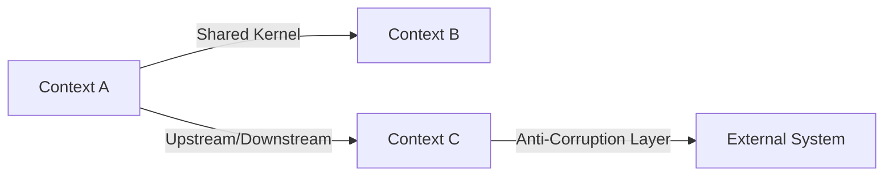

# Step 4: Domain-Driven Design

> Model the domain to ensure code structure reflects business concepts.

## When

L/XL tiers only. Can run **in parallel** with Step 5 (Architecture) if Step 3 is complete.

## Model

opus (complex domain reasoning)

## Input

- `{REQUIREMENTS}` from Step 1
- `{RESEARCH_FINDINGS}` from Step 2
- `{ADR_DECISIONS}` from Step 3
- Existing codebase domain structure

## Protocol

### 1. Identify Bounded Contexts

Analyze requirements for natural domain boundaries:

| Signal | Bounded Context |
|--------|----------------|
| Different stakeholders | Separate contexts |
| Different data lifecycles | Separate contexts |
| Different ubiquitous languages | Separate contexts |
| Shared data with different semantics | Separate contexts with shared kernel |

For **existing projects**: map new feature to existing bounded contexts first.
Only propose new contexts when the feature genuinely introduces a new domain.

### 2. Define Ubiquitous Language

For each bounded context involved:

```
## Context: {Name}

| Term | Definition | NOT to be confused with |
|------|-----------|------------------------|
| {Term1} | {Precise definition} | {Common misuse} |
| {Term2} | {Precise definition} | {Common misuse} |
```

Verify terms against:
- Existing codebase naming (Grep for conflicts)
- Requirement document terminology
- Stakeholder vocabulary

### 3. Model Aggregates & Entities

```
Aggregate: {Name}
├── Root Entity: {Name}
│   ├── {field}: {type}
│   └── {field}: {type}
├── Value Object: {Name}
│   └── {field}: {type}
└── Domain Event: {EventName}
    └── {payload}
```

Rules:
- Aggregates are consistency boundaries
- Entities have identity, Value Objects don't
- Domain Events signal state changes

### 4. Map Relationships



Relationship types:
- **Shared Kernel:** Shared code/models between contexts
- **Customer-Supplier:** Upstream provides, downstream consumes
- **Conformist:** Downstream adopts upstream model as-is
- **Anti-Corruption Layer:** Translate between incompatible models
- **Open Host Service:** Public API for multiple consumers

### 5. Validate Against Codebase

Check that proposed domain model is compatible with existing code:
- Do new entities conflict with existing names?
- Can aggregates be implemented with existing ORM/framework?
- Do relationships align with existing data access patterns?

## Write discipline (the 180-second rule)

An executor that returns from a tool call and then thinks in silence past **180 seconds** is killed by the
runtime. Thinking time grows with the history already accumulated, so on a large repo "read everything,
then write the document" is not a risk — it is a deterministic death, and nothing survives it, because
nothing was ever on disk.

MEASURED on this harness: the writing steps died **18 times out of 18** in the reading phase without ever
writing a file. The control — same slice, same model, one added instruction to write a skeleton early —
landed the skeleton 8 minutes in, on the first attempt, after six consecutive deaths.

So, in this step:

1. **Skeleton first — inside your first ~12 tool calls.** Write `features/<slug>/04_domain_model.md` containing only the headings this step
   requires (Bounded context map · Ubiquitous language · Aggregates/Entities/VOs · Relationships ·
   Codebase mapping), one line of intent under each.
2. **Then fill it one section per edit.** No single edit longer than ~120 lines. Every edit leaves the
   file readable; none of them is allowed to wait for the section after it.
3. **Never go more than 2 minutes without a tool call.** A thought that is getting long is the signal to
   stop and write what you have — an edit is a checkpoint, not an interruption.
4. **When you are unsure whether to read more or to write, WRITE.** A thin section refined later survives;
   a perfect section you never reached does not.

The skeleton is not a draft to apologise for. It is the artifact, opened early.

## Output

Create `features/<slug>/04_domain_model.md` with:
- Bounded context map
- Ubiquitous language glossary
- Aggregate/Entity/VO definitions
- Relationship diagram (Mermaid)
- Mapping to existing codebase structures

Create `features/<slug>/diagrams/domain-model.mermaid`

Set `{DOMAIN_MODEL}` variable.

## Quality Gates

- [ ] All new terms defined in ubiquitous language
- [ ] No naming conflicts with existing codebase
- [ ] Aggregates have clear consistency boundaries
- [ ] Relationships between contexts are typed
- [ ] Domain model is implementable with current tech stack
