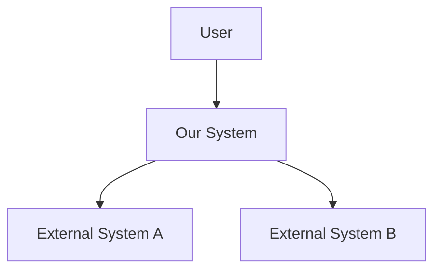
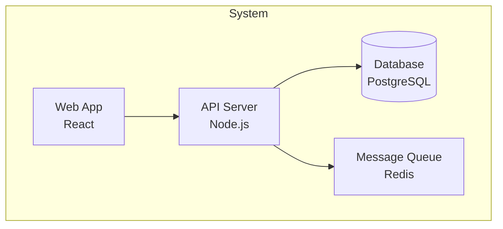
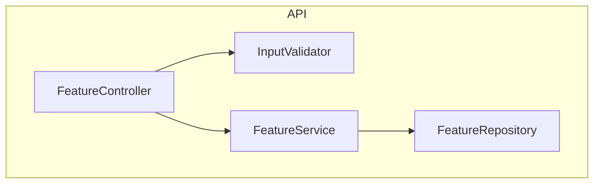
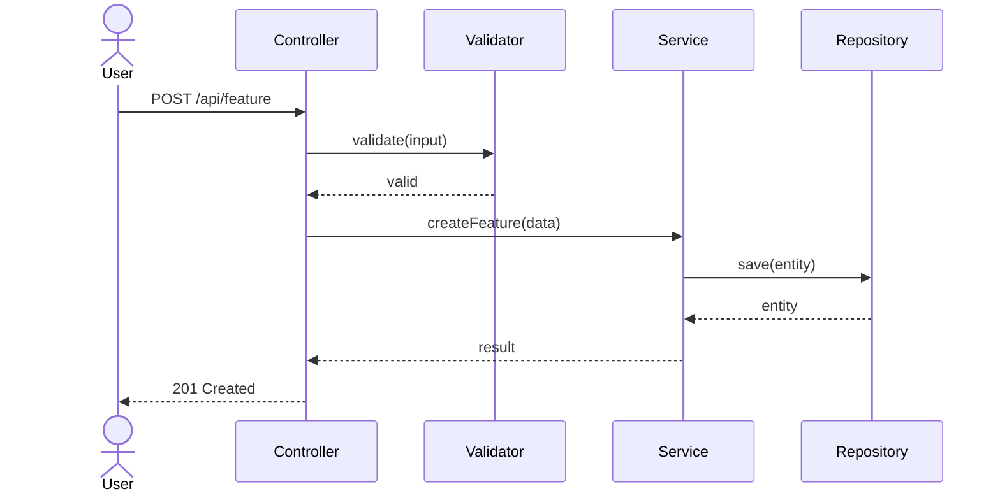

# Step 5: Technical Architecture

> Design the technical architecture using C4 diagrams and sequence flows.

## When

M+ tiers. Depth varies:
- **M:** Component diagram only (light)
- **L/XL:** Full C4 (Context + Container + Component) + sequence diagrams

## Model

opus (system design)

## Input

- `{REQUIREMENTS}` from Step 1
- `{ADR_DECISIONS}` from Step 3
- `{DOMAIN_MODEL}` from Step 4 (L/XL only)
- `{RESEARCH_FINDINGS}` from Step 2 (L/XL only)

## Protocol

### 1. C4 Level 1 — System Context (L/XL only)

Show the system in its environment:



Define:
- Who uses the system? (actors)
- What external systems does it interact with?
- What are the trust boundaries?

### 2. C4 Level 2 — Container Diagram (L/XL only)

Show high-level technical building blocks:



### 3. C4 Level 3 — Component Diagram (M/L/XL)

Show components within the container affected by this feature:



For M-tier: this is the ONLY diagram required.

### 4. Sequence Diagrams (L/XL)

For each main user flow, create a sequence diagram:



Create at minimum:
- Happy path flow
- Main error flow
- Async flow (if applicable)

### 5. Data Flow & Storage (L/XL)

Document:
- New tables/collections/schemas
- Migrations needed
- Data flow between components
- Caching strategy (if applicable)

### 6. API Design (if applicable)

For features exposing APIs:

```
POST /api/v1/{resource}
  Request: { field1: type, field2: type }
  Response: { id: string, ...fields }
  Errors: 400, 401, 404, 422

GET /api/v1/{resource}/:id
  Response: { ...full resource }
  Errors: 401, 404
```

## Observability — a MANDATORY section of `05_architecture.md`

The artifact must carry a section headed exactly **`Observability`**, answering how anyone would
know this feature is working once it ships:

- what it **logs**, and at what level;
- what it **counts** — the one or two numbers that would move if it broke;
- what a **failure looks like from outside** — the symptom, not the stack trace;
- **who would notice**, and how.

If the feature genuinely emits nothing at runtime — a pure refactor, a doc change, a gate that only
runs in CI — write **"nothing to observe"** and say why. That is a complete answer, not a gap. What
is not acceptable is leaving the question unanswered.

The heading is read by a machine (`dz score` reports it as a discipline), so it is spelled exactly
`Observability` — the prompt above and the check derive that word from one shared constant, because
a prompt asking for one heading while a check greps another produces a gate that fails every honest
run.

**Why this section exists.** MEASURED 2026-08-25: across 107 existing `05_architecture.md` files,
ZERO carried such a section, and the word `observability` appeared nowhere in the pipeline's own
prompts. The pipeline kept five telemetry stores about itself and asked for none about what it
built. The two capable skills — `observability` (818 lines) and `observability-testing-patterns`
(946 lines) — were fully written and unreachable, because nothing called them. This section is the
call site.

## Write discipline (the 180-second rule)

An executor that returns from a tool call and then thinks in silence past **180 seconds** is killed by the
runtime. Thinking time grows with the history already accumulated, so on a large repo "read everything,
then write the document" is not a risk — it is a deterministic death, and nothing survives it, because
nothing was ever on disk.

MEASURED on this harness: the writing steps died **18 times out of 18** in the reading phase without ever
writing a file. The control — same slice, same model, one added instruction to write a skeleton early —
landed the skeleton 8 minutes in, on the first attempt, after six consecutive deaths.

So, in this step:

1. **Skeleton first — inside your first ~12 tool calls.** Write `features/<slug>/05_architecture.md` containing only the headings this step
   requires at your tier (C4 Context · C4 Container · C4 Component · Sequence flows · Data & storage ·
   API design), one line of intent under each. An empty `mermaid` fence with a caption is a
   heading; fill it later.
2. **Then fill it one section per edit.** No single edit longer than ~120 lines. Every edit leaves the
   file readable; none of them is allowed to wait for the section after it.
3. **Never go more than 2 minutes without a tool call.** A thought that is getting long is the signal to
   stop and write what you have — an edit is a checkpoint, not an interruption.
4. **When you are unsure whether to read more or to write, WRITE.** A thin section refined later survives;
   a perfect section you never reached does not.

The skeleton is not a draft to apologise for. It is the artifact, opened early.

## Output

### M-tier
Create `features/<slug>/05_architecture.md` with:
- Component diagram
- Brief API design (if applicable)

### L/XL-tier
Create `features/<slug>/05_architecture.md` with:
- C4 diagrams (all 3 levels)
- Sequence diagrams
- Data model changes
- API design

Create `features/<slug>/diagrams/`:
- `architecture-c4.mermaid`
- `sequence-*.mermaid`

Set `{ARCHITECTURE}` variable.

## Quality Gates

- [ ] Component diagram covers all new components
- [ ] Each component has clear responsibility
- [ ] ADR decisions are reflected in architecture
- [ ] Domain model (Step 4) maps to components (L/XL)
- [ ] Mermaid syntax is valid
- [ ] No circular dependencies between components
- [ ] API follows existing project conventions
