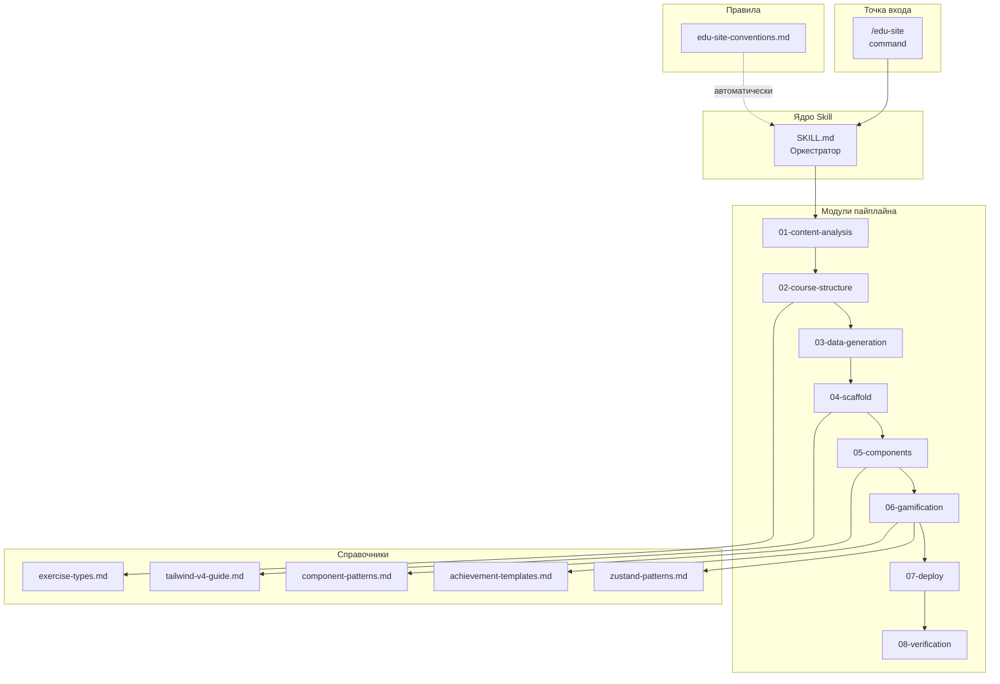
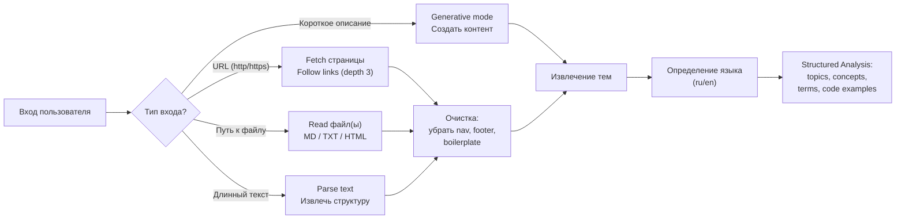
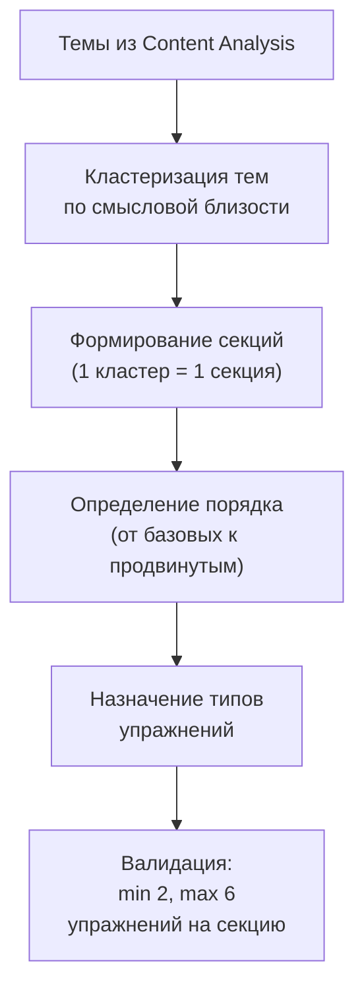
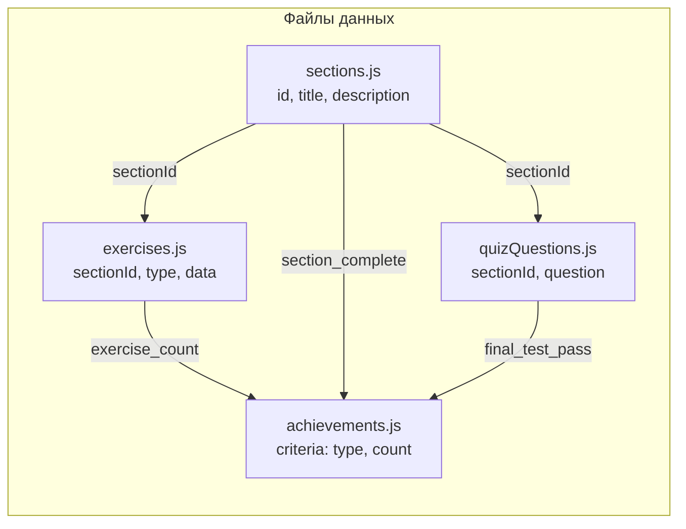
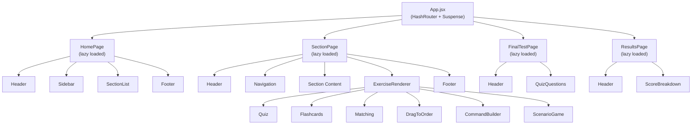
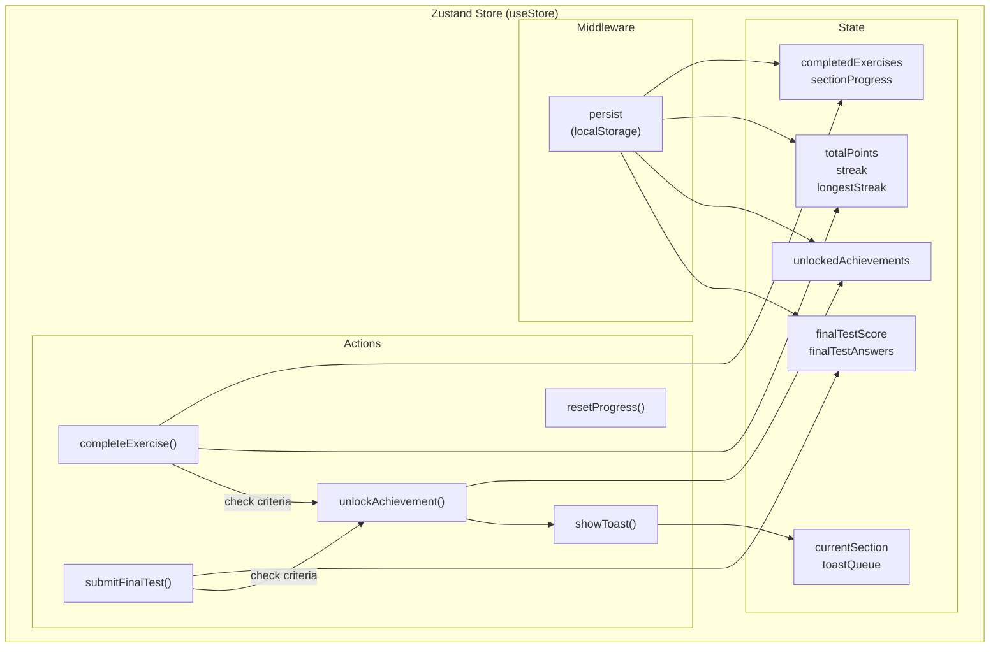
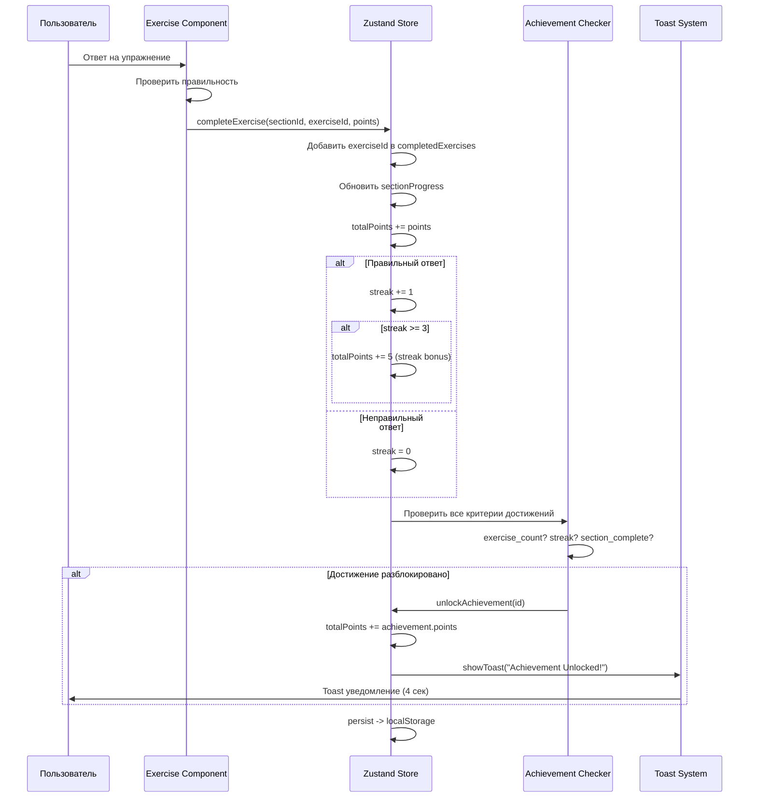
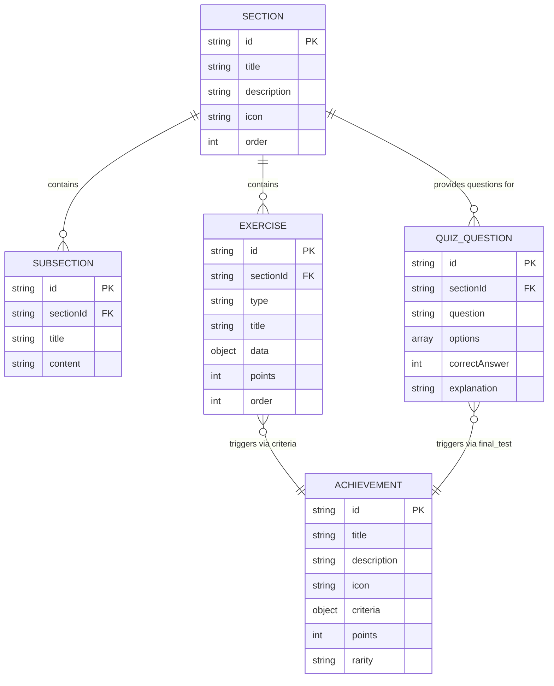

# Архитектура @dzhechkov/skills-edu-site

## Содержание

1. [Обзор системы и философия проектирования](#обзор-системы-и-философия-проектирования)
2. [Компоненты системы](#компоненты-системы)
3. [MODULE: Content Analysis](#module-content-analysis)
4. [MODULE: Course Structure](#module-course-structure)
5. [MODULE: Data Generation](#module-data-generation)
6. [MODULE: Scaffold](#module-scaffold)
7. [MODULE: Components](#module-components)
8. [MODULE: Gamification](#module-gamification)
9. [MODULE: Deploy](#module-deploy)
10. [MODULE: Verification](#module-verification)
11. [Архитектура данных](#архитектура-данных)
12. [Иерархия компонентов](#иерархия-компонентов)
13. [State management: Zustand](#state-management-zustand)
14. [Exercise Engine](#exercise-engine)
15. [Обоснование технологического стека](#обоснование-технологического-стека)
16. [SEO-архитектура](#seo-архитектура)
17. [Расширяемость](#расширяемость)
18. [Проектные решения и компромиссы](#проектные-решения-и-компромиссы)

---

## Обзор системы и философия проектирования

`@dzhechkov/skills-edu-site` — это скилл для Claude Code, реализующий полный цикл генерации образовательных SPA-приложений. Система принимает на вход документацию, URL, текст или описание темы и производит полностью рабочее React-приложение с интерактивными упражнениями, геймификацией и готовностью к деплою.

### Фундаментальная идея

Образовательный контент имеет предсказуемую структуру: тема разбивается на секции, секции содержат факты для изучения, факты можно проверить через упражнения. Edu-site автоматизирует этот процесс:

```
ВХОД                    ОБРАБОТКА                    ВЫХОД
----------             -----------                  --------
Документация  ->  Content Analysis             ->  React SPA
URL           ->  Course Structure             ->  с 6 типами
Текст         ->  Data Generation              ->  упражнений,
Тема          ->  Scaffold + Components        ->  геймификацией,
                  Gamification + Deploy         ->  прогрессом,
                  Verification                 ->  финальным тестом
```

### Ключевые принципы проектирования

**1. SPA-first (Single Page Application)**
Всё приложение — один HTML-файл + бандл JS/CSS. Нет серверной части, нет базы данных, нет API-вызовов в рантайме. Это радикально упрощает деплой и обслуживание.

**2. Gamification-first**
Геймификация — не надстройка, а основа UX. Каждое взаимодействие приносит очки. Достижения мотивируют завершить курс. Progress bar создаёт ощущение продвижения.

**3. Content-driven architecture**
Данные отделены от представления. Четыре файла данных (`sections.js`, `exercises.js`, `quizQuestions.js`, `achievements.js`) определяют весь контент курса. Компоненты — универсальные рендереры, которые работают с любым контентом.

**4. Zero-config deployment**
Сгенерированный проект включает GitHub Actions workflow. Один `git push` — и сайт задеплоен. Никаких дополнительных настроек.

**5. Offline-capable by design**
Все данные встроены в бандл. Прогресс сохраняется в localStorage. Сайт работает полностью автономно после первой загрузки.

---

## Компоненты системы

### Текстовая карта компонентов

```
@dzhechkov/skills-edu-site
+-- SKILL.md                               <- Точка входа, оркестратор 8 шагов
|
+-- modules/                               <- 8 модулей пайплайна
|   +-- 01-content-analysis.md             <- Анализ контента и язык
|   +-- 02-course-structure.md             <- Структура курса и маппинг
|   +-- 03-data-generation.md              <- 4 файла данных
|   +-- 04-scaffold.md                     <- Vite + React + Tailwind каркас
|   +-- 05-components.md                   <- React-компоненты
|   +-- 06-gamification.md                <- Zustand store + achievements
|   +-- 07-deploy.md                       <- GitHub Actions workflow
|   +-- 08-verification.md                <- 5 финальных проверок
|
+-- references/                            <- Справочные материалы
|   +-- exercise-types.md                  <- 6 типов упражнений
|   +-- component-patterns.md              <- React 19 паттерны
|   +-- tailwind-v4-guide.md               <- TailwindCSS v4 API
|   +-- zustand-patterns.md                <- Zustand persist + selectors
|   +-- achievement-templates.md           <- Шаблоны достижений
|
+-- examples/                              <- Примеры данных
    +-- sample-sections.js                 <- Пример sections.js
    +-- sample-exercises.js                <- Пример exercises.js (все 6 типов)
```

```
.claude/commands/
+-- edu-site.md                            <- /edu-site -- полный пайплайн

.claude/rules/
+-- edu-site-conventions.md                <- Правила генерации (автоматически)
```

### Mermaid-диаграмма компонентов



---

## MODULE: Content Analysis

### Назначение

Первый шаг пайплайна. Принимает произвольный вход (URL, файл, текст, описание темы) и производит структурированное представление контента.

### Архитектура входных данных



### Определение языка

Языковой детектор анализирует первые 1000 символов контента:

```
Стратегия:
1. Если > 60% символов кириллица -> ru
2. Если > 60% символов латиница -> en
3. Если смешанный -> по преобладанию
4. Если пользователь указал --lang -> принудительно
5. Fallback: en
```

### Выходные данные модуля

```
{
  language: "en" | "ru",
  topics: [{ name, relevance, subtopics }],
  concepts: [{ term, definition, frequency }],
  codeExamples: [{ code, language, context }],
  estimatedSections: number,
  contentLength: number,
  sourceType: "url" | "file" | "text" | "topic"
}
```

---

## MODULE: Course Structure

### Назначение

Преобразует результат Content Analysis в иерархию секций курса с назначением типов упражнений.

### Алгоритм построения структуры



### Маппинг контента на типы упражнений

| Тип контента | Сигналы обнаружения | Назначаемый тип |
|-------------|-------------------|----------------|
| Определения, словарь | "is a", "means", "refers to" | Flashcards |
| CLI-команды | команды с флагами, `$`, `>` | CommandBuilder |
| Пошаговые процессы | "step 1", "then", "after" | DragToOrder |
| Парные концепции | "X vs Y", таблицы соответствий | Matching |
| Решения, best practices | "should", "avoid", "recommended" | ScenarioGame |
| Факты, теория | вопросительные конструкции | Quiz |

---

## MODULE: Data Generation

### Назначение

Генерация 4 JavaScript-файлов с данными курса.

### 4 файла данных

```
src/data/
+-- sections.js         <- Секции курса с описаниями
+-- exercises.js        <- Упражнения всех 6 типов
+-- quizQuestions.js    <- Вопросы финального теста
+-- achievements.js     <- Достижения с критериями
```

### Связи между файлами данных



**Ключевое правило:** Все `sectionId` в `exercises.js` и `quizQuestions.js` должны ссылаться на существующие `id` в `sections.js`. Это проверяется на шаге Verification.

---

## MODULE: Scaffold

### Назначение

Создание каркаса Vite + React + TailwindCSS v4 проекта.

### Генерируемая структура

```
project-root/
+-- package.json                  <- Зависимости и скрипты
+-- vite.config.js                <- Vite конфигурация + base path
+-- index.html                    <- Entry HTML + SEO теги
+-- src/
|   +-- main.jsx                  <- ReactDOM.createRoot
|   +-- App.jsx                   <- HashRouter + Routes + Suspense
|   +-- app.css                   <- TailwindCSS v4 @import + @theme
+-- .github/
    +-- workflows/
        +-- deploy.yml            <- GitHub Actions workflow
```

### Конфигурация Vite

```javascript
import { defineConfig } from 'vite'
import react from '@vitejs/plugin-react'
import tailwindcss from '@tailwindcss/vite'

export default defineConfig({
  base: '/<repo-name>/',           // настраивается под GitHub Pages
  plugins: [
    react(),
    tailwindcss(),                 // TailwindCSS v4 через Vite плагин
  ],
})
```

### Почему HashRouter

GitHub Pages не поддерживает серверный routing (нет fallback на `index.html` для произвольных путей). `HashRouter` использует URL-хэш (`#/section/1`) вместо path-based routing (`/section/1`), что корректно работает без серверной конфигурации.

---

## MODULE: Components

### Назначение

Генерация всех React-компонентов приложения по 5 категориям.

### Карта компонентов

```
src/components/
+-- layout/
|   +-- Header.jsx                <- Логотип, навигация, очки, dark mode toggle
|   +-- Footer.jsx                <- Копирайт, ссылки
|   +-- Sidebar.jsx               <- Общий прогресс, список секций
|   +-- Navigation.jsx            <- Хлебные крошки, next/prev секция
|
+-- interactive/
|   +-- Quiz.jsx                  <- Вопрос + варианты ответа
|   +-- Flashcards.jsx            <- Карточка: flip, known/review
|   +-- Matching.jsx              <- Drag-and-drop matching
|   +-- DragToOrder.jsx           <- Drag-and-drop ordering
|   +-- CommandBuilder.jsx        <- Сборка команды из частей
|   +-- ScenarioGame.jsx          <- Ситуация + выбор действия
|
+-- common/
|   +-- Toast.jsx                 <- Уведомления (достижения, прогресс)
|   +-- ProgressBar.jsx           <- Полоса прогресса
|   +-- Badge.jsx                 <- Бейдж достижения
|   +-- AchievementPopup.jsx      <- Попап разблокированного достижения
|   +-- Button.jsx                <- Стилизованная кнопка
|   +-- Card.jsx                  <- Карточка-контейнер
|
+-- sections/
    +-- SectionList.jsx           <- Список секций на главной
    +-- ExerciseRenderer.jsx      <- Маршрутизатор: type -> компонент

src/pages/
+-- HomePage.jsx                  <- Главная: список секций + прогресс
+-- SectionPage.jsx               <- Страница секции: контент + упражнения
+-- FinalTestPage.jsx             <- Финальный тест: все вопросы
+-- ResultsPage.jsx               <- Результаты теста: оценка + breakdown
```

### Иерархия рендеринга



### ExerciseRenderer: маршрутизация по типу

```jsx
// src/components/sections/ExerciseRenderer.jsx
import { lazy, Suspense } from 'react'

const exerciseComponents = {
  'quiz': lazy(() => import('../interactive/Quiz')),
  'flashcards': lazy(() => import('../interactive/Flashcards')),
  'matching': lazy(() => import('../interactive/Matching')),
  'drag-to-order': lazy(() => import('../interactive/DragToOrder')),
  'command-builder': lazy(() => import('../interactive/CommandBuilder')),
  'scenario-game': lazy(() => import('../interactive/ScenarioGame')),
}

export function ExerciseRenderer({ exercise, onComplete }) {
  const Component = exerciseComponents[exercise.type]
  if (!Component) return null

  return (
    <Suspense fallback={<div>Loading exercise...</div>}>
      <Component
        data={exercise.data}
        onComplete={(points) => onComplete(exercise.id, points)}
      />
    </Suspense>
  )
}
```

---

## MODULE: Gamification

### Назначение

Настройка Zustand store с persist middleware, системы очков, достижений, progress tracking и toast-уведомлений.

### Архитектура Zustand store



### Поток геймификации при выполнении упражнения



---

## MODULE: Deploy

### Назначение

Генерация GitHub Actions workflow для автоматического деплоя на GitHub Pages.

### Workflow файл

```yaml
# .github/workflows/deploy.yml
name: Deploy to GitHub Pages

on:
  push:
    branches: [main]

permissions:
  contents: read
  pages: write
  id-token: write

concurrency:
  group: "pages"
  cancel-in-progress: true

jobs:
  build:
    runs-on: ubuntu-latest
    steps:
      - uses: actions/checkout@v4
      - uses: actions/setup-node@v4
        with:
          node-version: 20
          cache: 'npm'
      - run: npm install
      - run: npm run build
      - uses: actions/upload-pages-artifact@v3
        with:
          path: './dist'

  deploy:
    environment:
      name: github-pages
      url: ${{ steps.deployment.outputs.page_url }}
    runs-on: ubuntu-latest
    needs: build
    steps:
      - uses: actions/deploy-pages@v4
        id: deployment
```

---

## MODULE: Verification

### Назначение

Финальная проверка корректности сгенерированного проекта.

### 5 проверок

| Проверка | Метод | Критерий прохождения |
|---------|-------|---------------------|
| Import resolution | Парсинг `import` в JSX -> проверка существования файлов | Все импорты указывают на существующие файлы |
| Data file structure | Проверка экспортов в data/*.js | Массивы с обязательными полями (id, sectionId, type) |
| Component hierarchy | Трассировка App -> Pages -> Components | Все компоненты доступны через маршрутизацию |
| Router configuration | Проверка Route paths в App.jsx | Каждый Route ведёт на существующий компонент |
| Build simulation | Анализ JSX на синтаксические ошибки | Нет незакрытых тегов, сломанных выражений |

---

## Архитектура данных

### Связи между сущностями



### Формат данных по типу упражнения

| Тип | Обязательные поля в `data` |
|-----|--------------------------|
| quiz | `question`, `options[]`, `correctAnswer`, `explanation` |
| flashcards | `cards[{front, back}]` |
| matching | `pairs[{left, right}]` |
| drag-to-order | `items[]`, `correctOrder[]` |
| command-builder | `instruction`, `parts[]`, `correctCommand[]` |
| scenario-game | `situation`, `choices[{text, outcome, isOptimal, points}]` |

---

## State management: Zustand

### Почему Zustand, а не Redux / Context / Jotai

| Критерий | Zustand | Redux Toolkit | React Context | Jotai |
|----------|---------|--------------|---------------|-------|
| Bundle size | ~1 KB | ~12 KB | 0 KB (built-in) | ~3 KB |
| Boilerplate | Минимальный | Умеренный | Минимальный | Минимальный |
| Persist middleware | Встроенный | Отдельный пакет | Вручную | Вручную |
| DevTools | Да | Да | Нет | Да |
| Re-renders | Селекторный | Селекторный | Весь контекст | Атомарный |
| Сложность для генерации | Низкая | Высокая | Низкая | Средняя |

**Zustand выбран потому что:**
1. Минимальный размер (1 KB) — критично для лёгкого SPA
2. Встроенный persist middleware — критично для сохранения прогресса
3. Минимальный boilerplate — упрощает генерацию кода
4. Селекторный re-render — производительность без лишних перерисовок

### Persist middleware: подробности

```javascript
persist(
  (set, get) => ({
    // state + actions
  }),
  {
    name: 'edu-site-storage',     // ключ в localStorage
    version: 1,                    // для миграций
    partialize: (state) => ({
      // НЕ сохранять UI-state (toastQueue, currentSection)
      completedExercises: state.completedExercises,
      sectionProgress: state.sectionProgress,
      totalPoints: state.totalPoints,
      streak: state.streak,
      longestStreak: state.longestStreak,
      unlockedAchievements: state.unlockedAchievements,
      finalTestScore: state.finalTestScore,
      finalTestAnswers: state.finalTestAnswers,
    }),
  }
)
```

`partialize` исключает временные данные (очередь тостов, текущая секция) из персистенции. Это предотвращает проблемы при восстановлении стейта — например, toast, который должен был показаться 3 дня назад.

---

## Exercise Engine

### Как работает каждый из 6 типов

**Quiz:**
```
Рендер: вопрос + N кнопок-вариантов
Взаимодействие: клик по варианту
Валидация: selectedIndex === correctAnswer
Результат: правильно/неправильно + объяснение
```

**Flashcards:**
```
Рендер: карточка с текстом front
Взаимодействие: клик/пробел -> flip -> показать back
Валидация: пользователь отмечает "Знаю" / "Повторить"
Результат: "Знаю" = completed, "Повторить" = показать снова
```

**Matching:**
```
Рендер: две колонки элементов
Взаимодействие: drag left item -> drop on right item
Валидация: все пары совпадают с pairs[].left <-> pairs[].right
Результат: все верно (+10) / частично (+5) / неверно (0)
```

**DragToOrder:**
```
Рендер: перемешанный список элементов
Взаимодействие: drag-and-drop для перестановки
Валидация: currentOrder === correctOrder
Результат: верный порядок (+10) / 1 swap (+5) / иначе (0)
```

**CommandBuilder:**
```
Рендер: доступные части + пустая строка команды
Взаимодействие: клик/drag части -> добавить в строку
Валидация: builtCommand === correctCommand (или acceptableAlternatives)
Результат: точное совпадение (+10) / допустимый вариант (+5) / ошибка (0)
```

**ScenarioGame:**
```
Рендер: текст ситуации + N вариантов действий
Взаимодействие: клик по варианту
Валидация: choice.isOptimal
Результат: оптимальный выбор (+10) / допустимый (+5) / плохой (0)
Показать: outcome текст для выбранного варианта
```

---

## Обоснование технологического стека

### Почему Vite, а не CRA / Webpack / Parcel

| Критерий | Vite | CRA | Webpack (raw) | Parcel |
|----------|------|-----|--------------|--------|
| Скорость холодного старта | ~300ms | ~5s | ~3s | ~2s |
| HMR | Мгновенный | 1-3s | 1-3s | ~1s |
| Конфигурация | Минимальная | Zero-config | Сложная | Zero-config |
| TailwindCSS v4 интеграция | Нативный плагин | PostCSS | PostCSS | PostCSS |
| Build size | Оптимальный | Раздутый | Оптимальный | Хороший |
| ESM support | Нативный | Через babel | Через плагин | Нативный |

**Vite выбран потому что:** мгновенный HMR, нативная интеграция с TailwindCSS v4 через плагин, минимальная конфигурация, отличные результаты production build.

### Почему React 19

- Широкое знание Claude моделями (лучшая генерация кода)
- Экосистема компонентов и паттернов
- React 19: улучшенные Server Components (не используются, но модель хорошо знает API)
- JSX — естественный формат для генерации

### Почему TailwindCSS v4

- CSS-first конфигурация (`@theme` вместо `tailwind.config.js`)
- Нативный Vite плагин (не нужен PostCSS)
- Лучшая производительность (JIT by default)
- Меньший output (tree-shaking из коробки)

---

## SEO-архитектура

### index.html с OG-тегами

```html
<!DOCTYPE html>
<html lang="en">
<head>
  <meta charset="UTF-8" />
  <meta name="viewport" content="width=device-width, initial-scale=1.0" />
  <title>Learn Git Basics - Interactive Course</title>

  <!-- Open Graph -->
  <meta property="og:title" content="Learn Git Basics" />
  <meta property="og:description" content="Master Git with interactive exercises" />
  <meta property="og:type" content="website" />
  <meta property="og:url" content="https://user.github.io/repo/" />

  <!-- JSON-LD -->
  <script type="application/ld+json">
  {
    "@context": "https://schema.org",
    "@type": "Course",
    "name": "Learn Git Basics",
    "description": "Interactive course on Git fundamentals",
    "provider": { "@type": "Organization", "name": "Edu-Site" },
    "hasCourseInstance": {
      "@type": "CourseInstance",
      "courseMode": "online",
      "courseWorkload": "PT2H"
    }
  }
  </script>
</head>
<body>
  <div id="root"></div>
  <script type="module" src="/src/main.jsx"></script>
</body>
</html>
```

---

## Расширяемость

### Добавление нового типа упражнения

1. Создать компонент `src/components/interactive/NewType.jsx`
2. Добавить тип в `ExerciseRenderer.jsx`:
   ```javascript
   const exerciseComponents = {
     // ... existing types
     'new-type': lazy(() => import('../interactive/NewType')),
   }
   ```
3. Добавить формат данных в `references/exercise-types.md`
4. Обновить маппинг в `02-course-structure.md`

### Добавление кастомной темы

Отредактировать `@theme` блок в `src/app.css` — все CSS-переменные применятся ко всем компонентам автоматически через TailwindCSS v4.

### Интеграция с внешними сервисами

Архитектура приложения позволяет добавить внешние сервисы после генерации:

| Сервис | Интеграция | Модификация |
|--------|-----------|-------------|
| Аналитика (GA4) | Добавить скрипт в index.html | 1 файл |
| Backend API | Добавить fetch в Zustand actions | 1 файл (store) |
| Auth (Firebase) | Добавить provider в App.jsx | 2 файла |
| i18n (i18next) | Добавить provider + translations | 3+ файла |

---

## Проектные решения и компромиссы

### Почему static SPA, а не SSR/SSG?

Static SPA выбран для максимальной простоты деплоя. Один `npm run build` -> один `dist/` -> любой статический сервер. SSR (Next.js) требует серверную инфраструктуру. SSG (Astro, Gatsby) — хорошая альтернатива, но усложняет генерацию кода и добавляет зависимости.

**Компромисс:** SPA менее оптимален для SEO (контент рендерится в JS). Для образовательных сайтов, где основная аудитория приходит по прямой ссылке или через LMS, это допустимо.

### Почему HashRouter, а не BrowserRouter?

GitHub Pages не поддерживает серверный fallback для SPA-маршрутов. BrowserRouter требует `_redirects` или конфигурацию сервера. HashRouter работает на любом статическом хостинге без настройки.

**Компромисс:** URL вида `/#/section/1` менее красивый, чем `/section/1`. Для образовательного инструмента это не критично.

### Почему данные в JS-файлах, а не в JSON?

JavaScript файлы с `export` позволяют:
- Tree-shaking (если импортировать выборочно)
- Использовать функции и вычисляемые значения
- Типизацию через JSDoc (без TypeScript)

JSON потребовал бы `fetch()` в рантайме или дополнительного шага сборки для встраивания.

### Почему 6 типов упражнений, а не меньше или больше?

6 типов покрывают основные паттерны интерактивного обучения:
- Recall (Flashcards, Quiz)
- Construction (CommandBuilder, DragToOrder)
- Association (Matching)
- Application (ScenarioGame)

Меньше типов -> скучно. Больше типов -> сложнее генерировать корректные данные + больше компонентов = больший бандл.

### Почему localStorage, а не IndexedDB?

localStorage проще, синхронный, и объём данных прогресса мал (1-4 KB). IndexedDB оправдан при хранении медиа-контента или больших наборов данных — не наш случай.
