# Пользовательские потоки @dzhechkov/skills-edu-site

## Содержание

1. [Flow: Полный пайплайн (8 шагов)](#flow-полный-пайплайн-8-шагов)
2. [Flow: Анализ контента](#flow-анализ-контента)
3. [Flow: Выбор типа упражнения](#flow-выбор-типа-упражнения)
4. [Flow: Упражнение Quiz](#flow-упражнение-quiz)
5. [Flow: Упражнение Flashcards](#flow-упражнение-flashcards)
6. [Flow: Упражнение Matching](#flow-упражнение-matching)
7. [Flow: Упражнение Drag-to-Order](#flow-упражнение-drag-to-order)
8. [Flow: Упражнение Command Builder](#flow-упражнение-command-builder)
9. [Flow: Упражнение Scenario Game](#flow-упражнение-scenario-game)
10. [Flow: Разблокировка достижения](#flow-разблокировка-достижения)
11. [Flow: Отслеживание прогресса](#flow-отслеживание-прогресса)
12. [Flow: Финальный тест](#flow-финальный-тест)
13. [Flow: Сборка и деплой](#flow-сборка-и-деплой)

---

## Flow: Полный пайплайн (8 шагов)

### Sequence Diagram

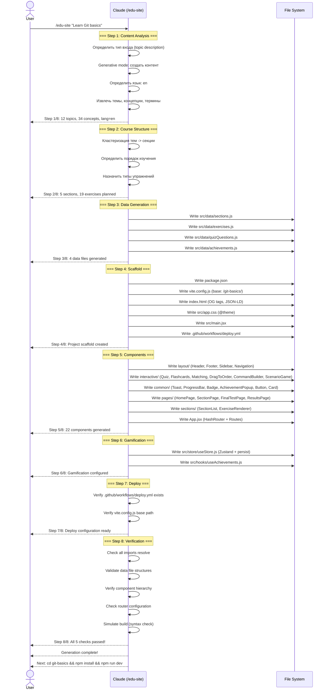

### Пошаговый разбор

**Шаг 1. Запуск пайплайна**
```
User: /edu-site "Learn Git basics: init, add, commit, branch, merge, remote"
```

**Шаг 2. Content Analysis**
- Определяется тип входа: topic description (нет URL, нет пути к файлу)
- Активируется generative mode
- Язык: en (латинские термины)
- Извлекаются темы: init, add, commit, branch, merge, remote

**Шаг 3. Course Structure**
- Темы кластеризуются в 5 секций
- Порядок: Setup -> Basics -> Branching -> Merging -> Remote
- Каждой теме назначается тип упражнения

**Шаг 4-8. Генерация**
- Последовательная генерация всех артефактов
- Финальная верификация

---

## Flow: Анализ контента

### Flowchart

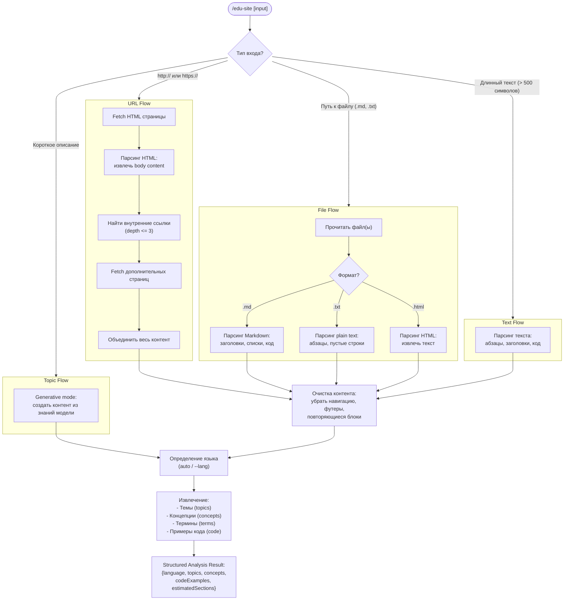

---

## Flow: Выбор типа упражнения

### Flowchart

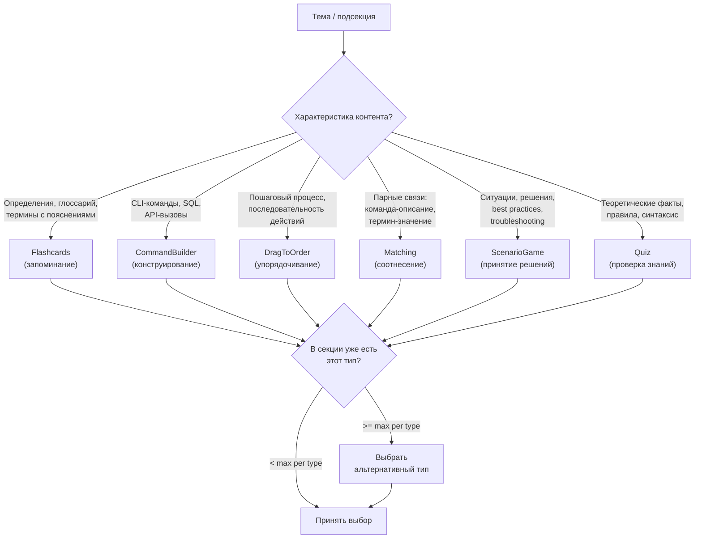

---

## Flow: Упражнение Quiz

### Sequence Diagram

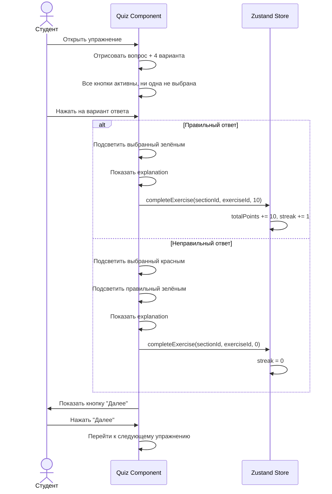

---

## Flow: Упражнение Flashcards

### Sequence Diagram

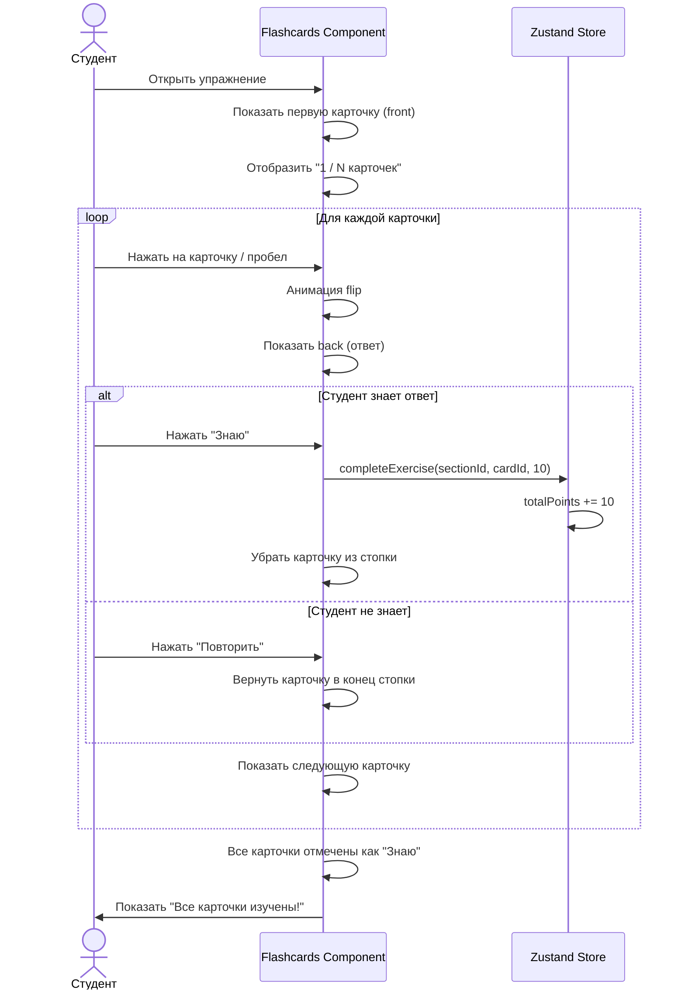

---

## Flow: Упражнение Matching

### Sequence Diagram

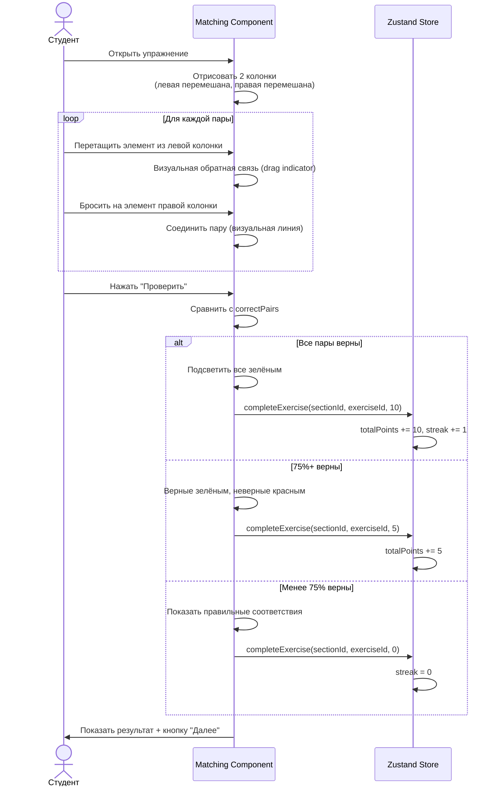

---

## Flow: Упражнение Drag-to-Order

### Sequence Diagram

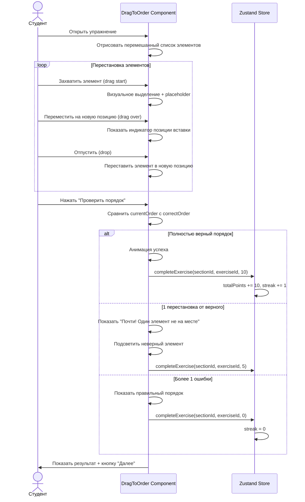

---

## Flow: Упражнение Command Builder

### Sequence Diagram

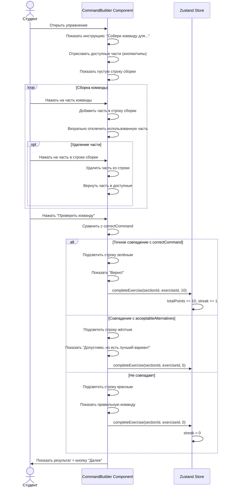

---

## Flow: Упражнение Scenario Game

### Sequence Diagram

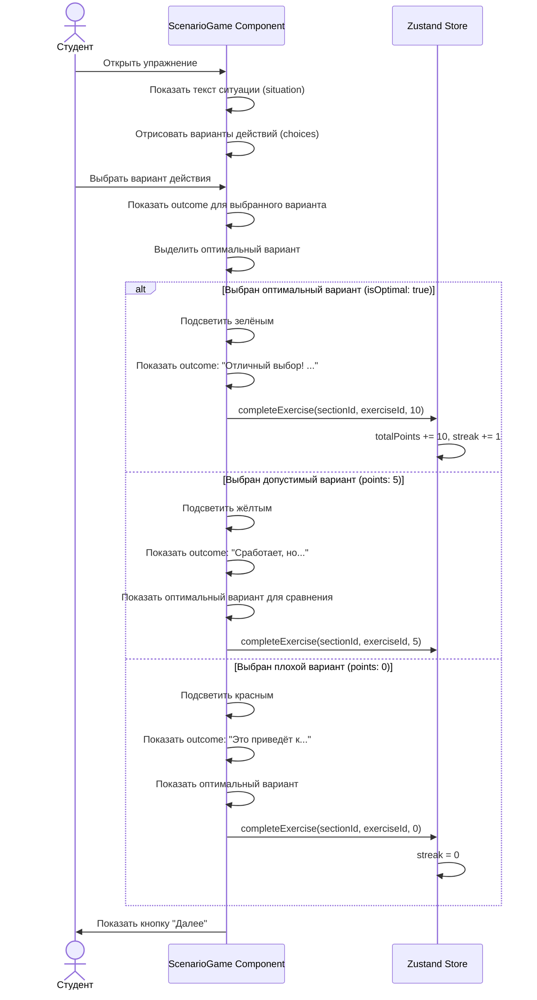

---

## Flow: Разблокировка достижения

### Flowchart

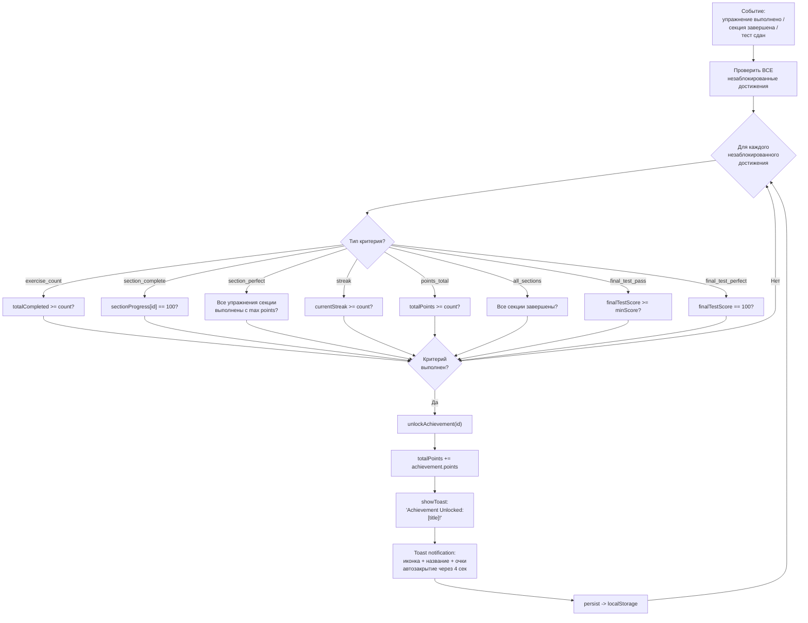

### Пример потока

```
Событие: студент выполнил 10-е упражнение подряд (streak = 10)

Проверка достижений:
  - "first-exercise" (exercise_count: 1) -> уже разблокировано -> SKIP
  - "fast-learner" (exercise_count: 5)   -> уже разблокировано -> SKIP
  - "streak-5" (streak: 5)              -> уже разблокировано -> SKIP
  - "streak-10" (streak: 10)            -> streak=10 >= 10    -> UNLOCK!

Результат:
  -> unlockAchievement("streak-10")
  -> totalPoints += 100 (rarity: rare)
  -> Toast: "Achievement Unlocked: On Fire! +100 pts"
  -> persist to localStorage
```

---

## Flow: Отслеживание прогресса

### Sequence Diagram

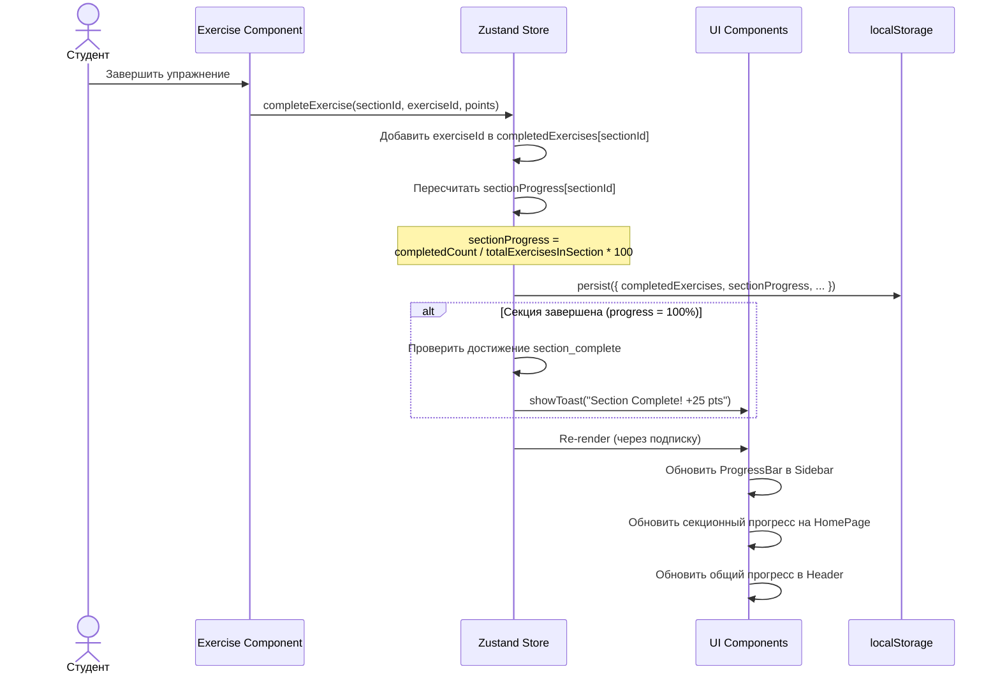

### Формула прогресса

```
Прогресс секции:
  sectionProgress[id] = (completedExercises[id].size / totalExercises[id]) * 100

Общий прогресс:
  overallProgress = sum(completedExercises[*].size) / totalExercises * 100

Где totalExercises для секции = exercises.filter(e => e.sectionId === id).length
```

---

## Flow: Финальный тест

### Sequence Diagram

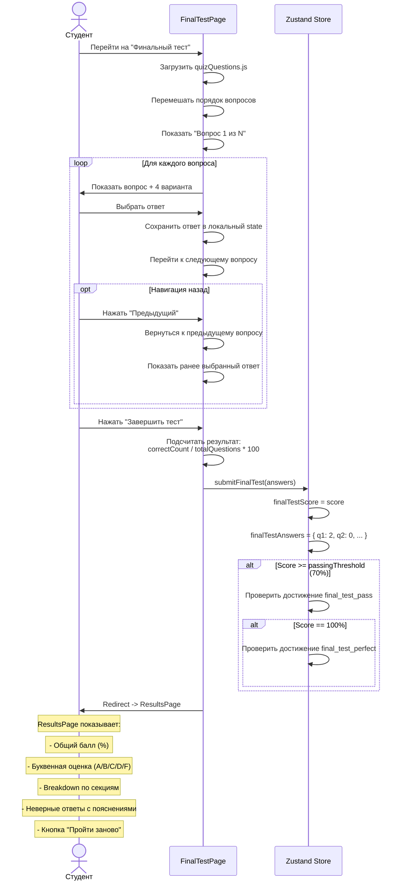

### Flowchart результатов

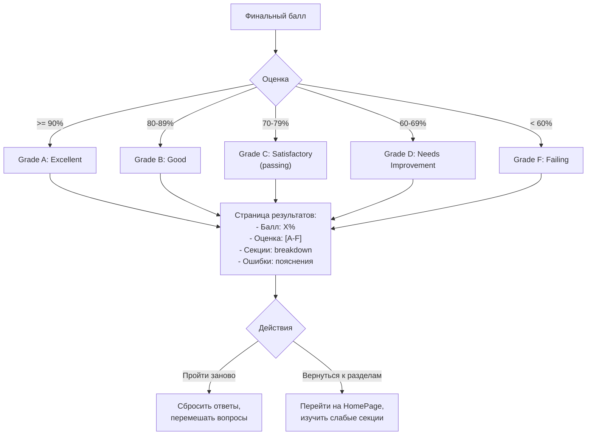

---

## Flow: Сборка и деплой

### Flowchart

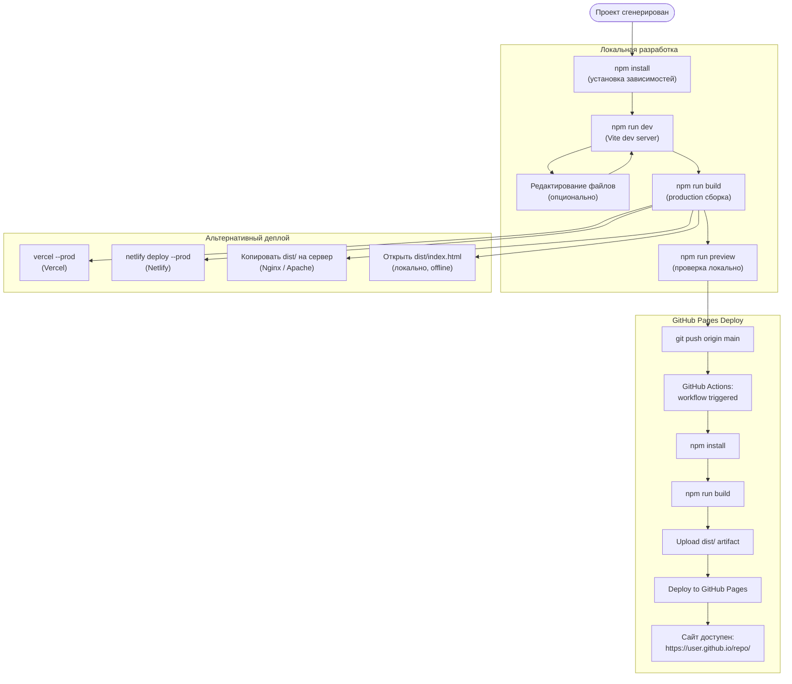

### GitHub Actions workflow шаг за шагом

```
1. Push в ветку main
   -> GitHub Actions detect push event

2. Job: build
   -> Checkout репозитория
   -> Setup Node.js 20
   -> npm install (cached)
   -> npm run build
   -> Upload dist/ as artifact

3. Job: deploy (depends on build)
   -> Download artifact
   -> Deploy to GitHub Pages
   -> Output: page URL

4. Результат:
   -> https://user.github.io/repo/ доступен
   -> SPA загружается с хешированным JS/CSS
   -> HashRouter обрабатывает маршруты клиентски
```

---

## Быстрый справочник

### Потоки генерации (администратор)

| Шаг | Модуль | Вход | Выход |
|-----|--------|------|-------|
| 1 | Content Analysis | URL / файл / текст / тема | Structured analysis |
| 2 | Course Structure | Structured analysis | Секции + маппинг упражнений |
| 3 | Data Generation | Структура курса | 4 файла .js |
| 4 | Scaffold | Метаданные проекта | Каркас Vite + React |
| 5 | Components | Список компонентов | 22 JSX-файла |
| 6 | Gamification | Данные достижений | Zustand store + hooks |
| 7 | Deploy | Имя репозитория | GitHub Actions workflow |
| 8 | Verification | Весь проект | 5 проверок: PASS/FAIL |

### Потоки обучения (студент)

| Действие | Компоненты | Результат |
|---------|-----------|----------|
| Выполнение упражнения | Exercise -> Store -> Toast | +10 pts, streak update |
| Завершение секции | SectionPage -> Store -> Toast | +25 pts, progress 100% |
| Разблокировка достижения | Store -> AchievementPopup -> Toast | +50-200 pts |
| Прохождение финального теста | FinalTestPage -> Store -> ResultsPage | Оценка A-F |
| Просмотр прогресса | Sidebar, Header, HomePage | % по секциям и общий |
