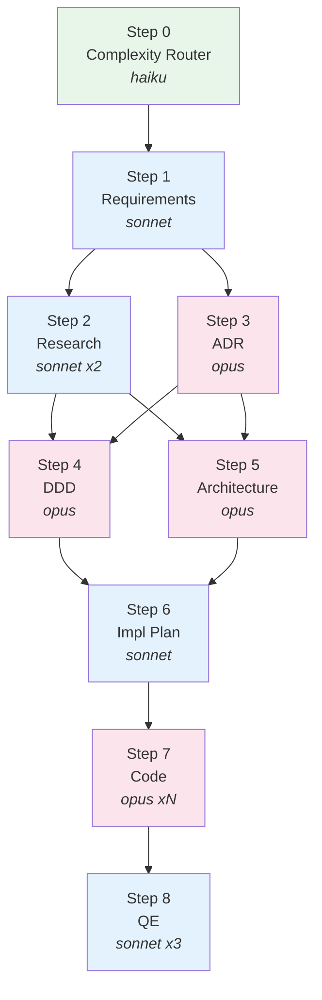
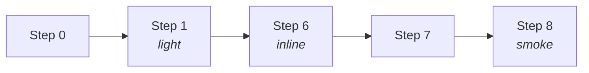
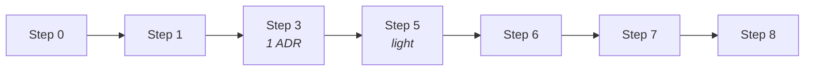
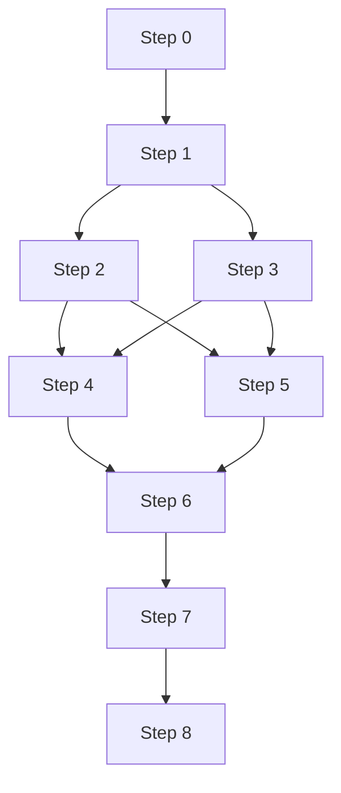
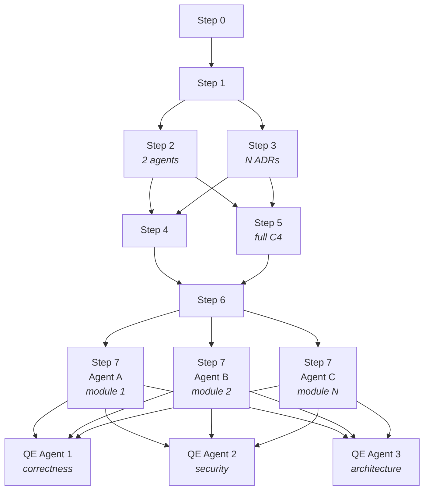

# Архитектура @dzhechkov/skills-feature-adr

> Адаптивный 9-шаговый pipeline для разработки фич любой сложности --
> от однофайлового багфикса до кросс-доменного рефакторинга на 30+ файлов.

---

## 1. Обзор

`@dzhechkov/skills-feature-adr` -- пакет навыков (skill pack) для Claude Code, реализующий полный цикл разработки фич с адаптивной глубиной проработки.

Ключевые характеристики:

- **9-шаговый pipeline** с автоматическим определением сложности через Complexity Router (S/M/L/XL)
- **ADR-driven архитектура** -- каждое значимое решение документируется через Architecture Decision Records с альтернативами и decision matrix
- **DDD-моделирование** -- bounded contexts, ubiquitous language и агрегаты для сложных фич (L/XL)
- **Мульти-агентная QE** -- параллельные review-агенты для XL-фич (correctness, security, architecture)
- **DAG-based выполнение** -- шаги могут выполняться параллельно, когда зависимости позволяют
- **Standalone или экосистема** -- работает автономно через `npx` или как часть Keysarium

```
                    @dzhechkov/keysarium-core              (shared framework)
                        ^         ^         ^
                        |         |         |
                   peerDep    peerDep   peerDep
                        |         |         |
  @dzhechkov/keysarium  |  skills-feature-adr  |  skills-bto
    (исследования)      |     (фичи)           |    (оценка)
```

---

## 2. Философия проектирования

### 2.1 Адаптивная сложность

Центральный принцип: **не over-engineer маленькие фичи и не under-engineer большие**.

Однофайловый багфикс не требует ADR, DDD-модели и C4-диаграмм. Кросс-доменный рефакторинг на 30+ файлов без них обречён на хаос. Complexity Router анализирует фичу по 6 измерениям и автоматически активирует ровно те шаги pipeline, которые необходимы.

### 2.2 ADR-first

Любое нетривиальное архитектурное решение (выбор технологии, паттерна, стратегии интеграции) документируется до начала кодирования. Каждый ADR содержит:

- Контекст и драйверы решения
- Минимум 2 альтернативы
- Decision matrix с взвешенными критериями
- Последствия (positive, negative, risks)

Это исключает "случайную архитектуру" и обеспечивает traceability от требований до кода.

### 2.3 DAG-based выполнение

Шаги pipeline -- не строго линейная последовательность. Для L/XL-фич шаги 2+3 и 4+5 могут выполняться параллельно, что сокращает время проработки. Для S/M-фич DAG коллапсирует в линейную последовательность -- параллелизм не нужен.

### 2.4 Модульная композиция скиллов

Pipeline переиспользует существующие скиллы экосистемы:

| Скилл | Где используется | Назначение |
|-------|-----------------|-----------|
| `explore` | Step 1 | Кларификация требований через адаптивные вопросы |
| `problem-solver-enhanced` | Step 3 | TRIZ-анализ для сложных trade-off в ADR |
| `frontend-design` | Step 7 | UI-реализация (если фича затрагивает интерфейс) |

Это даёт единообразие подходов и накопление экспертизы в одном месте.

---

## 3. Pipeline архитектура -- 9 шагов

### Step 0: Complexity Router

| Параметр | Значение |
|----------|---------|
| Модель | haiku |
| Время | ~30 секунд |
| Тиры | Все (всегда выполняется) |
| Артефакт | `00_complexity_assessment.md` |
| Promise | `FEATURE_ADR_ROUTED` |

Оценивает фичу по 6 измерениям (1-4 балла каждое), суммирует баллы и классифицирует: S (6-8), M (9-13), L (14-19), XL (20-24). Применяет override-правила (любое измерение = 4 -> минимум L, breaking changes > 0 -> минимум M). Определяет `{ACTIVE_STEPS}` и `{TIME_BUDGET}`.

### Step 1: Requirements

| Параметр | Значение |
|----------|---------|
| Модель | sonnet |
| Тиры | Все (light для S) |
| Артефакт | `01_requirements.md` |
| Promise | `FEATURE_ADR_REQUIREMENTS_GATHERED` |

Собирает стейкхолдеров, функциональные требования (FR) с acceptance criteria, нефункциональные требования (NFR), ограничения и scope. Для S-тира -- 3-5 bullet points без формального документа. Загружает скилл `explore` для кларификации неясных аспектов.

### Step 2: Research

| Параметр | Значение |
|----------|---------|
| Модель | sonnet |
| Тиры | L/XL |
| Агенты | 2 параллельных (codebase patterns / external patterns) |
| Артефакт | `02_research.md` |
| Promise | (входит в `FEATURE_ADR_DESIGNED`) |

Два параллельных sonnet-агента: первый анализирует паттерны в существующей кодовой базе (аналогичные модули, соглашения, структуры); второй исследует внешние аналоги и best practices. Результаты синтезируются оркестратором.

### Step 3: ADR (Architecture Decision Records)

| Параметр | Значение |
|----------|---------|
| Модель | opus |
| Тиры | M+ (1 ADR для M, N ADR для L/XL) |
| Артефакт | `03_adr/001-{decision}.md` |
| Promise | (входит в `FEATURE_ADR_DESIGNED`) |

Идентифицирует decision points в требованиях (выбор технологии, паттерна, стратегии интеграции, моделирования данных). Для каждого решения создаёт ADR по шаблону из `references/adr-template.md` с decision matrix. Может загружать `problem-solver-enhanced` для TRIZ-анализа сложных trade-off. Для L/XL запускается **параллельно** с Step 2.

### Step 4: DDD (Domain-Driven Design)

| Параметр | Значение |
|----------|---------|
| Модель | opus |
| Тиры | L/XL |
| Артефакт | `04_domain_model.md`, `diagrams/domain-model.mermaid` |
| Promise | (входит в `FEATURE_ADR_DESIGNED`) |

Идентифицирует bounded contexts, определяет ubiquitous language, моделирует агрегаты, сущности, value objects и domain events. Строит context map с типизированными связями (Shared Kernel, Customer-Supplier, Anti-Corruption Layer). Валидирует совместимость с существующей кодовой базой. Может выполняться **параллельно** с Step 5.

### Step 5: Architecture

| Параметр | Значение |
|----------|---------|
| Модель | opus |
| Тиры | M+ (light для M) |
| Артефакт | `05_architecture.md`, `diagrams/architecture-c4.mermaid`, `diagrams/sequence-*.mermaid` |
| Promise | `FEATURE_ADR_DESIGNED` |

Для M-тира: только component diagram. Для L/XL: полная C4-иерархия (System Context -> Container -> Component) + sequence diagrams для основных потоков (happy path, error path, async). Включает дизайн API (если применимо), описание миграций данных и стратегию кэширования.

### Step 6: Implementation Plan

| Параметр | Значение |
|----------|---------|
| Модель | sonnet |
| Тиры | Все (inline для S) |
| Артефакт | `06_implementation_plan.md` |
| Promise | `FEATURE_ADR_PLANNED` |

Декомпозиция реализации на задачи с dependency DAG. Определяет порядок выполнения, точки параллелизации (для Step 7), оценки трудоёмкости. Для S-тира -- inline-список в разговоре без отдельного файла.

### Step 7: Code

| Параметр | Значение |
|----------|---------|
| Модель | opus |
| Тиры | Все |
| Агенты | N параллельных для L/XL (по одному на модуль) |
| Артефакт | `07_code_changes/change_manifest.md` + реальные изменения в коде |
| Promise | `FEATURE_ADR_IMPLEMENTED` |

Для S/M: последовательная реализация задач. Для L/XL: параллельные opus-агенты, каждый работает над независимым модулем/доменом. Pre-implementation checklist обеспечивает соответствие конвенциям кодовой базы. Каждый агент отчитывается по created/modified/deleted файлам. Оркестратор верифицирует интеграционные точки между модулями.

### Step 8: QE (Quality Engineering)

| Параметр | Значение |
|----------|---------|
| Модель | sonnet |
| Тиры | Все (адаптивная глубина) |
| Агенты | 3 параллельных для XL (review panel) |
| Артефакт | `08_qe_report.md` |
| Promise | `FEATURE_ADR_VERIFIED` |

Многоуровневое тестирование с адаптивной глубиной:

| Тир | Smoke | Unit | Integration | E2E | Review Panel |
|-----|-------|------|-------------|-----|-------------|
| S | да | -- | -- | -- | -- |
| M | да | да | -- | -- | code review |
| L | да | да | да | -- | code review |
| XL | да | да | да | да | 3 агента (correctness + security + architecture) |

Для XL запускается мульти-агентная review panel из 3 параллельных sonnet-агентов, каждый фокусируется на своём аспекте: корректность (requirements coverage), безопасность (OWASP, auth, data exposure), архитектура (ADR adherence, pattern compliance).

---

## 4. Complexity Router

Complexity Router -- ключевой компонент адаптивности pipeline. Он определяет, сколько шагов нужно и какой глубины.

### 4.1 Шесть измерений

Каждое измерение оценивается от 1 (минимальное влияние) до 4 (максимальное):

| Измерение | 1 (S) | 2 (M) | 3 (L) | 4 (XL) |
|-----------|-------|-------|-------|--------|
| Files Affected | 1-3 | 4-10 | 11-30 | 30+ |
| Domains Touched | 1 | 1-2 | 2-4 | 4+ |
| New Integrations | 0 | 0-1 | 1-3 | 3+ |
| Breaking Changes | 0 | 0 | 0-2 | 2+ |
| New Data Models | 0 | 0-1 | 1-3 | 3+ |
| Cross-Cutting Concerns | 0 | 0-1 | 1-2 | 3+ |

Cross-Cutting Concerns: auth, logging, caching, i18n, error handling, monitoring и т.д.

### 4.2 Классификация по сумме баллов

| Сумма | Тир | Описание | Пример |
|-------|-----|----------|--------|
| 6-8 | **S** (Small) | Локальное изменение | Багфикс, config change, утилита |
| 9-13 | **M** (Medium) | Ограниченная фича | Новый API endpoint, UI-компонент |
| 14-19 | **L** (Large) | Мульти-доменная фича | Новый модуль, интеграция |
| 20-24 | **XL** (Extra Large) | Кросс-доменное изменение | Новая подсистема, major refactor |

### 4.3 Override-правила

Правила переопределения предотвращают недооценку сложности:

1. **Любое измерение = 4** -> минимальный тир L (даже если сумма < 14)
2. **Breaking changes > 0** -> минимальный тир M
3. **Пользователь явно указал тир** -> использовать указанный
4. **Описание содержит "refactor", "migration", "redesign"** -> bias к L/XL

### 4.4 Матрица активации шагов

```
Step                    | S | M | L | XL |
------------------------+---+---+---+----+
0 Complexity Router     | + | + | + | +  |
1 Requirements          | ~ | + | + | +  |
2 Research              |   |   | + | +  |
3 ADR                   |   | + | + | +  |
4 DDD                   |   |   | + | +  |
5 Architecture          |   | ~ | + | +  |
6 Implementation Plan   | ~ | + | + | +  |
7 Code                  | + | + | + | +  |
8 QE                    | ~ | + | + | +  |

+ = полный    ~ = облегченный    (пусто) = пропущен
```

### 4.5 Распределение time budget

| Тир | Общий бюджет | R (Requirements) | P (Planning: ADR+DDD+Arch) | I (Implementation) | Q (QE) |
|-----|-------------|------|------|------|------|
| S | 15 мин | 2 мин | 0 мин | 10 мин | 3 мин |
| M | 45 мин | 5 мин | 10 мин | 20 мин | 10 мин |
| L | 2 часа | 15 мин | 30 мин | 45 мин | 30 мин |
| XL | 4+ часа | 30 мин | 60 мин | 90 мин | 60 мин |

---

## 5. DAG выполнения

### 5.1 Полный DAG (L/XL)



### 5.2 DAG по тирам

**S (линейный):**



**M (линейный с ADR и архитектурой):**



**L (параллельные пары):**



**XL (полный DAG с мульти-агентным кодированием и review panel):**



### 5.3 Группы зависимостей

| Группа | Шаги | Тип | Предусловие |
|--------|------|-----|-------------|
| Group 1 | Step 0 -> Step 1 | sequential | -- |
| Group 2 | Step 2 // Step 3 | parallel | Step 1 complete |
| Group 3 | Step 4 // Step 5 | parallel | Steps 2+3 complete |
| Group 4 | Step 6 | sequential | Steps 4+5 complete |
| Group 5 | Step 7 (N agents) | parallel per module | Step 6 complete |
| Group 6 | Step 8 (3 agents) | parallel per role | Step 7 complete |

---

## 6. Agent Swarm стратегия

### 6.1 Внутришаговый параллелизм

| Шаг | Агенты | Модель | Задачи |
|-----|--------|--------|--------|
| Step 2 | 2 parallel | sonnet + sonnet | Codebase patterns // External analogues |
| Step 3+4 | 2 parallel | opus + opus | ADR drafting // DDD modeling (L/XL) |
| Step 7 | N parallel | opus x N | По одному агенту на независимый модуль/домен (XL) |
| Step 8 | 3 parallel | sonnet x 3 | Correctness // Security // Architecture (XL) |

### 6.2 Межшаговый параллелизм

Для L/XL-фич:

- **Steps 2 и 3** запускаются параллельно после завершения Step 1
- **Steps 4 и 5** могут пересекаться -- Step 5 стартует, как только Step 3 завершён, даже если Step 2 ещё в работе (Step 5 зависит от ADR, Step 4 зависит от Research)
- **Step 7** -- каждый модуль из implementation plan реализуется параллельным opus-агентом; после завершения всех агентов оркестратор верифицирует integration points

### 6.3 Свёртка для S/M

Для S-тира: никакого параллелизма. 5 шагов выполняются последовательно одним агентом.
Для M-тира: никакого параллелизма. 7 шагов выполняются последовательно, overhead от spawn агентов превышает выигрыш.

### 6.4 Агентная изоляция

- Каждый параллельный агент работает только со своим набором файлов
- Агенты не видят промежуточные результаты друг друга
- Оркестратор синтезирует результаты после завершения всех агентов группы
- Для Step 8 review panel: каждый reviewer получает одинаковый snapshot кода, пишет независимый отчёт

---

## 7. Cross-Step Variables

Реестр переменных, передаваемых между шагами pipeline:

| Переменная | Устанавливается | Используется | Тип | Описание |
|-----------|----------------|-------------|-----|----------|
| `{COMPLEXITY_TIER}` | Step 0 | Все шаги | `S` / `M` / `L` / `XL` | Определённый тир сложности |
| `{ACTIVE_STEPS}` | Step 0 | Оркестратор | `list[int]` | Активные шаги для данного тира |
| `{TIME_BUDGET}` | Step 0 | Все шаги | `dict` | Бюджет времени по категориям (R/P/I/Q) |
| `{DIMENSION_SCORES}` | Step 0 | Step 1 | `dict` | Оценки по 6 измерениям |
| `{REQUIREMENTS}` | Step 1 | Steps 2-8 | `structured` | FR, NFR, constraints, scope |
| `{RESEARCH_FINDINGS}` | Step 2 | Steps 3-5 | `structured` | Паттерны кодовой базы + внешние аналоги |
| `{ADR_DECISIONS}` | Step 3 | Steps 4-7 | `list[ADR]` | Принятые архитектурные решения |
| `{DOMAIN_MODEL}` | Step 4 | Steps 5-7 | `structured` | Bounded contexts, aggregates, language |
| `{ARCHITECTURE}` | Step 5 | Steps 6-7 | `structured` | C4 diagrams, sequence flows, API design |
| `{IMPL_PLAN}` | Step 6 | Step 7 | `list[task]` | Задачи с зависимостями (DAG) |
| `{CODE_CHANGES}` | Step 7 | Step 8 | `list[file]` | Созданные/изменённые/удалённые файлы |
| `{QE_RESULTS}` | Step 8 | Final report | `structured` | Результаты тестирования и review |

### Контракты передачи данных

- Step 3 (ADR) **должен** иметь доступ к `{REQUIREMENTS}` -- стартует только после Step 1
- Step 5 (Architecture) **должен** иметь доступ к `{ADR_DECISIONS}` -- не стартует без Step 3
- Step 7 (Code) **не может** стартовать без `{IMPL_PLAN}` из Step 6 -- это обязательный gate
- Step 8 (QE) валидирует `{CODE_CHANGES}` против `{REQUIREMENTS}` -- traceability от требований до тестов

---

## 8. Promise Tags

Система semantic completion promises для формализации checkpoint gates:

| Шаг | Promise Tag | Значение |
|-----|-------------|---------|
| Step 0 | `FEATURE_ADR_ROUTED` | Тир определён, active steps и time budget рассчитаны |
| Step 1 | `FEATURE_ADR_REQUIREMENTS_GATHERED` | Требования собраны, acceptance criteria определены |
| Steps 2-5 | `FEATURE_ADR_DESIGNED` | Все design-шаги тира завершены (research, ADR, DDD, architecture) |
| Step 6 | `FEATURE_ADR_PLANNED` | Implementation plan создан, задачи декомпозированы |
| Step 7 | `FEATURE_ADR_IMPLEMENTED` | Код реализован, change manifest заполнен |
| Step 8 | `FEATURE_ADR_VERIFIED` | QE пройден, все BLOCKER-находки устранены |

### Правила promise

1. Promise tag **выпускается только** после верифицируемого выполнения условий
2. Если условия **не выполнены**, выпускается `_INCOMPLETE` вариант (например, `FEATURE_ADR_DESIGNED_INCOMPLETE`)
3. Downstream-шаги **проверяют** upstream promise перед стартом
4. Promise tag включается в checkpoint banner для пользователя

### Checkpoint формат

```
=====================================================
  STEP N/8: [Step Name] Complete
  <promise>[PROMISE_TAG]</promise>
  Tier: {COMPLEXITY_TIER} | Active Steps: {ACTIVE_STEPS}

  [2-3 строки summary]
  Artifacts: [list]

  * "ок" -- next step
  * "углуби [section]" -- elaborate
  * "[feedback]" -- adjust
=====================================================
```

---

## 9. Model Routing

Каждый шаг использует модель, оптимальную для его задачи:

| Шаг | Модель | Rationale | Стоимость (отн.) |
|-----|--------|-----------|-----------------|
| Step 0: Complexity Router | **haiku** | Простая классификация по 6 измерениям, pattern matching | 1x |
| Step 1: Requirements | **sonnet** | Аналитическая работа: декомпозиция требований, acceptance criteria | 15x |
| Step 2: Research | **sonnet** | Исследовательский синтез: паттерны кодовой базы и аналоги | 15x |
| Step 3: ADR | **opus** | Сложное рассуждение: trade-off analysis, decision matrix, consequences | 75x |
| Step 4: DDD | **opus** | Доменное моделирование: bounded contexts, агрегаты, language | 75x |
| Step 5: Architecture | **opus** | Системный дизайн: C4 диаграммы, sequence flows, API design | 75x |
| Step 6: Implementation Plan | **sonnet** | Задачная декомпозиция: structured task DAG | 15x |
| Step 7: Code | **opus** | Генерация кода: сложная реализация с учётом конвенций | 75x |
| Step 8: QE | **sonnet** | Аналитический review: тестирование, валидация, findings | 15x |

### Правила routing

1. **Haiku** -- только для classification и pattern matching (Step 0)
2. **Sonnet** -- для аналитической работы, research, testing (Steps 1, 2, 6, 8)
3. **Opus** -- для creative и complex reasoning работы (Steps 3, 4, 5, 7)
4. **Никогда** opus для Step 0 -- это расточительно для простой классификации
5. **Никогда** haiku для Step 3/7 -- качество будет недостаточным для ADR и кода
6. При spawn агентов через Agent tool **всегда** указывается параметр `model`

---

## 10. Интеграция с keysarium-core

### 10.1 Что используется из core

`@dzhechkov/skills-feature-adr` потребляет следующие протоколы из `@dzhechkov/keysarium-core`:

| Модуль core | Протокол | Как используется в feature-adr |
|-------------|----------|-------------------------------|
| `governance/` | Checkpoint protocol | Checkpoint после каждого шага с promise tag |
| `governance/` | Shard protocol | Загрузка `feature-adr.shard.md` перед стартом |
| `orchestration/` | Model routing | 3-tier routing: haiku/sonnet/opus per step |
| `orchestration/` | Agent swarm topologies | Параллельные группы для L/XL (fork-join topology) |
| `trust-tiers/` | Tier classification | Текущий тир скилла: Tier 0 (Advisory) |
| `verification/` | Promise tags | 6 promise tags для 9 шагов |

### 10.2 Что НЕ используется

Feature-adr -- это отдельный pipeline. Он **не использует**:

- **Phases** -- pipeline построен на Steps (0-8), не на Phases (0-6) из Casarium
- **Research artifacts** -- `00_product_discovery.md`, `02_research_findings.md` и т.д. не создаются
- **CJM (Customer Journey Map)** -- Phase 2.5 из Casarium не применима
- **Presentation pipeline** -- Phase 5 с storytelling, speaker script, Q&A не генерируется
- **Witness chain** -- SHA-256 chain не создаётся для feature artifacts (Rule 8 из `witness-chain.md`)
- **Dream cycles** -- Insights из dream engine не применяются к feature-adr pipeline
- **Reward learning** -- `memory_query()`/`memory_store()` не вызываются (специфичны для Casarium)

### 10.3 peerDependency

`keysarium-core` подключается как **optional peerDependency**:

```json
{
  "peerDependencies": {
    "@dzhechkov/keysarium-core": "^1.0.0"
  },
  "peerDependenciesMeta": {
    "@dzhechkov/keysarium-core": {
      "optional": true
    }
  }
}
```

Без core пакет работает полностью автономно -- все необходимые протоколы инлайнены в шаблонах. Core добавляет формализованные версии тех же протоколов для проектов, использующих полную экосистему.

---

## 11. Package архитектура (npm)

### 11.1 Структура пакета

```
packages/@dzhechkov/skills-feature-adr/
├── package.json                    ← @dzhechkov/skills-feature-adr v1.0.0
├── bin/
│   └── cli.js                      ← Entry point (#!/usr/bin/env node)
├── src/
│   ├── cli.js                      ← Argument parsing, command routing
│   ├── utils.js                    ← Colors, logging, file ops, manifest, components
│   └── commands/
│       ├── init.js                 ← Установка skill pack в проект
│       ├── update.js               ← Обновление до новой версии
│       ├── remove.js               ← Удаление skill pack
│       ├── list.js                 ← Список установленных компонентов
│       └── doctor.js               ← Диагностика здоровья установки
├── scripts/
│   └── sync-templates.js           ← Синхронизация шаблонов при prepublishOnly
└── templates/                      ← Шаблоны для установки в целевой проект
    └── .claude/
        ├── commands/
        │   └── feature-adr.md      ← Slash-команда /feature-adr
        ├── rules/
        │   └── feature-adr-conventions.md
        ├── shards/
        │   └── feature-adr.shard.md
        └── skills/
            └── feature-adr/
                ├── SKILL.md
                ├── modules/        ← 00-08 (9 step modules)
                ├── references/     ← Templates и matrices
                └── examples/       ← Sample output
```

### 11.2 CLI-команды

```bash
npx @dzhechkov/skills-feature-adr init       # Установить в текущий проект
npx @dzhechkov/skills-feature-adr update     # Обновить до последней версии
npx @dzhechkov/skills-feature-adr remove     # Удалить из проекта
npx @dzhechkov/skills-feature-adr list       # Показать установленные компоненты
npx @dzhechkov/skills-feature-adr doctor     # Проверить здоровье установки

# Флаги:
#   --force     Перезаписать существующие файлы
#   --dry-run   Показать план без записи файлов
```

### 11.3 Компоненты установки

При `init` устанавливаются 4 компонента из `templates/`:

| Компонент | Целевой путь | Фильтр | Описание |
|-----------|-------------|--------|----------|
| `skill` | `.claude/skills/feature-adr/` | -- | SKILL.md + 9 модулей + 4 reference + 1 example |
| `commands` | `.claude/commands/` | `feature-adr*` | Slash-команда `feature-adr.md` |
| `rules` | `.claude/rules/` | `feature-adr*` | Конвенции `feature-adr-conventions.md` |
| `shards` | `.claude/shards/` | `feature-adr*` | Governance shard `feature-adr.shard.md` |

Фильтрация по префиксу `feature-adr` гарантирует, что при установке в проект с существующими commands/rules/shards не затрагиваются чужие файлы.

### 11.4 Manifest

После установки создаётся `.skills-feature-adr.json`:

```json
{
  "version": "1.0.0",
  "installedAt": "2026-03-02T10:00:00.000Z",
  "components": ["skill", "commands", "rules", "shards"],
  "files": [
    ".claude/commands/feature-adr.md",
    ".claude/rules/feature-adr-conventions.md",
    ".claude/shards/feature-adr.shard.md",
    ".claude/skills/feature-adr/SKILL.md",
    "..."
  ]
}
```

Manifest используется для `update` (diff с текущими шаблонами), `remove` (список файлов для удаления) и `doctor` (проверка целостности).

### 11.5 Интеграция с Keysarium

При `init` автоматически детектируется `.keysarium.json`. Если Keysarium уже установлен -- выводится интеграционное сообщение, и компоненты устанавливаются в общие директории (`.claude/commands/`, `.claude/skills/` и т.д.), обеспечивая бесшовную работу `/feature-adr` рядом с `/casarium`.

### 11.6 Template sync

Скрипт `sync-templates.js` вызывается при `prepublishOnly` для синхронизации шаблонов из source-of-truth (`.claude/` корневого репозитория) в `templates/` пакета, гарантируя консистентность.

---

## 12. Output архитектура

### 12.1 Директория фичи

Все артефакты создаются в `features/<feature-slug>/`:

```
features/<feature-slug>/
├── 00_complexity_assessment.md        ← Всегда
├── 01_requirements.md                 ← Всегда (inline для S)
├── 02_research.md                     ← L/XL
├── 03_adr/                            ← M+
│   ├── 001-<decision-1>.md
│   ├── 002-<decision-2>.md
│   └── ...
├── 04_domain_model.md                 ← L/XL
├── 05_architecture.md                 ← M+ (light для M)
├── 06_implementation_plan.md          ← Всегда (inline для S)
├── 07_code_changes/                   ← Всегда
│   └── change_manifest.md             ← Список created/modified/deleted файлов
├── 08_qe_report.md                    ← Всегда
├── diagrams/                          ← M+
│   ├── architecture-c4.mermaid        ← L/XL (component-only для M)
│   ├── domain-model.mermaid           ← L/XL
│   └── sequence-*.mermaid             ← L/XL
└── README.md                          ← Всегда (auto-generated summary)
```

### 12.2 Обязательные артефакты по тирам

**Тир S:**

```
features/<slug>/
├── 00_complexity_assessment.md
├── 08_qe_report.md
├── README.md
+ реальные изменения кода в репозитории
```

**Тир M (все из S, плюс):**

```
├── 01_requirements.md
├── 03_adr/001-*.md
├── 05_architecture.md
├── 07_code_changes/change_manifest.md
└── diagrams/
    └── (component diagram)
```

**Тир L (все из M, плюс):**

```
├── 02_research.md
├── 04_domain_model.md
└── diagrams/
    ├── architecture-c4.mermaid
    ├── domain-model.mermaid
    └── sequence-*.mermaid
```

**Тир XL:**
Все артефакты L на полной глубине.

### 12.3 Конвенции именования

- **Feature slug:** kebab-case, латиница, max 40 символов (например, `add-user-auth`, `refactor-payment-flow`)
- **Артефакты:** нумерованный префикс по номеру шага (`00_`, `01_`, ..., `08_`)
- **ADR файлы:** `NNN-<decision-slug>.md` (например, `001-choose-database-engine.md`)
- **Диаграммы:** описательный kebab-case (например, `architecture-c4.mermaid`, `sequence-main-flow.mermaid`)
- **Никаких дат и номеров тикетов** в slug -- они указываются внутри артефактов

### 12.4 Изоляция от других pipeline

```
researches/    ← /casarium pipeline ONLY
features/      ← /feature-adr pipeline ONLY
```

Feature-adr **никогда** не создаёт файлы в `researches/`. Casarium **никогда** не создаёт файлы в `features/`. Это обеспечивает чёткое разделение контекстов.

---

## Приложение A: Quality Gates по шагам

| Шаг | Gate | Блокирующий? |
|-----|------|-------------|
| 0 | Тир обоснован по 6 измерениям с explicit reasoning | Да |
| 1 | Все требования имеют acceptance criteria (M+) | Да |
| 2 | Research findings верифицированы, не галлюцинированы (L/XL) | Да |
| 3 | Каждый ADR содержит >= 2 альтернативы (M+) | Да |
| 4 | Domain model совместима с существующей кодовой базой (L/XL) | Да |
| 5 | Mermaid-диаграммы имеют валидный синтаксис (M+) | Да |
| 6 | Зависимости задач формируют валидный DAG | Да |
| 7 | Код следует конвенциям существующей кодовой базы | Да |
| 8 | Нет BLOCKER-находок, все MUST-требования пройдены | Да |

## Приложение B: Anti-Patterns

| Anti-Pattern | Сигнал обнаружения | Действие |
|-------------|-------------------|---------|
| Пропуск Step 0 | Переход к кодированию без классификации | BLOCK |
| Over-engineer S-тир | Полный pipeline для config change | Router должен классифицировать как S |
| Under-engineer XL-тир | Пропуск ADR/DDD для major refactor | Router должен классифицировать как XL |
| ADR без альтернатив | Менее 2 опций рассмотрено | BLOCK до добавления альтернатив |
| Архитектура без ADR | Диаграммы до решений | Step 5 требует output Step 3 |
| Код без плана | Кодирование без Step 6 | BLOCK -- plan обязателен |
| Пропуск QE | Доставка без тестирования | BLOCK -- Step 8 обязателен |
| Тир изменён mid-pipeline | Scope изменился после Step 0 | Рестарт pipeline с нового Step 0 |
