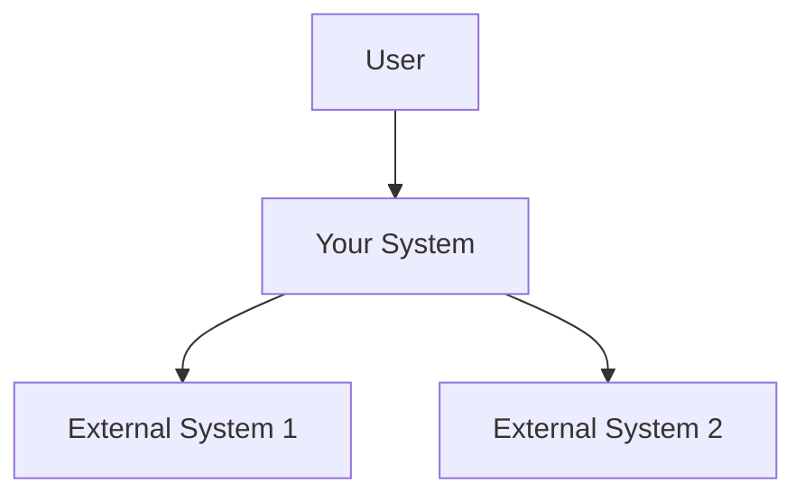
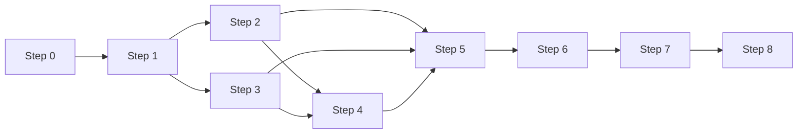
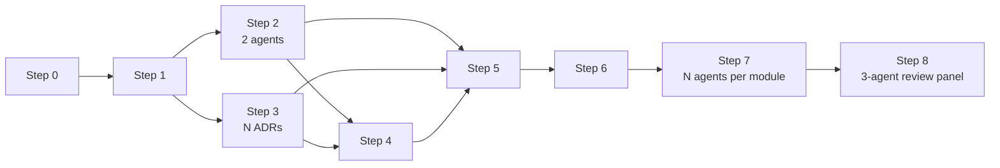

# Функциональность @dzhechkov/skills-feature-adr

> Полный справочник по каждому из 9 шагов pipeline, reference-материалам и anti-patterns.

## Содержание

1. [Step 0: Complexity Router](#1-step-0-complexity-router)
2. [Step 1: Requirements Gathering](#2-step-1-requirements-gathering)
3. [Step 2: Research](#3-step-2-research)
4. [Step 3: Architecture Decision Records](#4-step-3-architecture-decision-records)
5. [Step 4: Domain-Driven Design](#5-step-4-domain-driven-design)
6. [Step 5: Technical Architecture](#6-step-5-technical-architecture)
7. [Step 6: Implementation Plan](#7-step-6-implementation-plan)
8. [Step 7: Code Generation](#8-step-7-code-generation)
9. [Step 8: Quality Engineering](#9-step-8-quality-engineering)
10. [Reference Materials](#10-reference-materials)
11. [Anti-Patterns](#11-anti-patterns)

---

## 1. Step 0: Complexity Router

**Tiers:** All | **Model:** haiku | **Time:** ~30 секунд | **Promise:** `FEATURE_ADR_ROUTED`

Классифицирует фичу в один из 4 тиров и определяет какие шаги активны.

### 6 измерений оценки

| Измерение | 1 (S) | 2 (M) | 3 (L) | 4 (XL) |
|-----------|-------|-------|-------|--------|
| **Files Affected** | 1-3 | 4-10 | 11-30 | 30+ |
| **Domains Touched** | 1 | 1-2 | 2-4 | 4+ |
| **New Integrations** | 0 | 0-1 | 1-3 | 3+ |
| **Breaking Changes** | 0 | 0 | 0-2 | 2+ |
| **New Data Models** | 0 | 0-1 | 1-3 | 3+ |
| **Cross-Cutting Concerns** | 0 | 0-1 | 1-2 | 3+ |

Cross-cutting concerns: auth, logging, caching, i18n, error handling.

### Scoring

| Tier | Score Range | Time Budget |
|------|-----------|-------------|
| **S** (Small) | 6-8 | ~15 min |
| **M** (Medium) | 9-13 | ~45 min |
| **L** (Large) | 14-19 | ~2 hours |
| **XL** (Extra Large) | 20-24 | 4+ hours |

### Override Rules

1. Любое измерение = 4 (XL) → минимум tier **L**
2. Breaking changes > 0 → минимум tier **M**
3. Слова "refactor", "migration", "redesign" → bias toward **L/XL**
4. Пользователь может явно запросить tier

### Step Activation Matrix

| Step | S | M | L | XL |
|------|---|---|---|-----|
| 0 Complexity Router | ✅ | ✅ | ✅ | ✅ |
| 1 Requirements | ✅ (light) | ✅ | ✅ | ✅ |
| 2 Research | — | — | ✅ | ✅ |
| 3 ADR | — | ✅ (1 ADR) | ✅ (N ADRs) | ✅ (N ADRs) |
| 4 DDD | — | — | ✅ | ✅ |
| 5 Architecture | — | ✅ (light) | ✅ (full) | ✅ (full) |
| 6 Implementation Plan | ✅ (inline) | ✅ | ✅ | ✅ |
| 7 Code | ✅ | ✅ | ✅ | ✅ (parallel) |
| 8 QE | ✅ (smoke) | ✅ (unit+review) | ✅ (unit+integ+review) | ✅ (full+panel) |

### Time Budget Distribution (R/P/I/Q = Requirements/Planning/Implementation/QE)

| Tier | R | P | I | Q | Total |
|------|---|---|---|---|-------|
| S | 2 min | 0 | 10 min | 3 min | 15 min |
| M | 5 min | 10 min | 20 min | 10 min | 45 min |
| L | 15 min | 30 min | 45 min | 30 min | 2 hours |
| XL | 30 min | 60 min | 90 min | 60 min | 4 hours |

### Output

- **Файл:** `00_complexity_assessment.md`
- **Содержит:** dimension scores, total score, tier, override justification, active steps, time budget

---

## 2. Step 1: Requirements Gathering

**Tiers:** All | **Model:** sonnet | **Promise:** `FEATURE_ADR_REQUIREMENTS_GATHERED`

### Процесс

1. **Загрузить `explore` skill** для M/L/XL (для S — пропуск)
2. **Stakeholders** — end user, developer consumer, approver
3. **Functional Requirements** — FR-N с acceptance criteria (Given/When/Then)
4. **Non-Functional Requirements** (M+ only) — performance, security, scalability, compatibility, accessibility
5. **Constraints** — technical, business, organizational
6. **Scope Boundaries** — in scope / out of scope / dependencies / dependents
7. **Open Questions** — что требует уточнения

### Глубина по тирам

| Tier | Подход |
|------|--------|
| S | 3-5 bullet points inline, без файла |
| M/L/XL | Полный structured document `01_requirements.md` |

### Пример FR

```markdown
### FR-1: Уведомление о новом заказе

**Given** пользователь подписан на уведомления
**When** создаётся новый заказ
**Then** пользователь получает push-уведомление в течение 5 секунд
```

### Output

- **Файл:** `01_requirements.md` (или inline для S-tier)
- **Variable:** `{REQUIREMENTS}`

---

## 3. Step 2: Research

**Tiers:** L/XL only | **Model:** sonnet | **Agents:** 2 parallel

### 2 параллельных потока

#### Agent 1 — Codebase Pattern Research

- Поиск похожих features в кодовой базе
- Идентификация established patterns
- Каталогизация shared utilities/services
- Документирование test patterns
- Data access patterns

#### Agent 2 — External Pattern Research

- Industry solutions & best practices
- Framework conventions & recommendations
- Доступные библиотеки с trade-offs
- Known anti-patterns

### Synthesis

Результаты объединяются в Pattern Summary:
- Recommended approach vs alternatives
- Library evaluation
- Anti-patterns to avoid
- Clear recommendation с rationale

### Output

- **Файл:** `02_research.md`
- **Variable:** `{RESEARCH_FINDINGS}`

---

## 4. Step 3: Architecture Decision Records

**Tiers:** M+ only | **Model:** opus | **Promise (совместно с Steps 2-5):** `FEATURE_ADR_DESIGNED`

### Сигналы для ADR

- Technology choice (database, queue, framework)
- Pattern choice (Repository vs Active Record)
- Integration strategy (REST vs GraphQL vs gRPC)
- Data modeling (normalized vs denormalized)
- Deployment strategy (monolith vs microservice)
- Trade-off decisions (consistency vs availability)

### ADR Template

```markdown
# ADR-001: {Decision Title}

## Status
Proposed | Accepted | Superseded

## Context
{Problem space — NOT solution}

## Decision Drivers
- {Constraint 1}
- {Constraint 2}

## Considered Options
### Option A: {Name}
- ✅ Pro 1
- ❌ Con 1

### Option B: {Name}
- ✅ Pro 1
- ❌ Con 1

## Decision Matrix
| Criterion | Weight | Option A | Option B |
|-----------|--------|----------|----------|
| Performance | 0.3 | 8 | 6 |
| Simplicity | 0.3 | 7 | 9 |
| Extensibility | 0.4 | 9 | 5 |
| **Weighted** | | **8.1** | **6.5** |

## Decision
{Chosen option} — because {1-2 sentence rationale}

## Consequences
### Positive
- {Benefit}
### Negative
- {Tradeoff}
### Risks
- {Risk} → Mitigation: {mitigation}

## Links
- Requirement: FR-{N}
- Related: ADR-{M}
```

### Глубина по тирам

| Tier | Количество ADR |
|------|---------------|
| M | 1 ADR для главного решения |
| L/XL | N ADR для каждого значимого решения |

### Anti-Patterns (блокирующие)

| Pattern | Действие |
|---------|---------|
| Только 1 option в ADR | **BLOCK** — минимум 2 альтернативы |
| Нет consequences | **BLOCK** — обязательны |
| Decision без context | **BLOCK** — контекст = проблема, не решение |
| Premature optimization | **FLAG** — warn |

### Output

- **Директория:** `03_adr/001-{decision-slug}.md`, `002-*.md`, ...
- **Variable:** `{ADR_DECISIONS}`

---

## 5. Step 4: Domain-Driven Design

**Tiers:** L/XL only | **Model:** opus

### Компоненты DDD

#### Bounded Contexts

Определяются по:
- Разные stakeholders
- Разные data lifecycles
- Разные ubiquitous languages
- Shared data с разной семантикой

#### Ubiquitous Language

Точные определения терминов для каждого контекста:
```
Order (e-commerce context): A customer's purchase request
Order (fulfillment context): A shipment instruction
NOT confused with: Invoice, Quote
```

#### Aggregates & Entities

- Consistency boundaries
- Identity definitions
- Domain events

#### Relationships

| Тип | Описание |
|-----|---------|
| Shared Kernel | Общая модель между контекстами |
| Customer-Supplier | Downstream зависит от upstream |
| Conformist | Downstream полностью следует upstream |
| Anti-Corruption Layer | Изолирующий адаптер |
| Open Host Service | Публичный API для потребителей |

#### Codebase Compatibility Check

- Проверка naming conflicts
- ORM compatibility
- Pattern alignment

### Output

- **Файлы:** `04_domain_model.md` + `diagrams/domain-model.mermaid`
- **Variable:** `{DOMAIN_MODEL}`

---

## 6. Step 5: Technical Architecture

**Tiers:** M+ only | **Model:** opus

### C4 Levels

#### Level 1 — System Context (L/XL only)



- Actors/users
- Your system (центр)
- External systems
- Trust boundaries

#### Level 2 — Container Diagram (L/XL only)

- Technical building blocks (web app, API, database, queue, cache)
- Technologies (React, Node.js, PostgreSQL, Redis)
- Interactions

#### Level 3 — Component Diagram (M/L/XL)

- Components внутри affected container
- Responsibilities
- Dependencies

### Sequence Diagrams (L/XL)

- Happy path flow
- Main error flow
- Async flow (if applicable)

### Дополнительно (L/XL)

- **Data flow & storage** — new tables, migrations, schema changes
- **API design** — endpoints, request/response schemas, error codes

### Глубина по тирам

| Tier | Что включается |
|------|---------------|
| M | Component diagram only |
| L/XL | Full C4 (L1+L2+L3) + sequence diagrams + data/API design |

### Output

- **Файлы:** `05_architecture.md` + `diagrams/architecture-c4.mermaid`, `diagrams/sequence-*.mermaid`
- **Variable:** `{ARCHITECTURE}`

---

## 7. Step 6: Implementation Plan

**Tiers:** All | **Model:** sonnet | **Promise:** `FEATURE_ADR_PLANNED`

### Task Format

```
TASK-N: {Title}
  Description: {What to do}
  Files: {Files affected}
  Depends on: TASK-M (or none)
  Test: {How to verify}
```

### Task Properties

- **Independent** — reviewable/testable in isolation
- **Completable** — produces working code, not half-done
- **Testable** — clear done criteria

### Dependency Graph

Valid DAG (no cycles). Задачи организуются в **parallel groups** — группы независимых задач, которые можно выполнять одновременно.

```
Group 1: TASK-1, TASK-2 (independent)
  ↓
Group 2: TASK-3 (depends on TASK-1), TASK-4 (depends on TASK-2)
  ↓
Group 3: TASK-5 (depends on TASK-3 + TASK-4)
```

### Checkpoints между группами для верификации промежуточного прогресса.

### Risk Assessment (L/XL only)

- Blockers — что может заблокировать
- Fallbacks — запасные варианты
- External dependencies — внешние зависимости

### Глубина по тирам

| Tier | Подход |
|------|--------|
| S | Inline checklist (3-5 items, без файла) |
| M/L/XL | Full structured document |

### Output

- **Файл:** `06_implementation_plan.md`
- **Variable:** `{IMPL_PLAN}`

---

## 8. Step 7: Code Generation

**Tiers:** All | **Model:** opus | **Promise:** `FEATURE_ADR_IMPLEMENTED`

### Pre-Implementation Checklist

- [ ] Read similar implementations in codebase
- [ ] Identify naming conventions
- [ ] Study import patterns
- [ ] Document error handling patterns
- [ ] Review test patterns

### Execution Strategy

1. Для каждой задачи из плана:
   - Read existing files to be modified
   - Implement following existing patterns
   - Verify against architecture diagram
   - Verify against ADR decisions
2. **L/XL:** parallel agents per module/domain
3. After all agents: verify integration points, fix mismatches, run existing tests

### Code Quality Rules

1. Follow existing patterns (consistency > novelty)
2. No over-engineering
3. No premature abstraction
4. Handle errors at boundaries only
5. Self-documenting code > comments
6. Respect ADR decisions

### Change Manifest

Отслеживает все файлы: created / modified / deleted.

### Глубина по тирам

| Tier | Подход |
|------|--------|
| S | Single-pass implementation |
| M | Sequential with checkpoints |
| L/XL | Parallel agents per module |

### Output

- **Фактические изменения кода** в репозитории
- **Файл:** `07_code_changes/change_manifest.md`
- **Variable:** `{CODE_CHANGES}`

---

## 9. Step 8: Quality Engineering

**Tiers:** All | **Model:** sonnet | **Promise:** `FEATURE_ADR_VERIFIED`

### Phase 1: Smoke Tests (All tiers)

- [ ] Code compiles / no syntax errors
- [ ] Existing test suite passes (no regressions)
- [ ] Linter passes (if configured)
- [ ] Type checker passes (if configured)

**Для S-tier:** если Phase 1 passed → done.

### Phase 2: Test Generation (M+)

#### Unit Tests

- Happy path
- Edge cases
- Error scenarios

#### Integration Tests (L/XL)

- API endpoints
- Database operations
- Queue interactions
- External service mocks

#### E2E Tests (XL only)

- Complete user journeys
- Realistic data volumes
- Failure scenarios

### Phase 3: Code Review (M+)

#### 5 Review Dimensions

| Dimension | Weight | Что проверяется |
|-----------|--------|----------------|
| Correctness | 30% | Requirements covered? Edge cases? |
| Security | 20% | Injection, auth, data exposure? |
| Maintainability | 20% | Readable, patterns, future-proof? |
| Performance | 15% | N+1 queries? Unnecessary allocations? |
| Consistency | 15% | Conventions? Naming? |

#### 4 Severity Levels

| Level | Symbol | Meaning |
|-------|--------|---------|
| BLOCKER | 🔴 | Must fix before merge |
| WARNING | 🟡 | Should fix, not blocking |
| SUGGESTION | 🔵 | Nice to have |
| PRAISE | 🟢 | Well done |

### Phase 4: Multi-Agent Review Panel (XL only)

3 параллельных агента (sonnet):

| Agent | Focus |
|-------|-------|
| Correctness Reviewer | Requirements coverage, logic errors |
| Security Reviewer | OWASP top 10, auth, data protection |
| Architecture Reviewer | Pattern compliance, ADR adherence |

### Phase 5: Acceptance Criteria Validation

Для каждого FR-N из Step 1:

| Requirement | Status | Evidence |
|------------|--------|---------|
| FR-1 | ✅ PASS | Unit test `test_notification_sent` |
| FR-2 | ❌ FAIL | Missing error handling |
| FR-3 | ⚠️ PARTIAL | Works for push, not email |

### QE Report

```markdown
# QE Report

## Summary
- Tests: 42/45 passed
- Findings: 0 🔴, 2 🟡, 3 🔵, 5 🟢
- Requirements: 8/10 PASS, 1 PARTIAL, 1 FAIL

## Verdict: ⚠️ CONDITIONAL
Fix FR-2 error handling before merge.
```

#### Verdicts

| Verdict | Meaning |
|---------|---------|
| ✅ READY | All tests pass, no blockers, all requirements met |
| ❌ NEEDS FIXES | Blockers found, must fix |
| ⚠️ CONDITIONAL | Minor issues, can merge with tracked follow-ups |

### Глубина по тирам

| Tier | Scope |
|------|-------|
| S | Smoke tests only |
| M | Unit tests + basic review |
| L | Unit + integration + thorough review |
| XL | Full QE (all tests + security + performance + review panel) |

### Output

- **Файл:** `08_qe_report.md`
- **Variable:** `{QE_RESULTS}`

---

## 10. Reference Materials

### 10.1. complexity-matrix.md

Справочник по скорингу Complexity Router:
- Dimension scoring guide для каждого из 6 измерений
- Step activation matrix для каждого тира
- Quick decision tree

### 10.2. adr-template.md

Полный шаблон ADR с секциями:
- Status, Context, Decision Drivers, Considered Options, Decision Matrix, Decision, Consequences, Links
- ADR numbering convention (001-*.md)
- Quality checklist

### 10.3. c4-template.md

Шаблоны Mermaid-диаграмм для:
- Level 1 (System Context)
- Level 2 (Container)
- Level 3 (Component)
- Sequence diagrams
- Tips for effective diagrams

### 10.4. qe-checklist.md

- Pre-implementation shift-left checks
- During-implementation continuous checks
- Post-implementation checklist: correctness, security (OWASP-aligned), performance, maintainability, compatibility
- Review severity guide
- Tier-specific depth table

---

## 11. Anti-Patterns

### Блокирующие

| Pattern | Detection | Action |
|---------|-----------|--------|
| Skip Step 0 | Jump to coding without classification | **BLOCK** |
| Skip Step 6 | Code without implementation plan | **BLOCK** |
| Skip Step 8 | Ship without QE | **BLOCK** |
| ADR with 1 option | No alternatives considered | **BLOCK** |
| No consequences in ADR | Decision without impact analysis | **BLOCK** |
| Code without ADR (M+) | Architecture without decisions | **BLOCK** |

### Предупреждающие

| Pattern | Detection | Action |
|---------|-----------|--------|
| Over-engineer S-tier | Full pipeline for config change | **FLAG** during Router |
| Under-engineer XL | Skip ADR/DDD for major refactor | **FLAG** during Router |
| Decision without context | ADR starts from solution | **FLAG** |
| Premature optimization | Optimizing before profiling | **FLAG** |

---

## Cross-Step Variables

Полный реестр переменных, передаваемых между шагами:

| Variable | Set In | Used In | Type |
|----------|--------|---------|------|
| `{COMPLEXITY_TIER}` | Step 0 | All | S / M / L / XL |
| `{ACTIVE_STEPS}` | Step 0 | Orchestrator | list[int] |
| `{TIME_BUDGET}` | Step 0 | All | dict |
| `{REQUIREMENTS}` | Step 1 | Steps 2-8 | structured |
| `{RESEARCH_FINDINGS}` | Step 2 | Steps 3-5 | structured |
| `{ADR_DECISIONS}` | Step 3 | Steps 4-7 | list[ADR] |
| `{DOMAIN_MODEL}` | Step 4 | Steps 5-7 | structured |
| `{ARCHITECTURE}` | Step 5 | Steps 6-7 | structured |
| `{IMPL_PLAN}` | Step 6 | Step 7 | list[task] |
| `{CODE_CHANGES}` | Step 7 | Step 8 | list[file] |
| `{QE_RESULTS}` | Step 8 | Final report | structured |

---

## DAG выполнения

### S-Tier (linear)

```
Step 0 → Step 1 → Step 6 → Step 7 → Step 8
```

### M-Tier (linear)

```
Step 0 → Step 1 → Step 3 → Step 5 → Step 6 → Step 7 → Step 8
```

### L-Tier (parallel pairs)



### XL-Tier (full DAG + multi-agent)



---

## Model Routing

| Step | Model | Rationale |
|------|-------|-----------|
| 0 Complexity Router | haiku | Simple classification |
| 1 Requirements | sonnet | Analytical requirements |
| 2 Research | sonnet | Research synthesis |
| 3 ADR | opus | Complex trade-off reasoning |
| 4 DDD | opus | Domain modeling |
| 5 Architecture | opus | System design |
| 6 Implementation Plan | sonnet | Task decomposition |
| 7 Code | opus | Code generation |
| 8 QE | sonnet | Review and testing |
