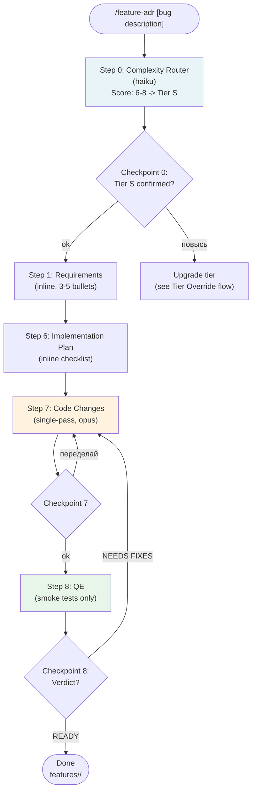
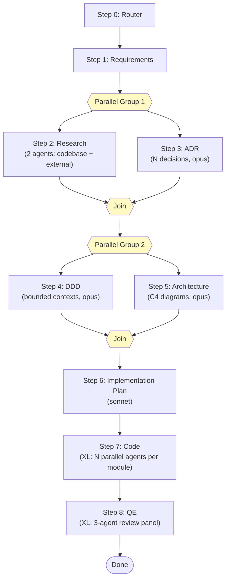
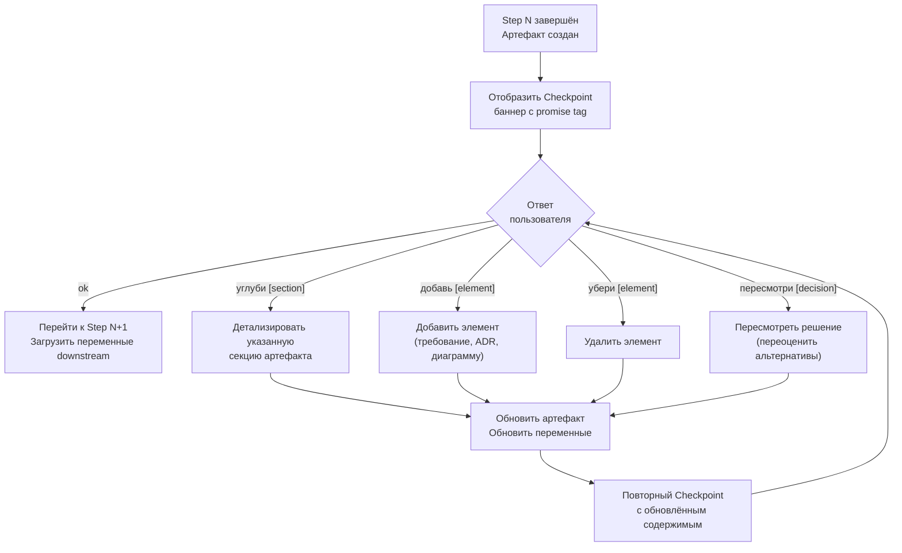
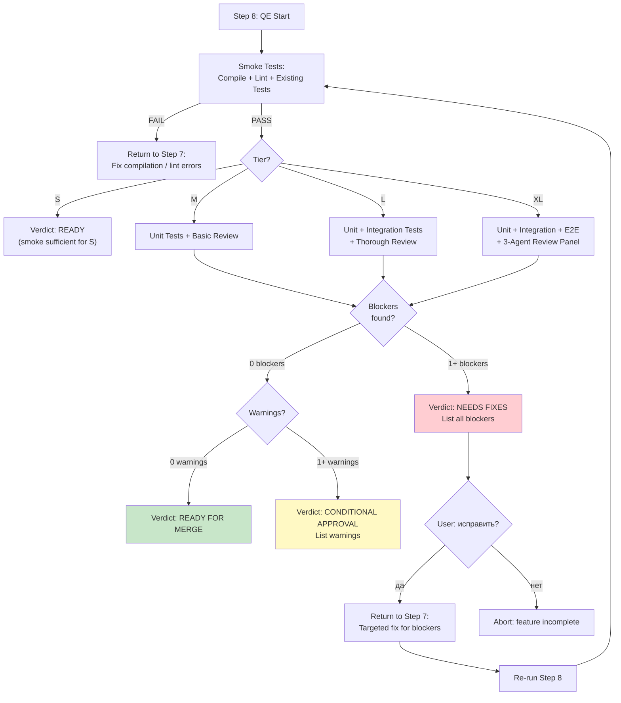

# 06. Пользовательские сценарии @dzhechkov/skills-feature-adr

## Содержание

1. [Обзор сценариев](#1-обзор-сценариев)
2. [Сценарий: S-Tier Feature (Bug Fix / Config Change)](#2-сценарий-s-tier-feature)
3. [Сценарий: M-Tier Feature (New API Endpoint)](#3-сценарий-m-tier-feature)
4. [Сценарий: L-Tier Feature (New Module)](#4-сценарий-l-tier-feature)
5. [Сценарий: XL-Tier Feature (Major Migration)](#5-сценарий-xl-tier-feature)
6. [Сценарий: Checkpoint с обратной связью](#6-сценарий-checkpoint-с-обратной-связью)
7. [Сценарий: Tier Override](#7-сценарий-tier-override)
8. [Сценарий: QE Failure](#8-сценарий-qe-failure)
9. [Сценарий: Установка и настройка](#9-сценарий-установка-и-настройка)
10. [Диаграммы потоков](#10-диаграммы-потоков)

---

## 1. Обзор сценариев

Карта всех потоков, покрываемых данным документом:

| Поток | Tier | Активные шаги | Параллелизм | Время |
|-------|------|---------------|-------------|-------|
| S-tier: Bug Fix / Config Change | S | 0 -> 1 -> 6 -> 7 -> 8 | Нет | ~15 мин |
| M-tier: New API Endpoint | M | 0 -> 1 -> 3 -> 5 -> 6 -> 7 -> 8 | Нет | ~45 мин |
| L-tier: New Module | L | 0 -> 1 -> [2\|\|3] -> [4\|\|5] -> 6 -> 7 -> 8 | Группы (2,3) и (4,5) | ~2 часа |
| XL-tier: Major Migration | XL | Полный DAG + multi-agent | Группы (2,3), (4,5), (7 per module) | ~4+ часов |
| Checkpoint Feedback | Любой | Повтор текущего шага | Нет | Зависит от объёма правок |
| Tier Override | Любой | Пересчёт после Step 0 | Нет | +1 мин |
| QE Failure | Любой | Step 8 -> Step 7 -> Step 8 | Нет | Зависит от серьёзности |
| Установка | -- | npx init | -- | ~1 мин |
| Обновление | -- | npx update | -- | ~1 мин |

---

## 2. Сценарий: S-Tier Feature

**Контекст:** Пользователь обнаружил баг -- кнопка логина не реагирует на мобильных устройствах. Необходимо исправить CSS/JS в 1-2 файлах.

### Шаг за шагом

**Шаг 1. Пользователь запускает pipeline**
```
User: /feature-adr Fix login button not responding on mobile
```

**Шаг 2. Step 0: Complexity Router (haiku)**

Router оценивает фичу по 6 измерениям:

| Измерение | Оценка | Обоснование |
|-----------|--------|-------------|
| Files affected | 1 (S) | 2 файла: login.css + login.js |
| Domains touched | 1 (S) | Только UI-слой (auth form) |
| New integrations | 1 (S) | 0 новых зависимостей |
| Breaking changes | 1 (S) | 0 breaking changes |
| New data models | 1 (S) | 0 моделей |
| Cross-cutting concerns | 1 (S) | 0 cross-cutting |

**Итого: 6 -> Tier S**

Активные шаги: `[0, 1, 6, 7, 8]`
Бюджет времени: 15 мин (R:2, P:0, I:10, Q:3)

Артефакт: `features/fix-login-button/00_complexity_assessment.md`

**Шаг 3. Checkpoint 0**
```
===============================================================
STEP 0/8: Complexity Router Complete
<promise>FEATURE_ADR_ROUTED</promise>
Tier: S | Active Steps: [0, 1, 6, 7, 8]

Feature classified as S based on: 2 files, 1 domain, 0 integrations
Pipeline: 5 steps, estimated 15 min

* "ok" -- proceed with this tier
* "повысь" -- bump to next tier
* "понизь" -- drop to lower tier
===============================================================
```
```
User: ок
```

**Шаг 4. Step 1: Requirements (light)**

Для S-tier -- 3-5 пунктов inline, без отдельного файла:

```
{REQUIREMENTS}:
- FR-1: Кнопка логина должна реагировать на tap на мобильных устройствах (iOS Safari, Chrome Android)
- FR-2: Визуальная обратная связь при нажатии (hover/active state) на touch-экранах
- FR-3: Существующее поведение на десктопе не должно измениться
```

**Шаг 5. Step 6: Implementation Plan (inline)**

Для S-tier -- inline чеклист:

```
[ ] Исправить touch event handling в login.js (добавить touchstart listener)
[ ] Обновить :hover/:active стили в login.css (@media (hover: hover) guard)
[ ] Проверить: не сломался ли десктопный flow
```

**Шаг 6. Step 7: Code Changes (single-pass)**

Единственный проход: исправление 2 файлов. Артефакт: `features/fix-login-button/07_code_changes/change_manifest.md`

**Шаг 7. Step 8: QE (smoke)**

Минимальная проверка:
- Код компилируется
- Линтер проходит
- Существующие тесты не упали

```
===============================================================
STEP 8/8: Quality Engineering Complete
<promise>FEATURE_ADR_VERIFIED</promise>
Tier: S

Tests: 47/47 (no regressions)
Review: 0 blockers, 0 warnings
Verdict: READY FOR MERGE

* "ok" -- feature complete!
===============================================================
```

**Итог:** `features/fix-login-button/` содержит:
```
features/fix-login-button/
  00_complexity_assessment.md
  07_code_changes/
    change_manifest.md
  08_qe_report.md
  README.md
```

---

## 3. Сценарий: M-Tier Feature

**Контекст:** Необходимо добавить API endpoint для экспорта данных пользователя в CSV-формате. Затрагивает API-слой и слой данных, требует выбора CSV-библиотеки.

### Шаг за шагом

**Шаг 1. Пользователь запускает pipeline**
```
User: /feature-adr Добавить API endpoint для экспорта данных пользователя в CSV
```

**Шаг 2. Step 0: Complexity Router (haiku)**

| Измерение | Оценка | Обоснование |
|-----------|--------|-------------|
| Files affected | 2 (M) | ~6 файлов: controller, service, route, DTO, test, migration |
| Domains touched | 2 (M) | API-слой + Data-слой |
| New integrations | 2 (M) | 1 новая библиотека для CSV |
| Breaking changes | 1 (S) | 0 breaking changes |
| New data models | 2 (M) | 1 модель: ExportJob (отслеживание статуса) |
| Cross-cutting concerns | 1 (S) | 0 cross-cutting |

**Итого: 10 -> Tier M**

Активные шаги: `[0, 1, 3, 5, 6, 7, 8]`
Бюджет времени: 45 мин (R:5, P:10, I:20, Q:10)

**Шаг 3. Checkpoint 0 -> "ok"**

**Шаг 4. Step 1: Full Requirements (sonnet)**

Загрузка explore skill для кларификации. Артефакт: `features/add-csv-export/01_requirements.md`

```markdown
## Functional Requirements

FR-1: GET /api/users/:id/export/csv -- инициировать экспорт
  Priority: MUST
  Acceptance: Given авторизованный пользователь,
              When GET /api/users/me/export/csv,
              Then получает CSV-файл с данными профиля.

FR-2: Экспорт включает поля: имя, email, дата регистрации, история заказов
  Priority: MUST

FR-3: Пагинация для больших объёмов (> 10K записей) через streaming
  Priority: SHOULD

FR-4: Rate limit: 1 экспорт в 5 минут на пользователя
  Priority: MUST

## Non-Functional Requirements

NFR-1: Latency < 3s для экспорта до 1K записей
NFR-2: CSV должен корректно открываться в Excel (BOM + UTF-8)

## Constraints
- Использовать существующую систему аутентификации (JWT)
- Максимальный размер файла: 50MB
```

Checkpoint 1 -> "ok"

**Шаг 5. Step 3: ADR (opus)**

Единственный ADR для M-tier -- выбор CSV-библиотеки.

Артефакт: `features/add-csv-export/03_adr/001-csv-library-choice.md`

```markdown
# ADR-001: CSV Library Choice

## Status
Accepted

## Context
Необходимо генерировать CSV-файлы с поддержкой Unicode, streaming
для больших объёмов и корректным Excel-совместимым форматированием.

## Considered Options
1. papaparse -- популярный парсер/генератор, 40K+ GitHub stars
2. json2csv -- специализированный JSON-to-CSV конвертер
3. Нативная реализация (streams + ручное форматирование)

## Decision Matrix

| Критерий | Вес | papaparse | json2csv | Нативная |
|----------|-----|-----------|----------|----------|
| Streaming support | 3 | ** | *** | ** |
| Excel compatibility | 3 | ** | *** | * |
| Bundle size | 2 | * | ** | *** |
| Team familiarity | 2 | ** | ** | *** |

## Decision
Выбрали **json2csv** -- лучший streaming API и встроенная Excel-совместимость
(BOM header, правильное экранирование).

## Consequences
### Positive
- Streaming из коробки (transforms API)
- Тестированная Excel-совместимость
### Negative
- Дополнительная зависимость (~15KB)
```

Checkpoint 3 -> "ok"

**Шаг 6. Step 5: Architecture Light (opus)**

Для M-tier -- только Component diagram + API design (без полного C4).

Артефакт: `features/add-csv-export/05_architecture.md` + `diagrams/architecture-c4.mermaid`

```
API endpoints:
- GET /api/users/:id/export/csv -- инициировать экспорт
- Middleware: authMiddleware, rateLimitMiddleware(1/5min)
- Controller -> ExportService -> UserRepository + json2csv stream -> Response
```

Checkpoint 5 -> "ok"

**Шаг 7. Step 6: Implementation Plan (sonnet)**

Артефакт: `features/add-csv-export/06_implementation_plan.md`

```
8 задач, 2 параллельные группы:

Group 1 (параллельно):
  TASK-1: Создать ExportJob модель + миграция
  TASK-2: Установить json2csv, создать CSV-генератор util

Group 2 (после Group 1):
  TASK-3: Создать ExportService (streaming logic)
  TASK-4: Создать ExportController + route + middleware
  TASK-5: Добавить rate limiting middleware

Group 3 (после Group 2):
  TASK-6: DTO для request/response
  TASK-7: Unit тесты для ExportService
  TASK-8: Integration тест для endpoint
```

Checkpoint 6 -> "ok"

**Шаг 8. Step 7: Code Generation (opus, sequential)**

Последовательная реализация по плану. 6 новых файлов + 2 модифицированных.

Артефакт: `features/add-csv-export/07_code_changes/change_manifest.md`

Checkpoint 7 -> "ok"

**Шаг 9. Step 8: QE -- Unit tests + basic review (sonnet)**

```
===============================================================
STEP 8/8: Quality Engineering Complete
<promise>FEATURE_ADR_VERIFIED</promise>
Tier: M

Tests: 12/12 (100%)
Review: 0 blockers, 1 warning, 1 suggestion
Requirements: 4/4 FR covered

WARNING: ExportService не обрабатывает disconnect клиента mid-stream
SUGGESTION: Добавить index на export_jobs.user_id

Verdict: CONDITIONAL APPROVAL -- fix 1 warning

* "ok" -- feature complete!
* "исправь [finding]" -- fix specific issue
===============================================================
```

**Итог:** `features/add-csv-export/` содержит:
```
features/add-csv-export/
  00_complexity_assessment.md
  01_requirements.md
  03_adr/
    001-csv-library-choice.md
  05_architecture.md
  06_implementation_plan.md
  07_code_changes/
    change_manifest.md
  08_qe_report.md
  diagrams/
    architecture-c4.mermaid
  README.md
```

---

## 4. Сценарий: L-Tier Feature

**Контекст:** Необходимо добавить полноценный модуль аналитики с дашбордом и real-time метриками. Затрагивает 3 домена (analytics, UI, data pipeline), ~20 файлов.

### Шаг за шагом

**Шаг 1. Запуск**
```
User: /feature-adr Добавить модуль аналитики с дашбордом и real-time метриками
```

**Шаг 2. Step 0: Complexity Router (haiku)**

| Измерение | Оценка | Обоснование |
|-----------|--------|-------------|
| Files affected | 3 (L) | ~20 файлов: модели, сервисы, контроллеры, компоненты UI, тесты |
| Domains touched | 3 (L) | Analytics domain + UI domain + Data pipeline |
| New integrations | 3 (L) | 2 интеграции: WebSocket server + time-series storage |
| Breaking changes | 1 (S) | 0 breaking changes |
| New data models | 3 (L) | 3 модели: Metric, Dashboard, Widget |
| Cross-cutting concerns | 3 (L) | 2: caching (метрики) + auth (доступ к дашбордам) |

**Итого: 16 -> Tier L**

Активные шаги: `[0, 1, 2, 3, 4, 5, 6, 7, 8]` -- полный pipeline
Бюджет времени: 2 часа (R:15, P:30, I:45, Q:30)

Checkpoint 0 -> "ok"

**Шаг 3. Step 1: Full Requirements с explore skill (sonnet)**

Загрузка `.claude/skills/explore/SKILL.md` для адаптивной кларификации:

```
Explore: Какой тип метрик -- бизнес (конверсии, выручка) или технические (CPU, latency)?
User: Бизнес-метрики: конверсии, выручка, retention. Real-time обновление через WebSocket.
```

Артефакт: `features/add-analytics-module/01_requirements.md`
- FR-1 .. FR-8 (8 функциональных требований)
- NFR-1 .. NFR-4 (latency, throughput, caching, auth)
- 3 constraint, 2 dependency

Checkpoint 1 -> "ok"

**Шаг 4. PARALLEL: Step 2 + Step 3**

Для L-tier шаги 2 и 3 запускаются параллельно:

| Агент | Шаг | Модель | Задача |
|-------|-----|--------|--------|
| Agent 1 | Step 2 (Research) | sonnet | Codebase patterns: анализ существующих модулей |
| Agent 2 | Step 2 (Research) | sonnet | External analogues: аналоги real-time dashboards |
| Agent 3 | Step 3 (ADR) | opus | Drafting ADR-001 .. ADR-003 |

**Step 2 результат:** `features/add-analytics-module/02_research.md`
- Паттерны из кодовой базы: event-driven architecture уже используется
- Внешние аналоги: Grafana-like widget model, Chart.js для визуализации

**Step 3 результат:** `features/add-analytics-module/03_adr/`
- ADR-001: Time-series storage (InfluxDB vs TimescaleDB vs Redis TimeSeries)
- ADR-002: Real-time transport (WebSocket vs SSE vs polling)
- ADR-003: Widget rendering strategy (server-side vs client-side)

Checkpoint 2-3 (объединённый) -> "ok"

**Шаг 5. PARALLEL: Step 4 + Step 5**

| Агент | Шаг | Модель | Задача |
|-------|-----|--------|--------|
| Agent 1 | Step 4 (DDD) | opus | 3 bounded contexts + ubiquitous language |
| Agent 2 | Step 5 (Architecture) | opus | Full C4 (Context + Container + Component) + sequences |

**Step 4 результат:** `features/add-analytics-module/04_domain_model.md`
- Bounded context 1: Metric Collection (events, aggregations)
- Bounded context 2: Dashboard Management (CRUD, layouts, widgets)
- Bounded context 3: Real-time Delivery (WebSocket subscriptions)

**Step 5 результат:** `features/add-analytics-module/05_architecture.md` + `diagrams/`
- C4 Context diagram
- C4 Container diagram
- C4 Component diagram (3 модуля)
- Sequence: metric ingestion flow
- Sequence: real-time dashboard update flow

Checkpoint 4-5 (объединённый) -> "ok"

**Шаг 6. Step 6: Implementation Plan (sonnet)**

Артефакт: `features/add-analytics-module/06_implementation_plan.md`

```
15 задач, 4 группы:

Group 1 (параллельно): Модели + миграции (TASK-1..3)
Group 2 (после Group 1): Сервисы (TASK-4..7)
Group 3 (параллельно, после Group 2): API + WebSocket + UI (TASK-8..12)
Group 4 (после Group 3): Интеграция + тесты (TASK-13..15)

Risk assessment:
- RISK-1: WebSocket scaling (medium) -- mitigation: Redis pub/sub adapter
- RISK-2: Time-series data volume (low) -- mitigation: retention policy 90d
```

Checkpoint 6 -> "ok"

**Шаг 7. Step 7: Code Generation (opus, sequential с checkpoints между группами)**

Последовательная реализация по группам. После каждой группы -- мини-проверка:
- Group 1 done: модели и миграции созданы, миграция прошла
- Group 2 done: сервисы реализованы, unit-тесты проходят
- Group 3 done: API endpoints + WebSocket handler + React компоненты
- Group 4 done: интеграционные тесты + end-to-end проверка

Артефакт: `features/add-analytics-module/07_code_changes/change_manifest.md`
- 15 новых файлов, 5 модифицированных

Checkpoint 7 -> "ok"

**Шаг 8. Step 8: QE -- Unit + Integration tests + thorough review (sonnet)**

```
===============================================================
STEP 8/8: Quality Engineering Complete
<promise>FEATURE_ADR_VERIFIED</promise>
Tier: L

Tests: 34/34 (100%) -- 22 unit + 12 integration
Review: 0 blockers, 2 warnings, 3 suggestions
Requirements: 8/8 FR covered

Verdict: CONDITIONAL APPROVAL

* "ok" -- feature complete!
===============================================================
```

**Итог:** `features/add-analytics-module/` содержит:
```
features/add-analytics-module/
  00_complexity_assessment.md
  01_requirements.md
  02_research.md
  03_adr/
    001-time-series-storage.md
    002-realtime-transport.md
    003-widget-rendering.md
  04_domain_model.md
  05_architecture.md
  06_implementation_plan.md
  07_code_changes/
    change_manifest.md
  08_qe_report.md
  diagrams/
    architecture-c4.mermaid
    sequence-metric-ingestion.mermaid
    sequence-realtime-update.mermaid
    domain-model.mermaid
  README.md
```

---

## 5. Сценарий: XL-Tier Feature

**Контекст:** Масштабная миграция с REST API на GraphQL с обязательным сохранением обратной совместимости. Затрагивает 40+ файлов, 5 доменов, требует координации множества агентов.

### Шаг за шагом

**Шаг 1. Запуск**
```
User: /feature-adr Миграция с REST API на GraphQL с сохранением обратной совместимости
```

**Шаг 2. Step 0: Complexity Router (haiku)**

| Измерение | Оценка | Обоснование |
|-----------|--------|-------------|
| Files affected | 4 (XL) | 40+ файлов: все контроллеры, сервисы, DTO, тесты, документация |
| Domains touched | 4 (XL) | 5 доменов: Auth, Users, Products, Orders, Payments |
| New integrations | 4 (XL) | 4: GraphQL server, schema registry, playground, codegen |
| Breaking changes | 4 (XL) | 3: API contract, client SDKs, webhook payloads |
| New data models | 4 (XL) | 5: GraphQL schema per domain + unified gateway schema |
| Cross-cutting concerns | 3 (L) | 3: auth (token relay), error handling (GraphQL errors), logging |

**Итого: 23 -> Tier XL**

Override: `breaking changes = 4 (XL)` -> minimum tier L. Уже XL по сумме.

Активные шаги: `[0, 1, 2, 3, 4, 5, 6, 7, 8]` -- полный DAG + multi-agent swarm
Бюджет: 4+ часов (R:30, P:60, I:90, Q:60)

Checkpoint 0 -> "ok"

**Шаг 3. Step 1: Comprehensive Requirements (sonnet + explore)**

Глубокая кларификация через explore skill:

```
Explore: Какая стратегия миграции? Big bang или постепенная (strangler fig pattern)?
User: Strangler fig -- постепенно переводим endpoint-ы, REST остаётся работать.

Explore: Какие клиенты используют REST API сейчас?
User: Web SPA (React), Mobile app (React Native), 3 внешних партнёра.
```

Артефакт: `features/migrate-rest-to-graphql/01_requirements.md`
- FR-1 .. FR-12 (12 функциональных требований)
- NFR-1 .. NFR-6 (latency parity, backward compat, rollback strategy)
- 5 constraints, 4 dependencies
- Migration phases timeline

Checkpoint 1 -> "ok"

**Шаг 4. PARALLEL: Step 2 (research) + Step 3 (ADRs)**

| Агент | Шаг | Модель | Задача |
|-------|-----|--------|--------|
| Agent 1 | Step 2 | sonnet | Codebase analysis: маппинг всех REST endpoints |
| Agent 2 | Step 2 | sonnet | External research: GraphQL migration best practices |
| Agent 3 | Step 3 | opus | ADR-001: Schema design (code-first vs schema-first) |
| Agent 4 | Step 3 | opus | ADR-002: Gateway pattern (Apollo Federation vs stitching vs monolith) |
| Agent 5 | Step 3 | opus | ADR-003: Auth relay (JWT passthrough vs context injection) |

Дополнительные ADR после завершения research:
- ADR-004: Backward compatibility strategy (REST proxy -> GraphQL)
- ADR-005: Client migration strategy (phased SDK update)

Checkpoint 2-3 -> "ok"

**Шаг 5. PARALLEL: Step 4 (DDD) + Step 5 (Architecture)**

| Агент | Шаг | Модель | Задача |
|-------|-----|--------|--------|
| Agent 1 | Step 4 | opus | 5 bounded contexts: Auth, Users, Products, Orders, Payments |
| Agent 2 | Step 5 | opus | Full C4 L1-L3 + 3 sequence diagrams |

**Step 4:** Ubiquitous language per domain, aggregate roots, domain events
**Step 5:**
- C4 Level 1: System context (clients -> GraphQL Gateway -> Services)
- C4 Level 2: Container diagram (Gateway, Auth Service, Domain Services, DB)
- C4 Level 3: Component diagram per service
- Sequence: Query resolution flow
- Sequence: Mutation with auth flow
- Sequence: Subscription (WebSocket) flow

Checkpoint 4-5 -> "ok"

**Шаг 6. Step 6: Implementation Plan (sonnet)**

```
30 задач, 6 групп:

Group 1: Infrastructure (TASK-1..4)
  - GraphQL server setup, schema registry, codegen config, playground
Group 2: Auth module (TASK-5..8)
  - Auth schema, resolvers, JWT middleware, tests
Group 3 (параллельно): Domain modules (TASK-9..20)
  - Users schema + resolvers (TASK-9..12)
  - Products schema + resolvers (TASK-13..16)
  - Orders schema + resolvers (TASK-17..20)
Group 4: Payments + Gateway (TASK-21..25)
  - Payments schema + resolvers + gateway stitching
Group 5: Backward compatibility (TASK-26..28)
  - REST proxy layer, deprecation headers, client SDK update
Group 6: Testing + Documentation (TASK-29..30)
  - E2E tests, migration guide

Risk assessment:
- RISK-1 (high): N+1 queries in GraphQL resolvers -- mitigation: DataLoader
- RISK-2 (high): Breaking partner integrations -- mitigation: REST proxy + 6mo deprecation
- RISK-3 (medium): Performance regression -- mitigation: query complexity limiting
```

Checkpoint 6 -> "ok"

**Шаг 7. Step 7: Code -- N параллельных агентов per module (opus)**

| Агент | Модуль | Файлы |
|-------|--------|-------|
| Agent 1 | Auth module | 4 файла: schema, resolvers, middleware, tests |
| Agent 2 | Users module | 4 файла: schema, resolvers, loaders, tests |
| Agent 3 | Products module | 4 файла: schema, resolvers, loaders, tests |
| Agent 4 | Orders module | 4 файла: schema, resolvers, loaders, tests |
| Agent 5 | Payments module | 4 файла: schema, resolvers, loaders, tests |

После завершения всех агентов:
- Оркестратор проверяет интеграцию между модулями
- Исправление interface mismatches
- Gateway stitching финализация
- REST proxy layer

Checkpoint 7 -> "ok"

**Шаг 8. Step 8: Full QE -- 3-agent review panel (sonnet)**

XL-tier использует полную мульти-агентную проверку:

| Агент | Роль | Фокус |
|-------|------|-------|
| Agent 1 | Correctness Reviewer | Покрытие требований FR-1..FR-12, логические ошибки |
| Agent 2 | Security Reviewer | Auth relay, injection через GraphQL queries, rate limiting |
| Agent 3 | Architecture Reviewer | Соответствие ADR решениям, pattern compliance |

Дополнительно: unit + integration + e2e тесты.

```
===============================================================
STEP 8/8: Quality Engineering Complete
<promise>FEATURE_ADR_VERIFIED</promise>
Tier: XL

Tests: 87/89 (97.8%) -- 2 flaky integration tests (WebSocket timing)
Review: 0 blockers, 3 warnings, 5 suggestions
Requirements: 12/12 FR covered

Verdict: CONDITIONAL APPROVAL -- fix flaky tests

* "ok" -- feature complete!
* "исправь [finding]" -- fix specific issue
* "повтори QE" -- re-run full QE
===============================================================
```

**Итог:** `features/migrate-rest-to-graphql/` содержит:
```
features/migrate-rest-to-graphql/
  00_complexity_assessment.md
  01_requirements.md
  02_research.md
  03_adr/
    001-schema-design-approach.md
    002-gateway-pattern.md
    003-auth-relay-strategy.md
    004-backward-compatibility.md
    005-client-migration.md
  04_domain_model.md
  05_architecture.md
  06_implementation_plan.md
  07_code_changes/
    change_manifest.md
  08_qe_report.md
  diagrams/
    architecture-c4.mermaid
    sequence-query-resolution.mermaid
    sequence-mutation-auth.mermaid
    sequence-subscription.mermaid
    domain-model.mermaid
  README.md
```

---

## 6. Сценарий: Checkpoint с обратной связью

**Контекст:** Во время M-tier фичи на шаге 3 (ADR) пользователь хочет добавить альтернативный вариант кеширования.

### Поток

**Шаг 1. Step 3 завершён -- ADR создан**

```
===============================================================
STEP 3/8: ADR Complete
Tier: M

1 architectural decision documented:
1. ADR-001: Session storage -> chose PostgreSQL

* "ok" -- proceed
* "пересмотри ADR-001" -- reconsider decision
* "добавь ADR для [topic]" -- add new decision
===============================================================
```

**Шаг 2. Пользователь даёт обратную связь**

```
User: Добавь анализ Redis как альтернативу для кеширования
```

**Шаг 3. Система корректирует ADR**

Claude обновляет ADR-001:
- Добавляет "Option 3: Redis" в Considered Options
- Заполняет decision matrix с Redis
- Пересчитывает взвешенные оценки
- Обновляет или подтверждает решение

**Шаг 4. Повторный Checkpoint**

```
===============================================================
STEP 3/8: ADR Complete (revised)
Tier: M

1 architectural decision documented:
1. ADR-001: Session storage -> chose PostgreSQL
   (Redis added as Option 3; PostgreSQL still wins on durability + team familiarity)

* "ok" -- proceed
* "пересмотри ADR-001" -- reconsider decision
===============================================================
```

**Шаг 5. Пользователь подтверждает**

```
User: ок
```

**Шаг 6. Pipeline продолжается**

Переменная `{ADR_DECISIONS}` обновлена с учётом Redis-анализа. Downstream шаги (Step 5, Step 6, Step 7) используют обновлённые решения.

---

## 7. Сценарий: Tier Override

**Контекст:** Router классифицировал фичу как S, но разработчик знает, что изменение затронет больше файлов.

### Поток

**Шаг 1. Step 0 классифицирует как S**

```
===============================================================
STEP 0/8: Complexity Router Complete
<promise>FEATURE_ADR_ROUTED</promise>
Tier: S | Active Steps: [0, 1, 6, 7, 8]

Feature classified as S based on: 2 files, 1 domain
Pipeline: 5 steps, estimated 15 min

* "ok" -- proceed with this tier
* "повысь" -- bump to next tier
* "понизь" -- drop to lower tier
===============================================================
```

**Шаг 2. Пользователь переопределяет**

```
User: Это M, затронет 6 файлов и нужен ADR для выбора подхода
```

**Шаг 3. Система пересчитывает**

Router обновляет классификацию:
- `{COMPLEXITY_TIER}` = M (по запросу пользователя)
- `{ACTIVE_STEPS}` = [0, 1, 3, 5, 6, 7, 8] (добавляются Step 3 и Step 5)
- `{TIME_BUDGET}` пересчитан на 45 мин

Артефакт `00_complexity_assessment.md` обновляется с пометкой:
```
Classification: M (user override from S)
Reason: User indicated 6 files affected and need for ADR
```

**Шаг 4. Повторный Checkpoint**

```
===============================================================
STEP 0/8: Complexity Router Complete (override)
<promise>FEATURE_ADR_ROUTED</promise>
Tier: M (upgraded from S per user request) | Active Steps: [0, 1, 3, 5, 6, 7, 8]

Pipeline: 7 steps, estimated 45 min

* "ok" -- proceed with M tier
===============================================================
```

**Шаг 5. Pipeline продолжается как M-tier**

Важно: tier зафиксирован после подтверждения на Checkpoint 0 и НЕ МОЖЕТ измениться в процессе pipeline. Если scope изменился значительно -- рекомендуется restart.

---

## 8. Сценарий: QE Failure

**Контекст:** На Step 8 обнаружена критическая уязвимость (SQL injection). Необходимо вернуться к Step 7 для исправления.

### Поток

**Шаг 1. Step 8 находит BLOCKER**

QE Review (sonnet) анализирует код и выявляет:

```
BLOCKER: SQL injection vulnerability in UserController.exportData()
  Line 45: db.query(`SELECT * FROM users WHERE id = ${req.params.id}`)
  Fix: Use parameterized query: db.query('SELECT * FROM users WHERE id = $1', [req.params.id])
```

**Шаг 2. QE Report: verdict NEEDS FIXES**

```
===============================================================
STEP 8/8: Quality Engineering Complete
<promise>FEATURE_ADR_VERIFIED_INCOMPLETE</promise>
Tier: M

Tests: 11/12 (91.7%) -- 1 FAIL (security test)
Review: 1 blocker, 1 warning, 0 suggestions
Requirements: 4/4 FR covered

Findings:
  BLOCKER: SQL injection in UserController.exportData() (line 45)
  WARNING: Missing input validation on export format parameter

Verdict: NEEDS FIXES

* "исправь все" -- fix all findings
* "исправь blocker" -- fix only blocker
* "покажи детали [finding]" -- detailed explanation
===============================================================
```

**Шаг 3. Пользователь решает исправить**

```
User: исправь blocker
```

**Шаг 4. Возврат к Step 7 для целевого исправления**

Claude модифицирует конкретный файл:
- `UserController.exportData()`: заменяет строковую интерполяцию на параметризованный запрос
- Обновляет `change_manifest.md`

**Шаг 5. Повторный Step 8**

QE повторяется:

```
===============================================================
STEP 8/8: Quality Engineering Complete
<promise>FEATURE_ADR_VERIFIED</promise>
Tier: M

Tests: 12/12 (100%)
Review: 0 blockers, 1 warning, 0 suggestions
Requirements: 4/4 FR covered

Verdict: CONDITIONAL APPROVAL (1 warning remains: input validation)

* "ok" -- feature complete!
* "исправь warning" -- fix remaining warning
===============================================================
```

**Шаг 6. Пользователь завершает**

```
User: ок
```

Pipeline завершён. Warning остаётся как задокументированный tech debt.

---

## 9. Сценарий: Установка и настройка

### Вариант 1: Быстрая установка через npx

```bash
# Одна команда -- устанавливает все компоненты
npx @dzhechkov/skills-feature-adr
```

Устанавливаются:
- `.claude/skills/feature-adr/` -- skill с 9 модулями + references + examples
- `.claude/commands/feature-adr.md` -- slash-команда
- `.claude/rules/feature-adr-conventions.md` -- правила и конвенции
- `.claude/shards/feature-adr.shard.md` -- governance shard

### Вариант 2: Глобальная установка

```bash
npm install -g @dzhechkov/skills-feature-adr
skills-feature-adr init
```

### Проверка установки

```bash
# Показать все установленные компоненты
npx @dzhechkov/skills-feature-adr list

# Вывод:
# Installed components:
#   Skill:    .claude/skills/feature-adr/SKILL.md
#   Modules:  9 (00-complexity-router .. 08-qe)
#   Refs:     4 (complexity-matrix, adr-template, c4-template, qe-checklist)
#   Examples: 1 (sample-feature-output)
#   Command:  .claude/commands/feature-adr.md
#   Rules:    .claude/rules/feature-adr-conventions.md
#   Shard:    .claude/shards/feature-adr.shard.md
```

### Health check

```bash
npx @dzhechkov/skills-feature-adr doctor

# Вывод:
# Health Check: @dzhechkov/skills-feature-adr
#   SKILL.md exists .............. OK
#   Modules (9/9) ................ OK
#   References (4/4) ............. OK
#   Examples (1/1) ............... OK
#   Command file ................. OK
#   Rules file ................... OK
#   Shard file ................... OK
#   features/ directory .......... OK (created)
#
# Status: HEALTHY
```

### Первый запуск

```bash
# Открыть Claude Code в директории проекта
# Запустить pipeline:
/feature-adr Добавить функцию экспорта в PDF
```

### Обновление

```bash
npx @dzhechkov/skills-feature-adr update

# Обновляет только изменённые файлы, не перезаписывает кастомизации
```

### Удаление

```bash
npx @dzhechkov/skills-feature-adr remove

# Удаляет все установленные компоненты
# Артефакты в features/ НЕ удаляются
```

---

## 10. Диаграммы потоков

### S-Tier Pipeline Flow



### L/XL Parallel Execution DAG



### Checkpoint Feedback Loop



### QE Decision Tree


