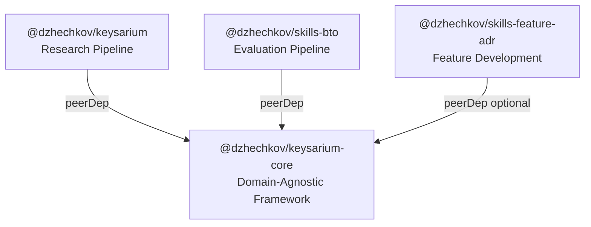
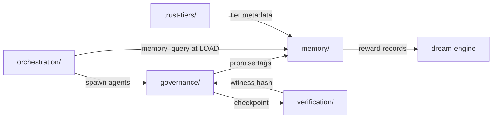
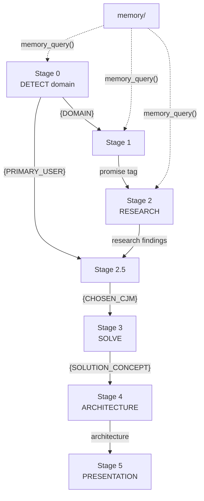

# Архитектура @dzhechkov/keysarium-core

> Domain-agnostic фреймворк для построения мульти-агентных AI-пайплайнов с governance, памятью, оркестрацией, верификацией и системой доверия.

## Содержание

1. [Обзор](#1-обзор)
2. [Архитектурная философия](#2-архитектурная-философия)
3. [Модульная архитектура](#3-модульная-архитектура)
4. [Граф зависимостей](#4-граф-зависимостей)
5. [Потоки данных](#5-потоки-данных)
6. [Ключевые паттерны проектирования](#6-ключевые-паттерны-проектирования)
7. [Схема терминологии](#7-схема-терминологии)
8. [Интеграция с потребителями](#8-интеграция-с-потребителями)
9. [Расширяемость](#9-расширяемость)

---

## 1. Обзор

`@dzhechkov/keysarium-core` — это «операционная система» для мульти-агентных AI-воркфлоу. Фреймворк предоставляет протоколы, а не код: набор markdown-документов, которые AI-агенты читают и выполняют.

### Ключевые характеристики

| Характеристика | Значение |
|---------------|---------|
| Версия | 1.0.0 |
| Лицензия | MIT |
| Node.js | >= 16.0.0 |
| Модулей | 6 |
| Файлов | 19 markdown-протоколов |
| Зависимости | 0 (zero dependencies) |
| Потребители | keysarium, skills-bto, skills-feature-adr |

### Что делает keysarium-core

- **Governance** — структурные правила, конституция, governance shards, checkpoints с promise-тегами
- **Memory** — персистентное обучение через reward-calibrated learning и dream cycles
- **Orchestration** — координация агентов (6 топологий), маршрутизация моделей (3 тира), фоновые воркеры
- **Verification** — SHA-256 witness chain, judge attestation, audit trail
- **Trust Tiers** — 4-уровневая классификация качества скиллов (Advisory → Verified)
- **Platform** — мультиплатформенная поддержка (Claude Code, Cursor, OpenCode, Copilot)

---

## 2. Архитектурная философия

### 2.1. Protocol-as-Code

Протоколы реализованы как markdown-документы, а не как исполняемый код. AI-агент читает протокол и следует его инструкциям. Это обеспечивает:

- **Платформенную независимость** — протоколы работают с любым AI-агентом
- **Прозрачность** — человек может прочитать и проверить протокол
- **Расширяемость** — новый протокол = новый markdown-файл
- **Версионирование** — git diff показывает изменения в протоколах

### 2.2. Zero Internal Dependencies

Все 6 модулей полностью независимы друг от друга. Потребитель может использовать любое подмножество модулей без импорта остальных:

```
governance ───> (standalone)
memory     ───> (standalone)
orchestration ──> (standalone)
verification ──> (standalone)
trust-tiers ──> (standalone)
platform   ───> (standalone)
```

### 2.3. Domain-Agnostic Design

Все протоколы используют обобщённую терминологию. Конкретная предметная область подставляется через terminology mapping (см. [раздел 7](#7-схема-терминологии)).

### 2.4. Cleanroom Extraction

keysarium-core был извлечён из Keysarium research pipeline путём cleanroom-экстракции:
1. Исходные протоколы из `lib/` и `.claude/rules/` — Keysarium-специфичные
2. Core-версии обобщены и не содержат Keysarium-терминологии
3. Оригинальные файлы остаются как доменные референсы

### Источники вдохновения

| Источник | Что взято |
|---------|----------|
| **Ruflo** | 7-layer governance, 6 топологий, 3-tier model routing |
| **Agentic QE** | Trust tiers, reward-calibrated learning, dream cycles, PACT principles |
| **Quality Forge** | Portable brain containers, SHA-256 witness chains |

---

## 3. Модульная архитектура

### 3.1. governance/ — Управление (3 файла)

Обеспечивает структурные правила и человеческие контрольные точки.

| Файл | Назначение | Ключевые концепции |
|------|-----------|-------------------|
| `constitution.md` | Универсальные инварианты | 7 правил INV-001..INV-007, домен-расширения INV-100+ |
| `shard-protocol.md` | Per-stage governance rules | Шарды перезагружаются на каждом этапе, предотвращают context drift |
| `checkpoint-protocol.md` | Human sync points | Promise tags `<promise>TAG</promise>`, reward classification |

**Проблема, которую решает:** После ~40 минут работы агент «забывает» правила, загруженные в начале. Governance shards перечитываются на каждом этапе.

**7 конституционных инвариантов:**

| ID | Название | Уровень нарушения |
|----|---------|-------------------|
| INV-001 | Artifact Integrity | HALT |
| INV-002 | Stage Completion Signal | HALT |
| INV-003 | Human Checkpoint Required | HALT |
| INV-004 | Evaluator Independence | HALT |
| INV-005 | Loop Detection | WARN + escalate |
| INV-006 | Memory Consistency | WARN |
| INV-007 | No Unverified Claims | HALT |

### 3.2. memory/ — Обучение (3 файла)

Персистентное обучение через reward scores (0.0–1.0) и паттерн-детекцию.

| Файл | Назначение | Ключевые концепции |
|------|-----------|-------------------|
| `memory-protocol.md` | memory_query / memory_store | Reward records, namespace `.keysarium/memory/` |
| `reward-tracker.md` | Аналитика и паттерны | Per-stage/domain/skill averages, trend detection, bottleneck detection |
| `dream-engine.md` | Background insight generation | Concept graphs, cross-domain associations, trigger-based execution |

**Цикл обучения:**
```
Stage Start → memory_query() → загрузка паттернов из прошлых запусков
    ↓
Stage Execution → агент использует паттерны для улучшения качества
    ↓
Checkpoint → user response → classify reward (1.0/0.7/0.3/0.0)
    ↓
memory_store() → сохранение reward record для будущих запусков
    ↓
Dream Cycle → фоновый анализ → cross-domain insights
```

### 3.3. orchestration/ — Оркестрация (4 файла)

Координация агентов, выбор топологий и маршрутизация моделей.

| Файл | Назначение | Ключевые концепции |
|------|-----------|-------------------|
| `queen-protocol.md` | 10-step coordinator lifecycle | INIT→HEALTH→LOAD→DETECT→SHARD→ORCHESTRATE→MONITOR→COLLECT→STORE→REPORT |
| `topology-selection.md` | 6 agent topologies | Star, Mesh, Hierarchical, Ring, Hybrid, Adaptive |
| `background-workers.md` | Non-blocking workers | Isolation rules, max 3 concurrent, stop-requested protocol |
| `model-routing.md` | 3-tier model assignment | haiku (1x), sonnet (15x), opus (75x) — экономия до 71% |

**6 топологий агентов:**

```
Star:           Mesh:           Hierarchical:
   C               A1←→A2          Queen
  /|\              ↕    ↕         /     \
 A1 A2 A3         A3←→A4       Mgr1   Mgr2
                               / \     / \
Ring:           Hybrid:       W1  W2  W3  W4
A1→A2→A3→A4    C
 ↑          |   / \
 └──────────┘  [Star] [Mesh]
```

| Топология | Координация | Fault Tolerance | Лучше всего для |
|----------|------------|-----------------|----------------|
| Star | Централизованная | Средняя | Простые параллельные задачи |
| Mesh | Децентрализованная | Высокая | Fault-tolerant research |
| Hierarchical | Иерархическая | Средняя | 10+ агентов |
| Ring | Последовательная | Низкая | Итеративное улучшение |
| Hybrid | Смешанная | Varies | Гетерогенные подзадачи |
| Adaptive | Динамическая | Высокая | Неопределённая сложность |

### 3.4. verification/ — Верификация (3 файла)

Криптографическая целостность и доказательства независимости оценщиков.

| Файл | Назначение | Ключевые концепции |
|------|-----------|-------------------|
| `witness-chain.md` | SHA-256 hash-chain | Tamper-evident: изменение артефакта ломает все downstream хеши |
| `judge-attestation.md` | Evaluator isolation proofs | Каждый судья хеширует свою оценку до видения чужих оценок |
| `audit-trail.md` | Evaluation history | 10 типов событий, decision records, retention = lifetime |

**Witness Chain:**
```
Artifact₀ → SHA-256(content₀ + NULL_HASH) = hash₀
Artifact₁ → SHA-256(content₁ + hash₀)     = hash₁
Artifact₂ → SHA-256(content₂ + hash₁)     = hash₂
...
```

Изменение Artifact₁ → hash₁ меняется → hash₂ ломается → цепочка обнаруживает тамперинг.

### 3.5. trust-tiers/ — Классификация доверия (2 файла)

4-уровневая система классификации качества скиллов.

| Файл | Назначение | Ключевые концепции |
|------|-----------|-------------------|
| `tier-system.md` | 4-tier classification | Tier 0 Advisory → Tier 3 Verified |
| `promotion-protocol.md` | Advancement rules | 3 пути промоции, demotion, cross-project transfer |

**Пирамида доверия:**
```
       ┌─────────┐
       │ Tier 3  │  Verified (eval tests + score ≥ 8.5)
       │ Highest │
      ┌┴─────────┴┐
      │  Tier 2   │  Validated (judge panel score ≥ 7.0)
      │   High    │
     ┌┴───────────┴┐
     │   Tier 1    │  Structured (SKILL.md + references/)
     │   Medium    │
    ┌┴─────────────┴┐
    │    Tier 0     │  Advisory (SKILL.md only)
    │     Low       │
    └───────────────┘
```

### 3.6. platform/ — Мультиплатформенность (4 файла)

Генерация конфигов для различных AI coding platforms.

| Файл | Назначение |
|------|-----------|
| `adapter-registry.md` | Реестр платформ + translation rules |
| `templates/cursor.md` | .cursorrules генерация (< 10K tokens) |
| `templates/opencode.md` | .opencode/ генерация |
| `templates/copilot.md` | copilot-instructions.md генерация (< 8K tokens) |

| Платформа | Формат | Сложность трансляции |
|----------|--------|---------------------|
| Claude Code | `.claude/` directory | Native (без трансляции) |
| Cursor | `.cursorrules` flat file | Low |
| OpenCode | `.opencode/` directory | Low |
| GitHub Copilot | `.github/copilot-instructions.md` | Medium |

---

## 4. Граф зависимостей

### 4.1. Внутренние зависимости модулей

Все модули **полностью независимы**:

```
governance/     ─── (standalone, 0 deps)
memory/         ─── (standalone, 0 deps)
orchestration/  ─── (standalone, 0 deps)
verification/   ─── (standalone, 0 deps)
trust-tiers/    ─── (standalone, 0 deps)
platform/       ─── (standalone, 0 deps)
```

Потребитель может использовать один модуль или все шесть — по выбору.

### 4.2. Внешний граф пакетов



| Потребитель | Тип зависимости | Используемые модули |
|------------|----------------|---------------------|
| keysarium | peerDep | Все 6 |
| skills-bto | peerDep | governance, orchestration, verification, trust-tiers |
| skills-feature-adr | peerDep (optional) | governance, orchestration |

### 4.3. Протокольные взаимосвязи

Хотя модули независимы, при совместном использовании они формируют связный pipeline:



---

## 5. Потоки данных

### 5.1. Начало этапа (Stage Start)

```
1. Queen: SHARD
   └─→ Читает governance shard для текущего этапа
   └─→ Проверяет upstream promise tags

2. Queen: memory_query()
   └─→ Загружает исторические паттерны из .keysarium/memory/
   └─→ Применяет top-3 паттерна к текущему контексту

3. Queen: ORCHESTRATE
   └─→ Выбирает топологию (star/mesh/hierarchical/ring/hybrid/adaptive)
   └─→ Назначает модель (haiku/sonnet/opus) по routing table
   └─→ Spawn агентов
```

### 5.2. Завершение этапа (Stage End)

```
1. Создание артефакта
   └─→ Файл записан в project directory

2. Witness Chain
   └─→ SHA-256(content + previous_hash) → append to .witness-chain.json

3. Checkpoint
   └─→ Отображение banner с promise tag
   └─→ Ожидание ответа пользователя

4. User Response
   └─→ Classify reward: "ок"=1.0, "углуби"=0.7, "переделай"=0.3, "заново"=0.0
   └─→ memory_store() → сохранение reward record
   └─→ Update dream trigger state (records_since_last_dream++)

5. Continue / Adjust
   └─→ "ок" → emit promise → next stage
   └─→ feedback → adjust → re-checkpoint (cascade rehash witness chain)
```

### 5.3. Cross-Stage Data Flow



---

## 6. Ключевые паттерны проектирования

### 6.1. Protocol-as-Code

Протоколы описаны в markdown и содержат: алгоритмы, JSON-схемы, правила, примеры. AI-агент читает протокол и выполняет его как инструкцию.

**Преимущества:** портируемость, прозрачность, версионируемость.

### 6.2. Shard-Based Context Management

Проблема context drift решается через governance shards — компактные (~50-100 строк) наборы правил, которые перечитываются на каждом этапе.

**Формат shard:** Time Budget → Prerequisites → Skill to Load → Rules → Quality Gates → Promise Tag → Anti-Patterns.

### 6.3. Semantic Completion Promises

Machine-readable маркеры `<promise>TAG</promise>` формализуют переход между этапами. Downstream этапы проверяют upstream promises перед стартом.

**Варианты:** `TAG` (success) или `TAG_INCOMPLETE` (conditions not met).

### 6.4. Reward-Calibrated Learning

Каждый checkpoint генерирует reward score на основе реакции пользователя. Накопленные rewards используются для улучшения будущих запусков:

| Реакция | Reward | Label |
|---------|--------|-------|
| Мгновенное одобрение | 1.0 | excellent |
| Мелкие правки | 0.7 | good |
| Значительная переработка | 0.3 | needs_work |
| Полный рестарт | 0.0 | failed |

### 6.5. Tamper-Evident Hash Chain

SHA-256 hash-chain: каждый хеш включает предыдущий хеш. Модификация одного артефакта ломает все downstream хеши → тамперинг обнаруживается автоматически.

### 6.6. Evaluator Isolation

Каждый судья в judge panel хеширует свою оценку **до** видения чужих оценок. Attestation chain доказывает порядок и независимость.

### 6.7. 3-Tier Model Routing

Задачи распределяются по 3 уровням моделей по сложности:

| Tier | Модель | Стоимость | Задачи |
|------|--------|----------|--------|
| 1 | haiku | 1x | Formatting, validation, structural checks |
| 2 | sonnet | 15x | Research, analysis, judge panels |
| 3 | opus | 75x | Creative design, complex solving |

**Экономия:** до 71% по сравнению с использованием opus для всего.

### 6.8. Trust Tier Classification

4-уровневая пирамида: Advisory (0) → Structured (1) → Validated (2) → Verified (3). Промоция через формальную оценку (judge panel) и тестирование.

---

## 7. Схема терминологии

keysarium-core использует обобщённые термины. При адаптации для конкретного домена замените:

| Core-термин | Замените на | Примеры |
|------------|-----------|---------|
| `stage` | Ваша единица pipeline | "phase" (Keysarium), "layer" (BTO), "step" (Feature ADR) |
| `project` | Ваша единица работы | "research" (Keysarium), "artifact" (BTO), "feature" (ADR) |
| `domain` | Ваша система категорий | "banking/retail" (Keysarium), "skill type" (BTO) |
| `skill` | Ваша единица способности | "explore/research" (Keysarium), "build/test" (BTO) |
| `memory-root` | Путь к памяти | `.keysarium/memory/` (default) |
| `insights-root` | Путь к insights | `.keysarium/insights/` (default) |
| `workers-root` | Путь к воркерам | `.keysarium/workers/` (default) |

---

## 8. Интеграция с потребителями

### 8.1. @dzhechkov/keysarium (Research Pipeline)

| Core-модуль | Как используется |
|------------|-----------------|
| governance | Constitution + 7 phase shards + checkpoint с promise tags |
| memory | memory_query/store на каждой фазе + reward tracking |
| orchestration | Queen protocol для 7 фаз + Star topology для параллельных агентов |
| verification | Witness chain per research + judge attestation для BTO |
| trust-tiers | Классификация скиллов (explore, research, solve, etc.) |
| platform | Генерация конфигов для Cursor/OpenCode/Copilot |

### 8.2. @dzhechkov/skills-bto (Evaluation Pipeline)

| Core-модуль | Как используется |
|------------|-----------------|
| governance | BTO evaluation shard + checkpoint protocol |
| orchestration | Star topology для judge panel (3-5 judges) + model routing |
| verification | Judge attestation + witness chain для evaluated artifacts |
| trust-tiers | Promotion protocol (Tier 1→2→3 через BTO scores) |

### 8.3. @dzhechkov/skills-feature-adr (Feature Development)

| Core-модуль | Как используется |
|------------|-----------------|
| governance | Feature ADR shard + checkpoint protocol |
| orchestration | DAG-based execution + parallel agents для L/XL tiers |

---

## 9. Расширяемость

### 9.1. Добавление нового инварианта

1. Создайте `governance/constitution-{domain}.md`
2. Нумерация с INV-100 (избежание конфликтов с core INV-001..007)
3. Формат: Rule → Enforcement → On violation → Rationale

```markdown
### INV-100: Data Perimeter

**Rule:** No customer data may leave the security perimeter.
**Enforcement:** All LLM calls must be to on-premise models.
**On violation:** HALT
**Rationale:** Regulatory compliance (FZ-152).
```

### 9.2. Добавление новой топологии

1. Добавьте секцию в `orchestration/topology-selection.md`
2. Определите: Description, ASCII diagram, Properties (coordination, communication, fault tolerance, scalability), Best for
3. Добавьте в Selection Guide table

### 9.3. Добавление новой платформы

1. Создайте `platform/templates/{platform-name}.md`
2. Добавьте запись в `platform/adapter-registry.md`
3. Определите: Target Format, Generation Protocol, Content Adaptation Rules, Size Constraints, Example Output

### 9.4. Добавление нового типа воркера

1. Определите тип в worker registry (type, description, model)
2. Создайте template с инструкциями для воркера
3. Следуйте isolation rules (только запись в свою директорию)

### 9.5. Расширение dream engine

1. Добавьте новый trigger type в trigger-state.json config
2. Добавьте новый тип ассоциации в Step 3 Dream Execution Protocol
3. Определите insight template для нового типа

---

## Приложение A: Полный реестр файлов

```
@dzhechkov/keysarium-core/
├── package.json
├── README.md
├── index.md                           ← Module registry
│
├── governance/                        ← 3 файла
│   ├── constitution.md                ← 7 universal invariants
│   ├── shard-protocol.md              ← Per-stage governance
│   └── checkpoint-protocol.md         ← Checkpoints + promises
│
├── memory/                            ← 3 файла
│   ├── memory-protocol.md             ← memory_query + memory_store
│   ├── reward-tracker.md              ← Analytics + patterns
│   └── dream-engine.md               ← Background insights
│
├── orchestration/                     ← 4 файла
│   ├── queen-protocol.md              ← 10-step lifecycle
│   ├── topology-selection.md          ← 6 topologies
│   ├── background-workers.md          ← Worker protocol
│   └── model-routing.md              ← 3-tier routing
│
├── verification/                      ← 3 файла
│   ├── witness-chain.md               ← SHA-256 hash-chain
│   ├── judge-attestation.md           ← Evaluator proofs
│   └── audit-trail.md                ← Evaluation history
│
├── trust-tiers/                       ← 2 файла
│   ├── tier-system.md                 ← 4-tier classification
│   └── promotion-protocol.md          ← Tier advancement
│
└── platform/                          ← 4 файла
    ├── adapter-registry.md            ← Platform registry
    └── templates/
        ├── cursor.md                  ← Cursor template
        ├── opencode.md               ← OpenCode template
        └── copilot.md                ← Copilot template
```

## Приложение B: JSON Schema Versions

Все JSON-схемы в пакете используют поле `"version": "1.0"`. Потребители должны проверять это поле при загрузке.

| Схема | Файл-источник | Используется в |
|-------|-------------|---------------|
| RewardRecord | memory-protocol.md | memory_store(), reward-tracker |
| config.json | memory-protocol.md | memory_query(), memory_store() |
| reward-summary.json | reward-tracker.md | /learning-stats |
| domain-patterns.json | reward-tracker.md | memory_query(), dream-engine |
| trigger-state.json | dream-engine.md | /dream status, trigger evaluation |
| dream-result.json | dream-engine.md | /dream insights |
| .witness-chain.json | witness-chain.md | /verify-chain |
| .judge-attestations.json | judge-attestation.md | /verify-chain |
| audit-log.json | audit-trail.md | Audit queries |
| registry.json | background-workers.md | /workers status |
| status.json | background-workers.md | Worker self-reporting |
