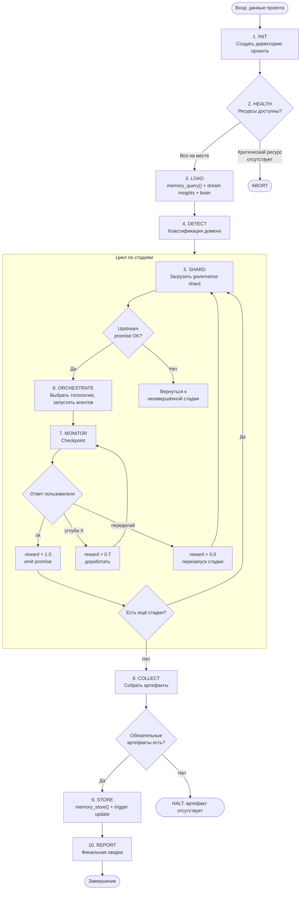
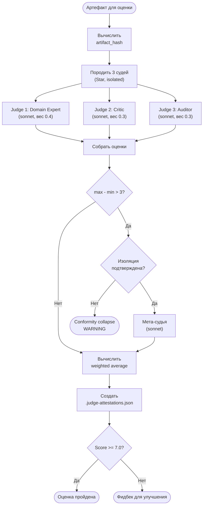
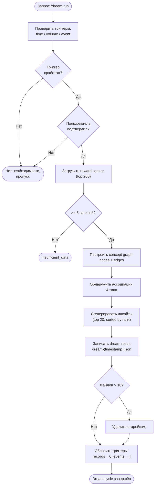
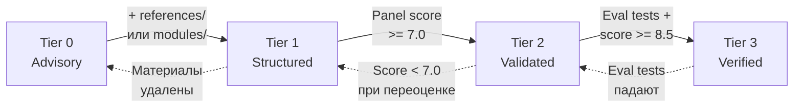

# Пользовательские сценарии @dzhechkov/keysarium-core

## Содержание

1. [Обзор сценариев](#1-обзор-сценариев)
2. [Сценарий: Запуск нового пайплайна](#2-сценарий-запуск-нового-пайплайна)
3. [Сценарий: Checkpoint взаимодействие](#3-сценарий-checkpoint-взаимодействие)
4. [Сценарий: Мульти-агентная оценка (Judge Panel)](#4-сценарий-мульти-агентная-оценка-judge-panel)
5. [Сценарий: Dream Cycle](#5-сценарий-dream-cycle)
6. [Сценарий: Background Worker запуск](#6-сценарий-background-worker-запуск)
7. [Сценарий: Witness Chain верификация](#7-сценарий-witness-chain-верификация)
8. [Сценарий: Промоция скилла (Tier 0 -> Tier 3)](#8-сценарий-промоция-скилла-tier-0--tier-3)
9. [Сценарий: Создание пайплайна с нуля](#9-сценарий-создание-пайплайна-с-нуля)
10. [Диаграммы потоков](#10-диаграммы-потоков)

---

## 1. Обзор сценариев

keysarium-core предоставляет набор протоколов для построения мульти-агентных пайплайнов. Каждый сценарий ниже описывает конкретный поток взаимодействия с фреймворком.

| Сценарий | Когда применяется | Модули core |
|----------|-------------------|-------------|
| Запуск нового пайплайна | Начало любого проекта | queen-protocol, memory-protocol, shard-protocol |
| Checkpoint взаимодействие | После каждой стадии пайплайна | checkpoint-protocol, memory-protocol |
| Мульти-агентная оценка | Оценка качества артефакта панелью судей | judge-attestation, topology-selection |
| Dream Cycle | Накопилось достаточно данных для анализа | dream-engine, reward-tracker |
| Background Worker | Фоновые задачи без блокировки сессии | background-workers, model-routing |
| Witness Chain верификация | Проверка целостности артефактов | witness-chain, audit-trail |
| Промоция скилла | Повышение уровня доверия к скиллу | promotion-protocol, tier-system, judge-attestation |
| Создание пайплайна с нуля | Построение собственного мульти-агентного пайплайна | все модули |

### Карта зависимостей сценариев

```
Создание пайплайна с нуля
  |
  v
Запуск нового пайплайна ──> Checkpoint взаимодействие ──> Dream Cycle
  |                              |                            |
  v                              v                            v
Background Worker        Witness Chain верификация    Промоция скилла
                                                          |
                                                          v
                                                 Мульти-агентная оценка
```

---

## 2. Сценарий: Запуск нового пайплайна

Queen Coordinator выполняет 10-шаговый протокол. Ниже -- полный поток с точками принятия решений и ветвлением при ошибках.

### Пошаговый поток

**Шаг 1. INIT -- создание рабочей директории**
```
1. Определить slug проекта из входных данных
2. Создать директорию: projects/{slug}/
3. Создать поддиректории: prototype/, diagrams/
4. Инициализировать метаданные проекта
```
- Если создание директории не удалось -- ABORT с диагностикой.

**Шаг 2. HEALTH -- проверка ресурсов**
```
1. Проверить наличие всех скиллов (SKILL.md для каждого)
2. Проверить governance shards для всех активных стадий
3. Проверить доступность файла конституции
4. Проверить внешние зависимости (sha256sum и т.д.)
```
- Если критический ресурс отсутствует -- ABORT с указанием отсутствующего файла.
- Если некритический ресурс отсутствует -- WARN и продолжить.

**Шаг 3. LOAD -- загрузка исторических знаний**
```
1. Вызвать memory_query() с текущим доменом и первой стадией
2. Загрузить последние dream insights из {insights-root}/
3. Загрузить brain файл (если есть предыдущий экспорт)
4. Лог: "Loaded {N} historical patterns" или "No historical data (first run)"
```
- Если `.keysarium/memory/` не существует -- graceful degradation, продолжить без данных.

**Шаг 4. DETECT -- классификация домена**
```
1. Проанализировать входные данные на ключевые слова домена
2. Определить характеристики: регуляторика, latency, deployment model
3. Установить переменные: {DOMAIN}, {PRIMARY_USER}, {AHA_MOMENT}
4. Активировать доменные правила (banking -> on-premise, retail -> A/B тесты)
```
- Если домен не определён -- использовать "general" по умолчанию.

**Шаг 5-7. Цикл стадий: SHARD -> ORCHESTRATE -> MONITOR**

Для каждой стадии пайплайна:

```
5. SHARD: Загрузить governance shard для текущей стадии
   - Проверить upstream promises (downstream не стартует без upstream)
   - Применить доменные правила к стадии

6. ORCHESTRATE: Выбрать топологию и выполнить
   - Определить топологию (Star / Mesh / Hierarchical / Ring / Hybrid / Adaptive)
   - Назначить модель: haiku для простых, sonnet для аналитики, opus для творческих
   - Запустить агентов по выбранной топологии
   - Собрать результаты, синтезировать (если параллельные агенты)

7. MONITOR: Checkpoint + контроль
   - Отобразить checkpoint баннер (формат из раздела 3)
   - Ожидать подтверждения человека
   - Записать reward (0.0-1.0) через memory_store()
   - Проверить бюджет времени vs. фактическое время
```

**Шаг 8. COLLECT -- сбор артефактов**
```
1. Перечислить все файлы, созданные в директории проекта
2. Проверить каждый артефакт на соответствие quality gates
3. Составить манифест артефактов
```
- Если обязательный артефакт отсутствует -- HALT с отчётом.

**Шаг 9. STORE -- сохранение знаний**
```
1. Вызвать memory_store() для финального результата
2. Обновить trigger-state.json для dream engine
3. При значимом выполнении -- инициировать извлечение знаний
```
- Если сохранение не удалось -- лог ошибки, продолжить (не блокировать выход пайплайна).

**Шаг 10. REPORT -- финальный отчёт**
```
1. Сформировать сводку по всем стадиям и их результатам
2. Перечислить все созданные артефакты
3. Отчёт: время по стадиям (факт vs. бюджет)
4. Отчёт: предупреждения и инциденты
5. Emit финальный promise tag
```

### Точки принятия решений

| Точка | Условие | Ветка "Да" | Ветка "Нет" |
|-------|---------|------------|-------------|
| HEALTH: ресурс найден? | Все скиллы/shards доступны | Продолжить | ABORT |
| LOAD: память существует? | `.keysarium/memory/` есть | Загрузить паттерны | Первый запуск, продолжить без |
| DETECT: домен определён? | Ключевые слова совпали | Применить доменные правила | Использовать "general" |
| SHARD: upstream promise? | Upstream promise emitted | Начать стадию | Вернуться к незавершённой стадии |
| MONITOR: checkpoint "ok"? | Пользователь подтвердил | Следующая стадия | Корректировка и повторный checkpoint |
| COLLECT: артефакт есть? | Файл создан | Добавить в манифест | HALT: обязательный артефакт отсутствует |

---

## 3. Сценарий: Checkpoint взаимодействие

Checkpoint -- это обязательная точка синхронизации между пайплайном и человеком. INV-003 запрещает автоматический переход без подтверждения.

### Формат баннера

```
=====================================================
CHECKPOINT {N}: {Название стадии} Complete
<promise>{PROMISE_TAG}</promise>
Witness: sha256:{hash}  (chain link #{N})

{2-3 строки о том, что было сделано}
Артефакты: {список файлов}
Время: {факт}m / {бюджет}m ({процент}%)

* "ok" -- следующая стадия
* "углуби {раздел}" -- доработать раздел
* "{обратная связь}" -- скорректировать
=====================================================
```

### Три пути обработки

**Путь 1: "ok" -- немедленное подтверждение**
```
1. Классифицировать reward = 1.0 (excellent)
2. Вызвать memory_store() с reward 1.0
3. Emit promise tag: <promise>{TAG}_COMPLETE</promise>
4. Добавить witness record в .witness-chain.json
5. Перейти к следующей стадии
```

**Путь 2: "углуби X" -- незначительная корректировка**
```
1. Классифицировать reward = 0.7 (good)
2. Разобрать обратную связь: определить область доработки
3. Выполнить доработку указанного раздела
4. Обновить артефакт
5. Если witness chain существует -- chain repair (пересчёт хешей)
6. Повторно отобразить checkpoint
7. Вызвать memory_store() с reward 0.7 после ответа
```

**Путь 3: "переделай" -- полный перезапуск стадии**
```
1. Классифицировать reward = 0.0 (failed)
2. Вызвать memory_store() с reward 0.0
3. Удалить/перезаписать артефакт текущей стадии
4. Перезапустить стадию с нуля (reload shard, re-orchestrate)
5. По завершению -- новый checkpoint
6. Emit promise НЕ происходит до следующего подтверждения
```

### Правила классификации reward

| Реакция пользователя | Reward | Label | Сигнал |
|----------------------|--------|-------|--------|
| Одно слово одобрения: "ok", "next" | 1.0 | excellent | 0 областей фидбека |
| Корректировка 1 области | 0.7 | good | 1 область фидбека |
| Корректировка 2+ областей | 0.3 | needs_work | 2+ областей фидбека |
| Полный перезапуск | 0.0 | failed | Перезапуск стадии |

Если пользователь даёт фидбек более 2 раз на одной стадии, reward ограничивается 0.3. Если сессия завершается без ответа -- запись не создаётся.

---

## 4. Сценарий: Мульти-агентная оценка (Judge Panel)

Панель судей используется для независимой оценки артефактов. Судьи работают в Star-топологии с обязательной изоляцией (INV-004).

### Пошаговый поток

**Шаг 1. Подготовка**
```
1. Определить артефакт для оценки
2. Вычислить artifact_hash = SHA-256(содержимое файла)
3. Определить размер панели: 3 (стандарт) или 5 (high-stakes)
4. Определить веса: Domain Expert 0.4 / Critic 0.3 / Auditor 0.3
```

**Шаг 2. Запуск судей (параллельно, Star-топология)**
```
Координатор порождает 3 агента (model: sonnet):
  - Judge 1 (Domain Expert): оценивает доменную точность и глубину
  - Judge 2 (Critic): ищет слабые места и edge cases
  - Judge 3 (Completeness Auditor): проверяет структурную полноту

Каждый судья:
  1. Получает artifact_hash (все оценивают один и тот же артефакт)
  2. Читает артефакт независимо
  3. Выставляет оценку (0-10) с обоснованием
  4. НЕ видит оценки других судей
```

**Шаг 3. Сбор и проверка расхождений**
```
1. Собрать оценки от всех судей
2. Вычислить: max_score - min_score
3. Если расхождение > 3:
   a. Верифицировать аттестации (подтвердить изоляцию)
   b. Если изоляция подтверждена -- эскалация к мета-судье (sonnet)
   c. Если изоляция нарушена -- флаг conformity collapse
4. Если расхождение <= 3: принять оценки
```

**Шаг 4. Вычисление итогового балла**
```
final_score = (expert * 0.4) + (critic * 0.3) + (auditor * 0.3)
```

**Шаг 5. Создание аттестаций**
```
Для каждого судьи (в порядке завершения):
  evaluation_hash = SHA-256(judge_id | artifact_hash | score | rationale_summary)
  previous_attestation_hash = предыдущий evaluation_hash (NULL_HASH для первого)
  Записать в .judge-attestations.json
```

**Шаг 6. Запись в audit trail**
```
1. Записать результаты оценки с финальным баллом
2. Если был мета-судья -- добавить его аттестацию в цепочку
3. Если финальный балл >= 7.0 -- артефакт прошёл оценку
4. Если финальный балл < 7.0 -- предоставить фидбек для улучшения
```

### Точки принятия решений

| Точка | Условие | Действие |
|-------|---------|----------|
| Расхождение > 3? | max - min > 3.0 | Эскалация к мета-судье |
| Изоляция нарушена? | Аттестации не валидны | Флаг conformity collapse |
| Балл >= 7.0? | Взвешенное среднее >= 7.0 | Артефакт прошёл оценку |
| Балл < 5.0 у одного судьи? | Любой judge score < 5.0 | Блокировка промоции даже при среднем >= 7.0 |

---

## 5. Сценарий: Dream Cycle

Dream Cycle -- фоновый процесс, который строит граф концепций из накопленных reward-записей и генерирует кросс-доменные инсайты.

### Пошаговый поток

**Шаг 1. Проверка триггеров**
```
1. Прочитать trigger-state.json
2. Проверить time trigger: elapsed > threshold (по умолчанию 60 мин)
3. Проверить volume trigger: records_since_last_dream >= 20
4. Проверить event trigger: pending_events не пуст
5. Если хотя бы один триггер сработал -- предложить запуск
6. Ожидать подтверждения пользователя (никогда не запускать автоматически)
```

**Шаг 2. Загрузка данных**
```
1. Проверить существование {memory-root}/
   - Если нет -> exit со статусом no_data
2. Прочитать reward-summary.json и domain-patterns.json (если есть)
3. Рекурсивно просканировать все reward-записи
4. Исключить просроченные записи
5. Отсортировать по reward DESC, затем timestamp DESC
6. Взять топ-200 записей
7. Если валидных записей < 5 -> exit со статусом insufficient_data
```

**Шаг 3. Построение графа концепций**
```
1. Инициализировать пустой граф: { nodes: [], edges: [] }
2. Для каждой записи создать/обновить узлы:
   - domain (домен)
   - stage (стадия)
   - skill (скилл)
   - outcome (результат)
3. Создать/обновить рёбра:
   - domain -> stage
   - stage -> skill
   - skill -> outcome
   (весом служит reward)
4. Вычислить агрегаты по узлам: avg_reward, record_count, trend
5. Вычислить агрегаты по рёбрам: weight (средний reward), record_count
```

**Шаг 4. Обнаружение ассоциаций (4 типа)**

| Тип | Описание | Порог |
|-----|----------|-------|
| Cross-Domain Stage Comparison | Сравнение производительности стадий между доменами | gap > 0.15 |
| Skill-Domain Mismatch | Сравнение эффективности скиллов в разных доменах | gap > 0.15 |
| Stage Correlation | Стадии, где низкие reward коррелируют | co-occurrence >= 3 |
| Temporal Trends | Систематические изменения reward во времени | статистическая значимость |

**Шаг 5. Генерация инсайтов**
```
1. Для каждой ассоциации сформировать инсайт:
   - type: performance | effectiveness | anti_pattern
   - confidence: min(1.0, evidence_count / 10)
   - impact: high | medium | low
   - rank_score: confidence * impact_weight
2. Отсортировать по rank_score DESC
3. Взять топ-20 инсайтов
```

**Шаг 6. Сохранение и ретенция**
```
1. Записать результат: {insights-root}/dream-{YYYYMMDD}-{HHmmss}.json
2. Применить ретенцию: максимум 10 файлов dream-*, удалить старейшие
3. Сбросить триггеры: records_since_last_dream = 0, pending_events = []
4. trigger-state.json НИКОГДА не удаляется ретенцией
```

---

## 6. Сценарий: Background Worker запуск

Background workers выполняют длительные операции без блокировки основной сессии. Каждый воркер изолирован и пишет результаты в свою директорию.

### Пошаговый поток

**Шаг 1. Валидация**
```
1. Проверить тип воркера (consolidate / export-brain / health-check / dream-cycle)
2. Прочитать registry.json
3. Подсчитать активные воркеры (status = running | starting)
4. Если активных >= 3 -> REJECT: "Max concurrent workers reached (3/3)"
5. Определить модель по таблице маршрутизации:
   - consolidate -> sonnet
   - export-brain -> haiku
   - health-check -> haiku
   - dream-cycle -> sonnet
```

**Шаг 2. Создание директории**
```
1. Сгенерировать worker_id: wkr-{YYYYMMDD}-{HHmmss}-{type}
2. Создать директорию: {workers-root}/{worker_id}/output/
3. Инициализировать status.json:
   { "worker_id": "...", "status": "starting", "progress": null }
```

**Шаг 3. Обновление реестра**
```
1. Добавить запись в registry.json:
   { "worker_id": "...", "type": "...", "status": "starting", "model": "..." }
2. Только оркестратор модифицирует registry.json (не сам воркер)
```

**Шаг 4. Загрузка шаблона и запуск**
```
1. Прочитать шаблон воркера из lib/worker-templates/{type}.md
2. Породить агента в фоновом режиме с указанной моделью
3. Передать воркеру: worker_id, output_dir, instructions
```

**Шаг 5. Выполнение воркера**
```
Воркер:
  1. Обновляет status.json: status = "running"
  2. Выполняет задачу (читает файлы проекта, анализирует)
  3. Периодически обновляет status.json с прогрессом
  4. Пишет результаты в {worker_dir}/output/
  5. НИКОГДА не модифицирует файлы вне {worker_dir}/
  6. НИКОГДА не порождает суб-агентов
```

**Шаг 6. Проверка флага остановки**
```
Между операциями воркер проверяет:
  - Существует ли файл {worker_dir}/stop-requested?
  - Если да -> обновить status.json: status = "stopped", завершить
```

**Шаг 7. Завершение**
```
1. Воркер записывает финальный status.json: status = "completed"
2. Оркестратор (при следующем /workers status) обновляет registry.json
3. Записи старше 24 часов (completed/failed/stopped) удаляются из реестра
```

### Правила изоляции воркеров

| Разрешено | Запрещено |
|-----------|-----------|
| Читать любые файлы проекта | Модифицировать файлы в researches/ |
| Писать в {worker_dir}/output/ | Модифицировать файлы в features/ |
| Обновлять свой status.json | Модифицировать .claude/ (commands, rules, skills) |
| | Модифицировать root-level файлы (CLAUDE.md и т.д.) |
| | Порождать суб-агентов |

---

## 7. Сценарий: Witness Chain верификация

Witness Chain обеспечивает целостность артефактов через цепочку SHA-256 хешей. Каждый хеш артефакта включает хеш предыдущего, делая цепочку tamper-evident.

### Пошаговый поток верификации

**Шаг 1. Загрузка цепочки**
```
1. Прочитать .witness-chain.json из директории проекта
2. Если файл не найден -> отчёт: NOT_FOUND
3. Извлечь массив chain[] из JSON
```

**Шаг 2. Проверка каждой записи**
```
Для каждой записи chain[i] (i = 0, 1, ..., N-1):
  1. Прочитать файл артефакта (chain[i].artifact)
     - Если файл не найден -> записать MISSING_ARTIFACT
  2. Определить previous_hash:
     - Если i == 0: previous_hash = NULL_HASH (64 нуля)
     - Иначе: previous_hash = chain[i-1].hash
  3. Вычислить expected = SHA-256(file_content + previous_hash)
  4. Сравнить expected с chain[i].hash
     - Совпадает -> VALID
     - Не совпадает -> BROKEN_LINK
  5. Проверить монотонность timestamp (каждый >= предыдущего)
  6. Проверить монотонность sequence (строго возрастает)
```

**Шаг 3. Формирование отчёта**
```
Если все записи VALID:
  "Chain integrity: OK ({N} records verified)"

Если обнаружены BROKEN_LINK:
  "Chain integrity: BROKEN at record {i}"
  "  Artifact: {filename}"
  "  Expected: sha256:{expected}"
  "  Stored:   sha256:{stored}"
  "  Possible cause: artifact modified after checkpoint"
```

**Шаг 4. Chain repair (при легитимной правке)**
```
Если артефакт был изменён по запросу пользователя (feedback на checkpoint):
  1. Пересчитать хеш модифицированного артефакта с тем же previous_hash
  2. Обновить hash записи в .witness-chain.json
  3. КАСКАД: пересчитать ВСЕ последующие записи
  4. Обновить last_updated
  5. Записать в массив chain_repairs:
     { "repaired_at": "...", "sequence": i, "reason": "User feedback" }
```

### Специальные случаи

| Ситуация | Поведение |
|----------|-----------|
| sha256sum недоступна | WARN, не блокировать пайплайн |
| Банковский домен + ошибка chain | Эскалация WARNING на checkpoint (ФЗ-152) |
| Feature ADR пайплайн | Witness chain не требуется |
| Genesis record (первый артефакт) | previous_hash = NULL_HASH |

---

## 8. Сценарий: Промоция скилла (Tier 0 -> Tier 3)

Система доверия из 4 уровней определяет надёжность скилла. Каждый переход требует выполнения конкретных условий.

### Переход Tier 0 -> Tier 1 (Advisory -> Structured)

```
Требования:
  1. SKILL.md содержит полную документацию (не заглушка)
  2. Хотя бы ОДНО из:
     - references/ с 2+ файлами
     - modules/ с подкомпонентами
     - Документированный формат вывода (JSON schema / шаблон)

Процесс:
  1. Ревью SKILL.md на полноту
  2. Проверить наличие вспомогательных материалов
  3. Обновить метаданные: trust_tier: 1, trust_tier_label: "Structured"

Формальная оценка НЕ требуется -- это структурная проверка.
```

### Переход Tier 1 -> Tier 2 (Structured -> Validated)

```
Требования:
  1. Все требования Tier 1 выполнены
  2. Панель из 3 судей (мульти-агентная оценка)
  3. Средний взвешенный балл >= 7.0
  4. Ни один судья не поставил < 5.0

Процесс:
  1. Отправить скилл на мульти-агентную оценку (см. раздел 4)
  2. Панель из 3 судей (sonnet):
     - Domain Expert (0.4): доменная точность и глубина
     - Critic (0.3): слабые места и edge cases
     - Completeness Auditor (0.3): структурная полнота
  3. Вычислить weighted average
  4. Если score >= 7.0:
     - Обновить: trust_tier: 2, bto_score: {score}, bto_date: "{date}"
     - Записать полные результаты оценки
  5. Если score < 7.0:
     - Предоставить фидбек от судей для улучшения
     - Скилл остаётся на Tier 1
     - Повторная оценка возможна после доработки
```

### Переход Tier 2 -> Tier 3 (Validated -> Verified)

```
Требования:
  1. Все требования Tier 2 выполнены
  2. Панельная оценка >= 8.5
  3. Набор детерминистических eval-тестов (минимум 5)
  4. Все eval-тесты проходят стабильно

Процесс:
  1. Создать eval test suite:
     - Определить тест-кейсы с известными входными и ожидаемыми выходными данными
     - Тесты детерминистичны (один вход -> один результат pass/fail)
     - Минимум 5 тест-кейсов
  2. Запустить eval-тесты, убедиться что все проходят
  3. Пройти панельную оценку с баллом >= 8.5
  4. Обновить: trust_tier: 3, eval_tests: {count}, eval_tests_passing: {count}
```

### Демоция

| Событие | Переход | Причина |
|---------|---------|---------|
| Eval-тесты начинают падать | Tier 3 -> Tier 2 | Регрессия функциональности |
| Балл при переоценке < 7.0 | Tier 2 -> Tier 1 | Деградация качества |
| Удалены вспомогательные материалы | Tier 1 -> Tier 0 | Утрата структуры |

---

## 9. Сценарий: Создание пайплайна с нуля

Полный walkthrough для построения собственного 4-стадийного мульти-агентного пайплайна на базе keysarium-core.

### Шаг 1. Определение стадий и временных бюджетов

```
Пример: пайплайн для технического аудита

| Стадия   | Название        | Бюджет | Описание                          |
|----------|-----------------|--------|-----------------------------------|
| stage-0  | Scope           | 15%    | Определение области аудита        |
| stage-1  | Investigation   | 35%    | Техническое исследование          |
| stage-2  | Assessment      | 30%    | Оценка и рекомендации             |
| stage-3  | Report          | 20%    | Финальный отчёт                   |
```

### Шаг 2. Написание конституции (инварианты)

Создать `governance/constitution.md`:

```markdown
### INV-001: Artifact Integrity
Rule: Каждый артефакт стадии проверяется через witness chain hash.
Enforcement: SHA-256 проверка на каждом checkpoint.
On violation: HALT

### INV-002: Stage Completion Signal
Rule: Стадия не завершена без promise tag.
On violation: HALT

### INV-003: Human Checkpoint Required
Rule: Автоматический переход между стадиями запрещён.
On violation: HALT

### INV-100: No Production Data in Report (доменный)
Rule: Отчёт не содержит production credentials или PII.
On violation: HALT
```

### Шаг 3. Создание governance shards

Для каждой стадии создать shard:

```markdown
# Shard: stage-0-scope

time_budget_pct: 15
skill: scope-analyzer
prerequisites: none
quality_gates:
  - scope document created
  - domain identified
promise_tag: AUDIT_SCOPE_DEFINED
```

### Шаг 4. Настройка памяти

Создать `{memory-root}/config.json`:

```json
{
  "version": "1.0",
  "retention_days": 90,
  "max_results_per_query": 10,
  "enabled": true,
  "known_domains": ["infrastructure", "security", "performance"],
  "reward_levels": {
    "excellent": 1.0,
    "good": 0.7,
    "needs_work": 0.3,
    "failed": 0.0
  }
}
```

### Шаг 5. Выбор топологий для каждой стадии

| Стадия | Топология | Агенты | Модель | Обоснование |
|--------|-----------|--------|--------|-------------|
| stage-0 | Single | 1 | sonnet | Линейная задача, не нужен параллелизм |
| stage-1 | Star | 3 | sonnet | 3 независимых направления исследования |
| stage-2 | Ring | 2 | opus | Итеративная оценка: draft -> review |
| stage-3 | Single | 1 | opus | Творческая генерация финального отчёта |

### Шаг 6. Настройка маршрутизации моделей

```markdown
| Задача                        | Tier | Модель | Обоснование                    |
|-------------------------------|------|--------|--------------------------------|
| Scope analysis                | 2    | sonnet | Аналитическая работа           |
| Investigation agents          | 2    | sonnet | Исследовательский синтез       |
| Assessment draft              | 3    | opus   | Сложная оценка                 |
| Assessment review             | 3    | opus   | Экспертная ревизия             |
| Report generation             | 3    | opus   | Творческая генерация           |
| File formatting, slug gen     | 1    | haiku  | Простые трансформации          |
```

### Шаг 7. Первое выполнение

```
1. Запустить Queen Coordinator с входными данными
2. Координатор проходит все 10 шагов (INIT -> REPORT)
3. На каждом checkpoint -- подтверждение пользователя
4. После завершения -- ревью артефактов и таймингов
```

### Шаг 8. Ревью learning stats

```
После первого выполнения:
  1. Проверить .keysarium/memory/{domain}/ -- reward записи созданы
  2. Просмотреть reward для каждой стадии
  3. Если reward < 0.7 для стадии -- проанализировать и скорректировать shard
  4. После 3+ выполнений -- запустить Dream Cycle для паттернов
  5. Использовать инсайты для итеративного улучшения пайплайна
```

---

## 10. Диаграммы потоков

### Диаграмма: Queen Coordinator -- полный жизненный цикл



### Диаграмма: Judge Panel -- мульти-агентная оценка



### Диаграмма: Dream Cycle



### Диаграмма: Промоция скилла


