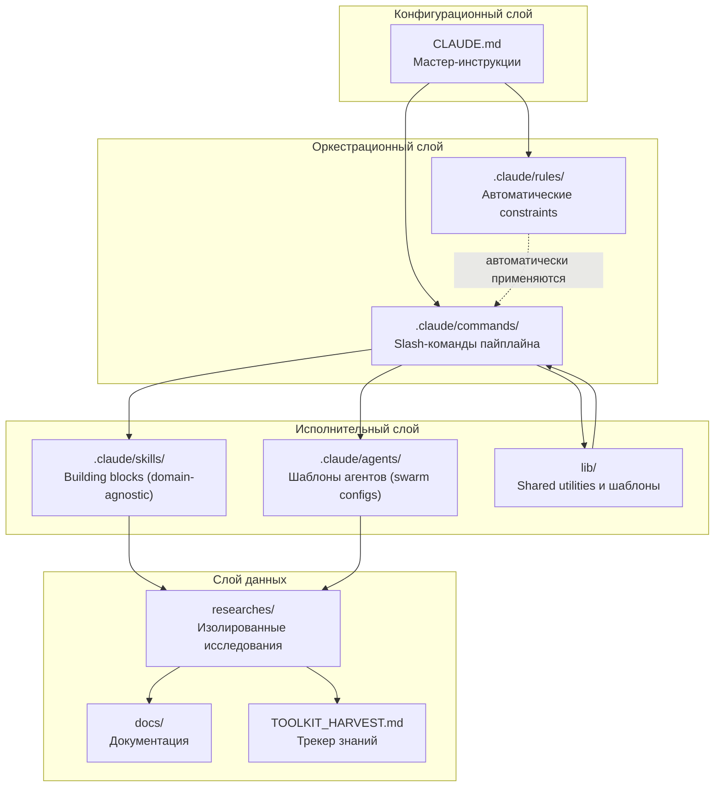
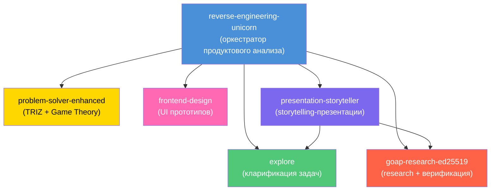
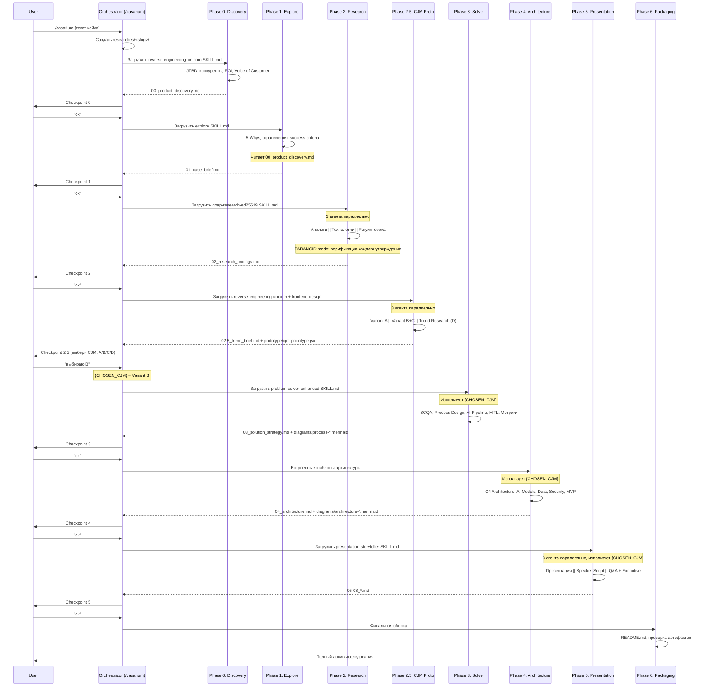
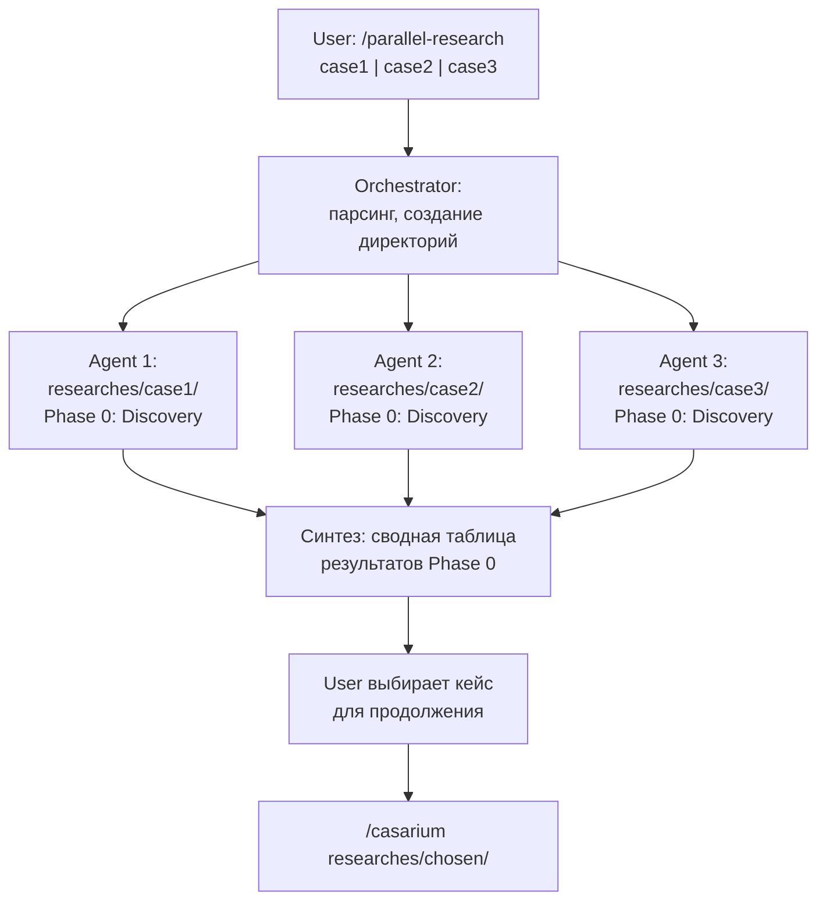
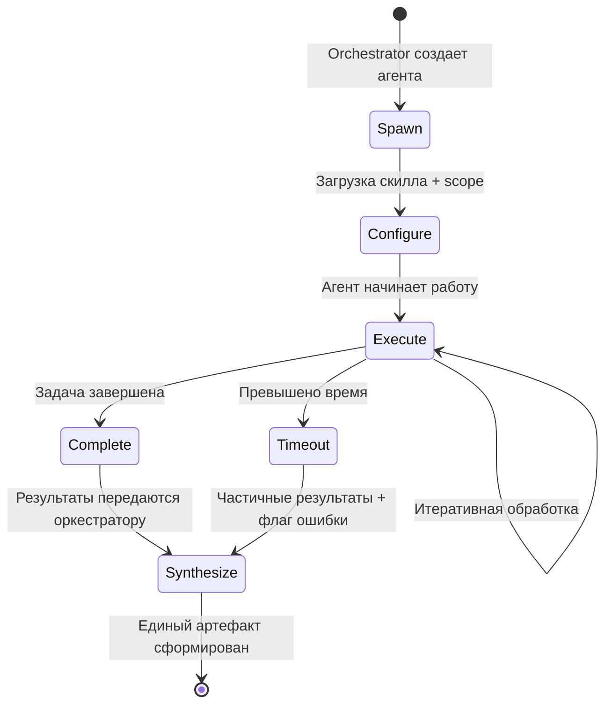
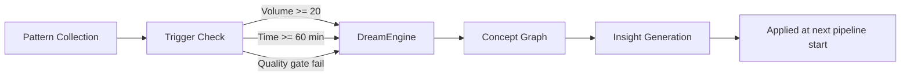
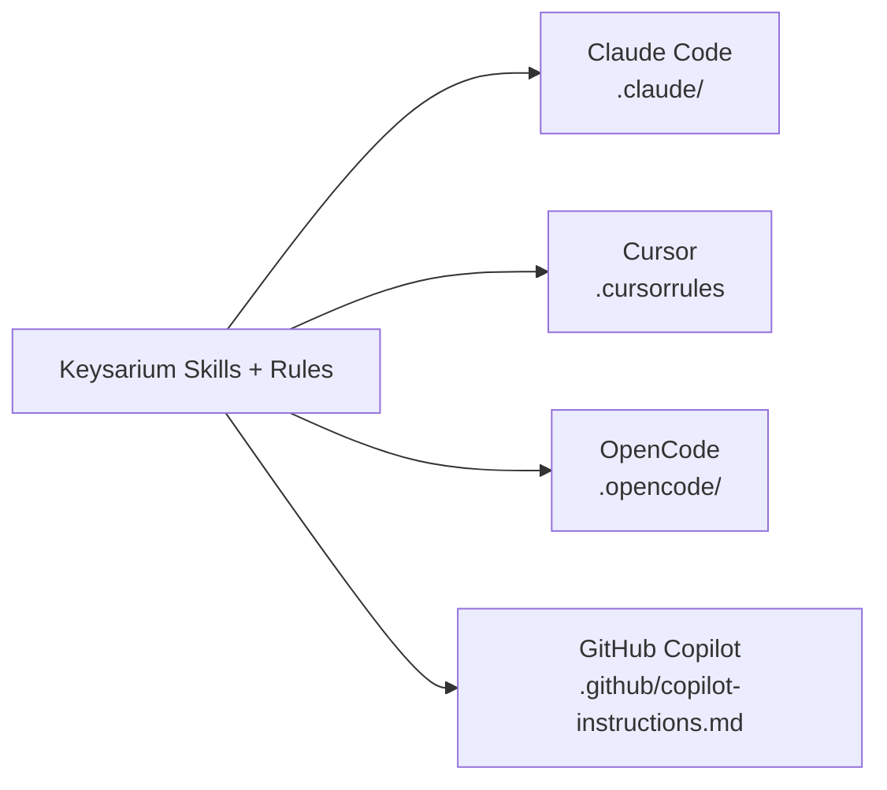

# 05. Архитектура и принципы Product Keysarium 2026

> **`/bto*` commands are NOT part of @dzhechkov/keysarium.** The BTO evaluator
> (Build-Benchmark-Test-Optimize) ships as a SEPARATE npm package. Install it first —
> `npx @dzhechkov/skills-bto init` — otherwise every `/bto…` command referenced below will
> not resolve in your project.


## Содержание

1. [Общая архитектура системы](#общая-архитектура-системы)
2. [Компоненты системы](#компоненты-системы)
3. [Принципы проектирования](#принципы-проектирования)
4. [Граф зависимостей скиллов](#граф-зависимостей-скиллов)
5. [Поток данных между фазами](#поток-данных-между-фазами)
6. [Agent Swarm Architecture](#agent-swarm-architecture)
7. [Модульность для переиспользования](#модульность-для-переиспользования)
8. [Сравнение с claude.ai](#сравнение-с-claudeai)
9. [Governance System](#governance-system)
10. [Memory & Learning System](#memory--learning-system)
11. [Verification System](#verification-system)
12. [Trust Tier System](#trust-tier-system)
13. [Background Workers](#background-workers)
14. [Multi-Platform Support](#multi-platform-support)
15. [keysarium-core Package](#keysarium-core-package)

---

## Общая архитектура системы

Product Keysarium 2026 построен как **модульный пайплайн-оркестратор** для AI-исследований. Система координирует прохождение кейса через 7 фаз (Phase 0-6), используя набор переиспользуемых скиллов, slash-команд, автоматических правил и агентов.

Архитектура следует принципу **"Convention over Configuration"** -- структура директорий `.claude/` определяет поведение системы без дополнительной конфигурации.

### Текстовое описание архитектуры

```
                    +---------------------------+
                    |       CLAUDE.md           |
                    | (мастер-инструкции,       |
                    |  автозагрузка при старте)  |
                    +---------------------------+
                               |
                    +----------v----------+
                    |  .claude/commands/   |
                    |  (slash-команды      |
                    |   пайплайна)         |
                    +----------+----------+
                               |
                 +-------------+-------------+
                 |             |             |
        +--------v---+  +-----v------+  +---v--------+
        | .claude/   |  | .claude/   |  | .claude/   |
        | skills/    |  | rules/     |  | agents/    |
        | (building  |  | (auto-     |  | (swarm     |
        |  blocks)   |  |  constraints)| configs)   |
        +--------+---+  +-----+------+  +---+--------+
                 |             |             |
                 +-------------+-------------+
                               |
                    +----------v----------+
                    |     lib/            |
                    | (shared utilities,  |
                    |  templates)         |
                    +----------+----------+
                               |
                    +----------v----------+
                    |    researches/      |
                    | (isolated research  |
                    |  directories)       |
                    +---------------------+
```

### Mermaid-диаграмма общей архитектуры



---

## Компоненты системы

### CLAUDE.md -- Мастер-инструкции

**Расположение:** `/CLAUDE.md` (корень проекта)

**Назначение:** Центральный конфигурационный файл, который автоматически загружается Claude Code при открытии проекта. Содержит:

- Описание назначения репозитория
- Быстрый старт (основные команды)
- Полную карту структуры проекта
- Таблицу фаз пайплайна с привязкой к командам, скиллам и артефактам
- Стратегию Agent Swarm (micro- и macro-параллелизм)
- Критические правила выполнения
- Доменные шаблоны (банки, ритейл, enterprise)
- Anti-patterns и способы их устранения

**Принцип работы:** Claude Code читает CLAUDE.md автоматически при старте сессии. Все инструкции из этого файла действуют как базовый контекст для каждого взаимодействия.

---

### .claude/skills/ -- Навыки (Building Blocks)

**Расположение:** `/.claude/skills/<skill-name>/`

**Назначение:** Самодостаточные, domain-agnostic модули знаний и инструкций. Каждый скилл -- это "строительный блок", который может использоваться в любом контексте, не только в рамках Keysarium-пайплайна.

**Структура скилла:**
```
.claude/skills/<skill-name>/
├── SKILL.md              ← Основные инструкции (точка входа)
├── references/           ← Справочные материалы
│   ├── technique-1.md
│   └── technique-2.md
├── modules/              ← Подмодули (для сложных скиллов)
│   ├── 01-module.md
│   └── 02-module.md
└── examples/             ← Примеры применения
    └── example-1.md
```

**Загрузка скилла:** Команды загружают скиллы через чтение SKILL.md перед выполнением фазы:
```
Read(".claude/skills/<skill-name>/SKILL.md")
```

**Список скиллов:**

| Скилл | Назначение | Используется в |
|-------|------------|----------------|
| `explore` | Адаптивная кларификация задач, 5 Whys, декомпозиция проблемы | Phase 1 |
| `goap-research-ed25519` | GOAP-планирование для исследований + криптографическая верификация источников | Phase 2, Phase 2.5 (Variant D) |
| `problem-solver-enhanced` | Решение проблем через TRIZ + Game Theory | Phase 3 |
| `frontend-design` | Дизайн и прототипирование UI-компонентов | Phase 2.5 |
| `presentation-storyteller` | Создание презентаций со storytelling-подходом | Phase 5 |
| `reverse-engineering-unicorn` | Reverse engineering компаний и продуктов, CJM-анализ | Phase 0, Phase 2.5 |

---

### .claude/commands/ -- Slash-команды

**Расположение:** `/.claude/commands/<command-name>.md`

**Назначение:** Pipeline-specific команды, реализующие конкретные фазы пайплайна Keysarium. В отличие от скиллов, команды привязаны к логике пайплайна и определяют последовательность действий, загрузку скиллов и формат артефактов.

**Вызов:** Пользователь вводит `/command-name [аргументы]` в Claude Code.

**Список команд:**

| Команда | Фаза | Описание |
|---------|------|----------|
| `/casarium` | All | Полный пайплайн (7 фаз) |
| `/new-research` | Init | Создать новое исследование |
| `/parallel-research` | Multi | Запустить несколько исследований параллельно |
| `/discovery` | Phase 0 | Product Discovery |
| `/explore-case` | Phase 1 | Глубокое понимание кейса |
| `/research` | Phase 2 | Бенчмарки, аналоги, технологии |
| `/cjm-prototype` | Phase 2.5 | CJM Prototype (MANDATORY) |
| `/solve` | Phase 3 | Стратегия решения |
| `/architecture-phase` | Phase 4 | Техническая архитектура |
| `/presentation` | Phase 5 | Презентация + Executive Summary |
| `/harvest` | Post | Извлечение знаний |

---

### .claude/rules/ -- Правила (автоматические constraints)

**Расположение:** `/.claude/rules/<rule-name>.md`

**Назначение:** Автоматически применяемые ограничения и правила, которые действуют на протяжении всей работы без явной загрузки. Правила обеспечивают quality gates и соблюдение стандартов.

**Список правил:**

| Правило | Назначение |
|---------|------------|
| `agent-swarm.md` | Когда и как использовать параллельных агентов, именование, оптимизация по стоимости |
| `anti-patterns.md` | Автоматическое обнаружение и блокировка anti-patterns |
| `checkpoint-protocol.md` | Формат и протокол чекпоинтов между фазами |
| `domain-specific.md` | Доменные правила (банки, ритейл, enterprise, healthcare) |
| `file-conventions.md` | Соглашения об именовании файлов и структуре директорий |
| `modular-reuse.md` | Правила модульного переиспользования компонентов |
| `research-quality.md` | PARANOID mode: требования к верификации источников |

---

### .claude/agents/ -- Шаблоны агентов

**Расположение:** `/.claude/agents/`

**Назначение:** Содержит reusable-конфигурации для Agent Swarm. Шаблоны определяют, какие агенты запускаются параллельно, какие скиллы они используют, и как синтезируются результаты.

**Принцип:** Агенты создаются через Agent tool в Claude Code. Каждый агент работает изолированно в рамках своего scope и не модифицирует файлы за его пределами.

---

### lib/ -- Разделяемые утилиты и шаблоны

**Расположение:** `/lib/`

**Назначение:** Общие утилиты, шаблоны и паттерны, используемые несколькими командами и скиллами:

- `lib/phase-utils.md` -- общие утилиты фаз
- `lib/agent-patterns.md` -- паттерны запуска агентов
- `lib/checkpoint-template.md` -- шаблон форматирования чекпоинтов

---

### researches/ -- Изолированные исследования

**Расположение:** `/researches/<case-slug>/`

**Назначение:** Каждое исследование полностью изолировано в своей директории. Ни один артефакт исследования не создается за пределами этой директории.

**Структура одного исследования:**
```
researches/<case-slug>/
├── 00_product_discovery.md       ← Phase 0
├── 01_case_brief.md              ← Phase 1
├── 02_research_findings.md       ← Phase 2
├── 02.5_trend_brief.md           ← Phase 2.5
├── 03_solution_strategy.md       ← Phase 3
├── 04_architecture.md            ← Phase 4
├── 05_presentation_content.md    ← Phase 5
├── 06_speaker_script.md          ← Phase 5
├── 07_qa_preparation.md          ← Phase 5
├── 08_executive_summary.md       ← Phase 5
├── prototype/
│   └── cjm-prototype.jsx        ← Phase 2.5
├── diagrams/
│   ├── architecture-c4.mermaid   ← Phase 4
│   ├── sequence-main-flow.mermaid← Phase 4
│   ├── process-as-is.mermaid     ← Phase 3
│   └── process-to-be.mermaid     ← Phase 3
└── README.md                     ← Phase 6
```

**Соглашения об именовании:**
- Slug: `snake_case`, только латиница (пример: `bank_kc_automation`)
- Артефакты: числовой префикс (`00_`, `01_`, ..., `08_`)
- Диаграммы: описательный `kebab-case` (пример: `architecture-c4.mermaid`)

---

### docs/ -- Документация

**Расположение:** `/docs/`

**Назначение:** Документация проекта, включая архитектуру, пользовательские flow, руководства по расширению и справочные материалы.

---

## Принципы проектирования

### 1. Модульность: каждый компонент самодостаточен

Каждый компонент системы (скилл, команда, правило) является самодостаточной единицей:

- **Скиллы** не зависят от пайплайна -- их можно использовать отдельно в любом проекте
- **Команды** определяют, какие скиллы загружать -- скилл не знает о команде
- **Правила** применяются автоматически и не зависят от конкретных команд
- **Агенты** конфигурируются шаблонами и не содержат бизнес-логики

Это позволяет заменять, добавлять и модифицировать любой компонент без влияния на остальные.

### 2. Изоляция: исследования не пересекаются

Каждое исследование создает полностью изолированную директорию в `researches/<slug>/`:

- Все артефакты фаз сохраняются только внутри своей директории
- Агенты при параллельной работе не выходят за границы своего scope
- Параллельные исследования (`/parallel-research`) работают в независимых директориях
- Нет shared state между исследованиями -- каждое самодостаточно

### 3. Параллелизм: Agent Swarm для ускорения

Система спроектирована для максимальной параллелизации:

- **Micro-parallelism:** внутри одной фазы несколько агентов работают одновременно
- **Macro-parallelism:** несколько исследований прорабатываются параллельно
- **Оптимизация моделей:** haiku для простых операций, sonnet для анализа, opus для креативной работы
- **Синтез:** после каждого параллельного этапа оркестратор объединяет результаты

### 4. Верифицируемость: PARANOID mode для research

Все исследовательские данные проходят строгую верификацию:

- Каждое утверждение должно иметь проверяемый источник
- Нулевая толерантность к галлюцинированным цитатам
- Порог уверенности: минимум 0.99
- Непроверенные данные маркируются как `[UNVERIFIED]`
- Перед завершением фазы -- чеклист верификации

### 5. Расширяемость: легко добавить новый домен или фазу

Система расширяется через конвенции, а не через код:

- **Новый домен:** добавить правило в `.claude/rules/domain-specific.md`
- **Новая фаза:** создать `.claude/commands/new-phase.md`, привязать скилл, обновить CLAUDE.md
- **Новый скилл:** создать `.claude/skills/new-skill/SKILL.md` с инструкциями
- **Новый агент:** создать шаблон в `.claude/agents/`

Нет необходимости модифицировать существующие компоненты при расширении.

---

## Граф зависимостей скиллов

Скиллы имеют иерархическую структуру зависимостей. `reverse-engineering-unicorn` выступает как оркестратор верхнего уровня, использующий остальные скиллы как building blocks.



**Как читать граф:**
- Стрелка `A --> B` означает "скилл A использует скилл B"
- `reverse-engineering-unicorn` зависит от всех остальных скиллов
- `presentation-storyteller` дополнительно зависит от `explore` и `goap-research-ed25519`
- Остальные скиллы (`explore`, `goap-research-ed25519`, `problem-solver-enhanced`, `frontend-design`) являются leaf-узлами без внешних зависимостей

---

## Поток данных между фазами

Каждая фаза создает артефакт, который используется последующими фазами как входные данные. Ключевой элемент -- `{CHOSEN_CJM}`, который фиксируется в Phase 2.5 и пронизывает все последующие фазы.



### Карта передачи данных

```
Phase 0 → [00_product_discovery.md] → Phase 1, Phase 2
Phase 1 → [01_case_brief.md]        → Phase 2, Phase 2.5
Phase 2 → [02_research_findings.md] → Phase 2.5, Phase 3
Phase 2.5 → [02.5_trend_brief.md]   → Phase 3
          → [prototype/cjm-prototype.jsx] → Phase 5
          → {CHOSEN_CJM}            → Phase 3, Phase 4, Phase 5
Phase 3 → [03_solution_strategy.md] → Phase 4, Phase 5
        → [diagrams/process-*.mermaid] → Phase 4, Phase 5
Phase 4 → [04_architecture.md]      → Phase 5
        → [diagrams/architecture-*.mermaid] → Phase 5
Phase 5 → [05-08_*.md]              → Phase 6
Phase 6 → [README.md, zip-архив]    → Пользователь
```

---

## Agent Swarm Architecture

### Обзор

Agent Swarm -- это стратегия параллелизации, при которой несколько AI-агентов работают одновременно над независимыми подзадачами. После завершения параллельного этапа оркестратор синтезирует результаты в единый артефакт.

### Micro-parallelism (внутри фаз)

Micro-parallelism применяется внутри одной фазы, когда подзадачи фазы могут выполняться независимо.

```mermaid
graph TB
    subgraph "Phase 0: Discovery (2 агента)"
        P0_O["Orchestrator Phase 0"] --> P0_A1["Agent 1:<br/>JTBD + Voice of Customer<br/>+ Aha Moment"]
        P0_O --> P0_A2["Agent 2:<br/>Конкуренты + Business Case<br/>+ Why AI Why Now"]
        P0_A1 --> P0_S["Синтез →<br/>00_product_discovery.md"]
        P0_A2 --> P0_S
    end

    subgraph "Phase 2: Research (3 агента)"
        P2_O["Orchestrator Phase 2"] --> P2_A1["Agent 1:<br/>Аналоги + метрики"]
        P2_O --> P2_A2["Agent 2:<br/>Технологии + Anti-patterns"]
        P2_O --> P2_A3["Agent 3:<br/>Регуляторика + market data"]
        P2_A1 --> P2_S["Синтез →<br/>02_research_findings.md"]
        P2_A2 --> P2_S
        P2_A3 --> P2_S
    end

    subgraph "Phase 2.5: CJM Prototype (3 агента)"
        P25_O["Orchestrator Phase 2.5"] --> P25_A1["Agent 1:<br/>CJM Variant A"]
        P25_O --> P25_A2["Agent 2:<br/>CJM Variant B + C"]
        P25_O --> P25_A3["Agent 3:<br/>Trend Research (Variant D)<br/>GOAP PARANOID"]
        P25_A1 --> P25_S["Синтез → 4 варианта<br/>prototype/cjm-prototype.jsx"]
        P25_A2 --> P25_S
        P25_A3 --> P25_S
    end

    subgraph "Phase 5: Presentation (3 агента)"
        P5_O["Orchestrator Phase 5"] --> P5_A1["Agent 1:<br/>Контент презентации<br/>05_presentation_content.md"]
        P5_O --> P5_A2["Agent 2:<br/>Speaker Script<br/>06_speaker_script.md"]
        P5_O --> P5_A3["Agent 3:<br/>Q&A + Executive Summary<br/>07 + 08_*.md"]
        P5_A1 --> P5_S["Синтез и<br/>финальная проверка"]
        P5_A2 --> P5_S
        P5_A3 --> P5_S
    end
```



### Macro-parallelism (между исследованиями)

Macro-parallelism применяется при параллельной обработке нескольких кейсов через `/parallel-research`.



### Agent Lifecycle: spawn -> execute -> synthesize

Каждый агент проходит строго определенный жизненный цикл:



**Этапы:**

1. **Spawn** -- оркестратор создает агента через Agent tool с описательным именем (например, "Phase 2 Technology Research")
2. **Configure** -- агенту назначается:
   - Scope (директория и файлы, с которыми он работает)
   - Скилл (SKILL.md для загрузки)
   - Модель (haiku/sonnet/opus в зависимости от сложности)
3. **Execute** -- агент выполняет задачу изолированно, не модифицируя файлы вне scope
4. **Synthesize** -- оркестратор объединяет результаты всех агентов в единый артефакт фазы

### Оптимизация по стоимости моделей

| Сложность задачи | Модель | Примеры |
|-----------------|--------|---------|
| Простые файловые операции, форматирование | haiku | Создание README, форматирование Mermaid |
| Анализ и синтез данных | sonnet | Research synthesis, сравнительные таблицы |
| Сложная креативная работа | opus | CJM дизайн, storytelling-презентации, архитектура |

---

## Модульность для переиспользования

### Как использовать скиллы в других проектах

Скиллы спроектированы как domain-agnostic building blocks. Для использования скилла в другом проекте:

1. **Скопировать директорию скилла:**
   ```bash
   cp -r .claude/skills/explore/ /path/to/other-project/.claude/skills/
   ```

2. **Загрузить в своем контексте:**
   ```
   Read(".claude/skills/explore/SKILL.md")
   ```

3. **Скилл работает автономно** -- он не зависит от остальных компонентов Keysarium.

**Примеры переиспользования:**

| Скилл | В каких проектах может пригодиться |
|-------|-----------------------------------|
| `explore` | Любой проект, требующий кларификации задач |
| `goap-research-ed25519` | Любое исследование с требованием к верификации |
| `problem-solver-enhanced` | Стратегическое планирование, решение сложных задач |
| `frontend-design` | Любой UI-проект |
| `presentation-storyteller` | Подготовка любых презентаций |
| `reverse-engineering-unicorn` | Анализ продуктов и компаний |

### Как адаптировать пайплайн под другой домен

Пайплайн адаптируется без модификации скиллов -- только через изменение команд и правил:

**Шаг 1.** Определить фазы нового пайплайна:
```
Пример: DevOps Audit Pipeline
Phase 0: Infrastructure Discovery
Phase 1: Security Audit
Phase 2: Performance Benchmarks
Phase 3: Recommendations
Phase 4: Migration Plan
```

**Шаг 2.** Создать команды для каждой фазы:
```
.claude/commands/infra-discovery.md    → использует explore + goap-research
.claude/commands/security-audit.md     → использует goap-research (PARANOID)
.claude/commands/perf-benchmark.md     → использует goap-research
.claude/commands/recommendations.md    → использует problem-solver-enhanced
.claude/commands/migration-plan.md     → использует presentation-storyteller
```

**Шаг 3.** Добавить доменные правила:
```
.claude/rules/devops-specific.md
```

**Шаг 4.** Обновить CLAUDE.md с новой таблицей фаз.

### Plugin-like Architecture через .claude/ конвенции

Система следует паттерну "plugin architecture", где `.claude/` выступает как plugin directory:

```
.claude/
├── commands/    ← "Routes"    — определяют, что вызывается
├── skills/      ← "Handlers"  — определяют, как выполняется
├── rules/       ← "Middleware" — определяют, какие ограничения действуют
└── agents/      ← "Workers"   — определяют, кто выполняет параллельно
```

**Аналогия с веб-фреймворком:**
- **Commands** = маршруты (routes): принимают запрос пользователя и направляют к нужному обработчику
- **Skills** = обработчики (handlers): содержат бизнес-логику выполнения задачи
- **Rules** = middleware: автоматически перехватывают и модифицируют поведение
- **Agents** = workers: выполняют задачи параллельно в изолированных контекстах

**Добавление нового "плагина":**
1. Создать файл в соответствующей директории
2. Обновить CLAUDE.md (если нужно)
3. Готово -- система подхватит новый компонент автоматически

---

## Сравнение с claude.ai

Product Keysarium 2026 спроектирован для работы в Claude Code, но его принципы применимы и к claude.ai (веб-интерфейс). Ниже -- ключевые различия в реализации.

### Загрузка скиллов

| Аспект | claude.ai | Claude Code |
|--------|-----------|-------------|
| Чтение скилла | `view("/mnt/skills/<skill>/SKILL.md")` | `Read(".claude/skills/<skill>/SKILL.md")` |
| Путь к скиллам | `/mnt/skills/` (виртуальная FS) | `.claude/skills/` (реальная FS проекта) |
| Автозагрузка | Через system prompt | Через CLAUDE.md |

### Команды

| Аспект | claude.ai | Claude Code |
|--------|-----------|-------------|
| Вызов команды | Через промпт: "Выполни Phase 0" | Через slash-команду: `/discovery` |
| Определение команд | В system prompt или project instructions | В `.claude/commands/<name>.md` |
| Параметры | Через текст в промпте | Через `$ARGUMENTS` |

### Правила

| Аспект | claude.ai | Claude Code |
|--------|-----------|-------------|
| Применение | Включены в system prompt | Автоматически из `.claude/rules/` |
| Обновление | Ручное обновление промпта | Редактирование файла |

### Параллелизация

| Аспект | claude.ai | Claude Code |
|--------|-----------|-------------|
| Agent Swarm | Недоступен | Agent tool с параллельными агентами |
| Macro-parallelism | Несколько вкладок вручную | `/parallel-research` автоматически |
| Модели агентов | Одна модель | haiku/sonnet/opus per agent |

### Преимущества Claude Code

| Возможность | Описание |
|------------|----------|
| **Git integration** | Автоматическое версионирование исследований, diff, history |
| **Agent tool** | Параллельные агенты с изоляцией и синтезом результатов |
| **File system access** | Полный доступ к файловой системе: создание, чтение, модификация файлов |
| **Slash-commands** | Типизированные команды с автодополнением и аргументами |
| **Rules autoload** | Правила из `.claude/rules/` применяются автоматически |
| **CLAUDE.md** | Автоматическая загрузка мастер-инструкций при старте |
| **Persistent workspace** | Состояние проекта сохраняется между сессиями через файлы |
| **Harvest** | Систематическое извлечение знаний из завершенных исследований |

### Когда что использовать

| Сценарий | Рекомендация |
|----------|-------------|
| Полный пайплайн с Agent Swarm | Claude Code |
| Быстрый анализ одного аспекта | claude.ai или Claude Code |
| Параллельные исследования | Claude Code (Agent tool) |
| Командная работа с git | Claude Code |
| Прототипирование скилла | claude.ai (быстрый feedback loop) |
| Production pipeline | Claude Code (воспроизводимость) |

---

## Governance System

### Constitution & Shards

Каждая фаза загружает свой governance shard из `.claude/shards/`:

```
.claude/shards/
├── phase-0-discovery.shard.md
├── phase-1-explore.shard.md
├── phase-2-research.shard.md
├── phase-25-cjm.shard.md
├── phase-3-solve.shard.md
├── phase-4-architecture.shard.md
├── phase-5-presentation.shard.md
├── bto-evaluation.shard.md
└── feature-adr.shard.md
```

Shard содержит: time budget, skill to load, prerequisites, quality gates, promise tag. Решает проблему context drift при длинных сессиях.

### Semantic Completion Promises

Каждый checkpoint включает машинно-читаемый `<promise>` тег:

| Фаза | Promise Tag |
|------|------------|
| Phase 0 | `DISCOVERY_COMPLETE` |
| Phase 1 | `CASE_EXPLORED` |
| Phase 2 | `RESEARCH_PARANOID_PASSED` |
| Phase 2.5 | `CJM_VALIDATED` |
| Phase 3 | `SOLUTION_DESIGNED` |
| Phase 4 | `ARCHITECTURE_DEFINED` |
| Phase 5 | `PRESENTATION_READY` |

---

## Memory & Learning System

### Reward-calibrated Learning

Персистентная память в `.keysarium/memory/`:

1. **Pre-phase:** `memory_query()` загружает релевантные паттерны из прошлых кейсов
2. **Post-checkpoint:** `memory_store()` сохраняет результат с reward score (0.0-1.0)

Reward mapping: "ок" → 1.0, minor adjustments → 0.7, significant rework → 0.3, full restart → 0.0

### Cross-phase Feedback Loops

6 именованных loops формализуют передачу данных:

| Loop | Direction | Key Variable |
|------|-----------|-------------|
| CJM → Solve | Phase 2.5 → 3 | `{CHOSEN_CJM}` |
| Research → Presentation | Phase 2 → 5 | Verified sources |
| Discovery → All | Phase 0 → 1-5 | `{DOMAIN}`, `{PRIMARY_USER}` |
| Solve → Architecture | Phase 3 → 4 | `{SOLUTION_CONCEPT}` |
| BTO Judges → Optimizer | Layer 2 → Optimize | `{WEAK_DIMENSIONS}` |
| History → Discovery | Past → Phase 0 | Domain patterns |

### Dream Cycles

Background pattern analysis engine:



Инсайты хранятся в `.keysarium/insights/` (max 10 файлов, chronological retention).

---

## Verification System

### SHA-256 Witness Chain

Каждый phase artifact получает hash, chain связывает артефакты:

```
Phase 0: hash_0 = SHA-256(00_product_discovery.md)
Phase 1: hash_1 = SHA-256(01_case_brief.md + hash_0)
Phase 2: hash_2 = SHA-256(02_research_findings.md + hash_1)
...
```

Хранится в `researches/<slug>/.witness-chain.json`. Невозможно подменить промежуточный артефакт без разрыва цепочки.

### BTO Judge Attestation

Криптографическое доказательство независимости судей в `.judge-attestations.json`:
- Каждый judge записывает оценку с SHA-256 hash ДО того, как видит оценки других
- Timestamps доказуемо верифицируют изоляцию judges

---

## Trust Tier System

| Tier | Label | Requirements |
|------|-------|-------------|
| 3 | Verified | Eval test suites + deterministic validation |
| 2 | Validated | /bto-test Layer 2 score >= 7.0 |
| 1 | Structured | SKILL.md + references/ or modules/ |
| 0 | Advisory | Only SKILL.md |

Повышение: `/bto-test .claude/skills/<name>/` → score >= 7.0 → Tier 2 → score >= 8.5 + eval tests → Tier 3.

---

## Background Workers

```mermaid
graph TB
    CMD["/workers start consolidate"] --> REG[Registry<br/>.keysarium/workers/registry.json]
    REG --> W1[Worker: consolidate<br/>model=sonnet]
    REG --> W2[Worker: health-check<br/>model=haiku]
    REG --> W3[Worker: dream-cycle<br/>model=sonnet]
    W1 --> OUT1[.keysarium/workers/{id}/]
    W2 --> OUT2[.keysarium/workers/{id}/]
    W3 --> OUT3[.keysarium/workers/{id}/]
```

Max 3 concurrent, strict isolation (write only to .keysarium/workers/), never opus.

---

## Multi-Platform Support



`/init-platform --platform <name>` генерирует platform-specific конфигурации. Skills и rules -- тот же markdown, меняется только формат загрузки.

---

## keysarium-core Package

3-package architecture:

```
@dzhechkov/keysarium-core          ← Domain-agnostic framework
        ↑                ↑
   peerDep          peerDep
        |                |
@dzhechkov/keysarium    @dzhechkov/skills-bto
```

Core modules (22 files):

| Module | Files | Purpose |
|--------|-------|---------|
| governance/ | 3 | Constitution, shard protocol, checkpoint protocol |
| memory/ | 3 | Memory protocol, reward tracker, dream engine |
| orchestration/ | 4 | Queen protocol, topologies, workers, model routing |
| verification/ | 3 | Witness chain, judge attestation, audit trail |
| trust-tiers/ | 2 | Tier system, promotion protocol |
| platform/ | 4 | Adapter registry + templates |

All protocols are domain-agnostic -- any team can build custom multi-agent pipelines.
