# 06. Пользовательские и административные flow

> **`/bto*` commands are NOT part of @dzhechkov/keysarium.** The BTO evaluator
> (Build-Benchmark-Test-Optimize) ships as a SEPARATE npm package. Install it first —
> `npx @dzhechkov/skills-bto init` — otherwise every `/bto…` command referenced below will
> not resolve in your project.


## Содержание

1. [User Flow: Полный пайплайн (/casarium)](#user-flow-полный-пайплайн)
2. [User Flow: Quick Mode (< 2 часов)](#user-flow-quick-mode)
3. [User Flow: Параллельные исследования](#user-flow-параллельные-исследования)
4. [User Flow: Отдельная фаза](#user-flow-отдельная-фаза)
5. [User Flow: Harvest знаний](#user-flow-harvest-знаний)
6. [Admin Flow: Добавление нового скилла](#admin-flow-добавление-нового-скилла)
7. [Admin Flow: Создание новой команды](#admin-flow-создание-новой-команды)
8. [Admin Flow: Настройка доменных правил](#admin-flow-настройка-доменных-правил)
9. [Admin Flow: Расширение пайплайна новой фазой](#admin-flow-расширение-пайплайна-новой-фазой)
10. [Admin Flow: Массовый harvest](#admin-flow-массовый-harvest)
11. [Error Flows](#error-flows)
12. [User Flow: BTO — Build-Test-Optimize](#user-flow-bto--build-test-optimize)
13. [User Flow: Feature ADR](#user-flow-feature-adr)
14. [User Flow: Background Workers](#user-flow-background-workers)
15. [User Flow: Dream Cycles](#user-flow-dream-cycles)
16. [User Flow: Brain Export/Import](#user-flow-brain-exportimport)

---

## User Flow: Полный пайплайн

### Sequence Diagram

```mermaid
sequenceDiagram
    actor U as User
    participant C as Claude (/casarium)
    participant FS as File System
    participant A as Agent Swarm

    U->>C: /casarium [текст кейса]
    C->>C: Определить CASE_NAME, тайминг, домен
    C->>FS: mkdir researches/<slug>/
    C->>FS: mkdir researches/<slug>/prototype/
    C->>FS: mkdir researches/<slug>/diagrams/
    C-->>U: Инициализация: 7 фаз, распределение времени

    Note over C: ═══ Phase 0: Product Discovery ═══
    C->>FS: Read .claude/skills/reverse-engineering-unicorn/SKILL.md
    C->>A: Spawn 2 агента
    A->>A: Agent 1: JTBD + Voice of Customer
    A->>A: Agent 2: Конкуренты + Business Case
    A-->>C: Результаты обоих агентов
    C->>C: Синтез результатов
    C->>FS: Write 00_product_discovery.md
    C-->>U: Checkpoint 0: Discovery Complete
    U->>C: "ок"

    Note over C: ═══ Phase 1: Explore ═══
    C->>FS: Read .claude/skills/explore/SKILL.md
    C->>FS: Read 00_product_discovery.md
    C->>C: 5 Whys, ограничения, success criteria
    C->>FS: Write 01_case_brief.md
    C-->>U: Checkpoint 1: Explore Complete
    U->>C: "ок"

    Note over C: ═══ Phase 2: Research ═══
    C->>FS: Read .claude/skills/goap-research-ed25519/SKILL.md
    C->>A: Spawn 3 агента (PARANOID mode)
    A->>A: Agent 1: Аналоги + метрики
    A->>A: Agent 2: Технологии + Anti-patterns
    A->>A: Agent 3: Регуляторика + market data
    A-->>C: Результаты трёх агентов
    C->>C: Синтез + верификация
    C->>FS: Write 02_research_findings.md
    C-->>U: Checkpoint 2: Research Complete
    U->>C: "ок"

    Note over C: ═══ Phase 2.5: CJM Prototype ═══
    C->>FS: Read .claude/skills/reverse-engineering-unicorn/SKILL.md
    C->>FS: Read .claude/skills/frontend-design/SKILL.md
    C->>A: Spawn 3 агента
    A->>A: Agent 1: CJM Variant A
    A->>A: Agent 2: CJM Variant B + C
    A->>A: Agent 3: Trend Research (Variant D)
    A-->>C: 4 варианта CJM
    C->>FS: Write 02.5_trend_brief.md
    C->>FS: Write prototype/cjm-prototype.jsx
    C-->>U: Checkpoint 2.5: Выберите CJM (A/B/C/D)
    U->>C: "выбираю B"
    C->>C: Зафиксировать {CHOSEN_CJM} = Variant B

    Note over C: ═══ Phase 3: Solve ═══
    C->>FS: Read .claude/skills/problem-solver-enhanced/SKILL.md
    C->>C: SCQA, Process Design, AI Pipeline (используя {CHOSEN_CJM})
    C->>FS: Write 03_solution_strategy.md
    C->>FS: Write diagrams/process-as-is.mermaid
    C->>FS: Write diagrams/process-to-be.mermaid
    C-->>U: Checkpoint 3: Solve Complete
    U->>C: "ок"

    Note over C: ═══ Phase 4: Architecture ═══
    C->>C: C4 Architecture, AI Models, Data, Security (используя {CHOSEN_CJM})
    C->>FS: Write 04_architecture.md
    C->>FS: Write diagrams/architecture-c4.mermaid
    C->>FS: Write diagrams/sequence-main-flow.mermaid
    C-->>U: Checkpoint 4: Architecture Complete
    U->>C: "ок"

    Note over C: ═══ Phase 5: Presentation ═══
    C->>FS: Read .claude/skills/presentation-storyteller/SKILL.md
    C->>A: Spawn 3 агента (используя {CHOSEN_CJM})
    A->>A: Agent 1: Контент презентации
    A->>A: Agent 2: Speaker Script
    A->>A: Agent 3: Q&A + Executive Summary
    A-->>C: Результаты трёх агентов
    C->>FS: Write 05_presentation_content.md
    C->>FS: Write 06_speaker_script.md
    C->>FS: Write 07_qa_preparation.md
    C->>FS: Write 08_executive_summary.md
    C-->>U: Checkpoint 5: Presentation Complete
    U->>C: "ок"

    Note over C: ═══ Phase 6: Packaging ═══
    C->>C: Проверка всех артефактов
    C->>FS: Write README.md
    C-->>U: Полный архив исследования
```

### Step by Step

**Шаг 1. Запуск пайплайна**
```
User: /casarium Кейс: Автоматизация контакт-центра банка с помощью AI.
      Тайминг: 4 часа. Домен: Банковский.
```

**Шаг 2. Инициализация**
- Claude определяет `CASE_NAME = bank_kc_automation`
- Создает `researches/bank_kc_automation/` со структурой
- Распределяет время: Phase 0 (36 мин) | Phase 1 (12 мин) | Phase 2 (36 мин) | Phase 2.5 (24 мин) | Phase 3 (36 мин) | Phase 4 (36 мин) | Phase 5 (48 мин) | Buffer (12 мин)
- Применяет доменные правила: банковский домен (on-premise LLM, ФЗ-152, HITL)

**Шаг 3. Phase 0 -- Product Discovery**
- Загружается скилл `reverse-engineering-unicorn`
- 2 агента параллельно: JTBD-анализ и конкурентный анализ
- Результат: `00_product_discovery.md`
- Checkpoint 0 -> пользователь подтверждает "ок"

**Шаг 4. Phase 1 -- Explore**
- Загружается скилл `explore`
- Декомпозиция проблемы, карта ограничений, success criteria
- Результат: `01_case_brief.md`
- Checkpoint 1 -> пользователь подтверждает "ок"

**Шаг 5. Phase 2 -- Research**
- Загружается скилл `goap-research-ed25519` в PARANOID mode
- 3 агента параллельно: аналоги, технологии, регуляторика
- Синтез с верификацией каждого утверждения
- Результат: `02_research_findings.md`
- Checkpoint 2 -> пользователь подтверждает "ок"

**Шаг 6. Phase 2.5 -- CJM Prototype (MANDATORY)**
- Загружаются скиллы `reverse-engineering-unicorn` + `frontend-design`
- 3 агента параллельно: Variant A, Variant B+C, Trend Research (D)
- Генерируется React-прототип с 4 вариантами CJM
- Результат: `02.5_trend_brief.md` + `prototype/cjm-prototype.jsx`
- Checkpoint 2.5 -> пользователь выбирает: "выбираю B"
- Фиксируется `{CHOSEN_CJM} = Variant B`

**Шаг 7. Phase 3 -- Solve**
- Загружается скилл `problem-solver-enhanced`
- Используется `{CHOSEN_CJM}` для проектирования решения
- SCQA, Process Design (As-Is -> To-Be), AI Pipeline, HITL, метрики, roadmap
- Результат: `03_solution_strategy.md` + Mermaid-диаграммы
- Checkpoint 3 -> пользователь подтверждает "ок"

**Шаг 8. Phase 4 -- Architecture**
- Встроенные шаблоны архитектуры + контекст Phase 0-3
- C4 Architecture, AI Models & Pipeline, Data Architecture, Security
- Результат: `04_architecture.md` + Mermaid-диаграммы
- Checkpoint 4 -> пользователь подтверждает "ок"

**Шаг 9. Phase 5 -- Presentation**
- Загружается скилл `presentation-storyteller`
- 3 агента параллельно: презентация, speaker script, Q&A + executive summary
- Результат: `05-08_*.md` (4 файла)
- Checkpoint 5 -> пользователь подтверждает "ок"

**Шаг 10. Phase 6 -- Packaging**
- Проверка наличия всех артефактов
- Генерация `README.md` с метаданными и оглавлением
- Финальный архив исследования готов

### Команды пользователя во время пайплайна

| Команда | Действие | Когда доступна |
|---------|----------|----------------|
| `ок` | Переход к следующей фазе | На любом checkpoint |
| `углуби [раздел]` | Доработать конкретный раздел | На любом checkpoint |
| `превью [X]` | Посмотреть созданный документ | В любой момент |
| `время [N]` | Изменить тайминг | В начале или на checkpoint |
| `ускорь` | Quick Mode текущей фазы | На checkpoint |
| `wow` | Добавить нестандартный элемент | На checkpoint |
| `выбираю A/B/C/D` | Зафиксировать CJM | Только на Checkpoint 2.5 |
| `объедини A+D` | Создать гибрид CJM | Только на Checkpoint 2.5 |

---

## User Flow: Quick Mode

Quick Mode предназначен для ситуаций, когда тайминг кейса составляет менее 2 часов. Фазы выполняются в сокращенном формате.

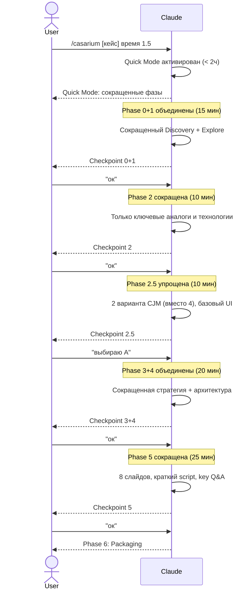

### Отличия от полного пайплайна

| Аспект | Полный (4ч) | Quick (< 2ч) |
|--------|-------------|--------------|
| Phase 0+1 | Раздельные | Объединены |
| Phase 2 | 3 агента, глубокий research | 1 агент, ключевые факты |
| Phase 2.5 | 4 варианта CJM | 2 варианта, базовый UI |
| Phase 3+4 | Раздельные | Объединены |
| Phase 5 | 10-12 слайдов, полный script | 8 слайдов, краткий script |
| Диаграммы | 4+ Mermaid | 2 Mermaid (минимум) |
| Executive Summary | Полная страница | Половина страницы |

### Правила Quick Mode

- Phase 2.5 (CJM) все равно **не пропускается** -- упрощается до 2 вариантов
- `08_executive_summary.md` все равно **обязателен**
- PARANOID mode для research **сохраняется** (лучше меньше утверждений, но верифицированных)
- Checkpoints **сохраняются** (но можно пройти быстрее)

---

## User Flow: Параллельные исследования

### Sequence Diagram

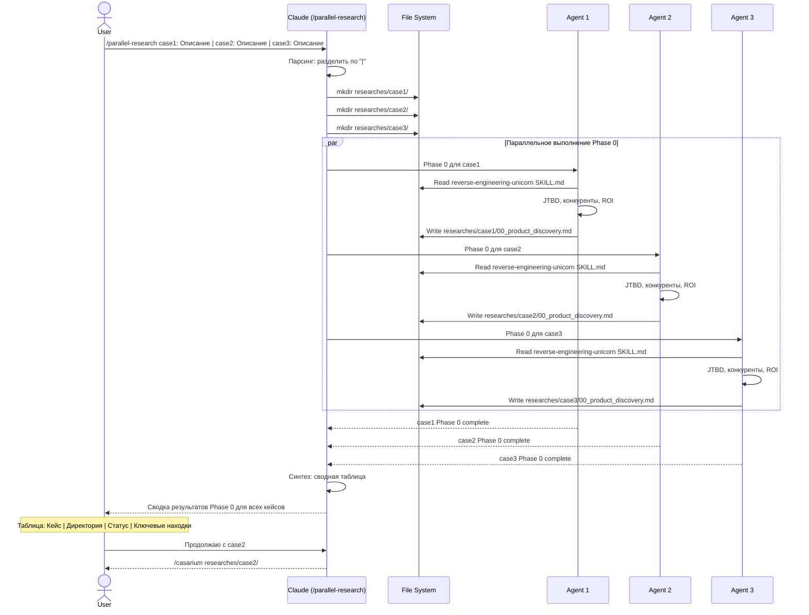

### Step by Step

**Шаг 1. Запуск параллельных исследований**
```
User: /parallel-research
  AI для контакт-центра банка |
  Персонализация в e-commerce |
  Автоматизация документооборота
```

**Шаг 2. Парсинг и инициализация**
- Claude разделяет аргумент по `|`
- Определяет slug для каждого: `bank_kc_ai`, `ecommerce_personalization`, `doc_automation`
- Создает 3 изолированные директории в `researches/`
- Инициализирует README.md в каждой

**Шаг 3. Параллельное выполнение Phase 0**
- Запускаются 3 агента одновременно
- Каждый агент загружает `reverse-engineering-unicorn` и выполняет Product Discovery
- Агенты работают изолированно -- каждый только в своей директории

**Шаг 4. Сводка результатов**
```
═══════════════════════════════════════════════════════
Параллельные исследования: Phase 0 Complete

| # | Кейс                    | Директория                      | Статус |
|---|-------------------------|---------------------------------|--------|
| 1 | AI для контакт-центра   | researches/bank_kc_ai/          | Done   |
| 2 | Персонализация e-com    | researches/ecommerce_personal/  | Done   |
| 3 | Автоматизация документов| researches/doc_automation/       | Done   |

Для продолжения:
  /casarium researches/bank_kc_ai/
  /casarium researches/ecommerce_personal/
  /casarium researches/doc_automation/
═══════════════════════════════════════════════════════
```

**Шаг 5. Пользователь выбирает кейс для продолжения**
- Можно продолжить один кейс через `/casarium`
- Можно продолжить несколько последовательно
- Phase 0 уже выполнена -- пайплайн продолжится с Phase 1

### Ограничения

- Рекомендуется не более 3-4 параллельных исследований
- Phase 0 выполняется параллельно, остальные фазы -- последовательно для каждого кейса
- Каждый агент строго изолирован в своей директории

---

## User Flow: Отдельная фаза

Пользователь может запустить любую фазу отдельно, если уже есть подготовленная директория исследования с артефактами предыдущих фаз.

### Sequence Diagram

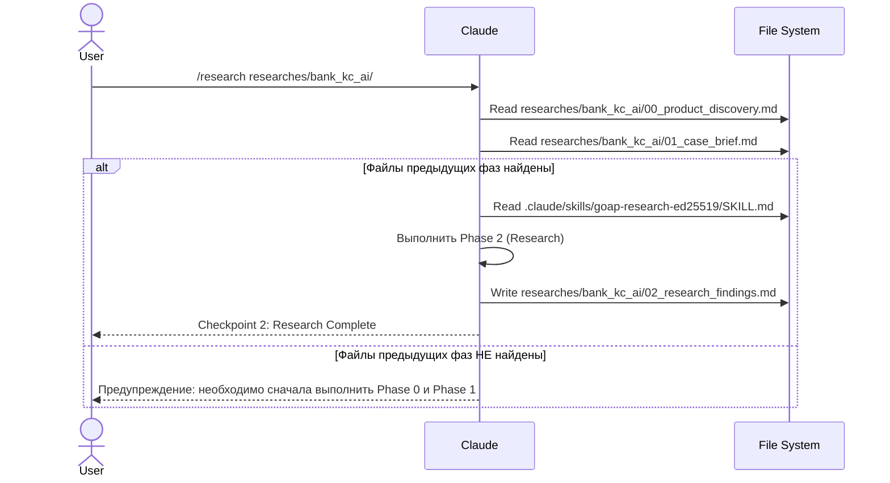

### Step by Step

**Шаг 1. Запуск отдельной фазы**
```
User: /research researches/bank_kc_ai/
```

**Шаг 2. Проверка контекста**
- Claude проверяет наличие артефактов предыдущих фаз
- Если Phase 0 (`00_product_discovery.md`) и Phase 1 (`01_case_brief.md`) существуют -- продолжает
- Если нет -- предупреждает и предлагает сначала выполнить пропущенные фазы

**Шаг 3. Выполнение фазы**
- Загружается соответствующий скилл
- Фаза выполняется с учетом контекста предыдущих артефактов
- Создается артефакт в директории исследования

**Шаг 4. Checkpoint**
- Отображается checkpoint с результатами
- Пользователь может скорректировать или подтвердить

### Таблица зависимостей фаз

| Фаза | Команда | Требует артефактов от |
|------|---------|----------------------|
| Phase 0 | `/discovery` | -- (начальная) |
| Phase 1 | `/explore-case` | Phase 0 |
| Phase 2 | `/research` | Phase 0, Phase 1 |
| Phase 2.5 | `/cjm-prototype` | Phase 0, Phase 1, Phase 2 |
| Phase 3 | `/solve` | Phase 0-2.5 + {CHOSEN_CJM} |
| Phase 4 | `/architecture-phase` | Phase 0-3 |
| Phase 5 | `/presentation` | Phase 0-4 |

---

## User Flow: Harvest знаний

### Sequence Diagram

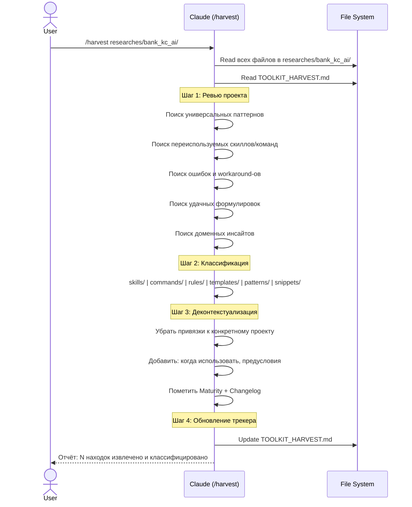

### Step by Step

**Шаг 1. Запуск harvest**
```
User: /harvest researches/bank_kc_ai/
```

**Шаг 2. Ревью исследования**
- Claude читает все артефакты в указанной директории
- Читает текущий `TOOLKIT_HARVEST.md`
- Ищет паттерны, которые можно обобщить за пределами конкретного кейса

**Шаг 3. Классификация находок**
Каждая находка распределяется по категориям:

| Категория | Примеры находок |
|-----------|----------------|
| skills/ | Улучшенный подход к CJM-анализу для банков |
| commands/ | Новая фаза "Compliance Review" |
| rules/ | "В банковском домене всегда проверяй ФЗ-152" |
| templates/ | Обновленный шаблон executive summary |
| patterns/ | Event sourcing для AI pipeline в банках |
| snippets/ | Универсальный CJM renderer для React |

**Шаг 4. Деконтекстуализация**
- Убираются привязки к конкретному банку/кейсу
- Добавляется документация: когда применять, предусловия, ограничения
- Маркируется зрелость: Beta / Stable
- Добавляется changelog

**Шаг 5. Обновление TOOLKIT_HARVEST.md**
- Новые находки добавляются в трекер
- Указывается проект-источник и дата извлечения

### Что НЕ извлекается

- Код, работающий только в контексте конкретного домена
- Паттерны, использованные один раз без уверенности в качестве
- Workaround-ы для конкретных багов библиотек (быстро устаревают)

---

## Admin Flow: Добавление нового скилла

### Sequence Diagram

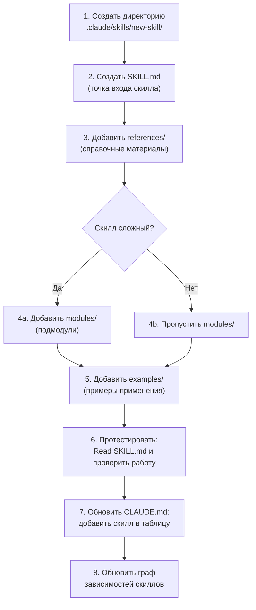

### Step by Step

**Шаг 1.** Создать директорию скилла:
```bash
mkdir -p .claude/skills/new-skill/references/
```

**Шаг 2.** Создать `SKILL.md` -- основной файл скилла. Обязательные секции:
```markdown
# Название скилла

## Роль
Описание, что делает скилл.

## Когда использовать
Условия и контекст применения.

## Инструкции
Пошаговый алгоритм работы.

## Формат вывода
Ожидаемый формат результата.

## Примеры
Ссылки на примеры или встроенные примеры.
```

**Шаг 3.** Добавить справочные материалы в `references/` -- техники, шаблоны, best practices, которые скилл использует.

**Шаг 4.** Для сложных скиллов -- добавить `modules/` с нумерованными подмодулями.

**Шаг 5.** Добавить `examples/` с конкретными примерами применения скилла.

**Шаг 6.** Протестировать: в Claude Code выполнить `Read(".claude/skills/new-skill/SKILL.md")` и проверить, что скилл выдает ожидаемые результаты.

**Шаг 7.** Обновить CLAUDE.md: добавить скилл в таблицу скиллов и граф зависимостей.

**Шаг 8.** Если скилл используется другими скиллами или командами -- обновить граф зависимостей.

### Принципы хорошего скилла

- **Domain-agnostic** -- скилл не должен быть привязан к конкретному домену
- **Самодостаточный** -- все необходимое содержится внутри директории скилла
- **Документированный** -- SKILL.md содержит полные инструкции для использования
- **Тестируемый** -- можно проверить работу скилла изолированно

---

## Admin Flow: Создание новой команды

### Sequence Diagram

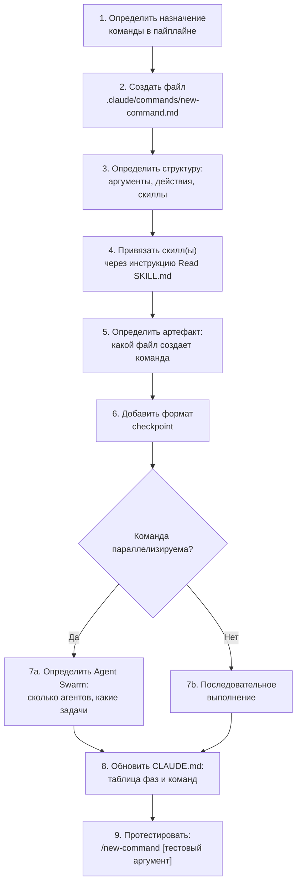

### Step by Step

**Шаг 1.** Определить место команды в пайплайне -- какая фаза, какие входные данные, какой результат.

**Шаг 2.** Создать файл `.claude/commands/new-command.md`. Обязательные секции:
```markdown
# Название команды

## Использование
/new-command [аргументы]

## Аргумент
$ARGUMENTS

## Действия
1. Загрузи скилл: Read(".claude/skills/<skill>/SKILL.md")
2. Прочитай контекст предыдущих фаз
3. Выполни [описание действий]
4. Создай файл [артефакт]
5. Покажи Checkpoint N

## Параллелизация (Agent Swarm)
[Если применимо]
```

**Шаг 3.** Привязать скилл -- указать, какой SKILL.md загружать перед выполнением.

**Шаг 4.** Определить формат артефакта и имя файла в соответствии с `file-conventions` правилом.

**Шаг 5.** Добавить checkpoint в формате из `checkpoint-protocol` правила.

**Шаг 6.** Если команда поддерживает параллелизацию -- описать Agent Swarm: количество агентов, распределение задач, формат синтеза.

**Шаг 7.** Обновить CLAUDE.md: таблицу фаз и список команд.

**Шаг 8.** Протестировать команду с тестовым аргументом.

---

## Admin Flow: Настройка доменных правил

### Sequence Diagram

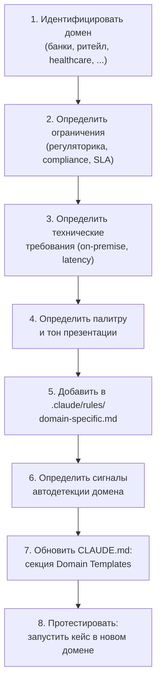

### Step by Step

**Шаг 1.** Идентифицировать домен и его специфику.

**Шаг 2.** Определить ключевые ограничения домена:
```markdown
## Новый Домен
- Регуляторные требования: [ФЗ-..., стандарты]
- Compliance: [что обязательно]
- Технические ограничения: [latency, deployment model]
```

**Шаг 3.** Добавить секцию в `.claude/rules/domain-specific.md`:
```markdown
## Новый Домен
- ALWAYS [обязательное действие]
- ALWAYS reference: [список нормативов]
- HITL [обязателен / рекомендован]
- Palette: [цвета]
- Tone: [стиль]
```

**Шаг 4.** Определить ключевые слова для автодетекции домена (в секции "Detection").

**Шаг 5.** Обновить CLAUDE.md в секции "Domain Templates".

**Шаг 6.** Протестировать: запустить `/casarium` с кейсом в новом домене и проверить, что правила применяются.

### Текущие доменные правила

| Домен | Ключевые правила | Палитра |
|-------|-----------------|---------|
| Банковский / FinTech | On-premise LLM, ФЗ-152, ЦБ, ФСТЭК, HITL обязателен | Blue/Navy/Silver |
| Ритейл / E-commerce | Latency < 200ms, A/B тестирование, privacy | Amber/Orange |
| Enterprise / B2B | Change Management, Legacy интеграции, SLA, ROI в FTE | Teal/Indigo |
| Healthcare | HITL для клинических решений, ФЗ-323, explainability | -- |

---

## Admin Flow: Расширение пайплайна новой фазой

### Sequence Diagram

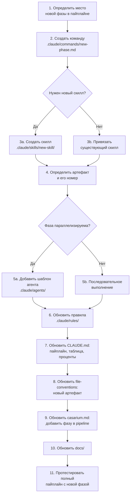

### Step by Step

**Шаг 1.** Определить, где новая фаза находится в pipeline:
```
Phase 0 → Phase 1 → Phase 2 → Phase 2.5 → [НОВАЯ ФАЗА] → Phase 3 → ...
```

**Шаг 2.** Создать файл команды `.claude/commands/new-phase.md` (см. [Admin Flow: Создание новой команды](#admin-flow-создание-новой-команды)).

**Шаг 3.** Создать или привязать скилл.

**Шаг 4.** Определить артефакт: имя файла (с числовым префиксом) и его содержание.

**Шаг 5.** Если фаза поддерживает параллелизацию -- создать шаблон агентов.

**Шаг 6.** Обновить правила в `.claude/rules/`:
- `agent-swarm.md` -- если новая фаза параллелизируема
- `file-conventions.md` -- добавить новый артефакт в структуру
- `checkpoint-protocol.md` -- если нужен особый формат checkpoint

**Шаг 7.** Обновить CLAUDE.md:
- Таблицу фаз
- Pipeline-диаграмму
- Распределение процентов времени
- Tracker артефактов

**Шаг 8.** Обновить `/casarium` команду:
- Добавить новую фазу в pipeline
- Добавить артефакт в tracker

**Шаг 9.** Обновить документацию.

**Шаг 10.** Протестировать полный пайплайн с новой фазой.

### Чеклист расширения

- [ ] Файл команды создан в `.claude/commands/`
- [ ] Скилл создан или привязан
- [ ] Артефакт определен и добавлен в file-conventions
- [ ] Agent Swarm настроен (если нужно)
- [ ] CLAUDE.md обновлен
- [ ] casarium.md обновлен
- [ ] Checkpoint формат определен
- [ ] Полный пайплайн протестирован

---

## Admin Flow: Массовый harvest

### Sequence Diagram

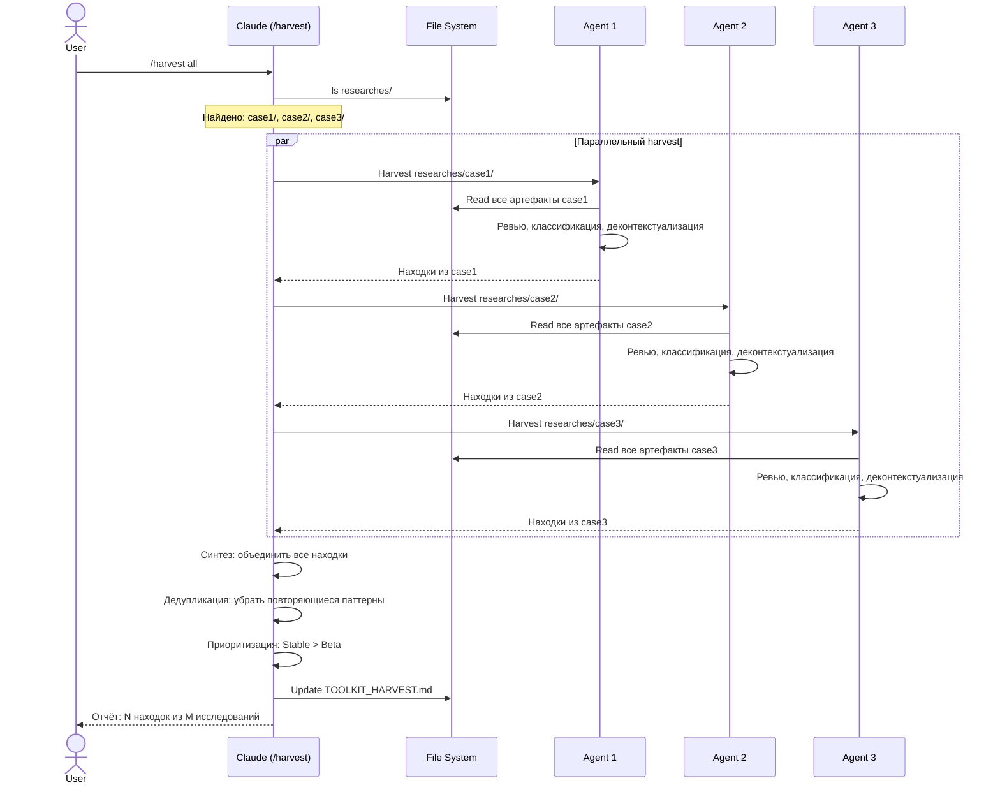

### Step by Step

**Шаг 1.** Запуск массового harvest:
```
User: /harvest all
```

**Шаг 2.** Claude сканирует `researches/` и находит все директории исследований.

**Шаг 3.** Для каждой директории запускается параллельный агент harvest:
- Каждый агент ревьюит своё исследование
- Ищет универсальные паттерны, скиллы, правила, шаблоны
- Классифицирует и деконтекстуализирует находки

**Шаг 4.** Оркестратор синтезирует результаты:
- Объединяет находки из всех исследований
- Дедуплицирует повторяющиеся паттерны
- Приоритизирует: если паттерн встречается в нескольких исследованиях -- повышает maturity

**Шаг 5.** Обновляет `TOOLKIT_HARVEST.md` с полным набором находок.

**Шаг 6.** Выводит отчет пользователю:
```
═══════════════════════════════════════════════════════
Harvest Complete: 3 исследования обработаны

| Категория  | Найдено | Новых | Обновлено |
|-----------|---------|-------|-----------|
| skills/    | 2       | 1     | 1         |
| commands/  | 1       | 1     | 0         |
| rules/     | 3       | 2     | 1         |
| templates/ | 2       | 0     | 2         |
| patterns/  | 4       | 3     | 1         |
| snippets/  | 1       | 1     | 0         |

TOOLKIT_HARVEST.md обновлён
═══════════════════════════════════════════════════════
```

---

## Error Flows

### Error Flow 1: Research не находит данных

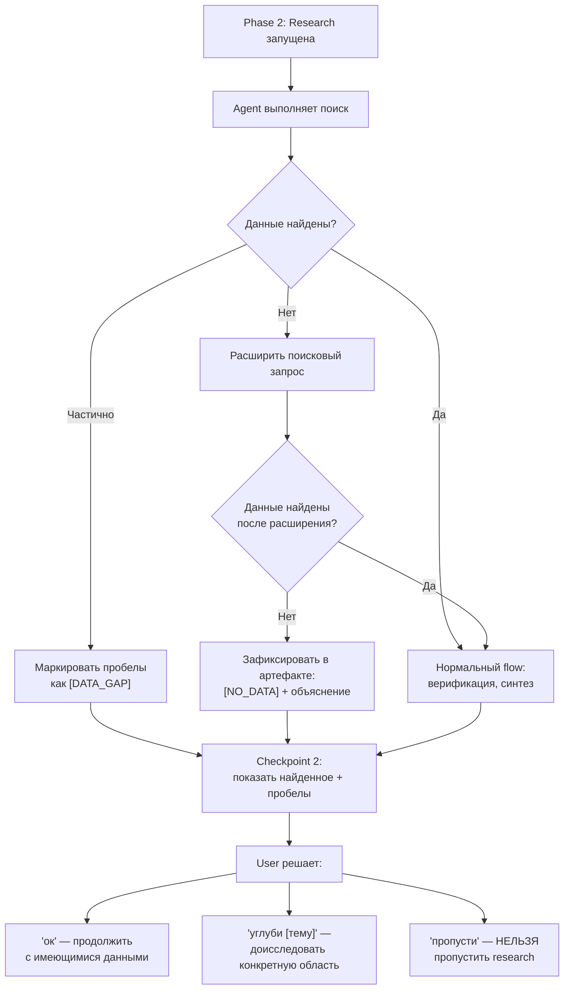

**Принципы обработки:**
- Research **никогда не пропускается** -- даже при отсутствии данных фиксируется сам факт отсутствия
- PARANOID mode: лучше `[NO_DATA]`, чем непроверенное утверждение
- Пробелы маркируются явно -- это ценная информация для последующих фаз
- Пользователь всегда информируется о состоянии данных на checkpoint

---

### Error Flow 2: Пользователь пропускает CJM (блокировка)

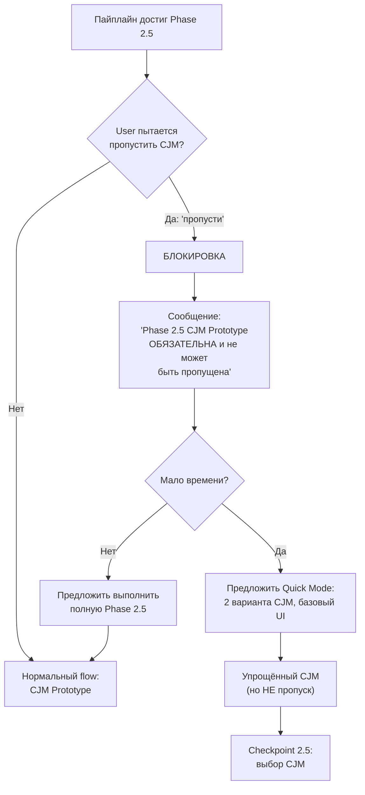

**Принципы обработки:**
- Phase 2.5 (CJM Prototype) -- **абсолютно обязательна**
- Правило `anti-patterns.md` автоматически блокирует попытку пропуска
- При нехватке времени предлагается Quick Mode: 2 варианта вместо 4, базовый UI
- `{CHOSEN_CJM}` **должен быть зафиксирован** перед Phase 3 -- без него последующие фазы не могут выполниться корректно

---

### Error Flow 3: Agent timeout

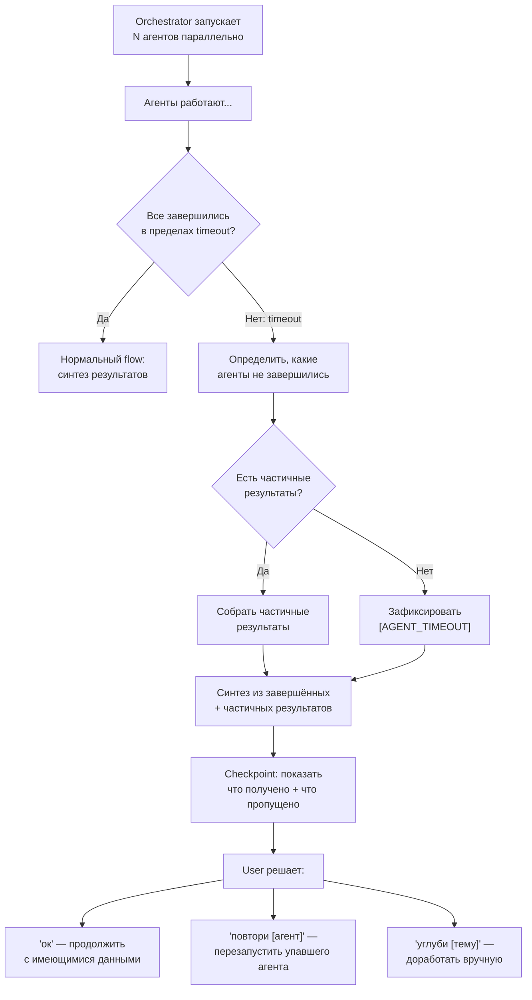

**Принципы обработки:**
- Timeout одного агента **не блокирует** остальных -- завершившиеся агенты возвращают результаты
- Частичные результаты **используются** -- лучше часть данных, чем ничего
- Пользователь информируется, какие данные получены, а какие пропущены
- Возможен перезапуск конкретного упавшего агента
- Timeout маркируется в артефакте как `[AGENT_TIMEOUT: <описание>]`

### Сводная таблица обработки ошибок

| Ошибка | Блокирует ли пайплайн | Действие |
|--------|----------------------|----------|
| Research не нашёл данных | Нет | `[NO_DATA]` + продолжить |
| Пропуск Phase 2.5 | Да | Блокировка, предложить Quick Mode |
| Пропуск Executive Summary | Да | Блокировка, обязательно создать |
| Agent timeout | Нет | Частичные результаты + уведомление |
| Нет артефактов предыдущих фаз | Да | Предложить выполнить пропущенные фазы |
| Anti-pattern обнаружен | Нет (предупреждение) | Флаг + автоматическое исправление |
| "Just add GPT" в решении | Нет (предупреждение) | Запросить конкретные модели + pipeline |
| Непроверенное утверждение | Нет (маркировка) | `[UNVERIFIED]` + флаг |

---

## User Flow: BTO — Build-Test-Optimize

### Sequence Diagram

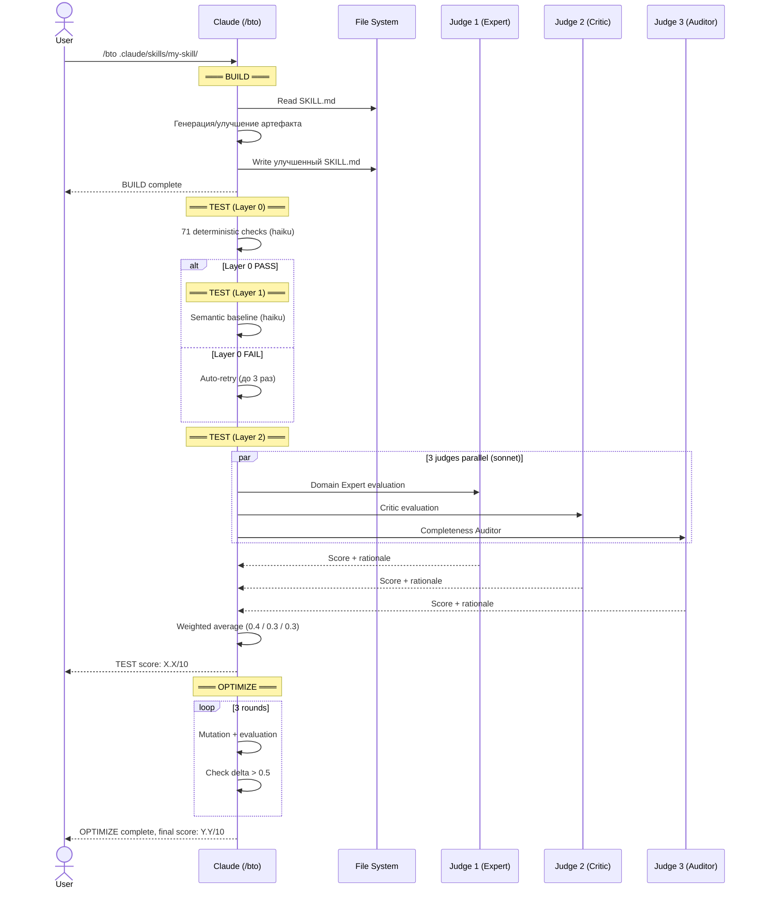

### Step by Step

**Шаг 1.** Запуск BTO:
```
/bto .claude/skills/my-skill/
```

**Шаг 2.** BUILD — генерация или улучшение артефакта.

**Шаг 3.** TEST — 3-уровневая оценка:
- Layer 0: структурные проверки (haiku)
- Layer 1: семантический базовый уровень (haiku)
- Layer 2: панель из 3 судей (sonnet), работают изолированно

**Шаг 4.** OPTIMIZE — эволюционная оптимизация за 3 раунда. Останавливается при delta ≤ 0.5 три раза подряд.

---

## User Flow: Feature ADR

### Sequence Diagram

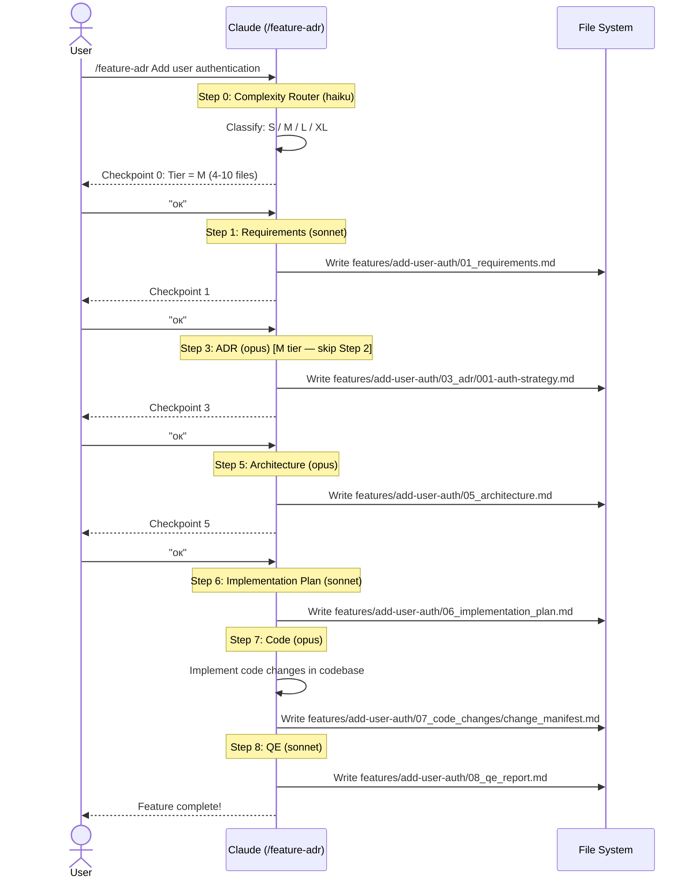

### Complexity Tiers

| Tier | Scope | Шаги |
|------|-------|------|
| **S** | 1-3 файла, 1 домен | 0→1→6→7→8 |
| **M** | 4-10 файлов, 1-2 домена | 0→1→3→5→6→7→8 |
| **L** | 11-30 файлов, 2-4 домена | Полный pipeline |
| **XL** | 30+ файлов, cross-cutting | Full DAG + multi-agent |

---

## User Flow: Background Workers

### Sequence Diagram

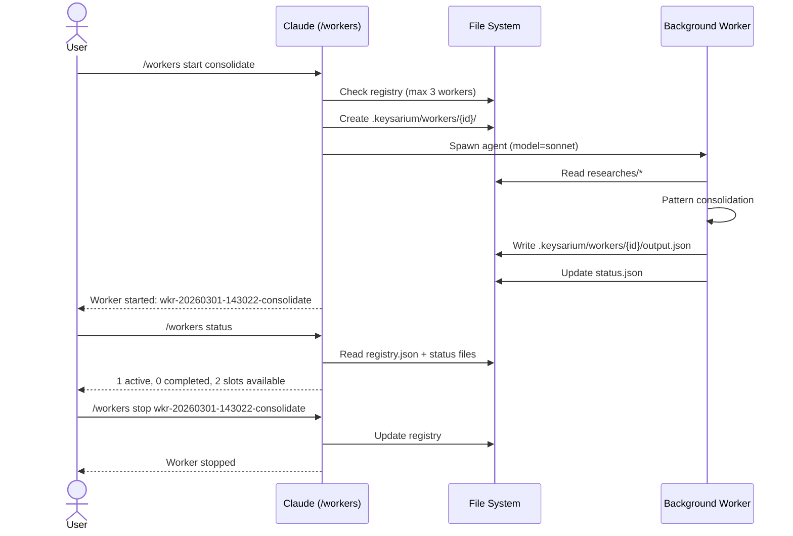

### Типы воркеров

| Тип | Модель | Назначение |
|-----|--------|-----------|
| `consolidate` | sonnet | Консолидация паттернов из исследований |
| `health-check` | haiku | Проверка здоровья системы |
| `export-brain` | haiku | Фоновый экспорт знаний |
| `dream-cycle` | sonnet | Dream cycle (concept graph + insights) |

---

## User Flow: Dream Cycles

### Sequence Diagram

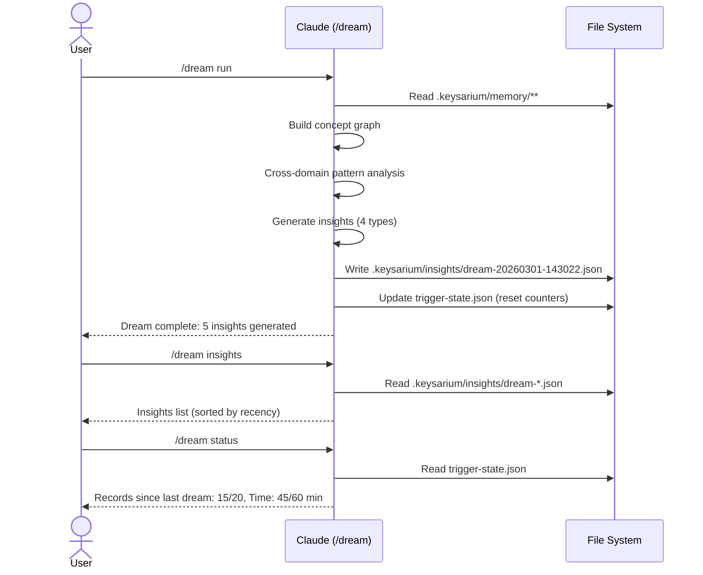

### Типы инсайтов

| Тип | Пример |
|-----|--------|
| Performance | "Phase 2 takes 2x longer for banking domain" |
| Effectiveness | "TRIZ produces higher scores than Game Theory for retail" |
| Preference | "CJM Variant B selected in 70% of enterprise cases" |
| Anti-pattern | "Phase 5 consistently gets rework when HITL skipped in Phase 3" |

---

## User Flow: Brain Export/Import

### Sequence Diagram

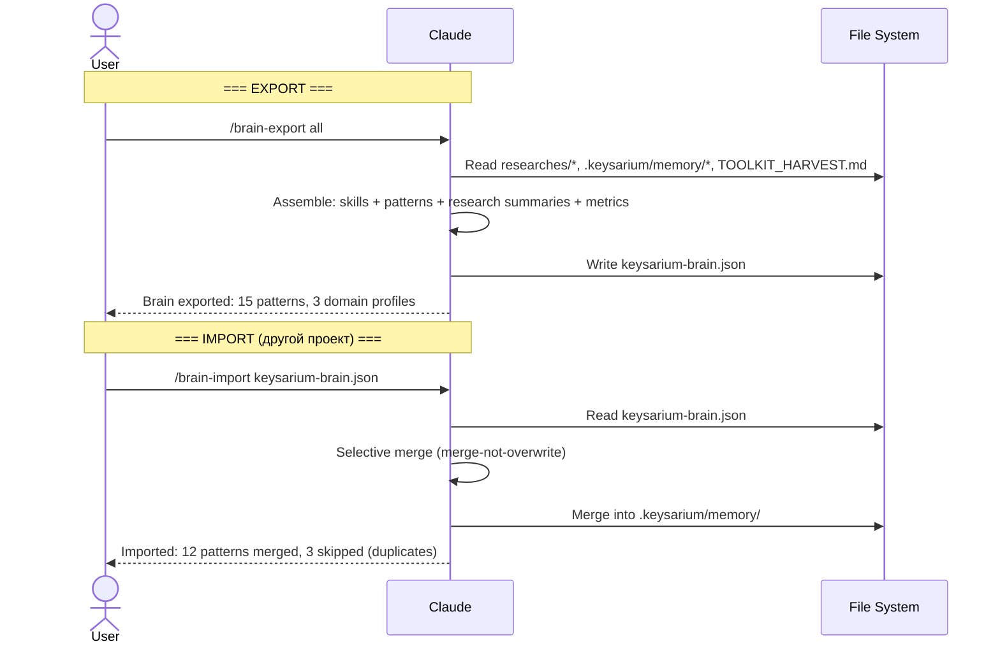
