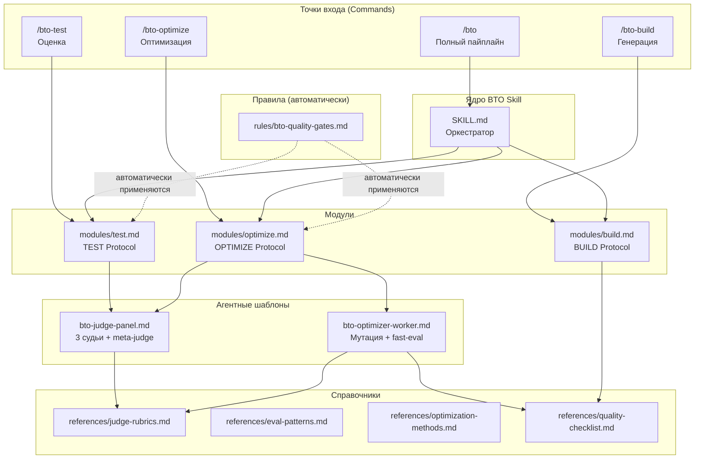
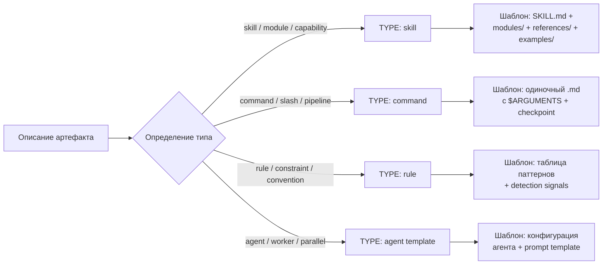
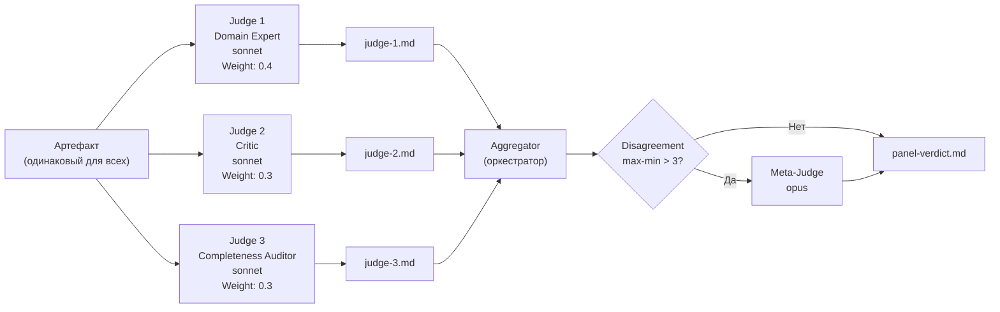
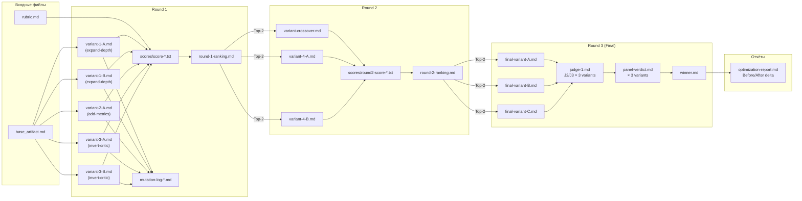
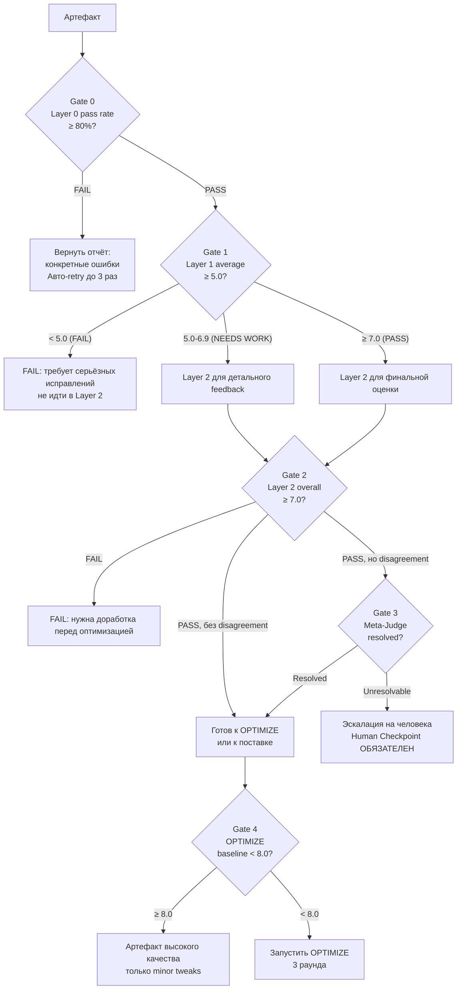

# 05. Архитектура @dzhechkov/skills-bto

> **`/bto*` commands are NOT part of @dzhechkov/keysarium.** The BTO evaluator
> (Build-Benchmark-Test-Optimize) ships as a SEPARATE npm package. Install it first —
> `npx @dzhechkov/skills-bto init` — otherwise every `/bto…` command referenced below will
> not resolve in your project.


## Содержание

1. [Обзор системы и философия проектирования](#обзор-системы-и-философия-проектирования)
2. [Компоненты системы](#компоненты-системы)
3. [MODULE: BUILD](#module-build)
4. [MODULE: TEST](#module-test)
5. [MODULE: OPTIMIZE](#module-optimize)
6. [Agent Swarm архитектура](#agent-swarm-архитектура)
7. [Диаграммы потоков данных](#диаграммы-потоков-данных)
8. [Архитектура quality gates](#архитектура-quality-gates)
9. [Система обнаружения anti-patterns](#система-обнаружения-anti-patterns)
10. [Интеграция с Keysarium](#интеграция-с-keysarium)
11. [Расширяемость системы](#расширяемость-системы)
12. [Проектные решения и компромиссы](#проектные-решения-и-компромиссы)

---

## Обзор системы и философия проектирования

`@dzhechkov/skills-bto` — это **Build-Benchmark-Test-Optimize (BTO)** скилл-пак для Claude Code, реализующий полный цикл создания, бенчмаркинга, оценки и итеративного улучшения Claude Code артефактов. Система работает как standalone-инструмент и как интегрированный компонент пайплайна `@dzhechkov/keysarium`.

### Фундаментальная идея

Промпт-инжиниринговые задачи имеют четыре отдельных фазы с принципиально разными требованиями:

```
BUILD               BENCHMARK           TEST                OPTIMIZE
──────              ─────────           ────                ────────
Генерация           Бенчмаркинг         Оценка              Улучшение
Требует:            Требует:            Требует:            Требует:
• Творчество        • Golden samples    • Объективность     • Управляемые мутации
• Структуру         • Детерм. тесты     • Разные точки зр.  • Быструю итерацию
• Domain знание     • Consistency probe  • Экспертные судьи  • Отбор лучших вариантов
```

BTO изолирует эти четыре режима в отдельные модули с чёткими контрактами на входе и выходе. Модули можно запускать независимо или последовательно как пайплайн.

### Ключевые принципы проектирования

**1. Layered Evaluation (иерархическая оценка)**
Дорогая LLM-оценка применяется только к артефактам, прошедшим дешёвые фильтры. Layer 0 (детерминистические проверки) отсеивает большинство очевидных проблем бесплатно. Только артефакты, прошедшие Layer 0 и Layer 1, получают полную панель из трёх судей Layer 2.

**2. Judge Isolation (изоляция судей)**
Ни один судья не видит оценки других судей до момента агрегации. Это предотвращает конформизм — феномен, при котором один агент адаптирует своё мнение к мнению группы, снижая ценность мульти-агентной оценки.

**3. Strategy-Driven Mutation (направленная мутация)**
Вместо случайных мутаций BTO использует именованные стратегии (`expand-depth`, `invert-critic`, `add-metrics` и др.), которые выбираются на основе слабых измерений из последней оценки. Это ускоряет сходимость и делает изменения интерпретируемыми.

**4. Cost-Bounded Execution (ограниченный бюджет)**
Каждая операция имеет явную стоимостную модель. Haiku используется для быстрых промежуточных оценок, Sonnet — для панели судей, Opus — только для crossover и meta-judge. Жёсткий лимит в 3 раунда (15 оценок) предотвращает неконтролируемые расходы.

**5. Artifact-Type Agnosticism (независимость от типа артефакта)**
Система работает с любым текстовым артефактом через настраиваемые rubrics и structure specs. Встроенная поддержка: skills, commands, rules, agent templates, research artifacts.

---

## Компоненты системы

### Текстовая карта компонентов

```
@dzhechkov/skills-bto
├── SKILL.md                         ← Точка входа, оркестратор пайплайна
│
├── modules/                         ← Три основных модуля
│   ├── build.md                     ← MODULE 1: Генерация артефактов
│   ├── test.md                      ← MODULE 2: Мульти-агентная оценка
│   └── optimize.md                  ← MODULE 3: Эволюционная оптимизация
│
├── references/                      ← Справочные материалы
│   ├── eval-patterns.md             ← Паттерны мульти-агентной оценки
│   ├── optimization-methods.md      ← Обзор методов оптимизации промптов
│   ├── judge-rubrics.md             ← Рубрики для судей
│   └── quality-checklist.md         ← Детерминистические чеклисты
│
└── examples/                        ← Примеры выходных артефактов
    └── sample-eval-report.md        ← Формат отчёта об оценке
```

```
.claude/agents/                      ← Шаблоны агентов-воркеров
├── bto-judge-panel.md               ← Панель из 3 судей + meta-judge
└── bto-optimizer-worker.md          ← Воркеры мутации + haiku fast-eval
```

```
.claude/commands/                    ← Slash-команды (точки входа)
├── bto.md                           ← /bto — полный пайплайн
├── bto-build.md                     ← /bto-build — генерация
├── bto-test.md                      ← /bto-test — оценка
└── bto-optimize.md                  ← /bto-optimize — оптимизация
```

```
.claude/rules/
└── bto-quality-gates.md             ← Автоматически применяемые quality gates
```

### Mermaid-диаграмма компонентов



---

## MODULE: BUILD

### Назначение

Генерация production-качества Claude Code артефактов (skills, commands, rules, agent templates) из описания на естественном языке.

### Архитектура обнаружения типа



### Два режима: QUICK и DEEP

| Режим | Когда использовать | Агенты | Время | Процесс |
|-------|-------------------|--------|-------|---------|
| QUICK | Простой артефакт, чёткие требования | 1 | ~2 мин | Прямая генерация из описания |
| DEEP | Сложный скилл, неясные требования | 1 + explore | ~5 мин | Кларификация через `explore` скилл → requirements brief → подтверждение → генерация |

### Шаблонная система

Каждый тип артефакта имеет строгий шаблон с обязательными секциями:

#### Скилл (обязательные секции)
```
# [Name]           ← Заголовок
## Overview        ← Назначение и область применения
## Quick Start     ← Быстрый старт (команды/вызовы)
## Protocol        ← Пошаговый протокол исполнения
##   Step 1: ...
##   Step N: ...
## Output Format   ← Формат выходных артефактов
## Anti-Patterns   ← Известные ошибки + способы устранения
## Dependencies    ← Зависимости от других скиллов/файлов
```

#### Команда (обязательные секции)
```
# /command-name — Description
## Usage           ← Синтаксис вызова
## Parameters      ← $ARGUMENTS и другие параметры
## Protocol        ← Логика исполнения
## Checkpoint      ← Баннер чекпоинта (обязательно)
```

#### Правило (обязательные секции)
```
# Rule Name
## Patterns        ← Таблица: Pattern | Detection Signal | Required Fix
## Auto-Detection  ← Инструкция по автоматическому применению
```

### Self-Review после генерации (4-уровневая проверка)

Перед выводом артефакта модуль BUILD выполняет самопроверку:

```
1. Structure check:   обязательные секции присутствуют, нет пустых секций
2. Content check:     нет generic/placeholder контента, специфичен для домена
3. Convention check:  kebab-case имена файлов, правильная иерархия заголовков
4. Size check:        SKILL.md: 2KB-30KB, Module: 1KB-15KB, Reference: 500B-10KB
```

Если любой чек не проходит → артефакт корректируется до вывода (Layer 0 inline check).

### Anti-Patterns модуля BUILD

| Anti-Pattern | Сигнал обнаружения | Обязательное исправление |
|-------------|--------------------|-----------------------|
| Generic skill | Нет domain-specific терминов | Добавить доменный контекст и ограничения |
| Missing references | Директория references/ пуста | Добавить минимум один reference файл |
| No examples | Директория examples/ пуста | Добавить минимум один few-shot пример |
| Over-scoped | SKILL.md > 30KB | Разбить на модули |
| Under-specified | SKILL.md < 2KB | Расширить деталями |
| Copy-paste | Идентичен другому скиллу | Адаптировать уникально |
| Missing anti-patterns | Секция Anti-Patterns отсутствует | Добавить типичные failure modes |
| No output format | Не описан ожидаемый выход | Добавить явную секцию Output Format |

---

## MODULE: TEST

### Назначение

Оценка любого Claude Code артефакта через четырёхуровневую иерархическую схему: от детерминистических проверок до полной мульти-агентной панели судей.

### Четырёхслойная архитектура

```
┌─────────────────────────────────────────────────────────────────┐
│  Layer 0: Deterministic Pre-checks                              │
│  Стоимость: 0 (нет LLM вызовов)   Скорость: мгновенно          │
│  Универсальные + Type-specific проверки (10-15 чеков)           │
│  Gate: ≥ 80% passed → продолжение                               │
└──────────────────────────┬──────────────────────────────────────┘
                           │ PASS
                           ▼
┌─────────────────────────────────────────────────────────────────┐
│  Layer 1: Single LLM Judge (Quick)                              │
│  Стоимость: ~$0.001   Модель: haiku   Скорость: ~10 сек        │
│  5 измерений: CLARITY, COMPLETENESS, ACTIONABILITY,             │
│               QUALITY, ANTI-PATTERNS                            │
│  Gate: Average ≥ 7.0 → PASS; 5.0-6.9 → NEEDS WORK; <5.0 → FAIL│
└──────────────────────────┬──────────────────────────────────────┘
                           │ PASS или NEEDS WORK
                           ▼
┌─────────────────────────────────────────────────────────────────┐
│  Layer 2: Full Judge Panel (3 Agents)                           │
│  Стоимость: ~$0.01   Модели: sonnet×3   Скорость: ~30 сек      │
│  Параллельно: Expert (0.4) || Critic (0.3) || Auditor (0.3)    │
│  5 измерений: METHODOLOGY, DEPTH, CORRECTNESS, USABILITY,      │
│               ROBUSTNESS                                        │
│  Disagreement detection: если max-min > 3 → Layer 3            │
└──────────────────────────┬──────────────────────────────────────┘
                           │ Disagreement > 3 на любом измерении
                           ▼
┌─────────────────────────────────────────────────────────────────┐
│  Layer 3: Meta-Judge (Disagreement Resolution)                  │
│  Стоимость: ~$0.05   Модель: opus   Скорость: ~20 сек          │
│  Читает все 3 оценки, выносит финальный вердикт                 │
│  Если неразрешимо → эскалация на человека                       │
└─────────────────────────────────────────────────────────────────┘
```

### Layer 0: Детерминистические проверки

Layer 0 полностью детерминирован и не требует LLM. Проверки разбиты на универсальные (для всех типов) и type-specific.

**Универсальные проверки (CHECK-U1..U5):**
```
CHECK-U1: Файл существует и не пуст
CHECK-U2: Валидный UTF-8 текст
CHECK-U3: Минимум один markdown заголовок (#)
CHECK-U4: Не более 2 последовательных пустых строк
CHECK-U5: Размер файла в допустимых пределах
```

**Skill-специфичные проверки (CHECK-S1..S10):**
```
CHECK-S1:  SKILL.md существует в директории скилла
CHECK-S2:  Первый заголовок — # Title
CHECK-S3:  Секция ## Overview или ## Purpose присутствует
CHECK-S4:  Секция ## Anti-Patterns присутствует
CHECK-S5:  Все файлы в modules/ упомянуты в SKILL.md
CHECK-S6:  Все файлы в references/ упомянуты в SKILL.md
CHECK-S7:  Нет пустых секций (heading → следующий heading без контента)
CHECK-S8:  Размер: 1KB < SKILL.md < 50KB
CHECK-S9:  Общий размер директории < 200KB
CHECK-S10: Минимум один файл в references/ ИЛИ examples/
```

**Command-специфичные проверки (CHECK-C1..C5):**
```
CHECK-C1: Содержит "$ARGUMENTS" или ссылку на параметр
CHECK-C2: Содержит checkpoint баннер или протокол
CHECK-C3: Инструкция загрузки скилла (Read *.SKILL.md)
CHECK-C4: Размер: 500B < файл < 20KB
CHECK-C5: Секция ## Usage или ## Protocol присутствует
```

**Rule-специфичные проверки (CHECK-R1..R4):**
```
CHECK-R1: Таблица или структурированный список паттернов
CHECK-R2: Каждый паттерн имеет detection signal и fix
CHECK-R3: Размер: 200B < файл < 10KB
CHECK-R4: Секция "Auto-Detection" или аналог присутствует
```

**Agent template-специфичные проверки (CHECK-A1..A4):**
```
CHECK-A1: Указана модель (haiku/sonnet/opus)
CHECK-A2: Указан scope изоляции (что читает, что пишет)
CHECK-A3: Шаблон промпта или инструкции присутствуют
CHECK-A4: Размер: 200B < файл < 10KB
```

### Layer 1: Quick Judge (haiku)

Один haiku агент оценивает артефакт по 5 измерениям:

| Измерение | Вопрос для оценки |
|-----------|-------------------|
| CLARITY | Инструкции однозначны? LLM может следовать им точно? |
| COMPLETENESS | Все необходимые секции присутствуют? |
| ACTIONABILITY | Может ли Claude произвести конкретный вывод из этих инструкций? |
| QUALITY | Хорошо структурировано? Профессионально оформлено? |
| ANTI-PATTERNS | Избегает известных ловушек? Есть покрытие failure modes? |

**Пороги:**
- Average ≥ 7.0: **PASS**
- Average 5.0–6.9: **NEEDS WORK** (можно перейти к Layer 2 для детального feedback)
- Average < 5.0: **FAIL** (требует исправления перед продолжением)

### Layer 2: Full Judge Panel (3 Agents параллельно)

Три агента-судьи работают параллельно. Ключевое ограничение: **нет межсудейской коммуникации до момента агрегации**.

#### Архитектура изоляции судей



#### Профили судей

**Judge 1 — Domain Expert (Weight: 0.4)**

Самый высокий вес. Фокус: техническая корректность и применимость в домене.

```
Критерии оценки:
• Domain accuracy:      Корректны ли утверждения для данной области?
• Technical depth:      Адресует ли артефакт неочевидные аспекты?
• Practical applicability: Можно ли использовать артефакт «как есть»?

Калибровка:
• 9-10: зарезервировано для исключительно качественных работ
• 7-8:  хорошее качество с незначительными улучшениями
• 5-6:  приемлемо, но требует доработки
• 1-4:  серьёзные проблемы
```

**Judge 2 — Critic (Weight: 0.3)**

Намеренно строгий. Инструктирован снижать оценки при наличии сомнений.

```
Критерии оценки:
• Logical consistency:  Нет внутренних противоречий?
• Verifiability:        Утверждения трассируемы к источникам или помечены [ANALYSIS]?
• Anti-pattern absence: Нет запрещённых паттернов из bto-quality-gates.md?

Калибровка:
• При обнаружении anti-pattern — кап критерия на уровне 5
• "Если сомневаешься — снижай оценку"
• Средняя оценка Critic должна быть ~5-6 (строгая калибровка)
```

**Judge 3 — Completeness Auditor (Weight: 0.3)**

Фокус: структурная полнота и целостность перекрёстных ссылок.

```
Критерии оценки:
• Section coverage:    Все обязательные секции присутствуют и не пусты?
• Depth per section:   Каждая секция достаточно глубокая (не stub)?
• Edge cases addressed: Упомянуты ли граничные условия и failure modes?

Калибровка:
• -2 очка за каждую отсутствующую обязательную секцию
• -1 очко за каждую stub-секцию (< 3 содержательных предложений)
```

### Агрегация оценок

```
Per-dimension score = Expert[dim] × 0.4 + Critic[dim] × 0.3 + Auditor[dim] × 0.3
Overall score       = mean(METHODOLOGY, DEPTH, CORRECTNESS, USABILITY, ROBUSTNESS)
```

**Обнаружение разногласий:**
```
Для каждого измерения:
  Если max(J1, J2, J3) - min(J1, J2, J3) > 3 → FLAG → эскалация на Meta-Judge
```

### Layer 3: Meta-Judge (Разрешение разногласий)

Meta-Judge вызывается только при обнаруженных разногласиях. Использует Opus для максимального уровня рассуждений.

**Входные данные:**
- Все 3 файла оценок (judge-1.md, judge-2.md, judge-3.md)
- Сам артефакт
- Рубрика оценки

**Задача Meta-Judge:**
1. Определить источник разногласия (неоднозначность критерия, реальный спор о качестве, или bias конкретного судьи)
2. Вынести примирённую оценку с явным обоснованием
3. Указать, чья точка зрения была наиболее валидной
4. Если разногласие неразрешимо — флагировать для человека

### Формат отчёта Layer 2

```
═══════════════════════════════════════════════════════
📊 BTO EVALUATION REPORT
Artifact: <path>
Type: <type>
Level: Layer 0 + Layer 1 + Layer 2

OVERALL SCORE: X.X / 10  [PASS / NEEDS WORK / FAIL]

Per-Dimension:
  METHODOLOGY:  X.X  ██████████░░
  DEPTH:        X.X  ████████░░░░
  CORRECTNESS:  X.X  █████████░░░
  USABILITY:    X.X  ██████████░░
  ROBUSTNESS:   X.X  ███████░░░░░

Flagged: [измерения с разногласием > 3]

Top Improvements:
1. ...
2. ...
3. ...
═══════════════════════════════════════════════════════
```

---

## MODULE: OPTIMIZE

### Назначение

Итеративное улучшение Claude Code артефактов через эволюционный цикл: мутация → оценка → отбор → crossover → повторение.

### Теоретическая основа: адаптация EvoPrompt

BTO OPTIMIZE основан на EvoPrompt (Guo et al., 2023 — "Connecting Large Language Models with Evolutionary Algorithms"), адаптированном для структурированных документов:

| EvoPrompt (оригинал) | BTO OPTIMIZE (адаптация) |
|---------------------|--------------------------|
| Случайная инициализация популяции | 5 направленных мутаций (strategy-driven) |
| Обобщённые мутации | Именованные стратегии (Rephrase / Restructure / Add Constraints / Simplify / Specialize) |
| Случайный crossover | Crossover по силам (секционный уровень) |
| Метрика точности на датасете | Оценки панели судей (мульти-измерение) |
| Многие поколения | 3 раунда (ограниченный бюджет) |

### Предусловия для запуска OPTIMIZE

1. Артефакт должен пройти Layer 0 (запуск TEST первым)
2. Базовая оценка Layer 2 установлена
3. **Только если baseline < 8.0** — артефакты с baseline ≥ 8.0 уже высокого качества

### Протокол трёх раундов

```
┌──────────────────────────────────────────────────────────────────┐
│  ROUND 0: Baseline                                               │
│  TEST (Layer 2) на текущем артефакте                             │
│  → Определить target dimensions (score < 7.0)                   │
└──────────────────────────────────┬───────────────────────────────┘
                                   │
                                   ▼
┌──────────────────────────────────────────────────────────────────┐
│  ROUND 1: Mutation + Fast Eval                                   │
│  5 воркеров × 1 мутация → 5 вариантов                           │
│  5 haiku агентов параллельно → быстрые оценки                   │
│  Отбор Top-2                                                     │
└──────────────────────────────────┬───────────────────────────────┘
                                   │ Top-2
                                   ▼
┌──────────────────────────────────────────────────────────────────┐
│  ROUND 2: Crossover + Fast Eval                                  │
│  Top-2 → crossover → 3 новых варианта                           │
│  3 haiku агента параллельно → быстрые оценки                    │
│  Отбор Top-2                                                     │
└──────────────────────────────────┬───────────────────────────────┘
                                   │ Top-2
                                   ▼
┌──────────────────────────────────────────────────────────────────┐
│  ROUND 3 (FINAL): Crossover + Full Panel                         │
│  Top-2 → crossover → 3 финальных варианта                       │
│  3 варианта × Layer 2 (полная панель)  ← используем sonnet!     │
│  Выбор победителя                                                │
└──────────────────────────────────────────────────────────────────┘
```

### Стратегии мутации

| Стратегия | Описание | Когда применять |
|-----------|----------|----------------|
| `expand-depth` | Добавить конкретные примеры, edge cases, неочевидные детали | Тонкие секции, низкий DEPTH |
| `compress-clarity` | Убрать избыточность, улучшить сигнал/шум, сжать язык | Многословные артефакты, низкий CLARITY |
| `reframe-domain` | Переформулировать контент через другую доменную линзу | Обобщённые утверждения, низкий CORRECTNESS |
| `add-metrics` | Заменить расплывчатые утверждения количественными | Абстрактные рекомендации без цифр |
| `invert-critic` | Напрямую адресовать blocking issues от Critic | Низкая оценка Critic |
| `fill-gaps` | Расширить отсутствующие или stub-секции | Низкая оценка Auditor |
| `crossover` | Объединить лучшие элементы двух вариантов | Финальный раунд, поздняя стадия |

### Маппинг стратегий на слабые измерения

| Слабое измерение | Основная стратегия | Вторичная стратегия |
|-----------------|-------------------|-------------------|
| METHODOLOGY | Restructure → reframe-domain | add-metrics |
| DEPTH | expand-depth | fill-gaps |
| CORRECTNESS | add-metrics | reframe-domain |
| USABILITY | compress-clarity | fill-gaps |
| ROBUSTNESS | expand-depth + edge cases | invert-critic |

### Архитектура воркеров мутации

**Standard Round: 3 воркера (sonnet)**
```
Worker 1: strategy="expand-depth",    variants=2
Worker 2: strategy="add-metrics",     variants=1
Worker 3: strategy="invert-critic",   variants=2
```

**Crossover Round: 2 воркера**
```
Worker 1: strategy="crossover",       model=opus  (требует creative synthesis)
Worker 2: strategy="compress-clarity",model=sonnet
```

### Inline Layer 0 Self-Check в воркерах

Каждый воркер перед сохранением варианта выполняет inline-проверку:

```
- [ ] Все обязательные секции присутствуют
- [ ] Нет placeholder-контента: [TODO], [TBD], <INSERT>, ???
- [ ] Длина в допустимых пределах: MIN_TOKENS < длина < MAX_TOKENS
- [ ] Нет самоцитирования (вариант не ссылается сам на себя)
- [ ] Мутация содержательна (diff от базы > 10% контента)
```

Если проверка не проходит → логировать причину в mutation-log, пропустить вариант.

### Crossover Protocol

Crossover выполняется Opus агентом и использует strength-based подход:
- Секции, где Variant A имеет более высокий score → брать из A
- Секции, где Variant B имеет более высокий score → брать из B
- Противоречия разрешаются явно

```
Агент Crossover получает:
• Variant A (score: X) + evaluation A
• Variant B (score: Y) + evaluation B
• Инструкцию: что взять из A, что из B
• Инструкцию: разрешить все противоречия явно
• Ограничение: выдать ПОЛНЫЙ артефакт (не diff)
```

### Условия сходимости и аварийного останова

| Условие | Действие |
|---------|---------|
| Delta ≤ 0.5 в 3 последовательных раундах | Объявить сходимость, остановить |
| Regression > 1.0 от baseline | Откат к предыдущему лучшему, логирование |
| Любой раунд показывает общую регрессию > 0.5 | Немедленный останов |
| Layer 0 fail rate > 50% в одном раунде | Остановиться, требуется human review |
| Количество раундов > 10 | Прерывание, сдать лучший найденный |
| Количество haiku оценок > 50 в сессии | Предупреждение, продолжение только с одобрения |
| Crossover score < оба родителя | Отбросить crossover, оставить лучшего родителя |

### Стоимостная модель одного полного цикла OPTIMIZE

| Операция | Количество | Модель | Оценка токенов |
|---------|-----------|--------|----------------|
| Baseline eval | 1 | sonnet × 3 | ~15K |
| Variant generation (Round 1) | 5 | opus | ~25K |
| Round 1 fast eval | 5 | haiku | ~10K |
| Crossover generation (Round 2) | 3 | opus | ~15K |
| Round 2 fast eval | 3 | haiku | ~6K |
| Crossover generation (Round 3) | 3 | opus | ~15K |
| Round 3 full panel | 3 | sonnet × 3 | ~45K |
| **Итого** | | | **~131K токенов** |

---

## Agent Swarm архитектура

### Паттерны параллельного исполнения

BTO использует три паттерна параллельного исполнения агентов:

**Паттерн 1: Параллельная панель судей (Layer 2)**
```
Артефакт ──┬──→ Judge 1 (Expert, sonnet)  ──┐
           ├──→ Judge 2 (Critic, sonnet)   ──┼──→ Aggregator → Verdict
           └──→ Judge 3 (Auditor, sonnet)  ──┘
```
Время: ~30 сек (параллельно вместо ~90 сек последовательно)

**Паттерн 2: Параллельные воркеры мутации**
```
Base Artifact ──┬──→ Worker 1 (expand-depth)   ──→ Variant 1-A, 1-B
               ├──→ Worker 2 (add-metrics)     ──→ Variant 2-A
               └──→ Worker 3 (invert-critic)   ──→ Variant 3-A, 3-B
```

**Паттерн 3: Параллельная haiku fast-eval**
```
Variant 1-A ──→ haiku eval ──→ score-1-A.txt  ┐
Variant 1-B ──→ haiku eval ──→ score-1-B.txt  │
Variant 2-A ──→ haiku eval ──→ score-2-A.txt  ├──→ Ranking → Top-K
Variant 3-A ──→ haiku eval ──→ score-3-A.txt  │
Variant 3-B ──→ haiku eval ──→ score-3-B.txt  ┘
```

### Модельная матрица

| Роль | Модель | Обоснование |
|------|--------|-------------|
| Layer 0 проверки | None (детерм.) | Бесплатно, мгновенно |
| Layer 1 Quick Judge | haiku | Дёшево, быстро, достаточно для направления |
| Layer 2 Domain Expert | sonnet | Domain knowledge + тонкая оценка |
| Layer 2 Critic | sonnet | Adversarial analysis, pattern detection |
| Layer 2 Completeness Auditor | sonnet | Структурная проверка |
| Layer 3 Meta-Judge | opus (default) | Только при разногласии, требует рассуждения |
| Mutation Workers | sonnet | Требует reasoning об улучшениях |
| Crossover Worker | opus (default) | Творческий синтез лучших элементов |
| Fast-Eval Agents | haiku | Объёмное ранжирование перед full panel |

### Стратегия именования агентов

Единообразная система именования для отслеживания:
```
"BTO Judge 1 — Domain Expert"
"BTO Judge 2 — Critic"
"BTO Judge 3 — Completeness Auditor"
"BTO Meta-Judge"
"BTO Optimizer — expand-depth"
"BTO Optimizer — invert-critic"
"BTO Layer 1 Fast Eval — variant-2-A"
"BTO Crossover"
```

### Anti-conformity меры

Предотвращение конформизма судей (когда все агенты сходятся к одному мнению):

1. **Role Differentiation** — у каждого судьи уникальный фокус и калибровка
2. **Critic Calibration** — Critic намеренно инструктирован давать средние оценки ~5-6
3. **Independent Evaluation** — ни один судья не видит оценки других до агрегации
4. **Disagreement as Signal** — высокое разногласие сигнализирует о важных измерениях качества
5. **Diverse Prompts** — каждый судья получает по-разному сформулированный оценочный промпт

---

## Диаграммы потоков данных

### Полный BTO пайплайн (BUILD → BENCHMARK → TEST → OPTIMIZE)

```mermaid
flowchart TD
    START(["/bto [description or path]"]) --> DETECT{"Тип запроса?"}

    DETECT -->|"Описание нового артефакта"| BUILD
    DETECT -->|"Путь к существующему артефакту"| TEST_ENTRY

    subgraph BUILD ["MODULE: BUILD"]
        B1["Определить тип артефакта"]
        B2{"Режим?"}
        B3["QUICK: прямая генерация"]
        B4["DEEP: загрузить explore skill\n→ кларификация требований"]
        B5["Выбрать шаблон"]
        B6["Генерация артефакта"]
        B7["Self-review (Layer 0 inline)"]
        B8{"Проверка пройдена?"}
        B9["Исправить проблемы"]
        B10["Сохранить артефакт"]

        B1 --> B2
        B2 -->|"чёткие требования"| B3
        B2 -->|"нечёткие требования"| B4
        B3 --> B5
        B4 --> B5
        B5 --> B6
        B6 --> B7
        B7 --> B8
        B8 -->|"Нет"| B9
        B9 --> B7
        B8 -->|"Да"| B10
    end

    B10 --> TEST_ENTRY

    subgraph TEST ["MODULE: TEST"]
        T0["Layer 0:\nДетерминистические проверки"]
        T0G{"≥ 80% passed?"}
        T1["Layer 1:\nhaiku quick eval"]
        T1G{"Average score?"}
        T2["Layer 2:\n3 судьи параллельно"]
        T2G{"Disagreement > 3?"}
        T3["Layer 3:\nMeta-Judge (opus)"]
        REPORT["Evaluation Report"]

        T0 --> T0G
        T0G -->|"FAIL"| FAIL_L0(["FAIL: вернуть отчёт\nс конкретными ошибками"])
        T0G -->|"PASS"| T1
        T1 --> T1G
        T1G -->|"< 5.0 (FAIL)"| FAIL_L1(["FAIL: требует исправления"])
        T1G -->|"≥ 5.0"| T2
        T2 --> T2G
        T2G -->|"Да"| T3
        T2G -->|"Нет"| REPORT
        T3 --> REPORT
    end

    TEST_ENTRY --> T0

    REPORT --> OPT_CHECK{"Baseline < 8.0?"}
    OPT_CHECK -->|"Нет (≥ 8.0)"| DONE(["DONE: артефакт высокого качества\nтолько minor tweaks"])
    OPT_CHECK -->|"Да"| OPTIMIZE

    subgraph OPTIMIZE ["MODULE: OPTIMIZE"]
        O1["Определить target dimensions\n(score < 7.0)"]
        O2["Round 1: 5 мутаций\n(воркеры параллельно)"]
        O3["Fast eval: 5 haiku агентов\n(параллельно)"]
        O4["Отбор Top-2"]
        O5["Round 2: Crossover\n→ 3 варианта"]
        O6["Fast eval: 3 haiku агентов"]
        O7["Round 3: Crossover\n→ 3 финальных варианта"]
        O8["Full Layer 2 eval\n(3 × 3 sonnet параллельно)"]
        O9["Выбор победителя"]
        O10["Отчёт: Before/After delta\n+ changelog"]

        O1 --> O2
        O2 --> O3
        O3 --> O4
        O4 --> O5
        O5 --> O6
        O6 --> O4_2["Отбор Top-2 (Round 2)"]
        O4_2 --> O7
        O7 --> O8
        O8 --> O9
        O9 --> O10
    end

    O10 --> FINAL(["CHECKPOINT: Применить изменения?"])
```



### Поток данных между файлами (одна оптимизация)



---

## Архитектура quality gates

### Иерархия ворот

Каждый gate является необходимым условием для перехода к следующему уровню:



### Quality Gates из bto-quality-gates.md

Правило `bto-quality-gates.md` автоматически применяется ко всем BTO операциям и определяет:

**Layer Architecture (обязательная последовательность):**
- Никогда не продвигать артефакт на более высокий слой при провале нижнего
- Layer 0 может авто-повторяться до 3 раз перед эскалацией на человека

**Обязательные Layer 0 проверки (5 универсальных):**
```
- [ ] Требуемые секции присутствуют (структурная проверка)
- [ ] Нет пустых placeholder-ов ([TODO], [TBD], <INSERT>)
- [ ] Длина в допустимых пределах (не ниже минимума, не выше максимума)
- [ ] Кодировка валидна (нет битого unicode, нет бинарных артефактов)
- [ ] Нет петель самоссылки (артефакт не цитирует себя как источник)
```

**Judge Panel Rules:**
- Нечётное количество судей: 3 (стандарт) или 5 (high-stakes)
- Изоляция: каждый судья читает одинаковый артефакт, пишет в отдельный файл
- Нет коммуникации между судьями до агрегации
- Финальная оценка = weighted average
- Порог разногласия: если max - min > 3 → Meta-Judge

**Optimization Delta Gate:**
- Итерация принимается ТОЛЬКО если: new_score - prev_score > 0.5
- Если delta ≤ 0.5 в 3 последовательных раундах → объявить сходимость
- Если score снижается > 1.0 → откат к предыдущему лучшему

**Human Checkpoint Rules:**
- НИКОГДА не авто-одобрять артефакт для поставки без human checkpoint
- Checkpoint обязателен после: Layer 2 оценки, финального раунда оптимизации, перед packaging

---

## Система обнаружения anti-patterns

BTO имеет двухуровневую систему обнаружения anti-patterns:

### Уровень 1: Автоматическое обнаружение (в процессе работы)

```
При генерации контента (BUILD):
  → Self-check против quality-checklist.md
  → При обнаружении: исправить до вывода

При оценке (TEST, Layer 2):
  → Judge 2 (Critic) специализируется на поиске anti-patterns
  → Anti-pattern cap: если обнаружен — кап критерия на уровне 5

При оптимизации (OPTIMIZE):
  → Воркер invert-critic специально адресует blocking issues от Critic
  → Layer 0 self-check в каждом воркере
```

### Уровень 2: Таблица BTO-специфичных anti-patterns

| Anti-Pattern | Сигнал обнаружения | Обязательное исправление |
|-------------|--------------------|-----------------------|
| Score inflation | Все судьи дают > 8.5 с первой попытки | Добавить calibration prompt к Critic |
| Overfitting to rubric | Артефакт оптимизирует формулировки буквально под рубрику | Blind evaluation: скрыть рубрику от генератора |
| Conformity collapse | Судьи сходятся к идентичным оценкам после 1 раунда | Enforced isolation, рандомизировать порядок судей |
| Runaway optimization | > 10 итераций без сходимости | Прерывание, логирование, human review |
| Phantom improvement | Delta > 0.5, но содержательных изменений нет | Diff-check контента, не только score |
| Judge-generator collusion | Одна модель для генерации И для оценки | BLOCK — генератор и судьи должны использовать разные модели |
| Missing rejection log | Отклонённые артефакты молча выброшены | Каждый отказ ДОЛЖЕН быть залогирован с причиной |

---

## Интеграция с Keysarium

BTO разработан как standalone-система, но имеет готовые точки интеграции с `@dzhechkov/keysarium`:

### Точки применения в Keysarium пайплайне

| Фаза Keysarium | BTO применение |
|---------------|----------------|
| Создание нового скилла | `/bto-build "describe skill"` |
| Улучшение существующего скилла | `/bto-optimize .claude/skills/<name>/SKILL.md` |
| После Phase 0 | `/bto-test researches/<slug>/00_product_discovery.md` |
| После Phase 2 | `/bto-test researches/<slug>/02_research_findings.md` |
| После Phase 5 | `/bto-test researches/<slug>/05_presentation_content.md` |

### Автономная установка

```bash
npx dz-skills-bto init    # Установить BTO в любой проект
npx dz-skills-bto doctor  # Проверить здоровье установки
```

`init` устанавливает:
```
.claude/skills/bto/          ← Основной скилл
.claude/agents/bto-*.md      ← Шаблоны агентов
.claude/commands/bto*.md     ← Slash-команды
.claude/rules/bto-quality-gates.md  ← Quality gates (автоматически)
```

### Отличия поведения BTO в контексте Keysarium

Когда BTO работает внутри Keysarium проекта, автоматически применяются:
- Checkpoint протокол (`checkpoint-protocol.md`) — баннер после каждого завершения
- Doменные правила (`domain-specific.md`) — если оцениваются research артефакты
- Agent Swarm правила (`agent-swarm.md`) — именование агентов, cost optimization

---

## Расширяемость системы

### Кастомные рубрики

Для оценки нестандартных артефактов создайте кастомный файл рубрики:

```markdown
# Custom Rubric: [Artifact Type]

## Evaluation Dimensions (1-10 each)

| Dimension | Description | Weight |
|-----------|-------------|--------|
| [DIM_1]   | ...         | 0.X    |
| [DIM_2]   | ...         | 0.X    |
...

## Pass Threshold
Overall ≥ [X.X]

## Anti-Patterns for This Type
...
```

Передать в BTO команду через: `/bto-test [path] rubric=[custom-rubric-path]`

### Кастомные судьи

Для специализированных оценок можно добавить кастомных судей в панель. Шаблон на основе `bto-judge-panel.md`:

```markdown
# Agent Template: BTO Judge — [Custom Role]

## Purpose
[Специализация]

## Calibration
[Инструкция по калибровке: строгий/либеральный/нейтральный]

## Evaluation Criteria
[3 критерия с весами]

## Weight in Panel
[0.X — должна соответствовать сумме 1.0 по всем судьям]
```

Нечётное количество судей обязательно: 3 (стандарт), 5 (high-stakes).

### Кастомные стратегии мутации

Добавить в `bto-optimizer-worker.md` в таблицу Mutation Strategies:

```markdown
| `your-strategy` | Описание что делает | Когда применять |
```

Затем написать текстовое описание стратегии для варианта generation prompt. Воркеры подберут новую стратегию автоматически.

### Кастомные Layer 0 проверки

Добавить новый тип артефакта в `modules/test.md` и `references/quality-checklist.md`:

```
### Your Artifact Type Checks

CHECK-X1: [Проверка 1]
CHECK-X2: [Проверка 2]
...
```

Добавить обнаружение типа в таблицу Type Detection в `modules/test.md`.

---

## Проектные решения и компромиссы

### Почему эволюционный подход, а не gradient descent?

Claude Code артефакты — структурированные документы с чёткими секциями. Мутации на уровне секций более осмыслены, чем токен-уровневые правки. Diversity в популяции предотвращает схождение к единственному стилю.

Альтернативы рассматривались:
- **TextGrad**: хорошо для одиночных промптов, но не для multi-section документов
- **DSPy**: требует Python framework, не работает в Claude Code context
- **OPRO**: может застрять в локальных оптимумах, дорого

### Почему именно 3 раунда?

Эмпирически: убывающая отдача после Round 3. Стоимостная модель: 15 оценок практически достижимы. Layer 2 на финальном раунде гарантирует качество отбора.

### Почему haiku для Layer 1 и sonnet для Layer 2?

Layer 1 нужна только грубая направленная оценка (направление улучшения). Haiku достаточно для этой задачи и в ~10x дешевле. Layer 2 требует глубокого reasoning о methodology и domain fit — здесь sonnet оправдан.

### Почему Critic имеет вес 0.3, а не 0.4?

Если Critic получает максимальный вес, артефакты оптимизируются быть "неуязвимыми к критике", а не "высококачественными". Expert с весом 0.4 гарантирует, что позитивная domain-обоснованность имеет большее значение.

### Почему Meta-Judge не автоматически разрешает ВСЕ разногласия?

Высокое разногласие само по себе является сигналом о неоднозначности качества артефакта. Некоторые разногласия не разрешимы без человеческого суждения о контексте применения. Принудительное разрешение Opus-ом скрыло бы эту информацию.

### Почему Crossover использует Opus, а мутации — sonnet?

Crossover требует синтеза: найти лучшие части двух разных вариантов, совместить их когерентно и разрешить противоречия. Это творческая задача высшего уровня. Мутации следуют чёткой именованной стратегии и требуют только reasoning — sonnet достаточно.
