# 06. Пользовательские и административные flow @dzhechkov/skills-bto

> **`/bto*` commands are NOT part of @dzhechkov/keysarium.** The BTO evaluator
> (Build-Benchmark-Test-Optimize) ships as a SEPARATE npm package. Install it first —
> `npx @dzhechkov/skills-bto init` — otherwise every `/bto…` command referenced below will
> not resolve in your project.


## Содержание

1. [Flow: Полный BTO пайплайн (/bto)](#flow-полный-bto-пайплайн)
2. [Flow: Build-only (/bto-build)](#flow-build-only)
3. [Flow: Test-only (/bto-test)](#flow-test-only)
4. [Flow: Optimize-only (/bto-optimize)](#flow-optimize-only)
5. [Flow: Панель судей (Layer 2)](#flow-панель-судей-layer-2)
6. [Flow: Раунд оптимизации (мутация → fast-eval → отбор → full panel)](#flow-раунд-оптимизации)
7. [Flow: Ошибки и rejection](#flow-ошибки-и-rejection)
8. [Flow: Human Checkpoint](#flow-human-checkpoint)
9. [Flow: Интеграция BTO в Keysarium пайплайн](#flow-интеграция-bto-в-keysarium-пайплайн)

---

## Flow: Полный BTO пайплайн

### Sequence Diagram

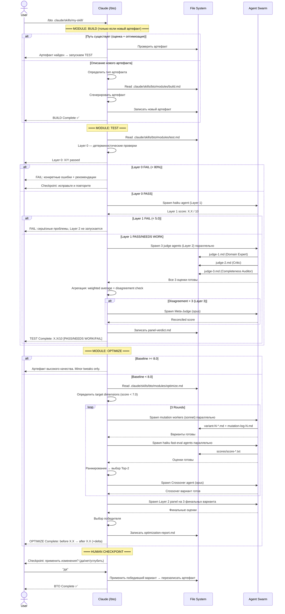

### Step by Step

**Шаг 1. Запуск пайплайна**
```
User: /bto .claude/skills/my-skill/SKILL.md
```

**Шаг 2. TEST — Layer 0**
- Claude читает `modules/test.md`
- Детерминистические проверки: 10-15 чеков за ~1 сек
- Например: SKILL.md существует, есть ## Overview, есть ## Anti-Patterns, все referenced modules существуют
- Если < 80% чеков прошло → вывод отчёта с конкретными ошибками, остановка

**Шаг 3. TEST — Layer 1 (haiku)**
- Один haiku агент оценивает по 5 измерениям
- Ввод: содержимое артефакта + evaluation prompt
- Вывод: CLARITY:8, COMPLETENESS:7, ACTIONABILITY:7, QUALITY:8, ANTI-PATTERNS:9
- Average: 7.8 → PASS

**Шаг 4. TEST — Layer 2 (3 × sonnet)**
- Три sonnet агента спавнятся параллельно
- Каждый читает тот же артефакт, пишет в отдельный файл
- После завершения всех трёх: агрегация с весами 0.4/0.3/0.3
- Проверка разногласий

**Шаг 5. OPTIMIZE — 3 раунда**
- Round 1: 5 направленных мутаций → 5 haiku оценок → Top-2
- Round 2: crossover → 3 haiku оценок → Top-2
- Round 3: crossover → 3 × Layer 2 → победитель

**Шаг 6. Human Checkpoint**
- Вывод отчёта: before/after delta по каждому измерению + changelog
- Пользователь подтверждает применение изменений

---

## Flow: Build-only

### Flowchart

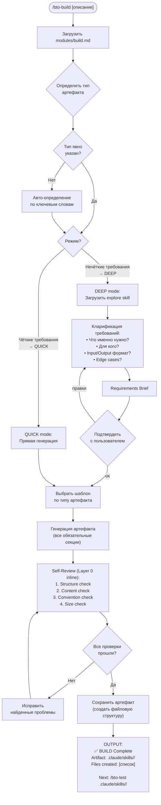

### Пример: QUICK mode

**Вход:**
```
User: /bto-build skill for processing CSV files with pandas validation
```

**Поток исполнения:**
1. Тип: `skill` (ключевое слово "skill")
2. Режим: QUICK (чёткое описание)
3. Шаблон: SKILL.md + modules/ + references/ + examples/
4. Генерация: структурированный скилл
5. Self-review: проверка 8 критериев
6. Вывод: созданные файлы

**Пример: DEEP mode**

**Вход:**
```
User: /bto-build something for analyzing customer behavior
```

**Поток исполнения:**
1. Тип: `skill` (можно предположить)
2. Режим: DEEP (нечёткие требования)
3. Загрузка `explore` скилла
4. Кларификационные вопросы:
   - "Что является входными данными: логи, транзакции, сессии?"
   - "Какой формат выхода: отчёт, JSON, диаграммы?"
   - "Какой домен: e-commerce, SaaS, mobile?"
5. Requirements brief → подтверждение → генерация

---

## Flow: Test-only

### Sequence Diagram с Layer 0 → 1 → 2 → 3 прогрессией

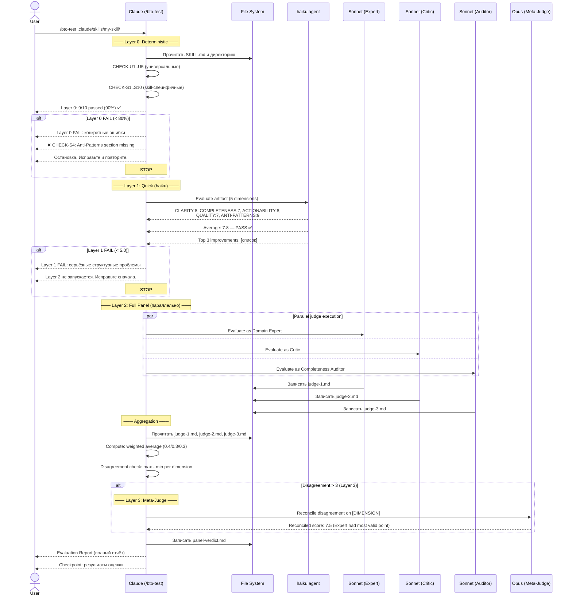

### Пример отчёта TEST

```
═══════════════════════════════════════════════════════
📊 BTO EVALUATION REPORT
Artifact: .claude/skills/my-skill/SKILL.md
Type: skill
Level: Layer 0 + Layer 1 + Layer 2

OVERALL SCORE: 7.4 / 10  [PASS]

Per-Dimension:
  METHODOLOGY:  7.8  ████████░░░░
  DEPTH:        6.9  ███████░░░░░  ← ниже 7.0, target для OPTIMIZE
  CORRECTNESS:  8.1  █████████░░░
  USABILITY:    7.2  ████████░░░░
  ROBUSTNESS:   6.8  ███████░░░░░  ← ниже 7.0, target для OPTIMIZE

Flagged: DEPTH (Expert:7, Critic:4, Auditor:6 — disagreement=3, Meta-Judge applied)

Top Improvements:
1. [Critic] Добавить конкретные примеры для каждого шага протокола
2. [Auditor] Раздел edge cases отсутствует в modules/core.md
3. [Expert] Стратегия не описывает поведение при недоступном API
═══════════════════════════════════════════════════════
```

### Level параметр

`/bto-test [path] level=[layer0|layer1|layer2|full]`

| Level | Запускает | Стоимость | Когда использовать |
|-------|-----------|-----------|-------------------|
| `layer0` | Только детерминистические проверки | $0 | CI/CD pre-check, быстрая валидация |
| `layer1` | Layer 0 + haiku | ~$0.001 | Быстрая итерация при разработке |
| `layer2` | Layer 0 + Layer 1 + полная панель | ~$0.01 | Тщательная оценка |
| `full` (default) | Всё включая Meta-Judge при необходимости | ~$0.05 | Финальная оценка перед поставкой |

---

## Flow: Optimize-only

### Flowchart полного цикла оптимизации

```mermaid
flowchart TD
    START(["/bto-optimize [path]"]) --> PREREQ

    PREREQ["Проверить предусловия:\n• Артефакт прошёл Layer 0\n• Baseline Layer 2 установлен"] --> BASELINE_CHECK

    BASELINE_CHECK{"Baseline\n>= 8.0?"} -->|"Да"| ALREADY_GOOD

    ALREADY_GOOD["Артефакт уже высокого качества.\nПредложить только minor tweaks."]

    BASELINE_CHECK -->|"Нет (< 8.0)"| FIND_TARGETS

    FIND_TARGETS["Определить target dimensions\n(score < 7.0 из baseline)"] --> ROUND1

    subgraph ROUND1 ["Round 1: Mutation + Fast Eval"]
        R1_WORKERS["Spawn 3 mutation workers\n(sonnet, параллельно):\n• Worker 1: expand-depth → 2 варианта\n• Worker 2: add-metrics → 1 вариант\n• Worker 3: invert-critic → 2 варианта"]
        R1_L0["Каждый воркер:\nLayer 0 self-check на своих вариантах"]
        R1_HAIKU["Spawn 5 haiku fast-eval agents\n(параллельно, по 1 на вариант)"]
        R1_RANK["Ранжирование вариантов\nround-1-ranking.md"]
        R1_TOP2["Отбор Top-2 вариантов"]

        R1_WORKERS --> R1_L0
        R1_L0 --> R1_HAIKU
        R1_HAIKU --> R1_RANK
        R1_RANK --> R1_TOP2
    end

    FIND_TARGETS --> ROUND1
    R1_TOP2 --> ROUND2

    subgraph ROUND2 ["Round 2: Crossover + Fast Eval"]
        R2_CROSS["Spawn Crossover agent (opus):\nСинтез Top-2 → 3 варианта"]
        R2_L0_2["Crossover агент:\nLayer 0 self-check"]
        R2_HAIKU2["Spawn 3 haiku fast-eval agents\n(параллельно)"]
        R2_RANK2["Ранжирование\nround-2-ranking.md"]
        R2_TOP2_2["Отбор Top-2"]

        R2_CROSS --> R2_L0_2
        R2_L0_2 --> R2_HAIKU2
        R2_HAIKU2 --> R2_RANK2
        R2_RANK2 --> R2_TOP2_2
    end

    R1_TOP2 --> ROUND2
    R2_TOP2_2 --> ROUND3

    subgraph ROUND3 ["Round 3 (Final): Full Panel"]
        R3_CROSS["Spawn Crossover agent (opus):\n3 финальных варианта"]
        R3_L0_3["Layer 0 self-check"]
        R3_PANEL["Spawn Judge Panel:\n3 варианта × 3 судьи\n(9 параллельных sonnet агентов)"]
        R3_AGG["Агрегация всех 9 оценок\nВыбор победителя"]

        R3_CROSS --> R3_L0_3
        R3_L0_3 --> R3_PANEL
        R3_PANEL --> R3_AGG
    end

    R2_TOP2_2 --> ROUND3
    R3_AGG --> CONV_CHECK

    CONV_CHECK{"Delta > 0.5\nот baseline?"}
    CONV_CHECK -->|"Нет (< 0.5)"| CONVERGED["Сходимость.\nМинимальное улучшение.\nРекомендация: оставить оригинал."]
    CONV_CHECK -->|"Да"| REPORT

    REPORT["Генерация отчёта:\noptimization-report.md\n• Before/After delta\n• Winning strategy\n• Changelog"] --> CHECKPOINT

    CHECKPOINT["Human Checkpoint:\nПоказать отчёт пользователю"] --> DECISION

    DECISION{"Применить\nизменения?"} -->|"да"| APPLY
    DECISION -->|"нет"| DISCARD
    DECISION -->|"углубить [dim]"| EXTRA_ROUND

    APPLY["Применить победивший вариант\n→ перезаписать артефакт"]
    DISCARD["Оставить оригинал.\nОтчёт сохранён для референса."]
    EXTRA_ROUND["Запустить доп. раунд\nс фокусом на [dim]"]
```

### Пример отчёта OPTIMIZE

```
═══════════════════════════════════════════════════════
🔧 BTO OPTIMIZATION REPORT
Artifact: .claude/skills/my-skill/SKILL.md
Rounds: 3
Total evaluations: 15 (5×haiku + 3×haiku + 3×sonnet×3)

BEFORE → AFTER:
  METHODOLOGY:  7.8 → 8.2  (+0.4)
  DEPTH:        6.9 → 8.0  (+1.1) ⬆️
  CORRECTNESS:  8.1 → 8.3  (+0.2)
  USABILITY:    7.2 → 7.9  (+0.7) ⬆️
  ROBUSTNESS:   6.8 → 7.8  (+1.0) ⬆️

  OVERALL:      7.4 → 8.0  (+0.6) ⬆️

Winning Strategy: expand-depth + invert-critic (crossover)

CHANGELOG:
- Добавлены конкретные примеры для каждого шага протокола
- Раздел edge cases добавлен в modules/core.md
- Задокументировано поведение при недоступном API
- Убрана избыточность в разделе Quick Start
═══════════════════════════════════════════════════════
```

---

## Flow: Панель судей (Layer 2)

### Детальный Sequence Diagram

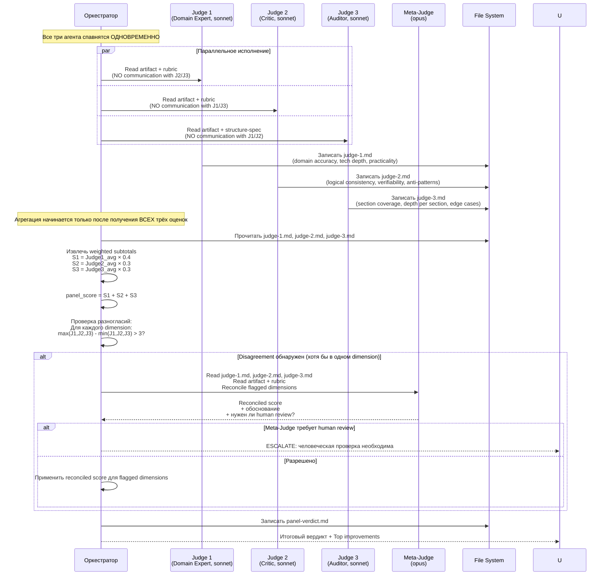

### Калибровка судей

Ключевой момент архитектуры: три судьи намеренно имеют разную строгость.

```
Judge 1 (Expert, Weight 0.4):
  Calibration: Reserve 9-10 for genuinely exceptional work
  Expected average: 7-8 for solid artifacts

Judge 2 (Critic, Weight 0.3):
  Calibration: "If in doubt, score lower"
  Anti-pattern cap: if anti-pattern detected → cap criterion at 5
  Expected average: 5-6 (deliberately strict)

Judge 3 (Auditor, Weight 0.3):
  Calibration: -2 per missing required section
              -1 per stub section (< 3 substantive sentences)
  Expected average: 6-8 for well-structured artifacts
```

Такая асимметрия предотвращает **conformity collapse** — феномен, при котором все судьи без особой причины дают похожие оценки.

### Разрешение разногласий (Meta-Judge)

Meta-Judge вызывается при разногласии > 3 очков по любому измерению:

```
Пример: DEPTH dimension
  Expert:  8 (глубина достаточна для задачи)
  Critic:  4 (не хватает edge cases, вагое в нескольких местах)
  Auditor: 7 (структурно полно)
  Разногласие: 8 - 4 = 4 → > 3 → ESCALATE

Meta-Judge получает:
  • Все три оценки с обоснованиями
  • Сам артефакт
  • Запрос: "Кто прав и почему?"

Meta-Judge выводит:
  • Примирённую оценку (например: 6.5)
  • Обоснование: "Critic выявил реальные gaps в edge cases.
    Expert оценил base content, но не edge coverage.
    Reconciled: 6.5, с рекомендацией добавить 2 edge cases."
  • Human review: NO (разрешено)
```

### panel-verdict.md формат

```markdown
## Panel Verdict — my-skill/SKILL.md

**Panel score:** 7.4 / 10
**Judge scores:** Expert=7.8, Critic=6.5, Auditor=7.2
**Disagreement flag:** YES (DEPTH: Expert=8, Critic=4, Auditor=7)
**Meta-Judge applied:** YES → Reconciled DEPTH: 6.5
**Decision:** PASS
**Pass threshold:** 7.0

**Top improvement areas:**
- [Critic] Недостаточно edge cases в Protocol section
- [Auditor] modules/advanced.md — stub section (2 предложения)
```

---

## Flow: Раунд оптимизации

### Детальный Sequence Diagram

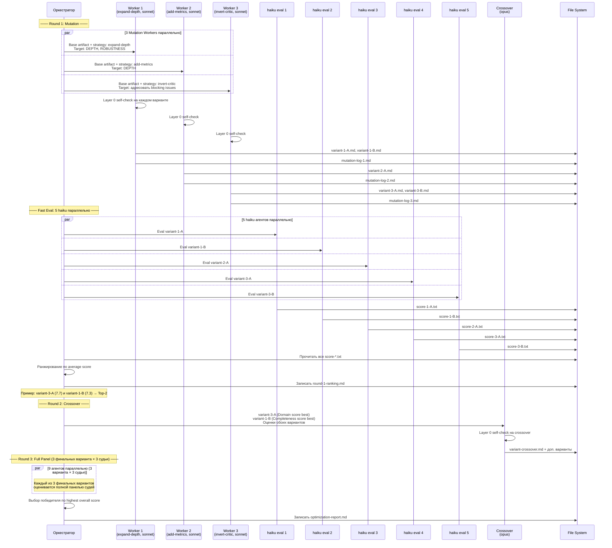

### round-ranking.md формат

```markdown
## Optimization Round 1 — Ranking

| Rank | Variant | R1 | R2 | R3 | Avg | Strategy |
|------|---------|----|----|----|----|---------|
| 1 | variant-3-A | 8 | 8 | 7 | 7.7 | invert-critic |
| 2 | variant-1-B | 7 | 8 | 7 | 7.3 | expand-depth |
| 3 | variant-2-A | 7 | 7 | 7 | 7.0 | add-metrics |
| 4 | variant-3-B | 6 | 7 | 7 | 6.7 | invert-critic |
| 5 | variant-1-A | 6 | 7 | 6 | 6.3 | expand-depth |

**Selected for Round 2:** variant-3-A, variant-1-B
**Discarded:** variant-2-A (avg 7.0, not top-2), variant-3-B (Layer 0: stub section), variant-1-A (low coherence)
```

### mutation-log формат

```markdown
## Mutation Log — Worker 3 — Round 1

**Strategy:** invert-critic
**Variants attempted:** 2
**Variants passed Layer 0:** 2
**Layer 0 failures:** none

**Substantive changes made:**
- Добавлены 3 edge cases в Protocol section (адресует "missing edge cases" из Critic)
- Формализована секция Failure Modes с конкретными сценариями
- Убраны вагые формулировки типа "может быть улучшено" → конкретные инструкции
```

---

## Flow: Ошибки и rejection

### Layer 0 Failure Flow

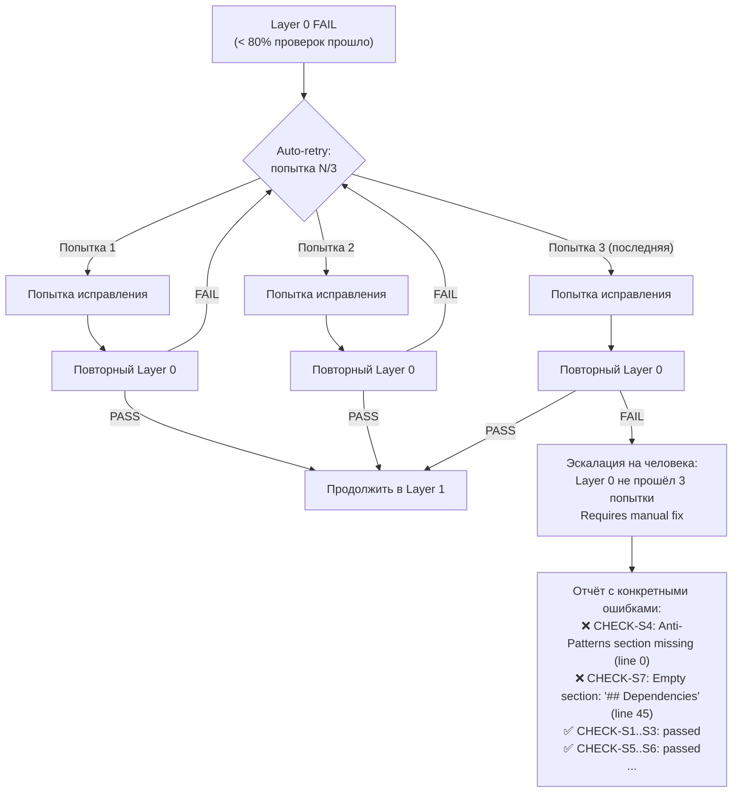

### Rejection logging (обязательно)

Каждый rejected артефакт ДОЛЖЕН быть залогирован. Это правило из `bto-quality-gates.md`:

```
Причины rejection в Worker:
→ Записать в mutation-log-[WORKER_ID].md:
  • variant-1-A: REJECTED — Layer 0 failure: no Anti-Patterns section
  • variant-2-A: REJECTED — Length below minimum (200 tokens < 300 min)
  • variant-1-B: PASSED

НИКОГДА не отбрасывать молча.
```

### Anti-Pattern Detection Flow

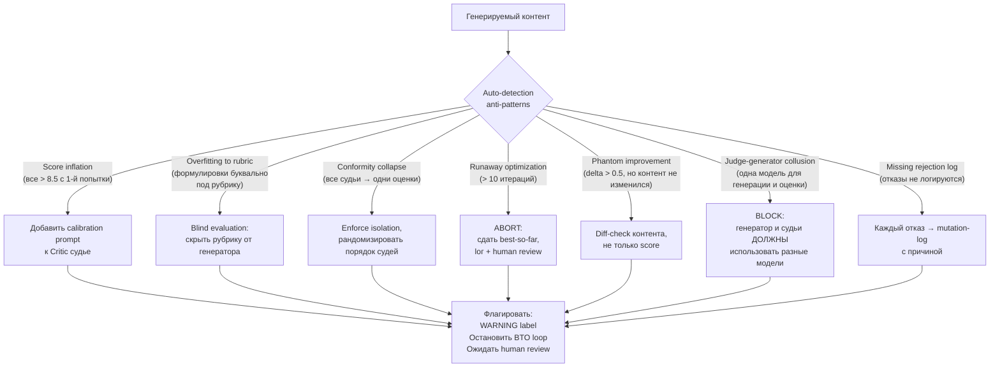

### Regression Rollback Flow

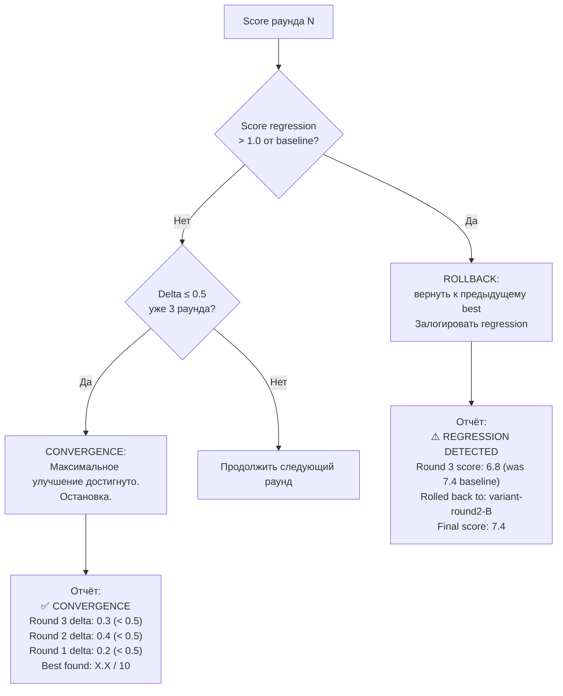

---

## Flow: Human Checkpoint

### Checkpoint после TEST

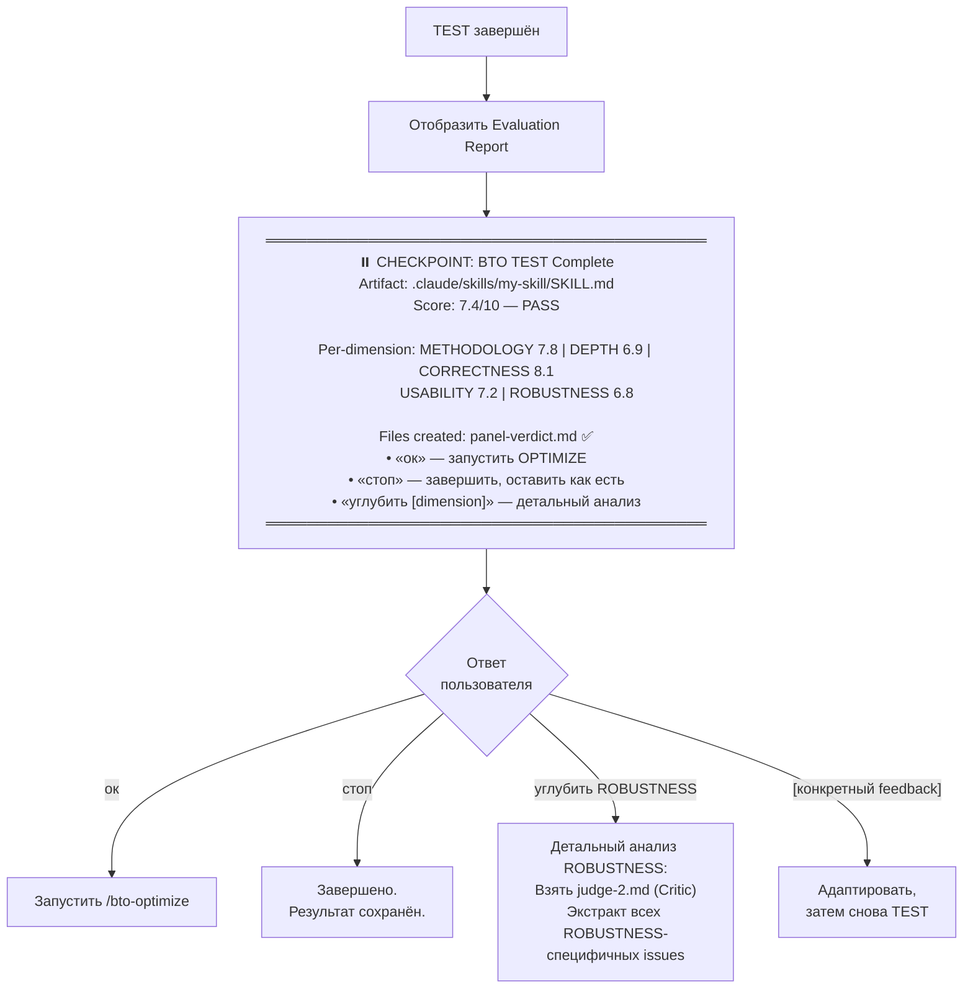

### Checkpoint после OPTIMIZE

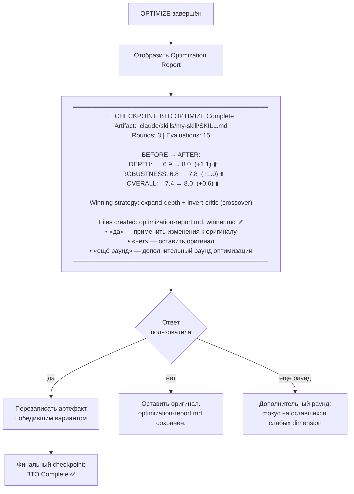

### Обязательные checkpoints (из bto-quality-gates.md)

```
НИКОГДА не авто-одобрять без human checkpoint:
  ✓ После Layer 2 evaluation
  ✓ После финального раунда оптимизации
  ✓ Перед packaging/delivery артефакта

Исключение: Layer 0 rejections могут авто-ретраиться до 3 раз
             перед эскалацией на человека.
```

---

## Flow: Интеграция BTO в Keysarium пайплайн

### Sequence Diagram: Keysarium + BTO

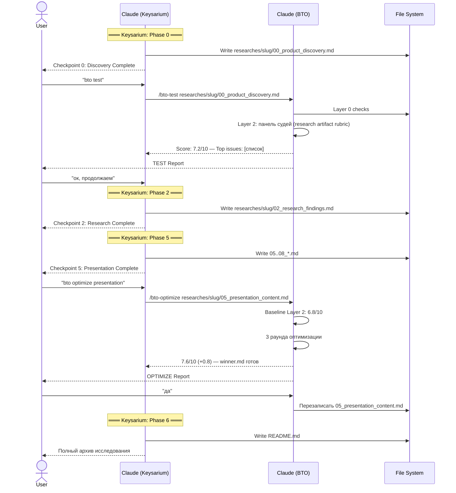

### Создание нового скилла через BTO в контексте Keysarium

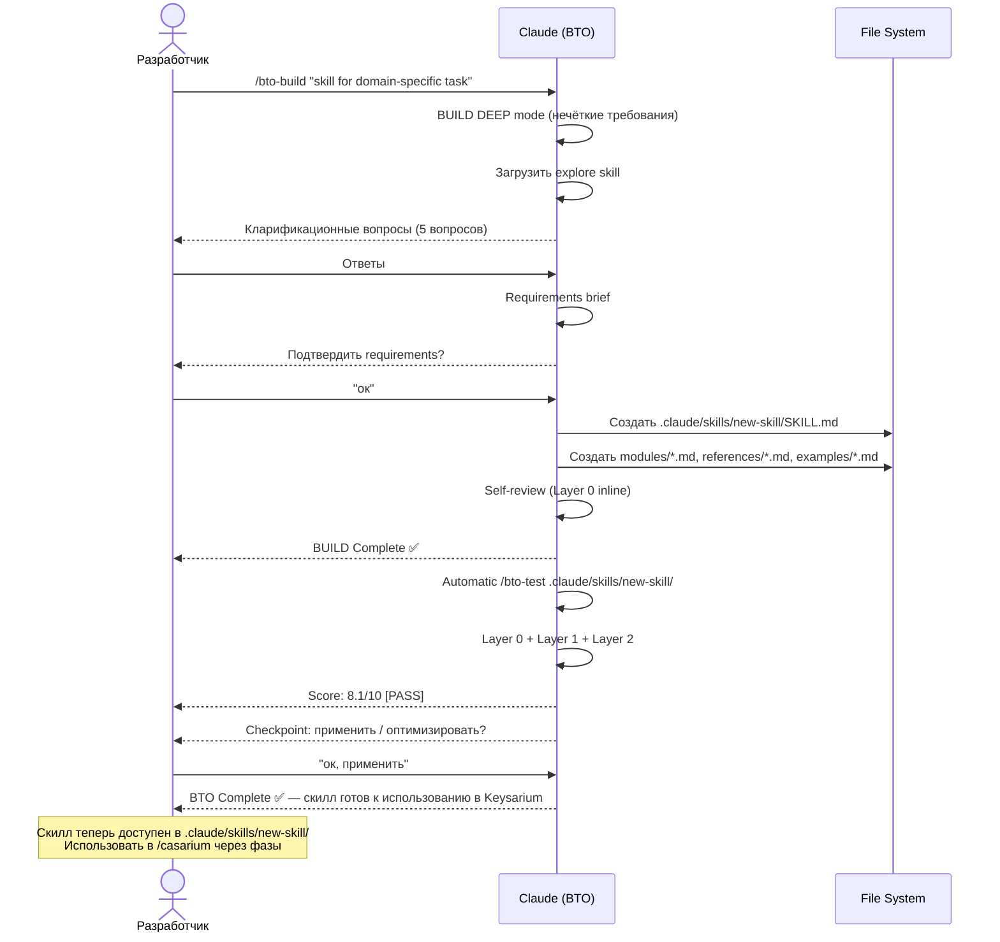

### BTO в CI/CD (только Layer 0)

Для автоматических проверок при коммите или в pipeline — использовать только Layer 0 (бесплатно):

```
# Пример: проверка всех skills при изменении
/bto-test .claude/skills/ level=layer0

Вывод:
  .claude/skills/bto/SKILL.md:         9/10 ✅
  .claude/skills/explore/SKILL.md:     10/10 ✅
  .claude/skills/my-new-skill/SKILL.md: 7/10 ❌ (CHECK-S4, CHECK-S10 failed)

  Total: 2/3 passed
```

### Использование BTO для Harvest знаний

После завершения Keysarium исследования BTO помогает валидировать извлечённые паттерны:

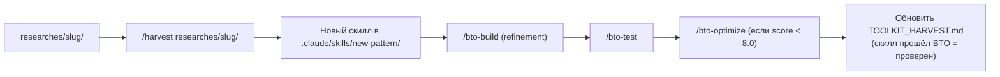

---

## Быстрый справочник команд

| Команда | Назначение | Минимальный вход | Стоимость |
|---------|-----------|-----------------|-----------|
| `/bto [path]` | Полный пайплайн BUILD→BENCHMARK→TEST→OPTIMIZE | Путь или описание | ~$0.16 |
| `/bto-build [description]` | Только генерация | Текстовое описание | ~$0.01 |
| `/bto-benchmark [path]` | Детерминистический бенчмаркинг | Путь к артефакту | ~$0.001 |
| `/bto-test [path]` | Только оценка (full) | Путь к артефакту | ~$0.01 |
| `/bto-test [path] level=layer0` | Только Layer 0 | Путь к артефакту | $0 |
| `/bto-test [path] level=layer1` | Layer 0 + haiku | Путь к артефакту | ~$0.001 |
| `/bto-optimize [path]` | Только оптимизация | Путь + baseline eval | ~$0.13 |

## Частые сценарии использования

```
# Быстрая проверка нового артефакта
/bto-test .claude/skills/new-skill/ level=layer1

# Полный цикл для нового скилла
/bto-build "создать skill для [задача]"

# Улучшение существующего слабого артефакта
/bto-optimize .claude/skills/weak-skill/SKILL.md

# Валидация research документа в Keysarium
/bto-test researches/my-case/02_research_findings.md

# Проверка всех skills (только структура, бесплатно)
/bto-test .claude/skills/ level=layer0

# Полный цикл для критического артефакта перед сдачей
/bto .claude/skills/important-skill/SKILL.md
```
