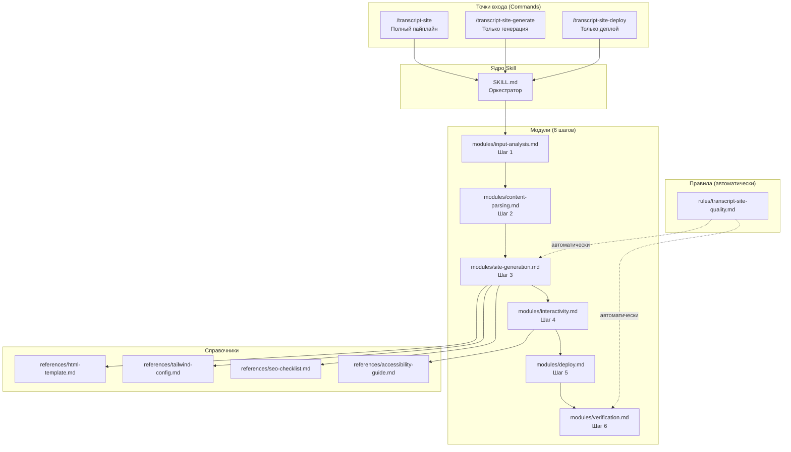
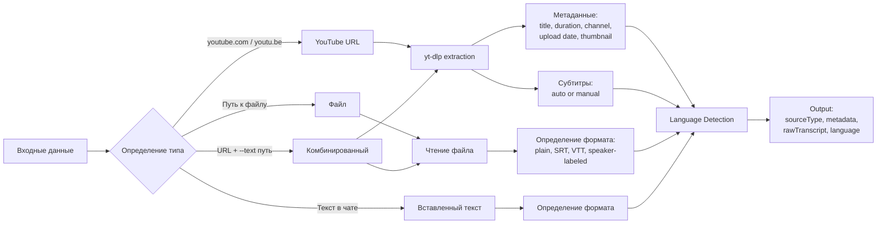
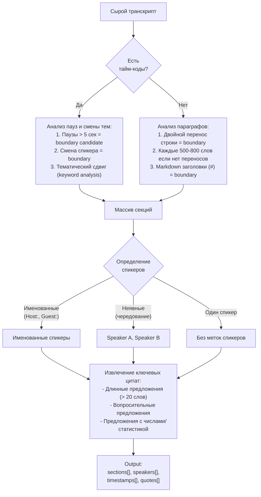
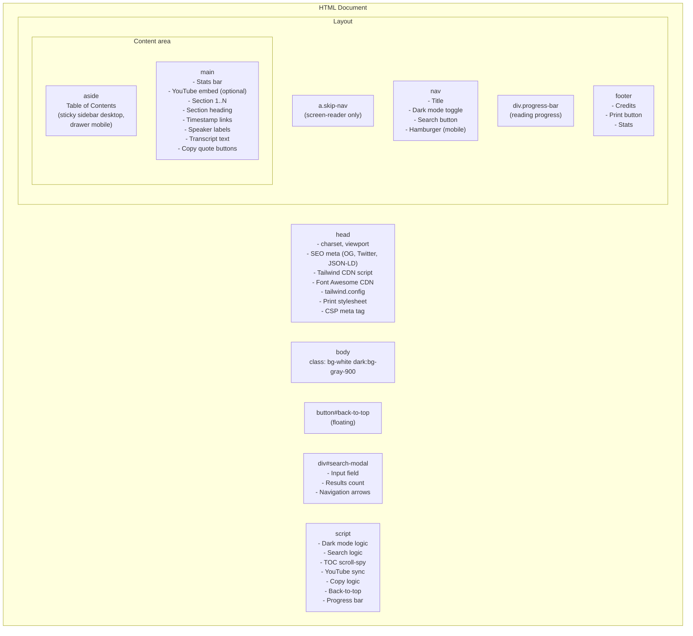
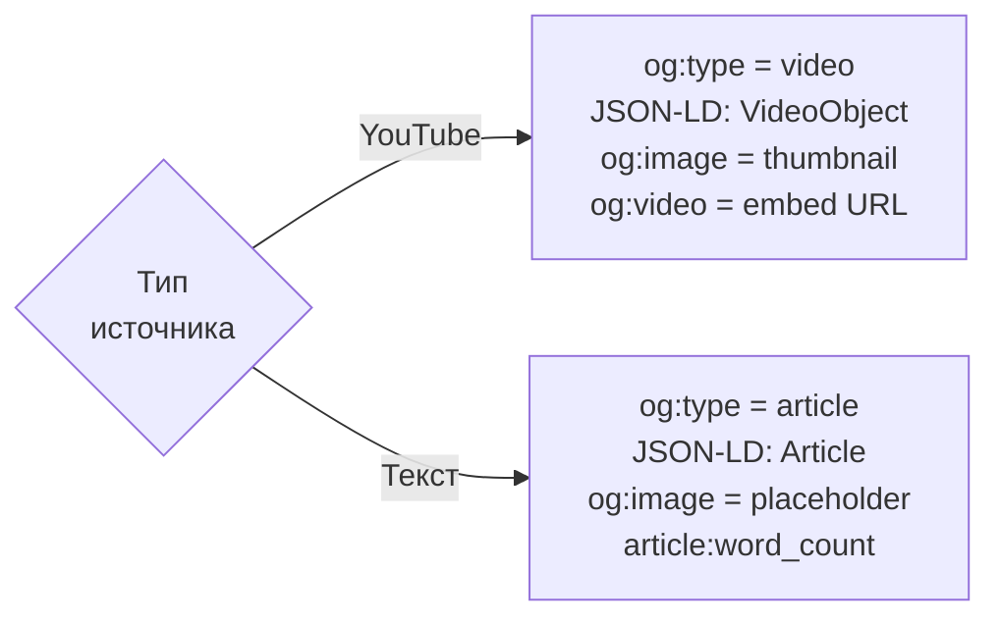
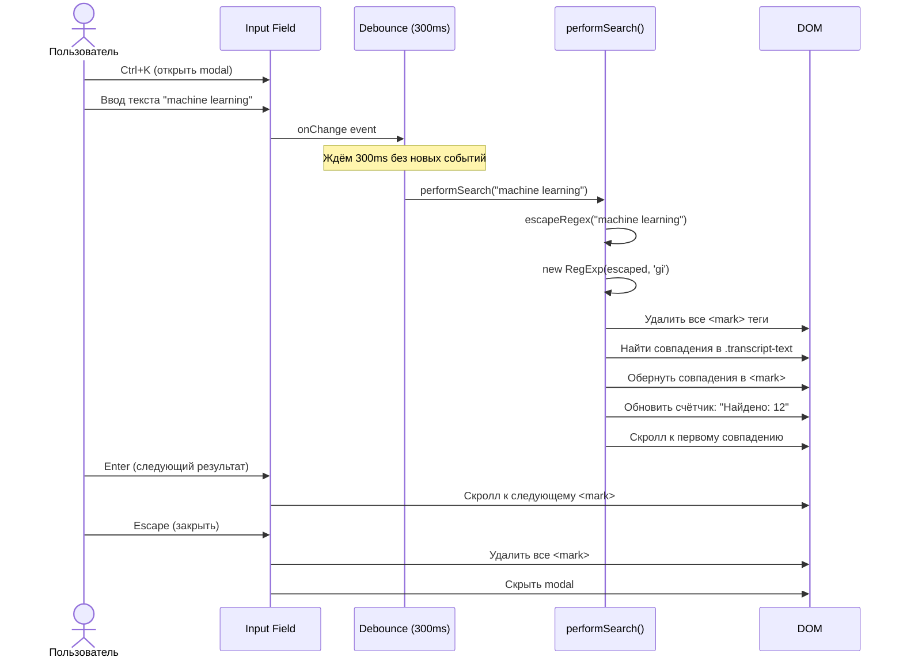
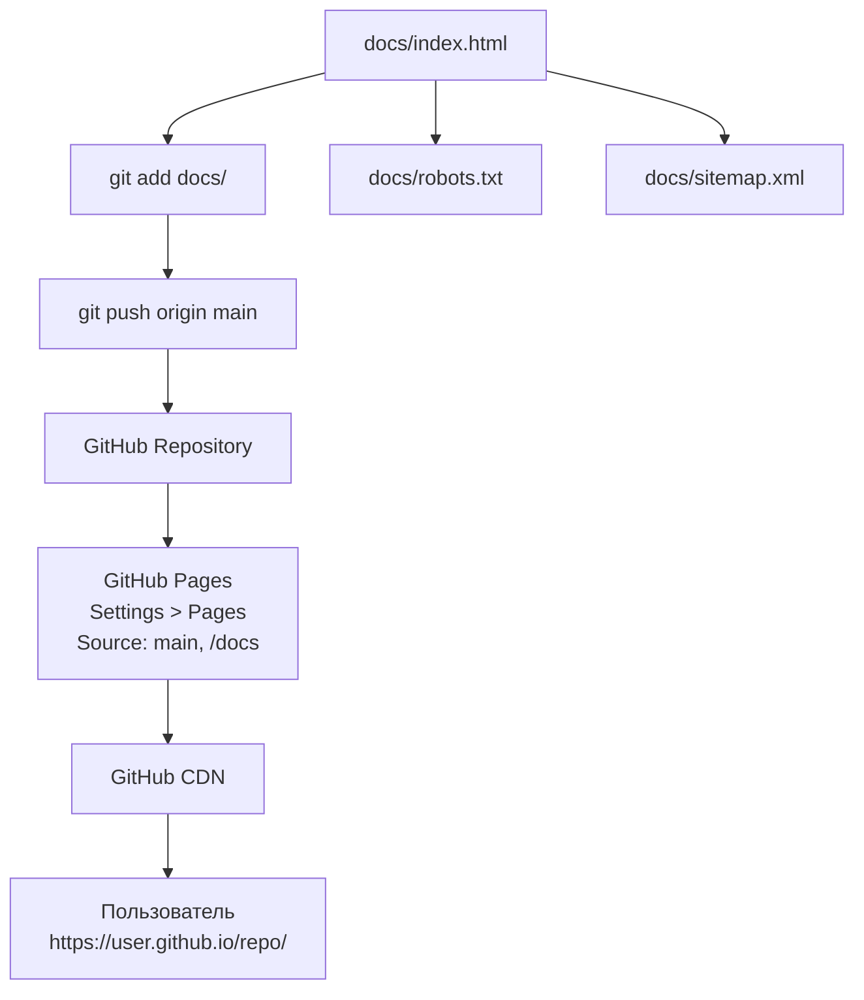
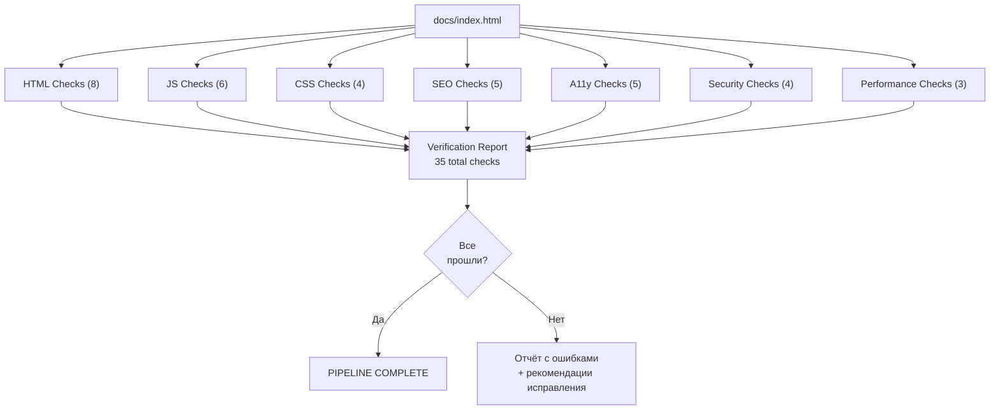
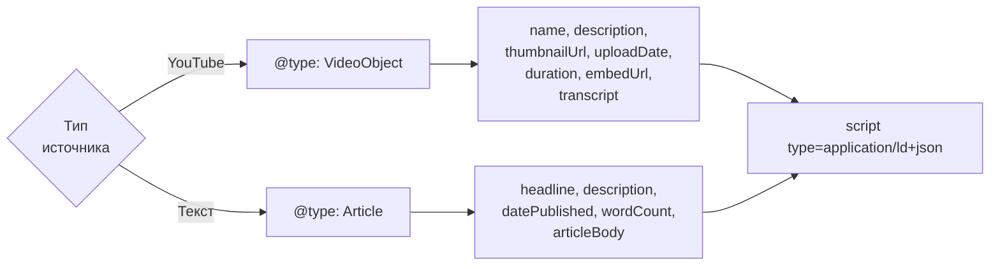

# Архитектура @dzhechkov/skills-transcript-site

## Содержание

1. [Обзор системы и философия проектирования](#1-обзор-системы-и-философия-проектирования)
2. [Компоненты системы](#2-компоненты-системы)
3. [MODULE: Input Analysis](#3-module-input-analysis)
4. [MODULE: Content Parsing](#4-module-content-parsing)
5. [MODULE: Site Generation](#5-module-site-generation)
6. [MODULE: Interactivity](#6-module-interactivity)
7. [MODULE: Deploy](#7-module-deploy)
8. [MODULE: Verification](#8-module-verification)
9. [Поток данных (Data Flow)](#9-поток-данных-data-flow)
10. [Выбор технологического стека](#10-выбор-технологического-стека)
11. [Архитектура безопасности](#11-архитектура-безопасности)
12. [SEO архитектура](#12-seo-архитектура)
13. [Доступность (Accessibility)](#13-доступность-accessibility)
14. [Расширяемость](#14-расширяемость)
15. [Проектные решения и компромиссы](#15-проектные-решения-и-компромиссы)

---

## 1. Обзор системы и философия проектирования

`@dzhechkov/skills-transcript-site` -- это скилл для Claude Code, генерирующий интерактивные веб-сайты из текстовых транскриптов и YouTube-видео. Ключевая идея: **zero-build, CDN-first, vanilla JS**. Выходной артефакт -- один (или несколько) HTML-файл(ов), готовых к открытию в браузере или деплою на GitHub Pages.

### Фундаментальные принципы

**1. Zero Build Step (нулевой шаг сборки)**

Никаких webpack, vite, esbuild, rollup. Никаких node_modules. Никаких package.json в выходной директории. Результат -- plain HTML, который открывается в браузере напрямую. Это критически важно для аудитории, которая не является фронтенд-разработчиками.

**2. CDN-First (CDN в приоритете)**

Tailwind CSS подключается через Play CDN. Font Awesome -- через cdnjs. YouTube -- через iframe API. Никаких локальных зависимостей. Это позволяет генерировать один self-contained файл без дополнительных assets.

**3. Vanilla JS (чистый JavaScript)**

Никаких React, Vue, Svelte, jQuery. Вся интерактивность реализована на vanilla JavaScript с event delegation. Это обеспечивает:
- Нулевую зависимость от фреймворков
- Минимальный размер JS-кода (~5-10 KB)
- Полную прозрачность и читаемость кода
- Отсутствие необходимости в системе модулей

**4. Static-Only Output (только статика)**

Выходные файлы не требуют сервера для работы. Нет API-эндпоинтов, нет серверного рендеринга, нет баз данных. Файл `index.html` открывается через `file://` протокол или любой статический хостинг.

**5. Progressive Enhancement (прогрессивное улучшение)**

Базовый HTML-контент (текст транскрипта) читается без JavaScript. Интерактивные фичи (поиск, dark mode, timestamp sync) добавляются как enhancement -- сайт остаётся функциональным при их отключении.

---

## 2. Компоненты системы

### Текстовая карта компонентов

```
@dzhechkov/skills-transcript-site
+-- SKILL.md                              <-- Точка входа, оркестратор 6 шагов
|
+-- modules/                              <-- 6 модулей пайплайна
|   +-- input-analysis.md                 <-- Шаг 1: source detection, yt-dlp, language
|   +-- content-parsing.md                <-- Шаг 2: sections, speakers, timestamps
|   +-- site-generation.md                <-- Шаг 3: HTML template, Tailwind, SEO
|   +-- interactivity.md                  <-- Шаг 4: search, TOC, dark mode, sync
|   +-- deploy.md                         <-- Шаг 5: GitHub Pages, robots, sitemap
|   +-- verification.md                   <-- Шаг 6: HTML/JS/CSS/SEO/a11y checks
|
+-- references/                           <-- Справочные материалы
|   +-- html-template.md                  <-- Базовый HTML шаблон
|   +-- tailwind-config.md                <-- Конфигурация Tailwind CDN
|   +-- seo-checklist.md                  <-- OG, Twitter Cards, JSON-LD
|   +-- accessibility-guide.md            <-- Skip-nav, ARIA, keyboard nav
|
+-- examples/                             <-- Примеры
    +-- sample-podcast.md                 <-- Пример: подкаст
    +-- sample-youtube.md                 <-- Пример: YouTube видео
```

```
.claude/commands/                         <-- Slash-команды
+-- transcript-site.md                    <-- /transcript-site -- полный пайплайн
+-- transcript-site-generate.md           <-- /transcript-site-generate -- только HTML
+-- transcript-site-deploy.md             <-- /transcript-site-deploy -- только деплой
```

```
.claude/rules/
+-- transcript-site-quality.md            <-- Автоматические правила качества
```

### Mermaid-диаграмма компонентов



---

## 3. MODULE: Input Analysis

### Назначение

Определение типа входных данных (YouTube URL, текст, файл), извлечение метаданных и подготовка сырого транскрипта для парсинга.

### Архитектура определения источника



### Language Detection

Определение языка использует трёхуровневый подход:

```
Уровень 1: Метаданные YouTube (если доступны)
  -> subtitle lang: "en" -> English
  -> subtitle lang: "ru" -> Russian

Уровень 2: Кодировка символов
  -> Кириллица (U+0400-U+04FF) > 30% -> Russian
  -> CJK (U+4E00-U+9FFF) > 10% -> Chinese/Japanese/Korean
  -> Latin -> дальнейший анализ

Уровень 3: Стоп-слова
  -> Высокая частотность "the", "and", "is" -> English
  -> Высокая частотность "и", "в", "на" -> Russian
  -> ...
```

### yt-dlp Integration Protocol

```bash
# Шаг 1: Извлечение метаданных (JSON)
yt-dlp --dump-json --no-download "URL"

# Шаг 2: Извлечение субтитров
yt-dlp --write-auto-sub --sub-lang "DETECTED_LANG" \
       --sub-format vtt --skip-download \
       --output "/tmp/transcript" "URL"

# Шаг 3: Парсинг VTT файла
# Удаление дублей, нормализация timestamps, объединение фрагментов
```

### Anti-Patterns модуля

| Anti-Pattern | Сигнал обнаружения | Обязательное исправление |
|-------------|--------------------|-----------------------|
| Пустой транскрипт | Менее 50 слов после извлечения | Предложить ввод вручную |
| Битая кодировка | Наличие U+FFFD (replacement character) | Предложить повторное извлечение или конвертацию |
| Неопределённый язык | Confidence < 0.6 | Запросить у пользователя |
| yt-dlp timeout | Нет ответа > 30 секунд | Предложить ввод вручную |

---

## 4. MODULE: Content Parsing

### Назначение

Разбиение сырого транскрипта на структурированные секции с определением спикеров, извлечением временных меток и ключевых цитат.

### Алгоритм секционирования



### Формат секции (внутренний)

```json
{
  "id": "section-03",
  "title": "Main Discussion Part 1",
  "startTime": 225,
  "endTime": 372,
  "speaker": "Guest",
  "wordCount": 1204,
  "content": "...",
  "timestamps": [
    { "time": 225, "label": "3:45", "text": "Let me explain..." },
    { "time": 245, "label": "4:05", "text": "The key insight is..." }
  ],
  "quotes": [
    { "text": "The key insight is that...", "time": 245 }
  ]
}
```

### Speaker Detection

```
Паттерн 1: Явные метки
  "Host:" / "Guest:" / "Dr. Smith:" -> Именованные

Паттерн 2: SRT/VTT метаданные
  <v Speaker 1> -> Извлечь имена из voice tags

Паттерн 3: Чередование
  Абзац 1 -> Speaker A
  Абзац 2 -> Speaker B (если стиль отличается)
  Абзац 3 -> Speaker A (возврат)

Паттерн 4: Монолог
  Один голос -> Без меток спикеров
```

---

## 5. MODULE: Site Generation

### Назначение

Трансформация структурированных данных (секции, спикеры, timestamps) в полноценную HTML-страницу с Tailwind CSS, SEO-тегами и семантической разметкой.

### HTML Template Architecture



### Tailwind Configuration

```javascript
tailwind.config = {
  darkMode: 'class',
  theme: {
    extend: {
      colors: {
        primary: {
          50: '#eef2ff',
          100: '#e0e7ff',
          200: '#c7d2fe',
          300: '#a5b4fc',
          400: '#818cf8',
          500: '#6366f1',
          600: '#4f46e5',
          700: '#4338ca',
          800: '#3730a3',
          900: '#312e81',
          950: '#1e1b4e'
        }
      }
    }
  }
}
```

Цвета `primary` автоматически заменяются на выбранную тему (indigo, emerald, rose, etc.).

### SEO Meta Generation



---

## 6. MODULE: Interactivity

### Назначение

Добавление интерактивных JavaScript-фич к сгенерированному HTML. Все фичи реализованы на vanilla JS без фреймворков и без build-шагов.

### Архитектура фич

```
+-- Dark Mode
|   +-- Toggle button (sun/moon icons)
|   +-- CSS class on <html> element
|   +-- localStorage persistence
|   +-- System preference detection (prefers-color-scheme)
|
+-- Search (Ctrl+K)
|   +-- Modal dialog
|   +-- Debounced input (300ms)
|   +-- Regex-based matching (escapeRegex)
|   +-- <mark> tag highlighting
|   +-- Result count display
|   +-- Enter/Shift+Enter navigation
|   +-- Escape to close
|
+-- Table of Contents
|   +-- Desktop: sticky sidebar
|   +-- Mobile: hamburger drawer
|   +-- IntersectionObserver scroll-spy
|   +-- Active section highlighting
|   +-- Click-to-scroll with smooth behavior
|
+-- YouTube Sync
|   +-- iframe API (enablejsapi=1)
|   +-- data-seek attributes on timestamp links
|   +-- Event delegation for clicks
|   +-- postMessage for seekTo()
|   +-- Origin restriction on message handler
|
+-- Copy Quote
|   +-- data-copy attributes on buttons
|   +-- Clipboard API (navigator.clipboard.writeText)
|   +-- Visual feedback (button text change, timeout reset)
|   +-- Fallback: document.execCommand('copy')
|
+-- Back-to-Top
|   +-- Floating button (fixed position)
|   +-- Appears on scroll > 300px
|   +-- Smooth scroll to top
|
+-- Progress Bar
|   +-- Fixed position at top of page
|   +-- Width = scrollY / (scrollHeight - clientHeight) * 100%
|   +-- Primary color fill
|
+-- Reading Stats
|   +-- Word count (computed from transcript text)
|   +-- Reading time (wordCount / 200)
|   +-- Section count
|   +-- Speaker count
```

### Event Delegation Pattern

Все интерактивные элементы используют единый паттерн event delegation через `data-*` атрибуты:

```javascript
document.addEventListener('click', function(e) {
  // YouTube timestamp sync
  const seekTarget = e.target.closest('[data-seek]');
  if (seekTarget) {
    e.preventDefault();
    const seconds = parseInt(seekTarget.dataset.seek);
    if (player && player.seekTo) {
      player.seekTo(seconds, true);
    }
    return;
  }

  // Copy quote
  const copyTarget = e.target.closest('[data-copy]');
  if (copyTarget) {
    e.preventDefault();
    const text = copyTarget.dataset.copy;
    navigator.clipboard.writeText(text).then(function() {
      const original = copyTarget.textContent;
      copyTarget.textContent = strings.copy_success;
      setTimeout(function() { copyTarget.textContent = original; }, 2000);
    });
    return;
  }

  // TOC section navigation
  const tocTarget = e.target.closest('[data-section]');
  if (tocTarget) {
    e.preventDefault();
    const sectionId = tocTarget.dataset.section;
    document.getElementById(sectionId).scrollIntoView({ behavior: 'smooth' });
    return;
  }

  // Dark mode toggle
  if (e.target.closest('#dark-mode-toggle')) {
    toggleDarkMode();
    return;
  }
});
```

Этот паттерн:
1. Не использует inline event handlers (безопасно для CSP)
2. Работает с динамически добавленными элементами
3. Минимизирует количество event listeners
4. Легко расширяется новыми `data-*` атрибутами

### Search Implementation



### IntersectionObserver Scroll-Spy

```javascript
const observer = new IntersectionObserver(function(entries) {
  entries.forEach(function(entry) {
    if (entry.isIntersecting) {
      // Убрать подсветку со всех TOC-элементов
      document.querySelectorAll('[data-section]').forEach(function(el) {
        el.classList.remove('bg-primary-100', 'dark:bg-primary-900', 'font-bold');
      });
      // Подсветить текущий
      const tocLink = document.querySelector('[data-section="' + entry.target.id + '"]');
      if (tocLink) {
        tocLink.classList.add('bg-primary-100', 'dark:bg-primary-900', 'font-bold');
      }
    }
  });
}, {
  rootMargin: '-20% 0px -70% 0px',
  threshold: 0
});

document.querySelectorAll('section[id^="section-"]').forEach(function(section) {
  observer.observe(section);
});
```

---

## 7. MODULE: Deploy

### Назначение

Генерация конфигурации для деплоя сайта. Основная цель -- GitHub Pages через `docs/` директорию.

### Архитектура деплоя



### GitHub Actions автоматизация (опционально)

```yaml
# .github/workflows/deploy-pages.yml
name: Deploy Pages
on:
  push:
    branches: [main]
    paths: ['docs/**']

permissions:
  pages: write
  id-token: write

jobs:
  deploy:
    environment:
      name: github-pages
      url: ${{ steps.deployment.outputs.page_url }}
    runs-on: ubuntu-latest
    steps:
      - uses: actions/checkout@v4
      - uses: actions/configure-pages@v4
      - uses: actions/upload-pages-artifact@v3
        with:
          path: docs/
      - id: deployment
        uses: actions/deploy-pages@v4
```

---

## 8. MODULE: Verification

### Назначение

Валидация сгенерированного сайта по 7 категориям: HTML, JavaScript, CSS, SEO, Accessibility, Security, Performance.

### Архитектура проверок



### Полный перечень проверок

**HTML (8 проверок):**

| ID | Проверка |
|----|---------|
| HTML-01 | Валидная HTML5 структура (DOCTYPE, html, head, body) |
| HTML-02 | Все теги правильно закрыты |
| HTML-03 | Нет deprecated атрибутов (align, bgcolor, etc.) |
| HTML-04 | Атрибут lang на html элементе |
| HTML-05 | Charset meta tag (UTF-8) |
| HTML-06 | Viewport meta tag |
| HTML-07 | Семантические элементы (nav, main, aside, footer) |
| HTML-08 | Уникальные id атрибуты (нет дубликатов) |

**JavaScript (6 проверок):**

| ID | Проверка |
|----|---------|
| JS-01 | Нет синтаксических ошибок (парсинг скрипт-блока) |
| JS-02 | Event delegation (нет inline handlers) |
| JS-03 | escapeHtml() функция присутствует |
| JS-04 | escapeRegex() функция присутствует |
| JS-05 | Нет eval(), document.write() |
| JS-06 | Нет innerHTML с пользовательскими данными без escapeHtml |

**CSS (4 проверки):**

| ID | Проверка |
|----|---------|
| CSS-01 | Tailwind CDN или inline CSS загружен |
| CSS-02 | Dark mode классы присутствуют (dark:bg-*, dark:text-*) |
| CSS-03 | Print stylesheet присутствует (@media print) |
| CSS-04 | Responsive utilities (sm:, md:, lg:) используются |

**SEO (5 проверок):**

| ID | Проверка |
|----|---------|
| SEO-01 | Open Graph теги (og:title, og:description, og:image) |
| SEO-02 | Twitter Card теги |
| SEO-03 | JSON-LD structured data (Article или VideoObject) |
| SEO-04 | Canonical URL |
| SEO-05 | robots.txt и sitemap.xml сгенерированы |

**Accessibility (5 проверок):**

| ID | Проверка |
|----|---------|
| A11Y-01 | Skip-nav ссылка в начале body |
| A11Y-02 | ARIA roles на навигации и основном контенте |
| A11Y-03 | Keyboard navigation для search (Escape для закрытия) |
| A11Y-04 | aria-label на иконических кнопках |
| A11Y-05 | Контрастность текста (Tailwind default палитра проверена) |

**Security (4 проверки):**

| ID | Проверка |
|----|---------|
| SEC-01 | Нет inline event handlers (onclick, onload, onerror) |
| SEC-02 | SRI хеши на CDN-ресурсах |
| SEC-03 | CSP meta-тег |
| SEC-04 | postMessage origin проверка |

**Performance (3 проверки):**

| ID | Проверка |
|----|---------|
| PERF-01 | HTML размер < 200 KB |
| PERF-02 | Нет render-blocking ресурсов (кроме Tailwind CDN) |
| PERF-03 | Изображения с lazy loading (если есть) |

---

## 9. Поток данных (Data Flow)

### End-to-end pipeline

```mermaid
flowchart LR
    subgraph "Input"
        YT["YouTube URL"]
        TXT["Text"]
        FILE["File"]
    end

    subgraph "Step 1: Input Analysis"
        YTDLP["yt-dlp"]
        LANG["Language<br/>Detection"]
        META["Metadata"]
    end

    subgraph "Step 2: Content Parsing"
        SPLIT["Section<br/>Splitting"]
        SPEAK["Speaker<br/>Detection"]
        TS["Timestamp<br/>Mapping"]
        QUOTE["Quote<br/>Extraction"]
    end

    subgraph "Step 3: Site Generation"
        TMPL["HTML<br/>Template"]
        TW["Tailwind<br/>Config"]
        SEOG["SEO<br/>Meta Tags"]
    end

    subgraph "Step 4: Interactivity"
        SEARCH["Search JS"]
        TOC["TOC JS"]
        DM["Dark Mode JS"]
        SYNC["YouTube Sync JS"]
        COPY["Copy JS"]
    end

    subgraph "Step 5: Deploy"
        ROBOT["robots.txt"]
        SMAP["sitemap.xml"]
    end

    subgraph "Step 6: Verification"
        CHECK["35 Checks"]
    end

    subgraph "Output"
        HTML["docs/index.html"]
    end

    YT --> YTDLP
    TXT --> LANG
    FILE --> LANG
    YTDLP --> META
    YTDLP --> LANG

    META --> SPLIT
    LANG --> SPLIT
    SPLIT --> SPEAK
    SPEAK --> TS
    TS --> QUOTE

    QUOTE --> TMPL
    META --> SEOG
    TMPL --> TW
    TW --> SEOG

    SEOG --> SEARCH
    SEARCH --> TOC
    TOC --> DM
    DM --> SYNC
    SYNC --> COPY

    COPY --> ROBOT
    ROBOT --> SMAP

    SMAP --> CHECK
    CHECK --> HTML
```



### Формат данных между шагами

| Шаг | Output | Формат |
|-----|--------|--------|
| 1 -> 2 | sourceType, metadata, rawTranscript, language | Internal object |
| 2 -> 3 | sections[], speakers[], timestamps[], quotes[] | Structured arrays |
| 3 -> 4 | htmlContent (string) | HTML string |
| 4 -> 5 | htmlWithJS (string), features[] | HTML string + feature list |
| 5 -> 6 | files (index.html, robots.txt, sitemap.xml) | File paths |
| 6 -> output | validationReport, status | Report + pass/fail |

---

## 10. Выбор технологического стека

### Почему Tailwind CDN, а не другие CSS-решения?

| Альтернатива | Почему отвергнута |
|-------------|-------------------|
| Bootstrap CDN | Более тяжёлый (~200 KB CSS), менее гибкий для кастомизации |
| Plain CSS | Требует ~3x больше кода, сложнее поддерживать responsive и dark mode |
| Tailwind CLI | Требует Node.js для build-шага, противоречит zero-build философии |
| Inline styles | Не масштабируются, не поддерживают responsive и pseudo-классы |

Tailwind Play CDN -- единственное решение, которое сочетает мощность utility CSS с zero-build deployment.

### Почему vanilla JS, а не React/Vue/Svelte?

| Альтернатива | Почему отвергнута |
|-------------|-------------------|
| React | Требует build (JSX -> JS), runtime ~130 KB, противоречит zero-build |
| Vue | Требует build или runtime compiler (~60 KB), избыточен для задачи |
| Svelte | Требует build (compile step), хотя компилируется в vanilla JS |
| Alpine.js | Ближайший кандидат (~15 KB), но добавляет ещё одну CDN-зависимость |
| jQuery | Устаревший, +87 KB, все нужные API есть в vanilla JS |

Vanilla JS достаточен для всех фич (search, dark mode, TOC, YouTube sync). Общий объём JS-кода: ~5-10 KB, что меньше, чем любой фреймворк.

### Почему не React + Next.js + Vercel?

Это антитеза нашей архитектуры. Next.js требует:
- `npm install` (node_modules: ~200 MB)
- Build step (`next build`)
- Runtime server (SSR/ISR) или static export
- Framework lock-in
- Continuous deployment pipeline

Наше решение: один HTML-файл, открываемый в браузере.

---

## 11. Архитектура безопасности

### XSS Prevention

Все пользовательские данные проходят через `escapeHtml()`:

```
Транскрипт текст     -> escapeHtml() -> innerHTML
Метаданные YouTube   -> escapeHtml() -> innerHTML
Имена спикеров       -> escapeHtml() -> innerHTML
Поисковые запросы    -> escapeRegex() -> RegExp constructor
```

Точки инъекции и их защита:

| Точка | Защита |
|-------|--------|
| Transcript content | `escapeHtml()` при вставке в DOM |
| Speaker names | `escapeHtml()` при вставке в DOM |
| Video title | `escapeHtml()` при вставке в DOM |
| Search input | `escapeRegex()` перед созданием RegExp |
| `data-*` атрибуты | Только числовые значения (timestamps) или pre-escaped |
| YouTube iframe src | Только `youtube.com/embed/` + alphanumeric video ID |

### Event Delegation Security

```
ЗАПРЕЩЕНО:
  <button onclick="handleClick()">     -- inline handler
  element.setAttribute('onclick', ...) -- dynamic inline handler

РАЗРЕШЕНО:
  document.addEventListener('click', function(e) {
    const target = e.target.closest('[data-action]');
    ...
  });
```

### SRI (Subresource Integrity)

Каждый CDN-ресурс включает `integrity` атрибут:

```html
<script src="https://cdn.tailwindcss.com"
        integrity="sha384-HASH"
        crossorigin="anonymous"></script>
```

### postMessage Origin Restriction

```javascript
window.addEventListener('message', function(event) {
  // ОБЯЗАТЕЛЬНО: проверка origin
  if (event.origin !== 'https://www.youtube.com') {
    return; // Отклонить сообщения от других origins
  }
  // Обработка YouTube API events
});
```

---

## 12. SEO архитектура

### Тройная SEO-стратегия

```
1. Open Graph (Facebook, LinkedIn, Telegram, WhatsApp)
   -> og:title, og:description, og:image, og:type, og:url

2. Twitter Cards (Twitter/X)
   -> twitter:card, twitter:title, twitter:description, twitter:image

3. JSON-LD Structured Data (Google, Bing, Yandex)
   -> @type: VideoObject (YouTube) или Article (text)
   -> headline, description, datePublished, wordCount
   -> transcript (для VideoObject)
```

### JSON-LD Architecture



---

## 13. Доступность (Accessibility)

### Skip Navigation

```html
<a href="#main-content" class="sr-only focus:not-sr-only focus:absolute focus:top-0 focus:left-0 focus:z-50 focus:bg-white focus:p-4">
  Skip to main content
</a>
```

### ARIA Roles

```html
<nav role="navigation" aria-label="Main navigation">
<main role="main" id="main-content">
<aside role="complementary" aria-label="Table of contents">
<footer role="contentinfo">
```

### Keyboard Navigation

| Клавиша | Действие |
|---------|---------|
| Ctrl+K / Cmd+K | Открыть поиск |
| Escape | Закрыть поиск / закрыть мобильное меню |
| Enter | Следующий результат поиска |
| Shift+Enter | Предыдущий результат поиска |
| Tab | Навигация между интерактивными элементами |

### Контрастность

Tailwind default палитра обеспечивает WCAG AA контрастность:
- Текст `gray-900` на `white`: ratio 17.15:1
- Текст `gray-100` на `gray-900`: ratio 15.39:1
- Primary-600 на white: ratio > 4.5:1

---

## 14. Расширяемость

### Кастомные темы

Создайте reference-файл с кастомной палитрой:

```
.claude/skills/transcript-site-generator/references/custom-theme-corporate.md
```

Содержимое:

```markdown
# Custom Theme: Corporate

## Tailwind Config Override

colors.primary = {
  50: '#f0fdf4',
  ...
  900: '#14532d'
}

fontFamily.sans = ['Inter', 'system-ui']
```

Использование:

```
/transcript-site [source] --theme custom-theme-corporate
```

### Кастомные exercise types

Для обучающих транскриптов можно добавить интерактивные упражнения:

```markdown
# Custom Exercise: Quiz

## HTML Template
<div data-exercise="quiz" data-question="What was the main point?">
  <button data-answer="a">Option A</button>
  <button data-answer="b">Option B</button>
</div>

## JS Handler
// Add to event delegation
const exercise = e.target.closest('[data-answer]');
if (exercise) { ... }
```

### Кастомные verification checks

Добавьте проверки в `modules/verification.md`:

```markdown
## Custom Checks

| ID | Проверка |
|----|---------|
| CUSTOM-01 | [Ваша проверка] |
```

---

## 15. Проектные решения и компромиссы

### Почему один HTML-файл, а не SPA с роутингом?

Один файл проще деплоить, не требует серверного роутинга, работает через `file://`, не ломается при 404. Для транскриптов до 30K слов один файл достаточен. Multi-page chunking используется только для очень длинных транскриптов.

### Почему Tailwind Play CDN, а не Tailwind CLI?

Tailwind CLI требует Node.js и build-шаг. Play CDN работает прямо в браузере. Документация Tailwind не рекомендует Play CDN для production, но для наших целей (50-100 KB HTML, посещаемость < 1000/день) это оправданный trade-off.

### Почему event delegation, а не component-based?

Event delegation через `data-*` атрибуты:
1. Совместимо со строгим CSP (нет inline handlers)
2. Работает с одним event listener вместо десятков
3. Не требует framework для привязки событий
4. Прозрачно для отладки

### Почему IntersectionObserver для scroll-spy?

Альтернативы:
- `scroll` event + `getBoundingClientRect()` -- дорого по CPU, throttle необходим
- `position: sticky` + CSS -- не даёт информации о текущей секции для TOC подсветки

IntersectionObserver -- нативный API, работает асинхронно, не блокирует main thread.

### Почему не SSG (Hugo, Jekyll, Eleventy)?

SSG требуют установки, конфигурации, шаблонов. Наш скилл генерирует HTML напрямую через Claude Code -- это и есть "генератор статических сайтов", только AI-driven вместо template-driven.
