# Пользовательские потоки @dzhechkov/skills-transcript-site

## Содержание

1. [Flow: Полный пайплайн (6 шагов)](#1-flow-полный-пайплайн-6-шагов)
2. [Flow: YouTube URL](#2-flow-youtube-url)
3. [Flow: Text-only](#3-flow-text-only)
4. [Flow: Search](#4-flow-search)
5. [Flow: Dark Mode](#5-flow-dark-mode)
6. [Flow: TOC Scroll-Spy](#6-flow-toc-scroll-spy)
7. [Flow: Copy Quote](#7-flow-copy-quote)
8. [Flow: Mobile Navigation](#8-flow-mobile-navigation)
9. [Flow: YouTube Timestamp Sync](#9-flow-youtube-timestamp-sync)
10. [Flow: GitHub Pages Deployment](#10-flow-github-pages-deployment)
11. [Flow: Error Handling](#11-flow-error-handling)

---

## 1. Flow: Полный пайплайн (6 шагов)

### Sequence Diagram

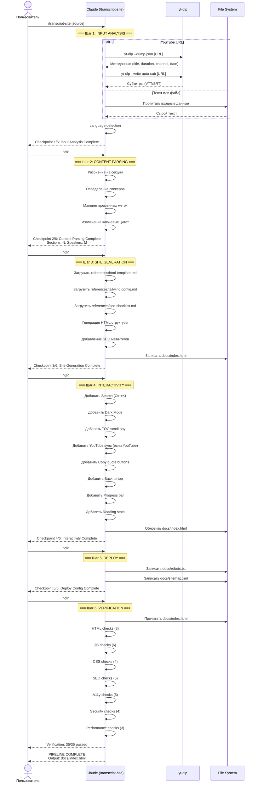
```mermaid
sequenceDiagram
    actor U as Пользователь
    participant C as Claude (/transcript-site)
    participant YT as yt-dlp
    participant FS as File System

    U->>C: /transcript-site [source]

    Note over C: === Шаг 1: INPUT ANALYSIS ===

    alt YouTube URL
        C->>YT: yt-dlp --dump-json [URL]
        YT-->>C: Метаданные (title, duration, channel, date)
        C->>YT: yt-dlp --write-auto-sub [URL]
        YT-->>C: Субтитры (VTT/SRT)
    else Текст или файл
        C->>FS: Прочитать входные данные
        FS-->>C: Сырой текст
    end

    C->>C: Language detection
    C-->>U: Checkpoint 1/6: Input Analysis Complete

    U->>C: "ok"

    Note over C: === Шаг 2: CONTENT PARSING ===

    C->>C: Разбиение на секции
    C->>C: Определение спикеров
    C->>C: Маппинг временных меток
    C->>C: Извлечение ключевых цитат
    C-->>U: Checkpoint 2/6: Content Parsing Complete<br/>Sections: N, Speakers: M

    U->>C: "ok"

    Note over C: === Шаг 3: SITE GENERATION ===

    C->>C: Загрузить references/html-template.md
    C->>C: Загрузить references/tailwind-config.md
    C->>C: Загрузить references/seo-checklist.md
    C->>C: Генерация HTML структуры
    C->>C: Добавление SEO мета-тегов
    C->>FS: Записать docs/index.html
    C-->>U: Checkpoint 3/6: Site Generation Complete

    U->>C: "ok"

    Note over C: === Шаг 4: INTERACTIVITY ===

    C->>C: Добавить Search (Ctrl+K)
    C->>C: Добавить Dark Mode
    C->>C: Добавить TOC scroll-spy
    C->>C: Добавить YouTube sync (если YouTube)
    C->>C: Добавить Copy quote buttons
    C->>C: Добавить Back-to-top
    C->>C: Добавить Progress bar
    C->>C: Добавить Reading stats
    C->>FS: Обновить docs/index.html
    C-->>U: Checkpoint 4/6: Interactivity Complete

    U->>C: "ok"

    Note over C: === Шаг 5: DEPLOY ===

    C->>FS: Записать docs/robots.txt
    C->>FS: Записать docs/sitemap.xml
    C-->>U: Checkpoint 5/6: Deploy Config Complete

    U->>C: "ok"

    Note over C: === Шаг 6: VERIFICATION ===

    C->>FS: Прочитать docs/index.html
    C->>C: HTML checks (8)
    C->>C: JS checks (6)
    C->>C: CSS checks (4)
    C->>C: SEO checks (5)
    C->>C: A11y checks (5)
    C->>C: Security checks (4)
    C->>C: Performance checks (3)
    C-->>U: Verification: 35/35 passed

    C-->>U: PIPELINE COMPLETE<br/>Output: docs/index.html
```

### Flowchart с точками принятия решений

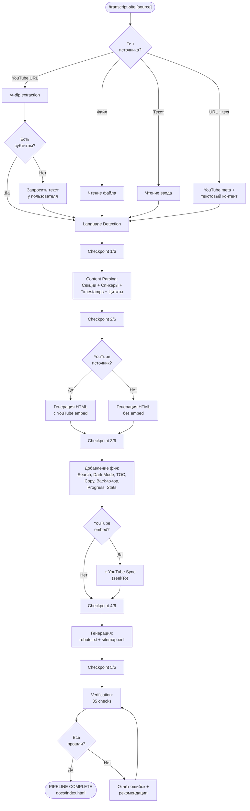
```mermaid
flowchart TD
    START(["/transcript-site [source]"]) --> DETECT{"Тип<br/>источника?"}

    DETECT -->|"YouTube URL"| YTDLP["yt-dlp extraction"]
    DETECT -->|"Файл"| FREAD["Чтение файла"]
    DETECT -->|"Текст"| TREAD["Чтение ввода"]
    DETECT -->|"URL + text"| COMBINED["YouTube meta +<br/>текстовый контент"]

    YTDLP --> HAS_SUBS{"Есть<br/>субтитры?"}
    HAS_SUBS -->|"Да"| LANG["Language Detection"]
    HAS_SUBS -->|"Нет"| MANUAL["Запросить текст<br/>у пользователя"]
    MANUAL --> LANG

    FREAD --> LANG
    TREAD --> LANG
    COMBINED --> LANG

    LANG --> CP1["Checkpoint 1/6"]
    CP1 --> PARSE["Content Parsing:<br/>Секции + Спикеры +<br/>Timestamps + Цитаты"]

    PARSE --> CP2["Checkpoint 2/6"]
    CP2 --> EMBED{"YouTube<br/>источник?"}

    EMBED -->|"Да"| GEN_YT["Генерация HTML<br/>с YouTube embed"]
    EMBED -->|"Нет"| GEN_TEXT["Генерация HTML<br/>без embed"]

    GEN_YT --> CP3["Checkpoint 3/6"]
    GEN_TEXT --> CP3

    CP3 --> FEATURES["Добавление фич:<br/>Search, Dark Mode, TOC,<br/>Copy, Back-to-top,<br/>Progress, Stats"]

    FEATURES --> HAS_YT{"YouTube<br/>embed?"}
    HAS_YT -->|"Да"| ADD_SYNC["+ YouTube Sync<br/>(seekTo)"]
    HAS_YT -->|"Нет"| CP4

    ADD_SYNC --> CP4["Checkpoint 4/6"]

    CP4 --> DEPLOY["Генерация:<br/>robots.txt + sitemap.xml"]
    DEPLOY --> CP5["Checkpoint 5/6"]

    CP5 --> VERIFY["Verification:<br/>35 checks"]
    VERIFY --> PASS{"Все<br/>прошли?"}

    PASS -->|"Да"| DONE(["PIPELINE COMPLETE<br/>docs/index.html"])
    PASS -->|"Нет"| FIX["Отчёт ошибок +<br/>рекомендации"]
    FIX --> VERIFY
```

---

## 2. Flow: YouTube URL

### Sequence Diagram

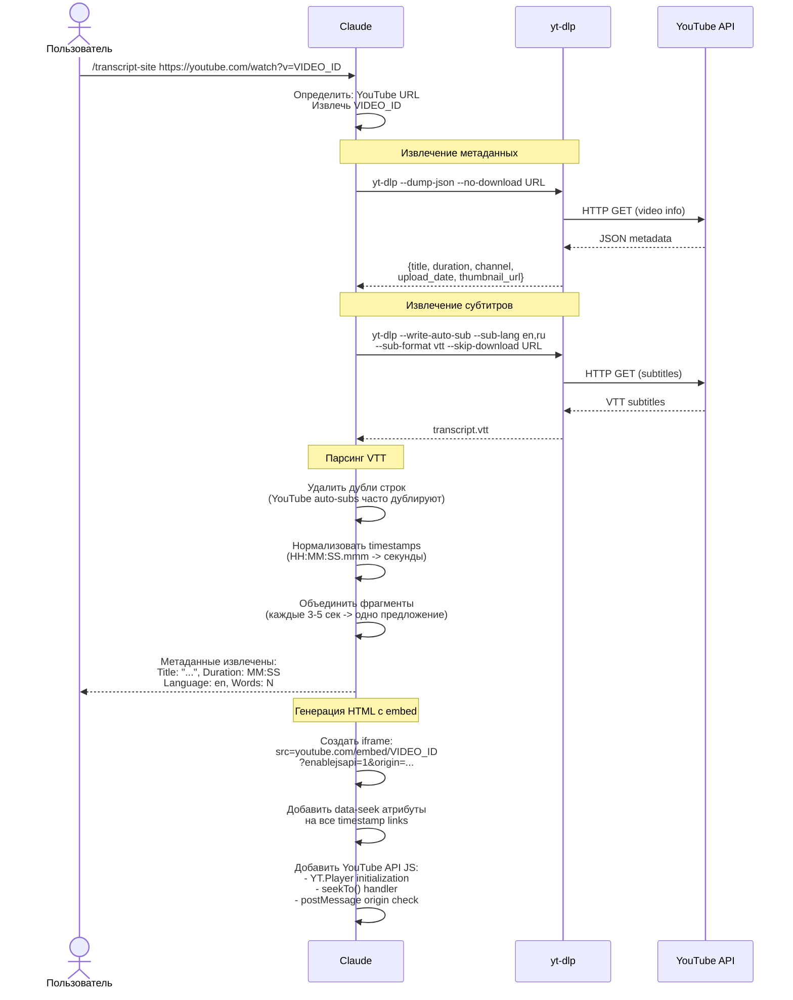
```mermaid
sequenceDiagram
    actor U as Пользователь
    participant C as Claude
    participant YT as yt-dlp
    participant API as YouTube API

    U->>C: /transcript-site https://youtube.com/watch?v=VIDEO_ID

    C->>C: Определить: YouTube URL<br/>Извлечь VIDEO_ID

    Note over C,YT: Извлечение метаданных

    C->>YT: yt-dlp --dump-json --no-download URL
    YT->>API: HTTP GET (video info)
    API-->>YT: JSON metadata
    YT-->>C: {title, duration, channel,<br/>upload_date, thumbnail_url}

    Note over C,YT: Извлечение субтитров

    C->>YT: yt-dlp --write-auto-sub --sub-lang en,ru<br/>--sub-format vtt --skip-download URL
    YT->>API: HTTP GET (subtitles)
    API-->>YT: VTT subtitles
    YT-->>C: transcript.vtt

    Note over C: Парсинг VTT

    C->>C: Удалить дубли строк<br/>(YouTube auto-subs часто дублируют)
    C->>C: Нормализовать timestamps<br/>(HH:MM:SS.mmm -> секунды)
    C->>C: Объединить фрагменты<br/>(каждые 3-5 сек -> одно предложение)

    C-->>U: Метаданные извлечены:<br/>Title: "...", Duration: MM:SS<br/>Language: en, Words: N

    Note over C: Генерация HTML с embed

    C->>C: Создать iframe:<br/>src=youtube.com/embed/VIDEO_ID<br/>?enablejsapi=1&origin=...

    C->>C: Добавить data-seek атрибуты<br/>на все timestamp links

    C->>C: Добавить YouTube API JS:<br/>- YT.Player initialization<br/>- seekTo() handler<br/>- postMessage origin check
```

### Обработка edge cases

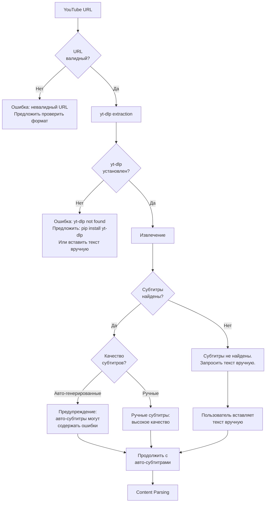
```mermaid
flowchart TD
    URL["YouTube URL"] --> VALID{"URL<br/>валидный?"}
    VALID -->|"Нет"| ERR_URL["Ошибка: невалидный URL<br/>Предложить проверить формат"]
    VALID -->|"Да"| YTDLP_RUN["yt-dlp extraction"]

    YTDLP_RUN --> YTDLP_OK{"yt-dlp<br/>установлен?"}
    YTDLP_OK -->|"Нет"| ERR_YTDLP["Ошибка: yt-dlp not found<br/>Предложить: pip install yt-dlp<br/>Или вставить текст вручную"]
    YTDLP_OK -->|"Да"| EXTRACT["Извлечение"]

    EXTRACT --> SUBS_OK{"Субтитры<br/>найдены?"}
    SUBS_OK -->|"Нет"| NO_SUBS["Субтитры не найдены.<br/>Запросить текст вручную."]
    SUBS_OK -->|"Да"| QUALITY{"Качество<br/>субтитров?"}

    QUALITY -->|"Авто-генерированные"| WARN["Предупреждение:<br/>авто-субтитры могут<br/>содержать ошибки"]
    QUALITY -->|"Ручные"| GOOD["Ручные субтитры:<br/>высокое качество"]

    NO_SUBS --> MANUAL["Пользователь вставляет<br/>текст вручную"]
    WARN --> CONTINUE["Продолжить с<br/>авто-субтитрами"]
    GOOD --> CONTINUE
    MANUAL --> CONTINUE

    CONTINUE --> PARSE["Content Parsing"]
```

---

## 3. Flow: Text-only

### Flowchart

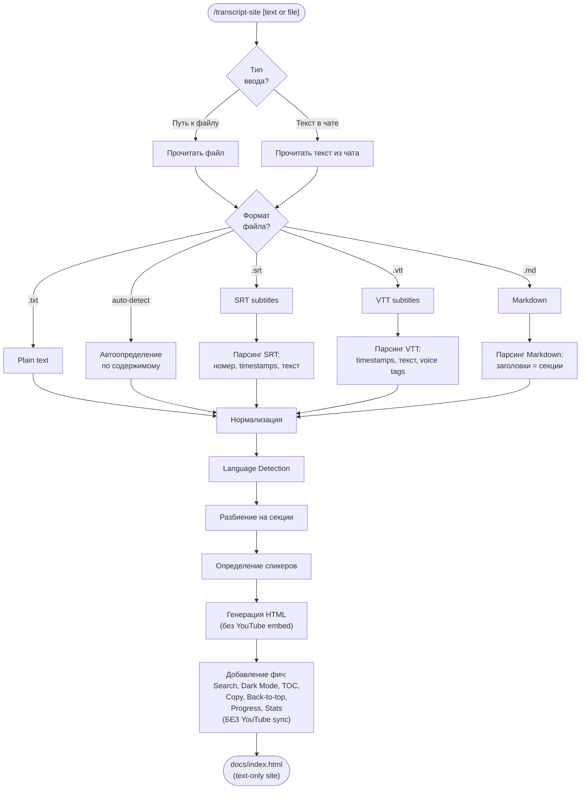
```mermaid
flowchart TD
    START(["/transcript-site [text or file]"]) --> TYPE{"Тип<br/>ввода?"}

    TYPE -->|"Путь к файлу"| READ_FILE["Прочитать файл"]
    TYPE -->|"Текст в чате"| READ_TEXT["Прочитать текст из чата"]

    READ_FILE --> FORMAT{"Формат<br/>файла?"}
    READ_TEXT --> FORMAT

    FORMAT -->|".txt"| PLAIN["Plain text"]
    FORMAT -->|".srt"| SRT["SRT subtitles"]
    FORMAT -->|".vtt"| VTT["VTT subtitles"]
    FORMAT -->|".md"| MD["Markdown"]
    FORMAT -->|"auto-detect"| AUTO["Автоопределение<br/>по содержимому"]

    PLAIN --> NORMALIZE["Нормализация"]
    SRT --> SRT_PARSE["Парсинг SRT:<br/>номер, timestamps, текст"]
    VTT --> VTT_PARSE["Парсинг VTT:<br/>timestamps, текст, voice tags"]
    MD --> MD_PARSE["Парсинг Markdown:<br/>заголовки = секции"]
    AUTO --> NORMALIZE

    SRT_PARSE --> NORMALIZE
    VTT_PARSE --> NORMALIZE
    MD_PARSE --> NORMALIZE

    NORMALIZE --> LANG["Language Detection"]
    LANG --> SECTIONS["Разбиение на секции"]
    SECTIONS --> SPEAKERS["Определение спикеров"]
    SPEAKERS --> GEN["Генерация HTML<br/>(без YouTube embed)"]

    GEN --> FEATURES["Добавление фич:<br/>Search, Dark Mode, TOC,<br/>Copy, Back-to-top,<br/>Progress, Stats<br/>(БЕЗ YouTube sync)"]

    FEATURES --> OUTPUT(["docs/index.html<br/>(text-only site)"])
```

### Отличия от YouTube flow

| Компонент | YouTube flow | Text-only flow |
|-----------|-------------|----------------|
| YouTube embed | Да (iframe) | Нет |
| Timestamp links | Кликабельные (seekTo) | Текстовые метки (нет seekTo) |
| YouTube sync JS | Да | Нет |
| postMessage handler | Да | Нет |
| og:type | video | article |
| JSON-LD | VideoObject | Article |
| Thumbnail | YouTube maxresdefault | Placeholder или пользовательское |

---

## 4. Flow: Search

### Sequence Diagram

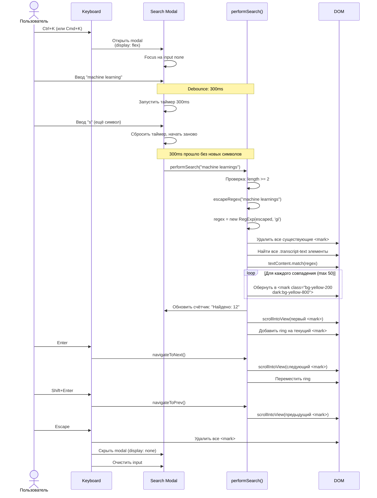
```mermaid
sequenceDiagram
    actor U as Пользователь
    participant K as Keyboard
    participant M as Search Modal
    participant S as performSearch()
    participant DOM as DOM

    U->>K: Ctrl+K (или Cmd+K)
    K->>M: Открыть modal<br/>(display: flex)
    M->>M: Focus на input поле

    U->>M: Ввод "machine learning"

    Note over M,S: Debounce: 300ms

    M->>M: Запустить таймер 300ms
    U->>M: Ввод "s" (ещё символ)
    M->>M: Сбросить таймер, начать заново

    Note over M,S: 300ms прошло без новых символов

    M->>S: performSearch("machine learnings")

    S->>S: Проверка: length >= 2
    S->>S: escapeRegex("machine learnings")
    S->>S: regex = new RegExp(escaped, 'gi')

    S->>DOM: Удалить все существующие <mark>
    S->>DOM: Найти все .transcript-text элементы
    S->>DOM: textContent.match(regex)

    loop Для каждого совпадения (max 50)
        S->>DOM: Обернуть в <mark class="bg-yellow-200<br/>dark:bg-yellow-800">
    end

    S->>M: Обновить счётчик: "Найдено: 12"
    S->>DOM: scrollIntoView(первый <mark>)
    S->>DOM: Добавить ring на текущий <mark>

    U->>K: Enter
    K->>S: navigateToNext()
    S->>DOM: scrollIntoView(следующий <mark>)
    S->>DOM: Переместить ring

    U->>K: Shift+Enter
    K->>S: navigateToPrev()
    S->>DOM: scrollIntoView(предыдущий <mark>)

    U->>K: Escape
    K->>DOM: Удалить все <mark>
    K->>M: Скрыть modal (display: none)
    K->>M: Очистить input
```

### Flowchart обработки поиска

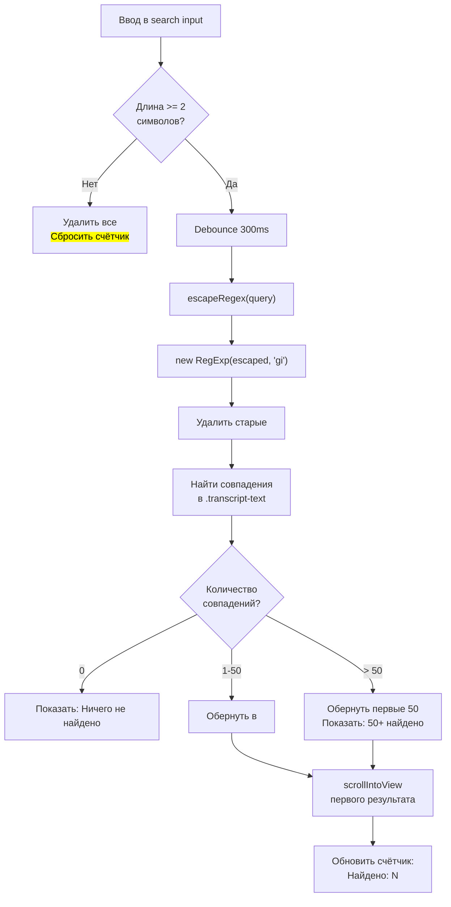
```mermaid
flowchart TD
    INPUT["Ввод в search input"] --> CHECK_LEN{"Длина >= 2<br/>символов?"}

    CHECK_LEN -->|"Нет"| CLEAR["Удалить все <mark><br/>Сбросить счётчик"]
    CHECK_LEN -->|"Да"| DEBOUNCE["Debounce 300ms"]

    DEBOUNCE --> ESCAPE_REGEX["escapeRegex(query)"]
    ESCAPE_REGEX --> CREATE_REGEX["new RegExp(escaped, 'gi')"]

    CREATE_REGEX --> CLEAR_OLD["Удалить старые <mark>"]
    CLEAR_OLD --> FIND["Найти совпадения<br/>в .transcript-text"]

    FIND --> COUNT{"Количество<br/>совпадений?"}

    COUNT -->|"0"| NO_RESULTS["Показать: Ничего не найдено"]
    COUNT -->|"1-50"| HIGHLIGHT["Обернуть в <mark>"]
    COUNT -->|"> 50"| LIMIT["Обернуть первые 50<br/>Показать: 50+ найдено"]

    HIGHLIGHT --> SCROLL["scrollIntoView<br/>первого результата"]
    LIMIT --> SCROLL

    SCROLL --> COUNTER["Обновить счётчик:<br/>Найдено: N"]
```

---

## 5. Flow: Dark Mode

### Flowchart

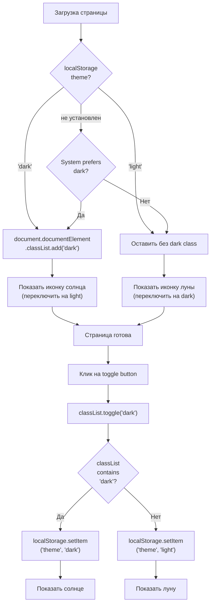
```mermaid
flowchart TD
    PAGE_LOAD["Загрузка страницы"] --> CHECK_LS{"localStorage<br/>theme?"}

    CHECK_LS -->|"'dark'"| SET_DARK["document.documentElement<br/>.classList.add('dark')"]
    CHECK_LS -->|"'light'"| SET_LIGHT["Оставить без dark class"]
    CHECK_LS -->|"не установлен"| CHECK_SYSTEM{"System prefers<br/>dark?"}

    CHECK_SYSTEM -->|"Да"| SET_DARK
    CHECK_SYSTEM -->|"Нет"| SET_LIGHT

    SET_DARK --> SHOW_SUN["Показать иконку солнца<br/>(переключить на light)"]
    SET_LIGHT --> SHOW_MOON["Показать иконку луны<br/>(переключить на dark)"]

    SHOW_SUN --> READY["Страница готова"]
    SHOW_MOON --> READY

    READY --> CLICK["Клик на toggle button"]

    CLICK --> TOGGLE["classList.toggle('dark')"]
    TOGGLE --> IS_DARK{"classList<br/>contains<br/>'dark'?"}

    IS_DARK -->|"Да"| STORE_DARK["localStorage.setItem<br/>('theme', 'dark')"]
    IS_DARK -->|"Нет"| STORE_LIGHT["localStorage.setItem<br/>('theme', 'light')"]

    STORE_DARK --> UPDATE_ICON["Показать солнце"]
    STORE_LIGHT --> UPDATE_ICON_2["Показать луну"]
```

### Sequence Diagram

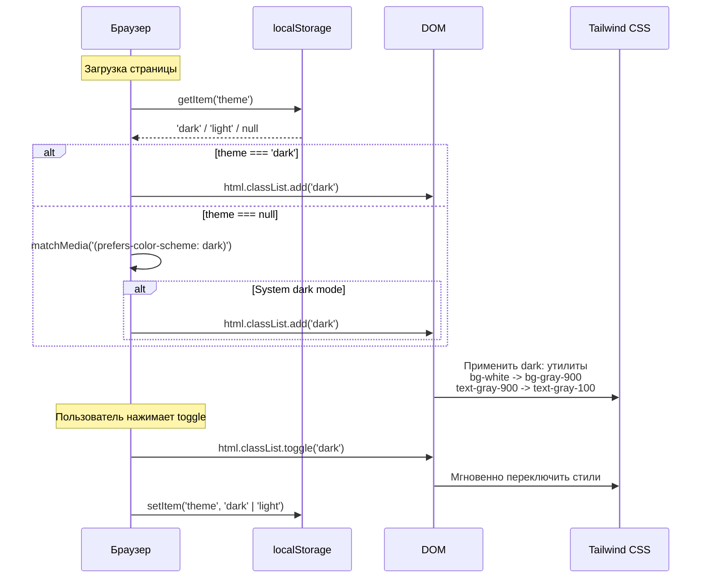
```mermaid
sequenceDiagram
    participant B as Браузер
    participant LS as localStorage
    participant DOM as DOM
    participant CSS as Tailwind CSS

    Note over B: Загрузка страницы

    B->>LS: getItem('theme')
    LS-->>B: 'dark' / 'light' / null

    alt theme === 'dark'
        B->>DOM: html.classList.add('dark')
    else theme === null
        B->>B: matchMedia('(prefers-color-scheme: dark)')
        alt System dark mode
            B->>DOM: html.classList.add('dark')
        end
    end

    DOM->>CSS: Применить dark: утилиты<br/>bg-white -> bg-gray-900<br/>text-gray-900 -> text-gray-100

    Note over B: Пользователь нажимает toggle

    B->>DOM: html.classList.toggle('dark')
    DOM->>CSS: Мгновенно переключить стили
    B->>LS: setItem('theme', 'dark' | 'light')
```

---

## 6. Flow: TOC Scroll-Spy

### Sequence Diagram

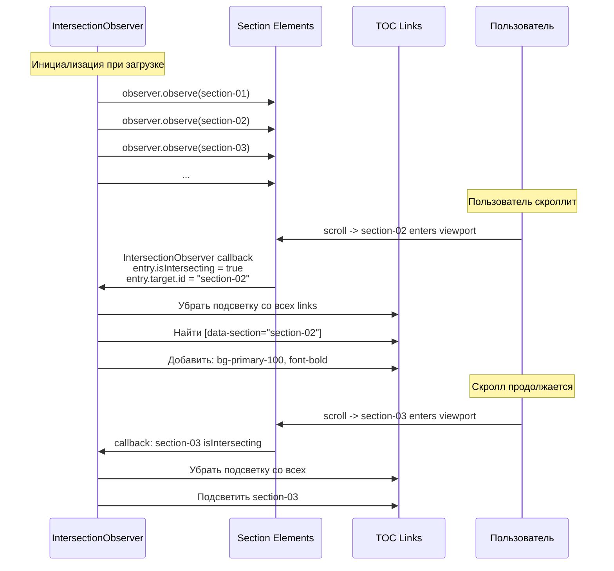
```mermaid
sequenceDiagram
    participant IO as IntersectionObserver
    participant SEC as Section Elements
    participant TOC as TOC Links
    participant U as Пользователь

    Note over IO: Инициализация при загрузке

    IO->>SEC: observer.observe(section-01)
    IO->>SEC: observer.observe(section-02)
    IO->>SEC: observer.observe(section-03)
    IO->>SEC: ...

    Note over U: Пользователь скроллит

    U->>SEC: scroll -> section-02 enters viewport

    SEC->>IO: IntersectionObserver callback<br/>entry.isIntersecting = true<br/>entry.target.id = "section-02"

    IO->>TOC: Убрать подсветку со всех links
    IO->>TOC: Найти [data-section="section-02"]
    IO->>TOC: Добавить: bg-primary-100, font-bold

    Note over U: Скролл продолжается

    U->>SEC: scroll -> section-03 enters viewport

    SEC->>IO: callback: section-03 isIntersecting

    IO->>TOC: Убрать подсветку со всех
    IO->>TOC: Подсветить section-03
```

### Flowchart

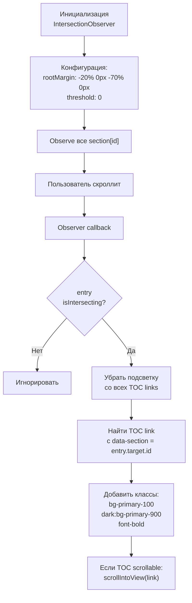
```mermaid
flowchart TD
    INIT["Инициализация<br/>IntersectionObserver"] --> CONFIG["Конфигурация:<br/>rootMargin: -20% 0px -70% 0px<br/>threshold: 0"]

    CONFIG --> OBSERVE["Observe все section[id]"]
    OBSERVE --> SCROLL["Пользователь скроллит"]

    SCROLL --> CALLBACK["Observer callback"]
    CALLBACK --> IS_INTERSECTING{"entry<br/>isIntersecting?"}

    IS_INTERSECTING -->|"Нет"| IGNORE["Игнорировать"]
    IS_INTERSECTING -->|"Да"| REMOVE_ALL["Убрать подсветку<br/>со всех TOC links"]

    REMOVE_ALL --> FIND_LINK["Найти TOC link<br/>с data-section = entry.target.id"]

    FIND_LINK --> HIGHLIGHT["Добавить классы:<br/>bg-primary-100<br/>dark:bg-primary-900<br/>font-bold"]

    HIGHLIGHT --> SCROLL_TOC["Если TOC scrollable:<br/>scrollIntoView(link)"]
```

---

## 7. Flow: Copy Quote

### Sequence Diagram

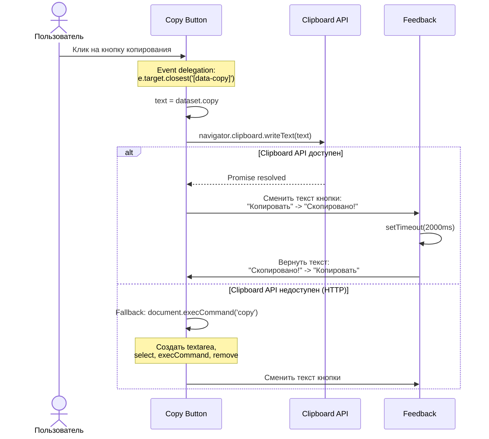
```mermaid
sequenceDiagram
    actor U as Пользователь
    participant BTN as Copy Button
    participant CB as Clipboard API
    participant FB as Feedback

    U->>BTN: Клик на кнопку копирования

    Note over BTN: Event delegation:<br/>e.target.closest('[data-copy]')

    BTN->>BTN: text = dataset.copy
    BTN->>CB: navigator.clipboard.writeText(text)

    alt Clipboard API доступен
        CB-->>BTN: Promise resolved
        BTN->>FB: Сменить текст кнопки:<br/>"Копировать" -> "Скопировано!"
        FB->>FB: setTimeout(2000ms)
        FB->>BTN: Вернуть текст:<br/>"Скопировано!" -> "Копировать"
    else Clipboard API недоступен (HTTP)
        BTN->>BTN: Fallback: document.execCommand('copy')
        Note over BTN: Создать textarea,<br/>select, execCommand, remove
        BTN->>FB: Сменить текст кнопки
    end
```

### Flowchart

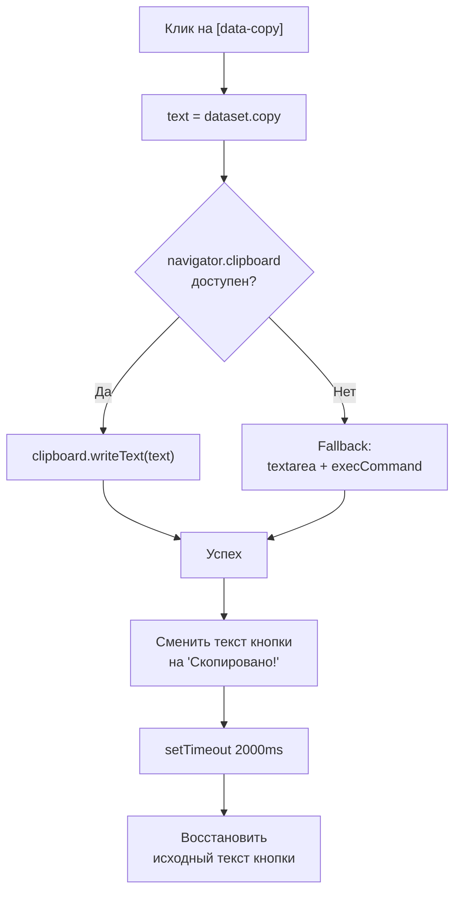
```mermaid
flowchart TD
    CLICK["Клик на [data-copy]"] --> GET_TEXT["text = dataset.copy"]
    GET_TEXT --> CHECK_API{"navigator.clipboard<br/>доступен?"}

    CHECK_API -->|"Да"| CLIPBOARD["clipboard.writeText(text)"]
    CHECK_API -->|"Нет"| FALLBACK["Fallback:<br/>textarea + execCommand"]

    CLIPBOARD --> SUCCESS["Успех"]
    FALLBACK --> SUCCESS

    SUCCESS --> FEEDBACK["Сменить текст кнопки<br/>на 'Скопировано!'"]
    FEEDBACK --> TIMEOUT["setTimeout 2000ms"]
    TIMEOUT --> RESTORE["Восстановить<br/>исходный текст кнопки"]
```

---

## 8. Flow: Mobile Navigation

### Flowchart

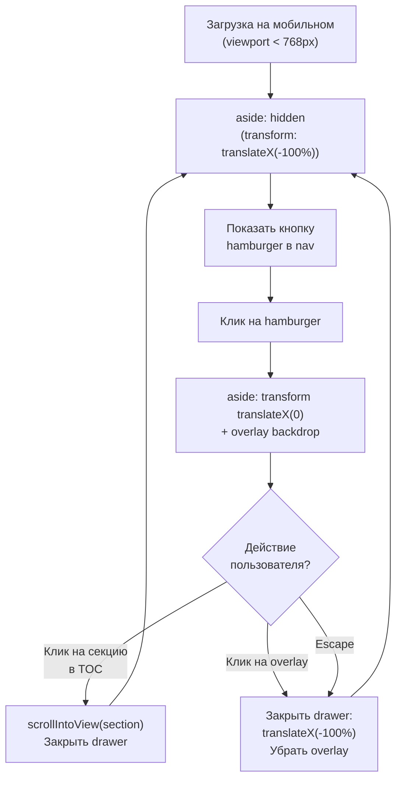
```mermaid
flowchart TD
    LOAD["Загрузка на мобильном<br/>(viewport < 768px)"] --> HIDE_ASIDE["aside: hidden<br/>(transform: translateX(-100%))"]

    HIDE_ASIDE --> SHOW_HAMBURGER["Показать кнопку<br/>hamburger в nav"]

    SHOW_HAMBURGER --> CLICK_HAMBURGER["Клик на hamburger"]
    CLICK_HAMBURGER --> OPEN_DRAWER["aside: transform translateX(0)<br/>+ overlay backdrop"]

    OPEN_DRAWER --> USER_CHOICE{"Действие<br/>пользователя?"}

    USER_CHOICE -->|"Клик на секцию<br/>в TOC"| SCROLL_SECTION["scrollIntoView(section)<br/>Закрыть drawer"]
    USER_CHOICE -->|"Клик на overlay"| CLOSE_DRAWER["Закрыть drawer:<br/>translateX(-100%)<br/>Убрать overlay"]
    USER_CHOICE -->|"Escape"| CLOSE_DRAWER

    SCROLL_SECTION --> HIDE_ASIDE
    CLOSE_DRAWER --> HIDE_ASIDE
```

### Sequence Diagram

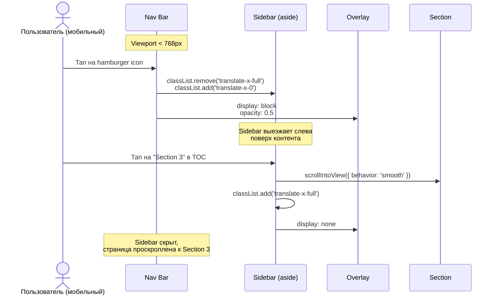
```mermaid
sequenceDiagram
    actor U as Пользователь (мобильный)
    participant NAV as Nav Bar
    participant ASIDE as Sidebar (aside)
    participant OVERLAY as Overlay
    participant SECTION as Section

    Note over NAV: Viewport < 768px

    U->>NAV: Тап на hamburger icon

    NAV->>ASIDE: classList.remove('translate-x-full')<br/>classList.add('translate-x-0')
    NAV->>OVERLAY: display: block<br/>opacity: 0.5

    Note over ASIDE: Sidebar выезжает слева<br/>поверх контента

    U->>ASIDE: Тап на "Section 3" в TOC

    ASIDE->>SECTION: scrollIntoView({ behavior: 'smooth' })
    ASIDE->>ASIDE: classList.add('translate-x-full')
    ASIDE->>OVERLAY: display: none

    Note over NAV: Sidebar скрыт,<br/>страница проскроллена к Section 3
```

---

## 9. Flow: YouTube Timestamp Sync

### Sequence Diagram

```mermaid
sequenceDiagram
    actor U as Пользователь
    participant LINK as Timestamp Link
    participant JS as Event Handler
    participant IFRAME as YouTube iframe
    participant YT as YouTube Player API

    Note over IFRAME: При загрузке страницы

    JS->>IFRAME: Create iframe with enablejsapi=1
    IFRAME->>YT: Load YouTube IFrame API
    YT-->>JS: onYouTubeIframeAPIReady()
    JS->>YT: new YT.Player('yt-player', {...})
    YT-->>JS: player ready

    Note over U: Клик на timestamp

    U->>LINK: Клик на [2:05]

    Note over LINK: HTML:<br/>a data-seek="125"

    LINK->>JS: click event (delegation)
    JS->>JS: e.target.closest('[data-seek]')
    JS->>JS: seconds = parseInt(dataset.seek) = 125

    JS->>YT: player.seekTo(125, true)
    YT->>IFRAME: Перемотка на 2:05

    JS->>IFRAME: scrollIntoView({ behavior: 'smooth' })<br/>(если iframe не в viewport)

    Note over U: Видео начинает воспроизведение с 2:05
```

### Flowchart с обработкой ошибок

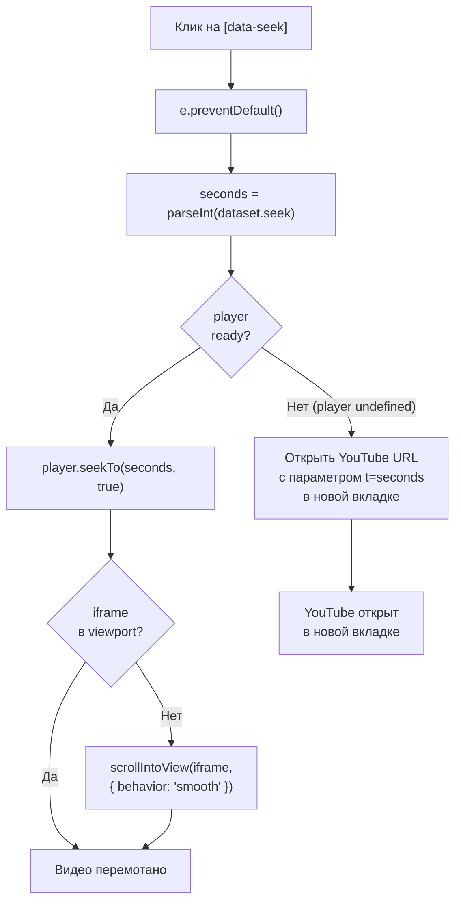
```mermaid
flowchart TD
    CLICK["Клик на [data-seek]"] --> PREVENT["e.preventDefault()"]
    PREVENT --> PARSE["seconds = parseInt(dataset.seek)"]

    PARSE --> CHECK_PLAYER{"player<br/>ready?"}

    CHECK_PLAYER -->|"Да"| SEEK["player.seekTo(seconds, true)"]
    CHECK_PLAYER -->|"Нет (player undefined)"| FALLBACK_1["Открыть YouTube URL<br/>с параметром t=seconds<br/>в новой вкладке"]

    SEEK --> IN_VIEW{"iframe<br/>в viewport?"}

    IN_VIEW -->|"Да"| DONE["Видео перемотано"]
    IN_VIEW -->|"Нет"| SCROLL["scrollIntoView(iframe,<br/>{ behavior: 'smooth' })"]
    SCROLL --> DONE

    FALLBACK_1 --> DONE_ALT["YouTube открыт<br/>в новой вкладке"]
```

---

## 10. Flow: GitHub Pages Deployment

### Flowchart

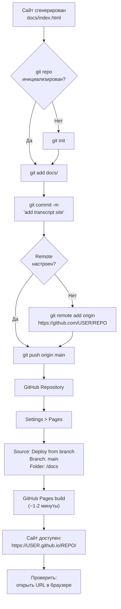
```mermaid
flowchart TD
    GEN["Сайт сгенерирован<br/>docs/index.html"] --> GIT_INIT{"git repo<br/>инициализирован?"}

    GIT_INIT -->|"Нет"| INIT["git init"]
    GIT_INIT -->|"Да"| ADD

    INIT --> ADD["git add docs/"]
    ADD --> COMMIT["git commit -m<br/>'add transcript site'"]
    COMMIT --> REMOTE{"Remote<br/>настроен?"}

    REMOTE -->|"Нет"| ADD_REMOTE["git remote add origin<br/>https://github.com/USER/REPO"]
    REMOTE -->|"Да"| PUSH

    ADD_REMOTE --> PUSH["git push origin main"]
    PUSH --> GITHUB["GitHub Repository"]
    GITHUB --> SETTINGS["Settings > Pages"]

    SETTINGS --> CONFIG["Source: Deploy from branch<br/>Branch: main<br/>Folder: /docs"]
    CONFIG --> BUILD["GitHub Pages build<br/>(~1-2 минуты)"]
    BUILD --> LIVE["Сайт доступен:<br/>https://USER.github.io/REPO/"]

    LIVE --> VERIFY_LIVE["Проверить:<br/>открыть URL в браузере"]
```

### Sequence Diagram с GitHub Actions

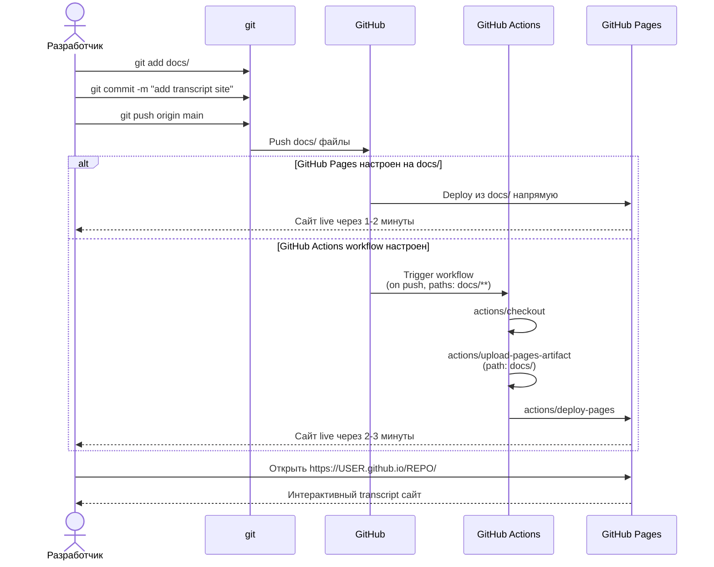
```mermaid
sequenceDiagram
    actor D as Разработчик
    participant GIT as git
    participant GH as GitHub
    participant GA as GitHub Actions
    participant GP as GitHub Pages

    D->>GIT: git add docs/
    D->>GIT: git commit -m "add transcript site"
    D->>GIT: git push origin main

    GIT->>GH: Push docs/ файлы

    alt GitHub Pages настроен на docs/
        GH->>GP: Deploy из docs/ напрямую
        GP-->>D: Сайт live через 1-2 минуты
    else GitHub Actions workflow настроен
        GH->>GA: Trigger workflow<br/>(on push, paths: docs/**)
        GA->>GA: actions/checkout
        GA->>GA: actions/upload-pages-artifact<br/>(path: docs/)
        GA->>GP: actions/deploy-pages
        GP-->>D: Сайт live через 2-3 минуты
    end

    D->>GP: Открыть https://USER.github.io/REPO/
    GP-->>D: Интерактивный transcript сайт
```

---

## 11. Flow: Error Handling

### yt-dlp не найден

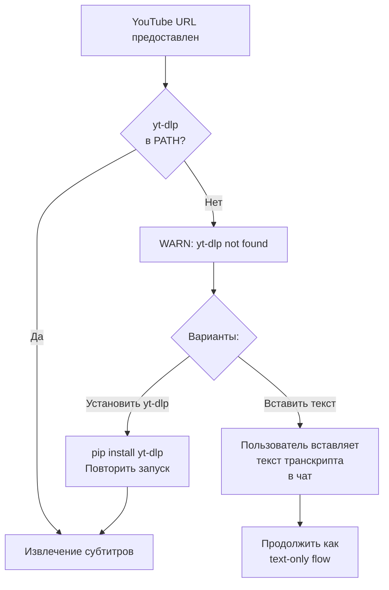
```mermaid
flowchart TD
    URL["YouTube URL предоставлен"] --> CHECK{"yt-dlp<br/>в PATH?"}

    CHECK -->|"Да"| EXTRACT["Извлечение субтитров"]
    CHECK -->|"Нет"| ERROR["WARN: yt-dlp not found"]

    ERROR --> OPTIONS{"Варианты:"}

    OPTIONS -->|"Установить yt-dlp"| INSTALL["pip install yt-dlp<br/>Повторить запуск"]
    OPTIONS -->|"Вставить текст"| MANUAL["Пользователь вставляет<br/>текст транскрипта<br/>в чат"]

    MANUAL --> CONTINUE["Продолжить как<br/>text-only flow"]
    INSTALL --> EXTRACT
```

### Транскрипт слишком короткий

```mermaid
flowchart TD
    PARSE["Content Parsing"] --> COUNT{"Слов<br/>< 50?"}

    COUNT -->|"Да"| SHORT["WARN: Транскрипт слишком короткий"]
    COUNT -->|"Нет"| CONTINUE["Продолжить"]

    SHORT --> OPTIONS{"Варианты:"}

    OPTIONS -->|"Продолжить<br/>(small site)"| SMALL["Генерация minimal site:<br/>1 секция, без TOC"]
    OPTIONS -->|"Добавить текст"| ADD["Пользователь добавляет<br/>ещё текст"]
    OPTIONS -->|"Отмена"| CANCEL["Прервать пайплайн"]

    ADD --> PARSE
```

### HTML validation failure

```mermaid
flowchart TD
    VERIFY["Шаг 6: Verification"] --> CHECK{"Все 35<br/>проверок<br/>прошли?"}

    CHECK -->|"Да"| DONE["PIPELINE COMPLETE"]
    CHECK -->|"Нет"| REPORT["Отчёт ошибок"]

    REPORT --> SEVERITY{"Уровень<br/>ошибок?"}

    SEVERITY -->|"Critical<br/>(HTML, Security)"| BLOCK["BLOCK: Исправить<br/>перед деплоем"]
    SEVERITY -->|"Warning<br/>(Performance)"| WARN["WARN: Рекомендации"]
    SEVERITY -->|"Info<br/>(SEO optional)"| INFO["INFO: Опционально"]

    BLOCK --> AUTO_FIX{"Авто-<br/>исправление<br/>возможно?"}

    AUTO_FIX -->|"Да"| FIX["Автоматическое<br/>исправление"]
    AUTO_FIX -->|"Нет"| MANUAL["Требуется ручное<br/>вмешательство"]

    FIX --> REVERIFY["Повторная<br/>верификация"]
    REVERIFY --> CHECK

    WARN --> DONE_WARN["PIPELINE COMPLETE<br/>(с предупреждениями)"]
    INFO --> DONE_INFO["PIPELINE COMPLETE"]
```

### Общая обработка ошибок

```mermaid
flowchart TD
    ERROR["Ошибка на любом шаге"] --> TYPE{"Тип<br/>ошибки?"}

    TYPE -->|"yt-dlp не найден"| YTDLP_ERR["Предложить установку<br/>или ручной ввод"]
    TYPE -->|"Пустой транскрипт"| EMPTY_ERR["Запросить текст<br/>у пользователя"]
    TYPE -->|"Файл не найден"| FILE_ERR["Проверить путь<br/>Показать ls директории"]
    TYPE -->|"Кодировка"| ENC_ERR["Предложить конвертацию<br/>iconv -f WINDOWS-1251 -t UTF-8"]
    TYPE -->|"Превышен размер"| SIZE_ERR["Предложить chunking<br/>--chunking multi"]
    TYPE -->|"GitHub Pages 404"| GH_ERR["Проверить Settings > Pages<br/>Branch + Folder"]
    TYPE -->|"Tailwind CDN offline"| CDN_ERR["Предложить --tailwind inline"]

    YTDLP_ERR --> CONTINUE["Продолжить<br/>с fallback"]
    EMPTY_ERR --> CONTINUE
    FILE_ERR --> RETRY["Повторить<br/>с правильным путём"]
    ENC_ERR --> RETRY
    SIZE_ERR --> CONTINUE
    GH_ERR --> MANUAL_FIX["Ручная настройка<br/>GitHub Pages"]
    CDN_ERR --> CONTINUE
```

---

## Быстрый справочник команд

| Команда | Назначение | Минимальный вход | Результат |
|---------|-----------|-----------------|-----------|
| `/transcript-site [source]` | Полный пайплайн (6 шагов) | YouTube URL, текст или путь к файлу | docs/index.html + robots.txt + sitemap.xml |
| `/transcript-site-generate [source]` | Только генерация HTML (шаги 1-4) | YouTube URL, текст или путь к файлу | docs/index.html |
| `/transcript-site-deploy [path]` | Только деплой конфиг (шаги 5-6) | Путь к существующему HTML | robots.txt + sitemap.xml + verification |

## Частые сценарии

```
# YouTube видео -> интерактивный сайт
/transcript-site https://youtube.com/watch?v=VIDEO_ID

# Текстовый файл -> сайт
/transcript-site /path/to/transcript.txt

# Markdown файл -> сайт
/transcript-site researches/case/08_executive_summary.md

# YouTube + исправленный текст
/transcript-site https://youtube.com/watch?v=... --text corrected.txt

# Кастомная тема + язык
/transcript-site [source] --theme emerald --lang ru

# Полностью offline-совместимый сайт
/transcript-site [source] --tailwind inline --icons inline --no-embed

# Multi-page для длинного транскрипта
/transcript-site [source] --chunking multi --output docs/long-talk/
```
