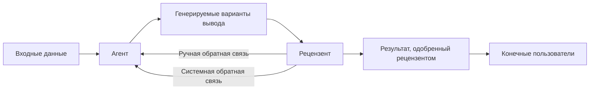

# Human in the loop — pick the autonomy level, then decide exactly when the agent stops and hands control to a person

## Output
An oversight design for one agent, landing in an ADR, an architecture step or a code review: the
autonomy level it ships at and the human role that pairs with it; the escalation trigger set, split
into qualitative conditions and instrumented uncertainty measures, each with the cutoff you chose and
the reason it is that number; the consequence weighting for this domain and the escalation budget the
review team can absorb; the contents of the handoff packet; the review protocol for an escalated case
and who sits on it; the two feedback loops and where each one lands; the delegation ladder that
widens autonomy over time plus the recovery path when the agent errs; and the countermeasures against
the four oversight-degradation modes, because an oversight design that ignores them decays into a
rubber stamp.

## When to use / NOT
- Use when: deciding whether an agent acts, proposes, or only drafts; choosing what fraction of cases
  a human must see and which ones; setting or re-tuning a confidence cutoff that routes a case to
  review; designing what a person receives at the moment control passes to them; standing up the
  review process for escalated cases and deciding who sits on it; diagnosing an oversight loop that
  has stopped working — reviewers approving without reading, alert volume drowning the important
  signal, the on-call team no longer skilled enough to judge; planning how an agent earns wider
  authority over months, and what happens to that authority after it makes a mistake; sizing how much
  of a human workflow an agent may replace before the remaining human support becomes too thin.
- NOT for: designing the interface, modality or conversational behaviour through which the human
  perceives all of this (→ `aiagents-agent-ux` — it owns what the screen shows and how the agent
  talks when unsure; this skill owns when the transfer of control happens at all); deciding who in
  the organisation carries responsibility for the agent's actions, what authority a team is granted,
  or which compliance and audit obligations apply (→ `aiagents-org-adoption-and-governance`); the
  technical perimeter — guardrails, roles and permissions, sandboxing, safe states as containment
  against an attacker or a misaligned agent (→ `aiagents-agent-security`, and for non-agent software
  `security-audit`, `security-testing`, `agentshield-scan`); the control-flow archetype and the step
  chain the agent executes between handoffs (→ `aiagents-orchestration-and-planning`); which
  production metrics to collect, at what alert threshold, and how to detect drift
  (→ `aiagents-observability-and-drift`); the loop that turns a detected failure into a fix
  (→ `aiagents-improvement-loops`); release readiness gates and staged rollout
  (→ `aiagents-release-gates-and-rollout`); how many agents there are and how they coordinate
  (→ `aiagents-single-vs-multi-agent`); human on-call process, paging and ITIL problem management for
  ordinary services (→ `incident-response`, `itsm-itil`); producing the owner-facing decision page
  (→ `decision-mockups`).

## Decision criteria

*Ordering note: the sequence §1 → §8 below is an authoring aid for running the decision, not a
procedure the book states in that order (адаптация для агента, не из книги). Each subsection's
content is traceable to the KUs it cites.*

### 1. Fix the autonomy level before you design any escalation (KU: ch03-p66-ku09, ch13-p340-ku01)
The book treats the degree of autonomy as a frequently-forgotten part of the experience: every user,
every task and every setting wants its own amount of control, and those preferences do not stay put —
they move with trust, familiarity with the task, how much is at stake, and workload [p.81]. The
concept the book credits to Andrej Karpathy is a smooth **регулятор автономности** (autonomy slider)
running from fully manual, through partial automation, to fully autonomous work [p.81].

Three positions, in the book's two worked settings [p.81-82]:

| Position | Developer setting [p.81-82] | Customer-support setting [p.82] |
|---|---|---|
| **Ручной** | The developer writes all the code; the IDE is an editor with highlighting and static analysis, no AI suggestions | Operators answer on their own |
| **С промптом** (assisting) | The agent offers completions, refactorings and documentation; every suggestion is checked and accepted by the human — speed at full control | The agent drafts replies with recommendations; the operator edits and approves |
| **Агентный** | The agent performs routine refactoring, static-analysis fixes and boilerplate generation to project conventions on its own; the developer is notified but does not confirm each action | The agent closes routine work itself (password resets, order tracking, FAQ) and escalates only the complex and the sensitive |

Skip the slider entirely and you land in one of two failure shapes: the agent reads as weak because it
demands too much manual input, or as intrusive because it acts without consent in a sensitive context
[p.82].

Five integration principles [p.83]:
- [ ] **Name the levels plainly** — comprehensible mode names and an explanation of what choosing each
      one means.
- [ ] **Make switching natural** — a fast toggle between levels as trust, context or load change.
- [ ] **Keep behaviour predictable per level** — under partial automation a draft requires explicit
      confirmation; under full autonomy, status updates and intervention options.
- [ ] **Communicate each level's risks and benefits** — for critical tasks, an explicit confirmation
      before full autonomy is switched on.
- [ ] **Adapt to trust and competence** — offer higher levels progressively; the book's illustration
      is proposing prompt-assisted mode after ten successful manual runs.

The check question the book leaves you with: how easily people can move between working modes [p.83].
Read the slider as a trust-forming mechanism rather than a mere feature [p.83].

**The human role that pairs with the level.** The book's role axis is executor → reviewer →
collaborator → governor [p.341]. Early deployments have the human launching tasks and watching results
closely; as trust accumulates the human moves to checking decisions at key control points, above all
where risk is high or regulation is tight [p.340-341].


Re-derived from табл. 13.1 [p.341] around one question — *which rung are we on, and what has to exist
for it*. The last column reports the interaction needs the table names for that rung; the book states
them as needs, not as a certification checklist.

| Rung | The human's duties [p.341] | The agent's autonomy [p.341] | Interaction needs named for this rung [p.341] |
|---|---|---|---|
| **Исполнитель** (executor) | submits tasks, checks every result | minimal; works under supervision | step-by-step guidance; very short feedback cycles |
| **Ревьюер** (reviewer) | spot-checks key results | moderate; routine already sits with the agent | dashboards; exception flags; confidence scores |
| **Коллега** (collaborator) | sets priorities; annotates jointly with the agent | high; the agent plans and acts under supervision | a joint-planning interface; contextual annotations |
| **Управляющий** (governor) | defines policies; audits decisions; oversees escalation | autonomous within the governing rules | policy-configuration screens; audit logs; explainability tooling |

A governor additionally needs system-wide observability and tooling to check alignment against
compliance schemes and human values [p.342]. In mature flows the human sets high-level goals and
intervenes for nuance, error handling and ethical judgement [p.341].

Two constraints on how you read this axis: the specific role is not pinned by it — it depends on the
task, its criticality and how much the human trusts the agent [p.340]; and the rungs are not a queue.
The GitLab Security Bot case shows executor, reviewer and governor coexisting inside one system, with
individual people shifting upward as trust accumulates [p.342]. Design consequence the book draws:
plan for the role your users and their organisations will grow into, not only today's interaction
[p.342].

### 2. Write the escalation triggers — qualitative conditions first (KU: ch11-p280-ku07)
The selection principle: surface the cases with the model's **lowest** confidence and the results with
the **heaviest** consequences, so human judgement is spent on the most valuable interactions rather
than on routine [p.290].

Four qualitative triggers [p.290]:
- [ ] Long-running errors with no clear technical explanation.
- [ ] Workflow anomalies with regulatory or ethical implications.
- [ ] Failures on especially important or critical tasks.
- [ ] Recommendations or conclusions produced by the automation that contradict each other.

**The channel that fills the reviewer's queue**, as the book describes it, is the automated pipeline:
it flags incidents crossing pre-defined thresholds, surfaces unexplained patterns, or presents
unresolved conflicts [p.290]. The section names no other route into the reviewer's queue — if your
design also lets a user, an operator or a downstream system push a case into review, that is your
addition, not the book's (вывод экстрактора, зафиксированный в KU ch11-p280-ku09).

### 3. Instrument the uncertainty — and treat every number as an example (KU: ch11-p280-ku07)
Five instruments [p.290]. **Every figure below is given in the book as an illustration («например…»),
not as a constant to adopt** [p.290] — the cutoff is a property of the instrument *and* the context,
which is why the same section carries two different ones.

| Instrument | What it reads | The book's illustrative reading [p.290] |
|---|---|---|
| Self-assessed confidence in the answer | a 0–1 score the model appends to its own output; some foundation models can do this (GPT-5 is the model named) | — |
| A cutoff on that score | routes anything below the line to a human | escalate below 0,7 |
| Entropy of the probability distribution | on a classification, higher entropy means a less clear-cut result | — |
| Agreement across repeated runs | the same input is run through several inferences and the spread is measured | three to five inferences; divergence above 20 % reads as a shaky answer |
| An external arbiter | a separate critic model scoring the coherence of the produced answer | — |

The context-bound cutoff, in the book's SOC-agent example: a threat classification below **0,8** goes
to review, while the confident routine detections stay with the automation [p.290].

**Consequence weighting** runs on the domain's own criticality scale. The SOC agent's labelling has
two axes [p.290]: incident class — a «high» level covering, say, a probable data breach — and the
asset touched, say administrator accounts. The book's folding of the two axes is presented as an
example: multiply the uncertainty measure by the consequence weight and compare the product against a
priority threshold [p.290].

### 4. Size the escalation BUDGET — it is a design parameter, not an outcome (KU: ch11-p280-ku07)
Choosing the cutoffs is work the book proposes to hand to automation: a tool such as DSPy tunes them
against accumulated history, simulating what share of cases each variant would send to a human. The
load figure the book names is keeping escalations under **10 %** of cases, or reviewers burn out
[p.290].

Read that as one number to design against, not as a hidden extra: two cutoffs plus a consequence
weighting produce a volume, and if the volume exceeds what your review team can absorb, the cutoffs —
not the reviewers — are what has to move. The hybrid arrangement the book is aiming at has the AI
handling the bulk of routine decisions and the human stepping in where judgement is genuinely needed
[p.290]. Without clearly defined triggers, the automation risks inappropriate or short-sighted
interventions [p.291].

### 5. Shape the handoff — the receiving human needs context, not a ticket (KU: ch13-p340-ku13)
Escalation is a policy-and-infrastructure layer that keeps agents inside their authority, above all in
critical or ambiguous situations [p.354]. A well-designed scheme states the specific decision types,
risk levels and confidence boundaries at which human control is required [p.354].

Two authority-partition illustrations. **The book presents both through «может» — they are assumptions
in a scenario, not recommended values** [p.354]:

| Partitioned by | The scenario as the book sketches it [p.354] |
|---|---|
| Request type (customer support) | routine requests closed by the agent; a payment dispute passed to a human; a suspected abuse flagged and routed to a security specialist |
| Amount (procurement) | a 1000-dollar line; below it the agent approves on its own, above it several authorised parties are involved |

Four implementation requirements [p.354]:
1. Escalation paths are encoded **both** in the technical systems **and** in the organisational roles.
2. The agent can recognise that escalation is needed — from uncertainty, from conflicting constraints,
   or from explicitly defined policies — and route the task accordingly.
3. The receiving human gets **context**: what the agent was trying to do, why it escalated, and what
   information is needed to continue.
4. Oversight is not reactive. Designated people or a dedicated group watch agent behaviour, read the
   logs and adjust escalation policies without waiting for an incident. The book offers two options
   for staffing this, neither asserted as required: these roles may repeat existing structures (line
   managers, compliance specialists), or new positions may be introduced — an AI-operations analyst,
   an agent-governance expert [p.354].

*(Deleted here per the KU's `verify` note: the unconditional claim that new positions **will** be
required. The book states it as a possibility — the strong formulation is removed rather than
softened.)*

Oversight is broader than HITL review: it includes policy and technical protections that bound agents
even in autonomous modes [p.354].

**Effect on adoption.** Knowing the agent will hand a decision over at the right moment, users take
the system into their work more readily even without trusting it entirely; systems with no clear
escalation logic behave over-confidently, which irritates users, or stall in front of uncertainty
[p.354].

**On closing the loop:** the book states that an effective escalation mechanism must support feedback
loops [p.355]. What is then done with the human's decision — policy updates, retraining, prompt tuning
— the book gives as a possibility rather than a rule, so no rule is asserted here (over-claim deleted
per the KU's `verify` note). Escalation itself is framed not as a sign of failure but as part of
responsible agent autonomy [p.355].

### 6. Wire the runtime flow — and notice that there are TWO loops (KU: ch11-p280-ku09)
The flow [p.289]: input is processed by the agent, which produces **candidate** outputs; the candidates
go to a human reviewer; the reviewer gives feedback by hand to refine them, or approves; the approved
result is delivered to end users. The load-bearing detail is that the feedback splits in two — manual
feedback returns to refine the specific output, while system feedback from the review process goes
into improving the agent's own performance [p.289].



A design that implements only the first loop turns the reviewer into a correction service: the case is
fixed, the agent is not. Note the distinction from §5 — this is the runtime review loop the book
states outright at [p.289]; the separate question of what an escalated *policy* decision later changes
in the system is the modal claim at [p.355] and is not asserted.

The book's worked case in the SOC agent [p.289]: automated RCA flags an ambiguous problem — a
suspicious login attempt that could be a VPN-induced false positive or a genuine break-in. The
security specialist inspects the trace, checks how the prompts were interpreted, and picks a possible
fix — for instance adding an ethical guideline to the prompt: «Избегай изоляции хостов без
подтверждения последствий для важных операций» [p.289].

The role of the scheme overall: to turn feedback pipelines from an error-correction device into a
mechanism for gaining information and tolerating error, keeping the system both scalable and
trustworthy [p.292].

### 7. Run the escalated case as a protocol, not as a one-off decision (KU: ch11-p280-ku08)
The review is carried out by a **multidisciplinary** team — typically engineers, product managers,
data-science specialists and UX experts [p.291]. Four components [p.291]:

- [ ] **Контекстный анализ** — reproduce the failure or anomaly in a controlled environment so the
      chain of events and the decision points become visible.
- [ ] **Изучение трассировок** — read the logs, traces and decision chains to understand how the agent
      interpreted the user's intent and why it chose those actions.
- [ ] **Оценка последствий** — assess scope and criticality on both technical correctness and user
      experience.
- [ ] **Планирование разрешения** — propose a targeted intervention. The range is wide: prompt edits;
      reworking the workflow; building new skills; changing user-facing functionality.

The book's intervention example: drift leads to hosts being isolated excessively, and the human
updates the `isolate_host` tool by adding a confirmation step [p.291].

Protocol requirements [p.291]: decisions are logged, rationales are preserved, outcomes are tracked —
so future incidents close faster and systemic problems become visible over time.

Why the non-engineering seats exist [p.291]: the product manager clarifies whether the failure reflects
a deeper divergence from user needs; the data-science specialist recognises patterns and edge cases
invisible to the rest; the UX researcher finds interaction difficulties that automatic metrics missed.
The payoff is organisational learning: every case worked through adds to a knowledge base used for
onboarding, for designing the system, and for refining the feedback loops themselves [p.291-292].

Scope limit stated by the book itself: HITL review is a **complement** to automated detection and RCA,
not a replacement — its role is to keep the feedback pipelines varied and aligned with the strategic
goals [p.289]. The automated detection and root-cause machinery it complements belongs to
`aiagents-observability-and-drift` and `aiagents-improvement-loops`.

### 8. Design against oversight's own decay — the control introduces its own failures (KU: ch12-p310-ku02)
Human control is introduced as a defence against agent autonomy, but it brings new vulnerabilities of
its own [p.311-312]. Re-derived from the chapter's HITL section as a catalogue of oversight failures
[p.312]:

| Oversight-degradation mode | How it shows up [p.312] |
|---|---|
| **Смещение автоматизации** (automation bias) | the operator over-trusts the recommendation and checks it weakly, especially when it is presented confidently |
| **Усталость от предупреждений** (alert fatigue) | a stream of frequent, low-value signals drowns the critical warnings |
| **Деградация навыков** (skill decay) | as routine moves to the agent, the human expertise needed for control weakens — and the intervention at the critical moment loses its effect |
| **Несоответствие стимулов** (incentive mismatch) | the human's goals and the agent's diverge — the characteristic pair is efficiency versus safety — which impedes real-time control |

**The book gives its answer as a single set of measures covering all four modes at once, not
row-by-row** [p.312] — so do not read a one-to-one countermeasure mapping into the table above:
- [ ] The escalation route is described so the operator knows where a case goes and on what signal.
- [ ] Notifications adapt to the situation instead of arriving as an even stream.
- [ ] Operators are trained continuously — otherwise both reaction speed and the very expertise that
      makes oversight real will sag.

One separate recommendation: train operators on interactive platforms simulating adversarial scenarios
(jailbreak, prompt injections) — this yields practical pentest skills and hits the risks of goal
misalignment and probabilistic reasoning directly [p.312].

The book gives no quantitative criteria here — no notification frequency, no training cadence — only
qualitative measures [p.312]. Those numbers are yours to set and to defend.

### 9. Grow the autonomy over time — and keep a way back (KU: ch13-p340-ku08)
Designing as though trust is present by default is the error the section is written against: trust is
earned, maintained, and restored when lost [p.350-351]. It is not binary and is not granted in advance
for good design or strong technical capability; it accumulates from consistent effectiveness,
transparent behaviour and clear boundaries, and it degrades fast the moment the agent errs, hides a
failure or behaves unpredictably [p.349].

Four mechanisms:
- **Прозрачность as a calibration instrument** — the agent proactively discloses its degree of
  confidence, the factors behind a decision, and the presence of uncertainty; the interface explains
  not only *what* the agent did but *why* [p.350].
- **Постепенное делегирование** [p.350] — early on the agent is cautious and goes to people for a
  check or an approval; as reliability is demonstrated, autonomy widens. Two example trajectories:
  a team agent first only drafts status reports and later gains the right to send them; a financial
  agent starts with read-only access and later gains the right to submit transactions under
  supervision [p.350].
- **Достоверность нагляднa** — comprehensible versioning, change logs, audit trails; uncertainty is
  surfaced rather than hidden; the user can readily override the agent's behaviour, intervene or make
  corrections [p.350].
- **Путь восстановления** — after a mistake or a deviation, the system must offer a way to reset the
  behaviour, retrain the agent, or cut back its functionality. Without such a path even small defects
  turn into a long-term loss of confidence in the system [p.350].

At team, function and organisation scope the agent stands for a shared interest rather than for one
person, and trust in those contexts has to be more deliberate and more distributed [p.350]. *(The
KU's unconditional claim about the agent's actions affecting many users and triggering system-wide
effects is deleted here: the book states that through «может» — a possibility, not a fact.)*

Two limits worth writing into the ADR. First, **the book fixes no "sufficient reliability" metric for
the next widening of autonomy** — it says only that autonomy may widen once the agent has proven
reliable and users have grown accustomed to it [p.350]; the promotion criterion is therefore yours to
define and to justify. Second, trust alone is not enough: it guides day-to-day interaction, but the
question of what happens when something goes wrong is answered by governance [p.351] — which is
`aiagents-org-adoption-and-governance`, not this skill.

### 10. Signal the confidence that gates the handoff (KU: ch03-p66-ku16)
Agents work in probabilistic settings, generating results from statistical models rather than
deterministic rules, so not all answers are equally reliable; communicating uncertainty effectively
matters for building user trust and **helps** users make informed decisions [p.91]. *(Nothing stronger
is claimed: the KU's formulation that users **cannot** make informed decisions without it was refused
by the verification pass and is deleted, not softened.)*

Three ways of expressing a confidence level [p.91]:
1. **Явные утверждения** — the book's example: «Я на 90 % уверен, что это правильный ответ» [p.91].
2. **Визуальные признаки** — badges, colour coding, reliability indicators in graphical interfaces.
3. **Корректировка поведения** — suggestions instead of firm recommendations when confidence is low.

Calibration runs in both directions [p.91]: do not be over-categorical under high uncertainty —
confidently wrong answers destroy trust fast; and do not over-hedge in non-critical interactions, or
the agent reads as unsure and unreliable. Match the form to the stake: in critical contexts
transparency is an unconditional requirement, in non-critical ones confidence can be conveyed less
formally [p.91]. Communicating confidence is not reducible to stating a probability — the form must
match the user's expectations and the significance of the interaction [p.91].

**Boundary:** the *rendering* of these signals — which visual treatment, which modality, how the agent
phrases itself — is `aiagents-agent-ux`. What belongs here is that a confidence signal is the same
quantity §3 thresholds on: the number the user sees and the number that routes a case to review should
be the same number, or your escalation policy and your interface are telling two different stories.

### 11. Where the replacement boundary sits — two named cases (KU: ch13-p340-ku09)
**Антипаттерн — Klarna, 2024** [p.350]. The decision: replace roughly **700** support staff with an
AI-based chatbot. The consequence: with empathy and subtlety of judgement gone, complaint volume rose
sharply, and in mid-2025 the company was hiring people again. The lesson the book names: excessive
automation without solid human support **can** quickly undermine trust [p.350].

**Паттерн — Erica, Bank of America** [p.344]. Scale: over **two billion** client requests and more
than half of internal IT-support tickets. Two working mechanics: the agent openly states its degree of
confidence — the book's phrasing is «Я на 85 % уверена, что это ответит на ваш вопрос» [p.344] — and
the dialogue can be explicitly transferred to a human once uncertainty rises above a certain
threshold. The trajectory: from simple FAQs to a trusted enterprise-wide service [p.344-345].

Read the contrast for what it is: substitution without a human fallback path against declared
confidence plus a handoff threshold (вывод экстрактора, зафиксированный в KU ch13-p340-ku09). Two
limits: the book does **not** quantify Erica's handoff threshold — it says only that there is one
[p.345]; and Erica's numbers describe scale, not accuracy [p.344].

## Key facts & formulas
- Escalation selection principle: lowest model confidence, heaviest consequences [p.290].
- Four qualitative escalation triggers: unexplained long-running errors; workflow anomalies with
  regulatory or ethical implications; failures on especially important or critical tasks; mutually
  contradictory automated recommendations [p.290].
- The prompt tail the book uses to obtain a self-assessed confidence score, verbatim [p.290]:
  ```
  Ответ должен завершаться так:
  уверенность: [0–1 в зависимости от степени уверенности в точности ответа]
  ```
- Illustrative cutoffs, both from the same page and deliberately different: escalate below **0,7**
  in general; below **0,8** for the SOC agent's threat classification [p.290]. GPT-5 is the model
  named as able to emit such a score [p.290].
- Repeat-run agreement: **three to five** inferences, divergence above **20 %** reads as a shaky
  answer [p.290].
- Consequence folding, given as an example: uncertainty × consequence weight, compared against a
  priority threshold [p.290]. SOC labelling axes: incident class («high», e.g. a probable data
  breach) and asset touched (e.g. administrator accounts) [p.290].
- Escalation budget: aim to keep escalations under **10 %** of cases so reviewers do not burn out;
  DSPy is the named tool for tuning the cutoffs against history [p.290].
- Authority-partition illustrations: customer support by request type; procurement at a **1000-dollar**
  line [p.354]. Both are scenario assumptions phrased with «может», not recommended values [p.354].
- Four review components: контекстный анализ, изучение трассировок, оценка последствий, планирование
  разрешения [p.291]; the reviewer team is engineers + product managers + data science + UX [p.291].
- Two feedback loops around the reviewer: manual feedback refines the specific output, system feedback
  improves the agent [p.289].
- Four oversight-degradation modes: automation bias, alert fatigue, skill decay, incentive mismatch
  [p.312]. The countermeasures are given as one set for all four, with no quantitative criteria
  [p.312].
- Role axis: исполнитель → ревьюер → коллега → управляющий [p.341]; per-rung duties, autonomy and
  interaction needs in табл. 13.1 [p.341]; governor additionally needs system-wide observability and
  value/compliance-alignment tooling [p.342]. GitLab Security Bot shows the rungs coexisting [p.342].
- Autonomy-slider positions: ручной / с промптом / агентный [p.81]; five integration principles
  [p.83]; the book's progression illustration is offering prompt-assisted mode after ten successful
  manual runs [p.83].
- Confidence phrasings the book prints: «Я на 90 % уверен, что это правильный ответ» [p.91]; «Я на
  85 % уверена, что это ответит на ваш вопрос» [p.344].
- Case figures: Klarna replaced roughly 700 support staff in 2024 and re-hired in mid-2025 [p.350];
  Erica handled over two billion client requests and more than half of internal IT tickets
  [p.344] — scale, not accuracy [p.344].
- Numbers the book does **not** give: a reliability metric that qualifies an agent for the next
  autonomy level [p.350]; Erica's handoff threshold [p.345]; notification frequency and operator
  training cadence [p.312].
- Source note carried by the KU: the paragraph on p.355 announces organisational-scope scaling as the
  «next section», but that material appears earlier (pp. 344-347) and the next section covers privacy
  and compliance — the cross-reference is misaligned [p.355].

## Anti-patterns
| Anti-pattern | Why it fails | Source |
|---|---|---|
| Designing escalation before the autonomy level is fixed | The trigger set is meaningless until you know whether the agent proposes, acts-and-notifies, or acts silently | ch03-p66-ku09 |
| One static autonomy setting for all users and tasks | Preferences move with trust, task familiarity, stake and workload; a fixed setting is not enough | ch03-p66-ku09 |
| Confirmation on every single action | The agent reads as weak — too much manual input — and users route around it | ch03-p66-ku09 |
| Autonomous action in a sensitive context with no consent | The other failure shape of a missing slider: the agent reads as intrusive | ch03-p66-ku09 |
| Copying 0,7 or 0,8 into your system as *the* threshold | Both are the book's examples, on the same page, deliberately different — the cutoff is bound to the instrument and the context | ch11-p280-ku07 |
| Escalating on uncertainty alone, with no consequence weighting | The selection principle has two arms; the domain criticality scale is the second one | ch11-p280-ku07 |
| Letting the escalation share float wherever the thresholds put it | Over roughly 10 % the reviewers burn out — the budget is a design parameter, and the cutoffs are what must move | ch11-p280-ku07 |
| No clearly defined triggers at all | The automation then risks inappropriate or short-sighted interventions | ch11-p280-ku07 |
| Handing over a case with no context packet | The receiving human needs what the agent tried, why it escalated and what is needed to continue | ch13-p340-ku13 |
| Escalation encoded only in the software | The paths must be encoded in the organisational roles as well as in the technical systems | ch13-p340-ku13 |
| Oversight that only reacts to incidents | Designated people are meant to watch behaviour, read logs and adjust escalation policy proactively | ch13-p340-ku13 |
| Shipping an agent with no escalation logic | Such systems behave over-confidently and irritate users, or stall in front of uncertainty | ch13-p340-ku13 |
| Reviewer feedback that only fixes the current output | Two loops exist; without the system loop the case is fixed and the agent is not | ch11-p280-ku09 |
| Treating an escalated case as a one-off decision | Decisions logged, rationales preserved, outcomes tracked is what makes systemic problems visible over time | ch11-p280-ku08 |
| An engineers-only review panel | Product, data science and UX seats each catch a class the others miss — user-need divergence, edge-case patterns, interaction friction | ch11-p280-ku08 |
| Using HITL review as a replacement for automated detection and RCA | The book names it a complement whose role is keeping the feedback pipelines varied and strategically aligned | ch11-p280-ku08 |
| Counting oversight as installed once a human is in the loop | Automation bias, alert fatigue, skill decay and incentive mismatch degrade the control itself | ch12-p310-ku02 |
| A flat, undifferentiated notification stream | Frequent low-value signals drown the critical warnings; notifications are meant to adapt to the situation | ch12-p310-ku02 |
| Moving all the routine to the agent and expecting oversight quality to hold | The expertise needed for control weakens as it stops being exercised; continuous training is the named answer | ch12-p310-ku02 |
| Assuming trust exists by default because the design is good | Trust is earned, maintained and restored; it is not granted in advance for capability | ch13-p340-ku08 |
| Widening autonomy with no recovery path | Without a way to reset behaviour, retrain or cut functionality, even small defects turn into long-term loss of confidence | ch13-p340-ku08 |
| Substituting an agent for a support function with no human fallback | The named lesson of the Klarna case: over-automation without solid human support can quickly undermine trust | ch13-p340-ku09 |
| Quoting Erica's volume figures as evidence of accuracy | Those numbers characterise scale, and the book does not quantify the handoff threshold at all | ch13-p340-ku09 |
| Displaying one confidence number to the user and thresholding on another | The signal the user reads and the signal that routes the case should be the same quantity | ch03-p66-ku16, ch11-p280-ku07 |
| Hedging everything, or asserting everything | Calibration is two-sided: over-categorical under uncertainty destroys trust, over-hedging in non-critical work reads as unreliable | ch03-p66-ku16 |

## Related decisions
- **`aiagents-agent-ux`** — the tightest seam. This skill decides *that* control passes and on what
  signal; that sibling decides how the moment is presented — modality, the visual treatment of a
  confidence cue, the wording when the agent is unsure. Change the autonomy level here (§1) and the
  interaction needs of the matching rung change there [p.341]; §10's confidence signal is generated
  under this skill's thresholds and rendered under that one.
- **`aiagents-org-adoption-and-governance`** — the book itself hands over at [p.351]: trust guides
  day-to-day interaction, governance answers what happens when something goes wrong. Escalation paths
  must be encoded in organisational roles as well as in software [p.354]; *who* those roles are, what
  authority they hold and which audit obligations bind them is decided there. A governance model that
  names no owner for the reviewer queue leaves §4's budget unenforceable.
- **`aiagents-agent-security`** — that sibling's guardrail set ends at "the agent moves to a safe state
  or hands the question to a human"; this skill starts exactly there. It owns the perimeter as
  containment against an attacker or a misaligned agent; this one owns the human oversight design.
  Note the direction of the coupling: its §8 is the operator-training recommendation from the same KU
  as our §8 (ch12-p310-ku02) — adversarial-scenario simulation is a security practice used to fix an
  oversight-degradation problem.
- **`aiagents-orchestration-and-planning`** — the control-flow archetype decides where in the step
  chain a stop can even be placed; a long autonomous chain with no natural pause point cannot carry a
  mid-flight handoff, so the escalation design constrains the archetype and vice versa.
- **`aiagents-observability-and-drift`** — supplies the signals §2's automated queue-filling channel
  runs on: flagged incidents crossing thresholds, unexplained patterns [p.290]. That sibling owns the
  metric set, the alert thresholds and drift detection; this one owns what happens to a case once it
  is flagged.
- **`aiagents-improvement-loops`** — HITL review is a complement to automated detection and RCA
  [p.289]. §7's resolution planning hands a targeted intervention (prompt edit, workflow rework, new
  skill, user-facing change) into that loop.
- **`aiagents-evaluation-design`** — §3's uncertainty instruments (repeat-run divergence, a critic
  model) are measurement machinery; if you need to know whether the confidence score is *calibrated*
  rather than merely present, that is an evaluation question.
- **`aiagents-release-gates-and-rollout`** — §9's graduated delegation and a staged rollout are
  different ladders on the same system: one widens what the agent is allowed to do, the other widens
  who is exposed to it. Do not conflate them; a canary at full autonomy is still full autonomy.
- **`aiagents-agent-fit-and-model-choice`** — §11's replacement boundary is the downstream half of the
  scoping decision made there: what the agent's task boundaries are determines how much human support
  has to remain beside it.
- **`incident-response`, `itsm-itil`** — an escalated agent case eventually meets an ordinary incident
  process; paging, severity ladders and problem management for services with no agent in them live
  there.

## Источник
Derived from «Building Applications with AI Agents» (Albada, рус. пер., ISBN 978-601-14-1158-5):
глава 3, с. 81–83, 91; глава 11, с. 289–292; глава 12, с. 311–312; глава 13, с. 340–342, 344–345,
349–351, 354–355.
KUs: ai-apps-ch03-p66-ku09, ai-apps-ch03-p66-ku16, ai-apps-ch11-p280-ku07, ai-apps-ch11-p280-ku08,
ai-apps-ch11-p280-ku09, ai-apps-ch12-p310-ku02, ai-apps-ch13-p340-ku01, ai-apps-ch13-p340-ku08,
ai-apps-ch13-p340-ku09, ai-apps-ch13-p340-ku13.
Deep reference: `references/knowledge-units.md`.
- Confidence-signal anchor: «Я на 85 % уверена, что это ответит на ваш вопрос» [p.344].
- Escalated-fix anchor: «Избегай изоляции хостов без подтверждения последствий для важных операций» [p.289].

## Self-check
- [x] Every criterion traces to a listed KU?
- [x] Facts carry page anchors?
- [x] trust_tier 1 (machine-distilled, routing-gated at CP3.5, not yet human-reviewed)?
- [x] All three `partial` KUs' flagged over-claims deleted rather than softened, and the deletion
      marked in place (§5 twice, §9, §10)?
- [x] The оversight-degradation table stays two-column, with the book's single countermeasure set kept
      explicitly un-mapped to individual rows?
- [x] Every illustrative number (0,7 / 0,8 / 20 % / 10 % / 1000 $) labelled as the book's example
      rather than a constant?
- [x] Boundary clause names `aiagents-agent-ux` and `aiagents-org-adoption-and-governance` by id,
      with the WHEN-vs-INTERFACE and RUNTIME-vs-ACCOUNTABILITY lines drawn explicitly?

## Examples
- «Агент закупок: с какой суммы требовать подтверждение человека?» → the book gives a 1000-dollar line
  only as a scenario assumption [p.354], so derive your own: pick the consequence scale for your
  domain, fold it with an uncertainty measure, then check the resulting escalation volume against what
  your approvers can absorb — the budget (under ~10 % is the book's named load figure [p.290]) is what
  decides the line, not the round number.
- "Our reviewers approve almost everything the agent proposes — is the model that good?" → probably
  not: this is automation bias, one of the four oversight-degradation modes [p.312]. Check alert
  fatigue and skill decay alongside it, and apply the book's measure set — a route the operator
  actually understands, situation-adaptive notifications, continuous training — remembering the book
  maps those to all four modes together, not one per mode.
- «Сколько автономности дать агенту на старте?» → start from the slider: ручной / с промптом /
  агентный [p.81], pair it with the human role that rung implies (executor / reviewer / collaborator /
  governor, табл. 13.1 [p.341]), and plan the widening as graduated delegation — draft-only before
  send-capable, read-only before transaction-capable [p.350] — with a recovery path (reset, retrain,
  cut back) in place before the first widening [p.350].
- "What should the human actually see when the agent escalates?" → the context packet: what the agent
  was trying to do, why it escalated, and what information is needed to continue [p.354]; plus the
  trace material the review protocol needs — logs, decision chains, a reproducible failure [p.291].
  How that is laid out on screen is `aiagents-agent-ux`.
- «Мы заменили поддержку ботом, жалобы выросли — что делать?» → the Klarna shape [p.350]: the missing
  piece is a human fallback path, not a better bot. The contrasting mechanics the book names are a
  declared confidence level and an explicit transfer of the dialogue to a human above a threshold
  [p.344-345] — and note that the book does not quantify that threshold, so it is yours to set and
  justify.
- "Where does escalation stop being my problem and become a governance question?" → at the moment the
  question changes from *when does control pass* to *who is answerable for what it did*: trust guides
  day-to-day interaction, governance answers what happens when something goes wrong [p.351] →
  `aiagents-org-adoption-and-governance`.
