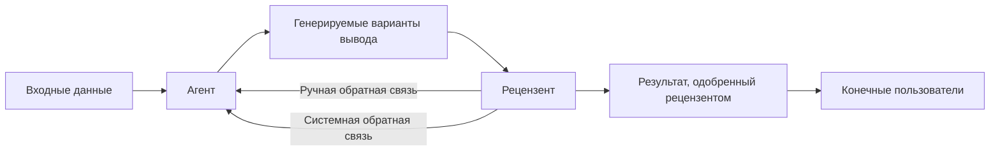
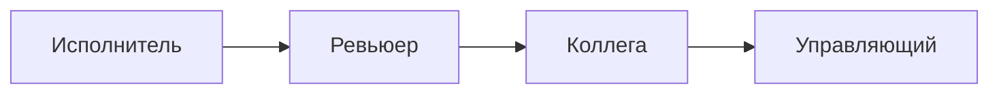

# aiagents-human-in-the-loop — knowledge units

Source book: «Building Applications with AI Agents» (Albada, рус. пер., ISBN 978-601-14-1158-5),
главы 3, 11, 12, 13.
Machine-distilled, not human-reviewed against the cited pages (trust_tier 1 — routing-gated at CP3.5 2026-08-18; Tier 2 requires human review). 10 KUs.

Cluster T13 — HITL, эскалация и уровень автономности. Three of these KUs are `verified: partial`;
each one's excluded over-claim is stated in its own section below and is absent from `SKILL.md`.

---

## KU01 — Регулятор автономности (autonomy slider): три режима + пять принципов интеграции
- **type:** decision-framework
- **pages:** гл. 3, с. 81, 82, 83 (unit: «Регулировка автономности; рис. 3.4»)
- **ku_id:** ai-apps-ch03-p66-ku09
- **verified:** true

**Problem:** Часто забываемый аспект UX — уровень автономности агента: каждому пользователю, каждой
задаче и каждой обстановке нужна своя мера контроля, и эти предпочтения не статичны [p.81].

**Content:**
Концепция (со ссылкой книги на Андрея Карпатого): система должна позволять плавно выбирать степень
автономности — от полностью ручного управления через частичную автоматизацию до полностью автономной
работы (регулировка автономности, autonomy slider; Рис. 3.4 [p.81]).

Три режима на примере разработчика [p.81-82]:
- РУЧНОЙ: разработчик пишет весь код сам; IDE — только редактор с подсветкой и статическим анализом,
  без предложений ИИ.
- С ПРОМПТОМ (ассистирующий): агент предлагает завершения кода, рефакторинг, документацию, но каждое
  предложение проверяется и принимается человеком — ускорение при полном контроле.
- АГЕНТНЫЙ: агент автономно выполняет стандартный рефакторинг, исправления по статическому анализу,
  генерацию шаблонного кода по соглашениям проекта; разработчик оповещается, но не подтверждает
  каждое действие.

Те же три режима на платформе поддержки клиентов [p.82]: операторы отвечают сами / агент готовит
черновики ответов с рекомендациями, оператор редактирует и одобряет / агент сам закрывает рутину
(сброс паролей, отслеживание заказов, FAQ) с эскалацией только сложных и конфиденциальных вопросов.

Риск отсутствия регулятора: агент кажется слабым (слишком много ручного ввода) или навязчивым
(действует без согласия в чувствительных контекстах) [p.82].

Пять принципов интеграции [p.83]:
1. Ясное выражение степеней автономности — понятные названия режимов и объяснение последствий выбора.
2. Органичные переходы — быстрый переключатель между уровнями при изменении доверия, контекста или
   нагрузки.
3. Предсказуемое поведение на каждом уровне — например, при частичной автоматизации черновик требует
   явного подтверждения; при полной автономности — обновления статуса и варианты вмешательства.
4. Передача рисков и преимуществ каждого уровня; для критических задач — явное подтверждение перед
   включением полной автономности.
5. Адаптация по доверию и компетентности: постепенно предлагать более высокие уровни — скажем, когда
   человек десять раз удачно отработал вручную, предложить ему режим с промптом.

Ключевой вопрос-проверка: насколько легко люди смогут переключаться между режимами работы — от этого
зависит, примут ли агента как надёжного партнёра [p.83].

**Applicability:** Любая область, где рабочему потоку полезно ходить между тремя состояниями: человек
делает сам, ИИ подсказывает, машина делает всё [p.82-83].

**Limits:** Регулятор — механизм формирования доверия, а не просто техническая функция [p.83];
предпочтения меняются со временем (доверие, знание задачи, важность ситуации, нагрузка) — статичная
настройка недостаточна [p.81].

---

## KU02 — Передача уверенности и неуверенности агента
- **type:** methodology
- **pages:** гл. 3, с. 91
- **ku_id:** ai-apps-ch03-p66-ku16
- **verified:** partial — **excluded claim:** утверждение «без передачи неуверенности пользователи не
  могут принимать обоснованные решения» сильнее источника; книга говорит лишь, что такая передача им
  ПОМОГАЕТ [p.91]. Сильная формулировка удалена (не смягчена) и в `SKILL.md` отсутствует.

**Problem:** Агенты работают в вероятностных средах — не все ответы одинаково достоверны; передача
уверенности важна для формирования доверия и помогает пользователям принимать обоснованные решения
[p.91]. *(Формулировка проблемы приведена здесь в редакции источника; исходная формулировка KU —
через «не могут» — исключена.)*

**Content:**
Три способа выражения уровня уверенности [p.91]:
1. Явные утверждения — пример книги: «Я на 90 % уверен, что это правильный ответ» [p.91].
2. Визуальные признаки — значки, цветовая кодировка, индикаторы достоверности в графических
   интерфейсах.
3. Корректировка поведения — предложения вместо твёрдых рекомендаций при низкой уверенности.

Двусторонняя калибровка [p.91]:
- не проявлять излишнюю категоричность при высокой неуверенности — безапелляционные неправильные
  ответы быстро разрушают доверие;
- не перестраховываться в некритичных взаимодействиях — агент выглядит неуверенным и ненадёжным.

Подстройка под ставку взаимодействия: в критически важных контекстах прозрачность — безусловное
требование; в некритических уверенность передаётся менее формально [p.91].

**Applicability:** Формулирование любых вероятностных выводов агента [p.91]; смыкается с требованием
явно сигнализировать о неизбежной изменчивости выводов языковых моделей [p.94].

**Limits:** Передача уверенности не сводится к указанию вероятности — форма должна соответствовать
ожиданиям пользователя и значимости взаимодействия [p.91]. Визуальное/модальное ОФОРМЛЕНИЕ сигнала —
зона `aiagents-agent-ux`; здесь удерживается только связь сигнала с порогом эскалации.

---

## KU03 — Когда эскалировать на человека: пороги неопределённости и последствий
- **type:** decision-framework
- **pages:** гл. 11, с. 289, 290, 291 (unit: «Ревью с участием человека»)
- **ku_id:** ai-apps-ch11-p280-ku07
- **verified:** true

**Problem:** Как выбрать, какие случаи уходят человеку, чтобы его суждение тратилось на самые ценные
взаимодействия, а не на рутину [p.290].

**Content:**
Общий принцип отбора: наверх выводятся случаи с НАИМЕНЬШЕЙ уверенностью модели и результаты с САМЫМИ
серьёзными последствиями [p.290].

КАЧЕСТВЕННЫЕ триггеры эскалации [p.290]:
- затяжные ошибки, которым нет внятного технического объяснения;
- аномалии рабочих потоков, задевающие нормативную или этическую плоскость;
- отказы на задачах повышенной важности либо критичных;
- взаимно противоречащие рекомендации или выводы, выданные автоматикой.

КОЛИЧЕСТВЕННЫЕ приборы неопределённости — все числа из книги приведены там как ПРИМЕРЫ («например…»),
а не как обязательные константы [p.290]:
1. Самооценка в самом ответе. Часть фундаментальных моделей (в тексте упомянута GPT-5) умеет
   приписать к своему ответу оценку достоверности по шкале 0–1; включает её инструкция-хвост вида
   «уверенность: [0–1 в зависимости от степени уверенности в точности ответа]» [p.290].
2. Отсечка по этой оценке. Пример книги — уводить человеку всё, что ниже 0,7 [p.290].
3. Энтропия распределения вероятностей: чем она выше на классификации, тем менее однозначен результат
   [p.290].
4. Согласованность повторов. Один и тот же вход прогоняют несколькими выводами подряд (в книге —
   три–пять) и считают расхождение свыше 20 % признаком шаткости ответа [p.290].
5. Внешний арбитр — отдельная модель-критик, чья задача оценить связность выданного ответа [p.290].

Отсечка привязана к прибору и к контексту: классификатору угроз в агенте SOC книга назначает границу
0,8, ниже которой случай уходит на рецензирование, а поток уверенных штатных срабатываний остаётся
автоматике [p.290].

ОЦЕНКА ПОСЛЕДСТВИЙ ведётся по шкале критичности самой предметной области. В агенте SOC разметка
двухосевая [p.290]: по классу инцидента — уровень «high», куда попадает, скажем, вероятная утечка
данных; и по затронутому активу — скажем, учётные записи администраторов. Свёртку двух измерений
книга приводит как пример: показатель неопределённости перемножают с весом последствий и сравнивают
произведение с порогом приоритета [p.290].

БЮДЖЕТ ЭСКАЛАЦИИ как отдельный параметр: подбор самих отсечек книга предлагает отдать автоматике —
тот же DSPy настраивает их по накопленной истории, проигрывая, какая доля случаев уйдёт человеку при
каждом варианте; названный ориентир нагрузки — удерживать долю эскалаций ниже 10 %, иначе рецензенты
выгорают [p.290].

**Applicability:** Гибридные схемы, где ИИ закрывает основную массу рутинных решений, а человек
включается там, где нужно суждение [p.290]; случаи неоднозначных намерений, этических нюансов,
конфликтов целей и новых граничных ситуаций [p.289].

**Limits:** Без чётко заданных триггеров автоматика рискует предпринять неуместные или недальновидные
вмешательства [p.291]. Числовые пороги в книге даны как примеры, а не как универсальные константы:
0,7 и 0,8 приведены для разных контекстов [p.290].

---

## KU04 — Протокол HITL-ревью эскалированного случая
- **type:** checklist
- **pages:** гл. 11, с. 289, 290, 291, 292 (unit: «Ревью с участием человека»)
- **ku_id:** ai-apps-ch11-p280-ku08
- **verified:** true

**Problem:** Эскалированный случай надо разобрать так, чтобы из него получилось изменение системы и
запись в организационной памяти, а не разовое решение [p.291, 292].

**Content:**
Разбор ведёт междисциплинарная команда рецензентов — обычно инженеры, продакт-менеджеры, специалисты
data science и UX-эксперты [p.291].

Четыре составляющие процесса ревью [p.291]:
- [ ] КОНТЕКСТНЫЙ АНАЛИЗ — воспроизвести сбой или аномалию в контролируемой среде, чтобы стали видны
      цепочка событий и места, где принимались решения.
- [ ] ИЗУЧЕНИЕ ТРАССИРОВОК — просмотреть логи, трассировки и цепочки решений, чтобы понять, как агент
      истолковал намерение пользователя и почему выбрал эти действия.
- [ ] ОЦЕНКА ПОСЛЕДСТВИЙ — оценить область и критичность как по технической правильности, так и по
      пользовательскому опыту.
- [ ] ПЛАНИРОВАНИЕ РАЗРЕШЕНИЯ — предложить адресное вмешательство. Спектр широк: правка промптов;
      переделка рабочего потока; создание новых навыков; изменение функциональности, которую видит
      пользователь.

Пример вмешательства: дрейф приводит к чрезмерной изоляции хостов — человек обновляет инструмент
`isolate_host`, добавляя шаг подтверждения [p.291].

Требования к протоколу [p.291]: решения логируются, обоснования сохраняются, результаты отслеживаются
— так будущие инциденты закрываются быстрее, а системные проблемы становятся видимыми со временем.

Зачем нужны роли за пределами инженерии [p.291]: продакт-менеджер проясняет, не отражает ли сбой более
глубокое расхождение с потребностями пользователей; специалист data science узнаёт паттерны и
граничные случаи, невидимые остальным; UX-исследователь находит затруднения во взаимодействии,
которые автоматические метрики не поймали.

Итоговая ценность — организационное обучение: каждый разобранный случай пополняет базу знаний, по
которой обучают новых участников команды, проектируют систему и уточняют сами контуры обратной связи
[p.291-292].

**Applicability:** Случаи, прошедшие триггеры эскалации (см. KU03) [p.290]; неоднозначные намерения,
этические нюансы, конфликты целей, новые граничные случаи [p.289].

**Limits:** HITL-ревью прямо названо дополнением к автоматизированному обнаружению и RCA, а не
заменой: его роль — удержать пайплайны обратной связи разносторонними и согласованными со
стратегическими целями [p.289].

---

## KU05 — Поток HITL-ревью с двумя контурами обратной связи
- **type:** case-pattern
- **pages:** гл. 11, с. 289, 290, 292 (unit: «Ревью с участием человека; рис. 11.3»)
- **ku_id:** ai-apps-ch11-p280-ku09
- **verified:** true

**Problem:** Как встроить человека в рантайм агента, не превращая его в узкое горлышко и не теряя
обучающий сигнал от его правок [p.289].

**Content:**
Схема потока [p.289]: входные данные обрабатываются агентом, который порождает ПОТЕНЦИАЛЬНЫЕ варианты
вывода; эти кандидаты идут рецензенту-человеку; тот вручную даёт обратную связь на уточнение либо
одобряет; одобренный результат доставляется конечным пользователям. Существенно, что контуров
обратной связи ДВА: ручная обратная связь возвращается на уточнение конкретного вывода, а системная
обратная связь от процесса ревью идёт на улучшение производительности самого агента [p.289].

Реконструкция Рис. 11.3 [p.289]:

Разбор конкретного случая в агенте SOC [p.289]: автоматизированный RCA помечает неоднозначную
проблему — подозрительная попытка входа, которая может оказаться и ложноположительным срабатыванием
из-за VPN, и настоящим взломом. Специалист по безопасности проверяет трассировку, сверяет
интерпретацию промптов и выбирает возможное исправление — например, добавляет в промпт этическую
рекомендацию «Избегай изоляции хостов без подтверждения последствий для важных операций» [p.289].

Роль схемы в целом: превратить пайплайны обратной связи из средства исправления ошибок в механизм
получения информации и устойчивости к ошибкам, сохранив систему одновременно масштабируемой и
достоверной [p.292].

**Applicability:** Агенты, где часть решений имеет нормативные, этические или критичные для бизнеса
последствия [p.290]; сложные требования, с которыми автоматика в одиночку не справляется [p.289].

**Limits:** Канал наполнения очереди рецензента, описанный книгой, — автоматические пайплайны, которые
помечают инциденты, превышающие заранее определённые пороги, выявляют необъяснимые закономерности или
представляют неразрешённые конфликты [p.290]; других каналов попадания случая к рецензенту раздел не
называет [вывод экстрактора].

---

## KU06 — Цена человеческого контроля: четыре режима деградации HITL
- **type:** tradeoff-table
- **pages:** гл. 12, с. 311, 312 (unit: «Уникальные риски агентных систем»)
- **ku_id:** ai-apps-ch12-p310-ku02
- **verified:** true

**Problem:** Контроль со стороны человека вводится как средство защиты от автономии агента, но сам
приносит новые уязвимости [p.311-312].

**Content:**
По мотивам раздела о HITL, гл. 12, с. 312 — реструктурировано как каталог сбоев надзора:

| Режим деградации надзора | В чём проявляется |
|---|---|
| Смещение автоматизации | оператор чрезмерно доверяет рекомендации и слабо её проверяет, особенно когда та подана уверенно [p.312] |
| Усталость от предупреждений | поток частых и малозначимых сигналов топит критические предупреждения [p.312] |
| Деградация навыков | по мере передачи рутины агенту квалификация человека, нужная для контроля, слабеет — и вмешательство в критический момент теряет эффективность [p.312] |
| Несоответствие стимулов | цели человека и агента расходятся (характерная пара — эффективность против безопасности), что мешает контролю в реальном времени [p.312] |

Ответ книги дан не построчно, а одним набором мер сразу на все четыре режима [p.312]:
- [ ] маршрут эскалации описан так, что оператор знает, куда и по какому признаку передавать случай
      выше;
- [ ] оповещения подстраиваются под обстановку, а не сыплются ровным потоком;
- [ ] операторов учат непрерывно — иначе просядут и скорость реакции, и та самая квалификация, без
      которой надзор превращается в формальность.

Отдельная рекомендация: тренировать операторов на интерактивных платформах, моделирующих
состязательные сценарии (джейлбрейк, промпт-инъекции), — это даёт практические навыки пентеста и
напрямую бьёт по рискам рассогласования целей и вероятностных рассуждений [p.312].

**Applicability:** Проектирование контура «человек в петле» для агентов с автономными действиями.

**Limits:** Книга не даёт количественных критериев (частота оповещений, периодичность тренировок) —
только качественные меры [p.312].

---

## KU07 — Четыре роли человека при росте автономности агента
- **type:** decision-framework
- **pages:** гл. 13, с. 340, 341, 342 (unit: «Меняющаяся роль человека в агентных системах; табл. 13.1»)
- **ku_id:** ai-apps-ch13-p340-ku01
- **verified:** true

**Problem:** Какую роль отвести человеку рядом с агентом и что обязан дать ему интерфейс на этой
ступени: ответ не статичен и зависит от задачи, её критичности и уровня доверия человека к агенту
[p.340].

**Content:**
В ранних развёртываниях человек сам запускает задачи агента и пристально смотрит за результатами;
накопив доверие, он переключается на проверку решений в ключевых контрольных точках — прежде всего
там, где риски велики или регулирование жёсткое [p.340-341].

Ось ролей — реконструкция Рис. 13.1 [p.341]:

По мотивам табл. 13.1, гл. 13, с. 341 — реструктурировано вокруг вопроса «на какой ступени
делегирования мы сейчас и что построено под неё». Последняя колонка воспроизводит ПОТРЕБНОСТИ
взаимодействий, названные таблицей для этой ступени.

| Ступень | Обязанность человека | Автономность агента | Потребности взаимодействий на этой ступени |
|---|---|---|---|
| Исполнитель (executor) | ставит задачи, просматривает каждый выданный результат [p.341] | минимальная; работает под присмотром [p.341] | пошаговые указания; предельно короткая петля обратной связи [p.341] |
| Ревьюер (reviewer) | точечно проверяет ключевые результаты [p.341] | умеренная; рутина уже за агентом [p.341] | дашборды; флаги для исключений; показатели достоверности [p.341] |
| Коллега (collaborator) | расставляет приоритеты; ведёт аннотации совместно с агентом [p.341] | высокая; агент планирует и действует под присмотром [p.341] | интерфейс совместного планирования; аннотации по контексту [p.341] |
| Управляющий (governor) | задаёт политики; аудирует решения; надзирает над эскалацией [p.341] | автономен в границах управляющих правил [p.341] | экраны для настройки политик; аудиторские журналы; средства объяснимости [p.341] |

Управляющему сверх этого нужна наблюдаемость общесистемного уровня и инструментарий проверки на
согласованность со схемами соблюдения стандартов и с человеческими ценностями [p.342]. В зрелых
потоках человек назначает высокоуровневые цели, а вмешивается ради нюансов, обработки ошибок и
этической оценки [p.341].

Проектное следствие: планировать надо не только текущее взаимодействие, но и ту роль, до которой
пользователи и их организации дорастут завтра [p.342].

**Applicability:** Проектирование развёртывания агента в организации, где роль человека будет
эволюционировать вместе с ростом автономности системы [p.340-342].

**Limits:** Конкретная роль не задана осью жёстко: она зависит от задачи, её критичности и уровня
доверия человека к агенту [p.340]. Кейс GitLab Security Bot показывает, что ступени оси не
выстраиваются в очередь: исполнитель, ревьюер и управляющий сосуществуют в одной системе, а
закрепление конкретного человека за ступенью сдвигается вверх по мере накопления доверия [p.342].

> Примечание к формулировке заголовка колонки: в `SKILL.md` заголовок «Что обязан дать интерфейс»
> ослаблен до «потребности взаимодействий, названные для этой ступени» — книга перечисляет их как
> ПОТРЕБНОСТИ (табл. 13.1, «Потребности взаимодействий»), а не как обязательный чек-лист поставки.

---

## KU08 — Жизненный цикл доверия: постепенное делегирование и путь восстановления
- **type:** methodology
- **pages:** гл. 13, с. 349, 350, 351 (unit: «Жизненный цикл доверия»)
- **ku_id:** ai-apps-ch13-p340-ku08
- **verified:** partial — **excluded claim:** модальность масштабного эффекта. Книга пишет, что
  действия агента «МОГУТ» затрагивать множество пользователей, порождать эффекты общесистемного
  охвата и читаться как отражение корпоративной политики [p.350]; исходный KU утверждал это безусловно.
  Безусловная формулировка удалена (не смягчена) и в `SKILL.md` отсутствует.

**Problem:** Проектировать систему так, будто доверие присутствует по умолчанию, — ошибка: доверие
зарабатывается, поддерживается и восстанавливается в случае утери [p.350-351].

**Content:**
Модель: доверие не бинарно и не выдаётся авансом за хороший дизайн или технические возможности; оно
накапливается от последовательной эффективности, прозрачности поведения и чётких границ, а
деградирует быстро — стоит агенту ошибиться, спрятать сбой или повести себя непредсказуемо [p.349].

Механизм 1 — ПРОЗРАЧНОСТЬ как инструмент калибровки: агент по своей инициативе раскрывает степень
уверенности, факторы принятия решений и наличие неопределённости, а интерфейс объясняет не только ЧТО
агент сделал, но и ПОЧЕМУ [p.350].

Механизм 2 — ПОСТЕПЕННОЕ ДЕЛЕГИРОВАНИЕ [p.350]. На ранней стадии агент осторожничает и ходит к людям
за проверкой или одобрением; по мере доказанной надёжности автономность расширяется. Две
траектории-примера из книги:
- командный агент сперва только готовит черновики отчётов о статусе, а позже получает право их
  отправлять [p.350];
- финансовый агент стартует с доступом только на чтение, а позже получает право отправлять
  транзакции под наблюдением [p.350].

Механизм 3 — ДОСТОВЕРНОСТЬ НАГЛЯДНА: понятное версионирование, журналы изменений, следы аудита;
неопределённость выносится на поверхность, а не прячется; пользователь может без труда переопределить
поведение агента, вмешаться или внести коррективы [p.350].

Механизм 4 — ПУТЬ ВОССТАНОВЛЕНИЯ: после ошибки или отклонения система обязана дать способ сбросить
поведение, переобучить агента либо урезать его функциональность; без такого пути даже мелкие недочёты
оборачиваются долгосрочной потерей уверенности в системе [p.350].

Масштабный эффект (в редакции источника): на командном, функциональном и организационном уровне агент
представляет уже не одного человека, а общий интерес; доверие в таких контекстах должно быть более
продуманным и более распределённым [p.350]. *(Безусловное утверждение о влиянии на многих
пользователей и о системных эффектах исключено — см. заголовок раздела.)*

**Applicability:** Любая система, где агенты встраиваются в рабочие потоки с участием человека
[p.350-351].

**Limits:** На этих страницах метрика «достаточной надёжности» для очередного расширения автономности
не задана: книга говорит лишь, что автономность может расшириться, когда агент докажет надёжность, а
пользователи к нему привыкнут [p.350]. Одного доверия мало: оно направляет повседневные
взаимодействия, но на вопрос о том, что произойдёт при сбое, отвечает управление [p.351].

---

## KU09 — Две границы автоматизации: Klarna (провал) и Erica (сигнал уверенности)
- **type:** case-pattern
- **pages:** гл. 13, с. 344, 345, 350
- **ku_id:** ai-apps-ch13-p340-ku09
- **verified:** true

**Problem:** Где проходит граница замещения человека агентом и что обязано происходить, когда агент
не уверен.

**Content:**
АНТИПАТТЕРН — Klarna, 2024 г. [p.350]. Решение: подменить чат-ботом на базе ИИ приблизительно
700 человек в службе поддержки. Последствие: с утратой эмпатии и тонкости суждений количество жалоб
резко пошло вверх, и в середине 2025 г. компания заново нанимала людей. Названный урок: избыточная
автоматизация при слабой человеческой опоре способна быстро обрушить доверие [p.350].

ПАТТЕРН — Erica, Bank of America [p.344]. Масштаб: более двух миллиардов клиентских запросов и свыше
половины тикетов внутренней ИТ-поддержки. Две работающие механики: 1) агент открыто называет степень
своей уверенности — пример формулировки из книги: «Я на 85 % уверена, что это ответит на ваш вопрос»
[p.344]; 2) диалог явно можно перевести на человека, когда неуверенность поднимается выше
определённого порога. Траектория: начали с простых FAQ, пришли к доверенному сервису
общекорпоративного масштаба [p.344-345].

Контраст читается так: замещение без человеческого запасного пути разрушает доверие, а объявленная
уверенность плюс порог передачи человеку его наращивают [вывод экстрактора].

**Applicability:** Клиентская поддержка и внутренние сервисные потоки при решении о степени замещения
человека агентом [p.344-345, 350].

**Limits:** Порог передачи диалога человеку в кейсе Erica книга не квантифицирует — сказано лишь про
«определенного порога» [p.345]. Числа Erica (два миллиарда запросов, половина ИТ-тикетов)
характеризуют масштаб, а не точность [p.344].

---

## KU10 — Проектирование эскалации: когда и как вмешивается человек
- **type:** decision-framework
- **pages:** гл. 13, с. 354, 355 (unit: «Механизм эскалации и контроль»)
- **ku_id:** ai-apps-ch13-p340-ku13
- **verified:** partial — **excluded claims (две):** (1) решения человека по эскалированной ситуации
  «МОГУТ использоваться» для улучшения будущего поведения агентов — безусловное «возвращаются в
  систему через обновление политик, повторное обучение или настройку промптов» удалено; (2) новые
  должности «МОГУТ потребоваться», а не потребуются — безусловное «потребуют завести новые» удалено.
  Обе формулировки удалены (не смягчены) и в `SKILL.md` отсутствуют.

**Problem:** При растущей автономности организация обязана ответить на вопрос, когда и как должен
вмешаться человек [p.354].

**Content:**
Эскалация — это уровень политики и инфраструктуры, удерживающий агентов в рамках их полномочий,
прежде всего в критичных и неоднозначных ситуациях [p.354].

Что определяет хорошо спроектированная схема [p.354]: конкретные типы решений, уровни рисков и
границы достоверности, при которых требуется человеческий контроль.

Две иллюстрации разметки полномочий из книги — это допущения, а не безусловные правила [p.354]:
- Клиентская поддержка, разметка по типу обращения: рутина — агент закрывает сам; спор об оплате —
  уходит человеку; подозрение на злоупотребление — помечается и адресуется специалисту по
  безопасности.
- Закупки, разметка по сумме: порог — 1000 долларов; ниже порога агент утверждает покупку
  самостоятельно, выше — включается согласование несколькими уполномоченными сторонами.

Четыре требования к реализации:
1. Пути эскалации кодируются И в технических системах, И в организационных ролях [p.354].
2. Агент умеет распознать необходимость эскалации — по неопределённости, по конфликтам ограничений
   или по явно определённым политикам — и правильно маршрутизировать задачу [p.354].
3. Принимающий человек получает КОНТЕКСТ: что агент пытался сделать, почему он эскалировал и какая
   информация нужна, чтобы продолжить [p.354].
4. Контроль не реактивен: назначенные сотрудники или выделенная группа, не дожидаясь инцидента,
   наблюдают за поведением агентов, читают журналы и подкручивают политики эскалации. Книга даёт две
   возможности укомплектования, ни одну не объявляя обязательной: надзорные роли способны лечь на
   уже имеющиеся структуры (линейный менеджмент, комплаенс) — либо могут потребовать новых
   должностей: аналитика ИИ-операций, эксперта по управлению агентами [p.354].

Контроль шире HITL-ревью: он включает политические и технические меры защиты, ограничивающие агентов
даже в автономных режимах [p.354].

Эффект на доверие: зная, что агент вовремя передаст решение человеку, пользователи охотнее берут
систему в работу, даже не доверяя ей всецело; системы без чёткой логики эскалации ведут себя излишне
самоуверенно, раздражая пользователей, либо впадают в ступор перед неопределённостью [p.354].

Замыкание петли: работающая схема эскалации обязана нести контуры обратной связи [p.355].
*(Что именно делается с решением человека дальше — обновление политик, повторное обучение, настройка
промптов — книга даёт как возможность, поэтому правило здесь не формулируется; см. исключённое
утверждение выше.)* Эскалация трактуется не как признак неудачи, а как часть ответственной автономии
агента [p.355].

Замечание к источнику: абзац на с. 355 анонсирует «в следующем разделе» тему масштабирования агентов
по организационным областям действия [p.355], однако этот материал изложен РАНЕЕ (раздел
«Масштабирование сотрудничества», pp. 344-347), а следующий раздел посвящён приватности и комплаенсу —
перекрёстная ссылка рассогласована.

**Applicability:** Проектирование агента, работающего в условиях неопределённости, двусмысленности или
этического риска; обязательный элемент при высокой автономности [p.354].

**Limits:** Пороги (1000 долларов, типы спорных случаев) — иллюстрации конкретных сценариев, поданные
книгой через «может», а не рекомендованные значения [p.354]. Что собственные границы достоверности и
уровни риска задаёт каждая организация — вывод экстрактора из того, что схема эскалации определяет
эти пороги для конкретной системы [вывод экстрактора; p.354].
