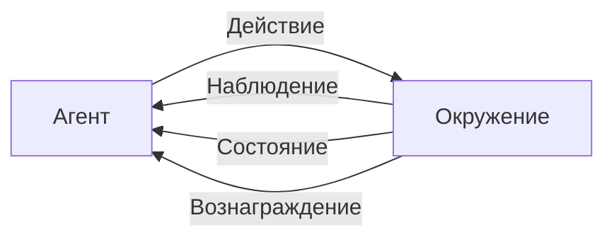

# Improvement loops — turn a detected agent failure into a root cause, a landed fix, and a ranked backlog

## Output
An improvement-cycle design that lands in an ADR, a post-incident write-up or an architecture step:
which of the three loops the current task belongs to and what each costs; the detector's target pattern
list and the grouping mechanism behind it; the four-step RCA result — the traced flow, the localised
component, the single-incident-vs-pattern verdict, and the frequency/severity reading that sets priority;
the chosen fix lever with its rationale (prompt-level: rephrase / examples / task decomposition / context
expansion; tool-level: internal logic / capability extension / integration / a missing tool added by hand;
or automated optimisation with a named framework and a sized training set); the verification gate the
change must clear before it ships; the three-field record for every refinement — the problem observed,
what was changed, how the effect will be measured; and the consolidated backlog with dedup, tags, linked
evidence and a five-axis priority per item.

## When to use / NOT
- Use when: an alert or a user complaint has fired and you need the route from "the agent is failing" to
  "here is the change that fixes it"; the same tool call keeps failing with malformed parameters and you
  must decide whether that is a prompt defect, a tool defect or a missing tool; hand-tuning prompts has
  stopped scaling and you are weighing an automated optimiser; you have to pick between DSPy and
  Microsoft Trace for a specific system shape; you are sizing the labelled training set for an optimiser
  run; insights are arriving from monitoring, RCA reports, user complaints and HITL review into four
  different trackers and nothing is being fixed; the backlog is long, the team is small, and you need a
  defensible ordering; you want a discipline that stops the same fix being rediscovered next quarter.
- NOT for: deciding what to instrument, which metrics to collect, what threshold fires an alert, or which
  statistical test proves drift (→ `aiagents-observability-and-drift` — that skill produces the signal this
  one consumes); giving the agent a learning mechanism of its own — reflection loops, ExpeL insight lists,
  SFT/DPO/RFT, or the in-context-vs-offline-retraining anchoring decision (→ `aiagents-learning-strategy`);
  constructing the evaluation set, the judge and the metric mix that scores a candidate change
  (→ `aiagents-evaluation-design`); the safe-rollout machinery for the fix — shadow deployment, canary,
  live-traffic experiments and their statistics (→ `aiagents-release-gates-and-rollout`, and for the
  statistics of a split test → `ab-test-analysis`); ITIL problem management over recurring IT incidents,
  with a known-error database, 5-whys, fishbone or WSJF scoring (→ `problem-management` — that is the
  generic service-management discipline; this skill is the agent-specific failure taxonomy and the
  agent-specific fix levers); restoring service during a live outage (→ `incident-response`); a
  critique-revise cycle executed inside a single agent turn (→ `reflection-loop`); choosing the shape of an
  autonomous loop in this workspace (→ `continuous-agent-loop`); running a team retrospective
  (→ `retrospective`); predicting defects from repository history (→ `qe-defect-intelligence`); scoring
  roadmap features with RICE/MoSCoW (→ `prioritization-frameworks`).

## Decision criteria

### 1. The three-loop frame — and which parts of it are this skill's (KU: ch11-p280-ku01)
The book's premise: in a sufficiently complex multi-agent system failures are the norm rather than an
anomaly, because such a system takes unpredictable input, serves heterogeneous users and depends on
external data sources that change fast; the real test is how well the system learns from them [p.280].
Continuous improvement is presented not as one mechanism but as a feedback loop built from diagnosis,
experimentation and learning [p.280].

Three loops, in the book's order [p.280-281]:

| # | Loop | What it does |
|---|---|---|
| 1 | **Пайплайн обратной связи** | detect the failure, understand its nature, classify it — automated analysis at scale combined with human (HITL) review, converting raw telemetry and real interactions into conclusions you can act on [p.280] |
| 2 | **Схемы экспериментирования** | check a proposed improvement in a controlled environment — shadow deployment, A/B testing, Bayesian bandits — as structured routes to incremental rollout at minimal risk [p.280] |
| 3 | **Непрерывное обучение** | embed the improvement into the system: operational in-context adjustments, or periodic offline retraining [p.280] |

**This skill owns loop 1 and the aggregation/prioritisation that follows it.** Loop 2 is
`aiagents-release-gates-and-rollout`; loop 3 is `aiagents-learning-strategy`. The frame itself lives here
because it is what tells you which loop a given problem belongs in.

The framing analogy the chapter opens with is reinforcement learning — an agent acquiring behaviour through
iterative interaction with its environment [p.280]. Рис. 11.1, reconstructed [p.281]:



**The organisational half is named as an equal, not a footnote** [p.281]: the loops require alignment
between developers, data scientists, product and UX; systems for documenting insights, for prioritisation,
and for protection against unintended consequences; and a culture that treats a failure as a source of
information. The gap the chapter sets out to close: many teams take pre-trained foundation models, never
train their own agents, and end up with no structured improvement cycle at all [p.281]. Fine-tuning
(глава 7) is only one of the available means — the chapter deliberately takes a wider set [p.281].

### 2. Which loop does the task in front of you actually need (KU: ch11-p280-ku02)
Restructured from табл. 11.1 [p.282] around a single question — *what is the team trying to do right now?*
The columns restate the book's own «Когда используется / Предназначение / Преимущества / Ограничения»;
no row is claimed to lead to any other row.

| The task right now | Take | What you get | What you pay |
|---|---|---|---|
| Work out what breaks and why: failure diagnosis, pattern search, building an improvement plan; suited to complex high-volume systems [p.282] | **Feedback pipelines** — observing, analysing and prioritising interaction problems for actionable conclusions [p.282] | data handled at scale; automation fused with human control; proactive risk detection; the foundation the other two loops stand on [p.282] | the result is capped by data quality, and problems never seen before can slip past when no escalation path exists [p.282] |
| Check one specific improvement before rollout: incremental deployment, comparing variants, a dynamic environment needing fast feedback [p.282] | **Experiments** — verifying changes in controlled environments, measuring consequences, lowering deployment risk [p.282] | decisions on data; risk minimised; variants made comparable; adaptation to real conditions [p.282] | a substantial volume of data is required; it is resource-hungry; and in ultra-high-risk environments it is inapplicable without gates [p.282] |
| Lock the adaptation in: tuning to observed patterns, personalisation, removing systematic problems; strongest in fast-changing environments and where correction must be immediate [p.282] | **Continuous learning** — dynamic adaptation to interactions and shifting needs [p.282] | real-time adaptivity; user change accounted for; growing stability; personalisation supported [p.282] | overfitting and regression risk; high compute cost; requires dependable monitoring [p.282] |

The three are **not substitutes**: feedback supplies the data experiments run on, and experiments steer
retraining and fine-tuning [p.309].

> Source caveat carried from the KU: in the corpus the «Непрерывное обучение» row of табл. 11.1 lost its
> column alignment — the «Предназначение» cell prints after the «Когда используется» cell [p.282]. The
> fields above were restored by reading the column headers.

### 3. What an automated detector must recognise (KU: ch11-p280-ku05)
Manual monitoring and debugging stop scaling as agent systems grow [p.287], so the detection layer is
built from three mechanisms used together — rule-based triggers, anomaly-detection algorithms, and
statistical grouping — sifting large volumes of logs and events [p.287].

Patterns such a system should recognise [p.287]:
- [ ] failures that repeat on one specific tool or skill;
- [ ] sharp spikes in error frequency or in reaction time;
- [ ] anomalies in user engagement and satisfaction metrics;
- [ ] behaviour divergence between agent versions or between deployment environments.

Modern pipelines add ML or statistical methods on top, to catch what is not obvious: gradual drift in the
agent's decisions, and correlations between a particular user input and the failures that follow
it [p.287-288].

**The base function of the whole layer is to find the REPEATING problem** [p.282]: recurring skill-selection
failures point at a mismatch between the user's intent and the agent's reasoning, while persistent
tool-call errors expose ambiguity in how their parameters are generated.

**Worked shape of a detection, from the chapter's SOC agent handling hundreds of alerts a day** [p.287]:
the detector registers a spike of failing `query_logs` calls whose query parameter is malformed — the agent
is producing over-complicated SQL-like queries the backend cannot parse. A tool such as Trace logs every
call, folds like errors into one group — here «недопустимый синтаксис запроса» [p.287] — and ties that group
to the reasoning step that preceded it in the prompt [p.287].

Limit to respect: even with grouping, automation can miss a previously unseen problem when no escalation is
configured [p.282].

### 4. RCA in an agent system: four steps from «what» to «why» (KU: ch11-p280-ku06)
Detection is not diagnosis. RCA answers why rather than what, and it is not post-failure debugging — it is a
standing iterative process for understanding the links between user intent, the agent's reasoning, the
system architecture and the external environment [p.288].

| Step | Do this [p.288] | The output it owes you |
|---|---|---|
| 1. **Трассировка рабочего потока** | reconstruct the end-to-end chain of agent decisions, tool calls and user interactions that led to the failure | the failing run, replayable |
| 2. **Локализация сбоев** | isolate the responsible component — a misread prompt, a wrong skill choice, a tool with over-rigid parameter logic | the component to change |
| 3. **Распознавание закономерностей** | establish whether this is a one-off or part of a repeating pattern tied to user actions, input or system states | single incident vs pattern |
| 4. **Оценка последствий** | measure frequency and criticality | the priority of the response |

**The practical conclusion the book puts first**: failures in agent systems are frequently *not* purely
technical — the source can be ambiguous task definitions, gaps in the training data, or changed user
expectations the system was never built for [p.288]. RCA sometimes exposes organisational blind spots:
success metrics that reward the wrong behaviour, or workflows that have stopped matching what users
need [p.288]. Hence the output of RCA is a list of improvement opportunities, not a culprit — refining
prompts and tool calls, changing skill orchestration, up to revising the team's picture of user
needs [p.288].

**A root-cause class the chapter names** [p.286]: the SOC agent's prompt assumes outdated threat patterns
(weighted toward IP-based logins while attackers have moved to credential stuffing), and the result is
repeated false negatives. The fix named for it is refining the prompt with updated examples, or adding
verification steps inside the tools [p.286].

RCA moves the team off continuous incident handling and onto an insight-driven process, but it is only the
first step from telemetry to change — experiments and continuous learning follow [p.288].

### 5. Prompt refinement: symptoms, diagnosis, four techniques, and the gate (KU: ch11-p280-ku10)
Timing: this is the step reached once the feedback pipelines and human review have accumulated enough
actionable insight; among the improvement mechanisms the book calls it the most straightforward and the
most important [p.292]. The reason is the prompt's position — it is the bridge between the user's intent
and the agent's actions, and a small change in wording, structure or context can radically alter the
interpretation, the course of reasoning and the result [p.292].

**Symptoms the feedback loops usually surface** [p.292]:
- ambiguous instructions → inconsistent or irrelevant answers;
- over-generalised prompts → hallucinations and off-task results;
- rigid narrow prompts → an inability to generalise over real-world variety;
- unclear task boundaries, escalation order and error handling.

**Diagnosis comes before editing** [p.292]: check the false positives, follow the agent's reasoning, and
isolate the part of the prompt that produced the unwanted result.

**Four editing techniques** [p.292-293]:
- [ ] **Переформулировка** — rewrite the instruction more clearly, remove ambiguity, state the expected
      answer formats.
- [ ] **Добавление примеров** — put both positive and negative samples into the prompt as support for the
      agent's reasoning.
- [ ] **Декомпозиция задач** — cut a complex multi-step instruction into a chain of shorter prompts, or into
      intermediate reasoning phases.
- [ ] **Расширение контекста** — mix in extra information, constraints or relevant reference material.

> The book presents the symptom list and the technique list as two separate lists; it does not map one onto
> the other. Choose the technique from your own diagnosis (step 2 above), not from a lookup table — no such
> table exists in the source.

**The gate on automating this** [p.294]: in systems with mature feedback, prompt correction can be automated
from the observed error patterns — but every change must be verified, preferably by autonomous testing
*and* a live shadow deployment, otherwise regressions and unintended side effects follow.

**Recording discipline, shared by prompt and tool refinements** [p.297]: every refinement documents three
things — the problem that was observed, what was changed, and how the effect will be measured. That makes
refinements traceable and reproducible, and leaves the next team the knowledge of which techniques work and
why.

Two limits [p.294, p.297]: prompts alone are not enough in modern agent architectures, because agents lean
on external tools that need their own refinement; and a prompt edit that looks cosmetic can echo across the
whole system — the more complex the architecture and the more interacting agents it holds, the stronger the
echo, which is why the book treats post-deployment performance monitoring as very important.

### 6. Automating the prompt loop, and which framework fits (KU: ch11-p280-ku03, ch11-p280-ku04)
Manual trial-and-error prompt engineering does not scale to the volume a production multi-agent system
generates [p.282-283]. The standard automated cycle used by frameworks of the DSPy and APO class [p.283]:

1. The starting prompt goes to the target model.
2. The target model produces results.
3. An evaluating model scores those results against a dataset and emits metrics.
4. An optimising model uses the metrics to iteratively refine the prompt and propose a new one.

The cycle closes: improvement runs continuously and is driven by data, without manual intervention [p.283].
Реконструкция рис. 11.2 [p.283]:


**What the loop buys at system level** [p.286]: feedback tools can back-propagate *textual* feedback onto
prompts, skill parameters and the reasoning-formation strategy. Two applications the book pairs explicitly
with their symptom:

| Symptom the analysis shows | What the pipeline can recommend [p.286] |
|---|---|
| Certain instructions repeatedly produce ambiguous results | more precise wording, adjusted constraints, or reordering the reasoning stages |
| Tool calls repeatedly fail because parameters are malformed | corrections to how those parameters are built — introducing verification steps or dynamic returns |

**Proactive optimisation is a separate role** [p.286]: continuously analysing input reveals areas of deferred
risk before they surface as a critical failure — early detection of drift in user query patterns can, for
example, trigger a prompt correction.

**Framework choice** [p.283-284]:

| | **DSPy** | **Microsoft Trace** |
|---|---|---|
| What it is | open-source Python framework from Stanford's NLP group; purpose is automatic optimisation of systems built on foundation models [p.283] | open-source framework for generative optimisation of AI systems [p.284] |
| Working model | the LM pipeline is treated as a modular declarative program, refined systematically from data instead of by hand [p.283-284] | optimisation treated as a generative process — the foundation model itself iteratively proposes and evaluates improvements [p.284] |
| Signal it consumes | labelled examples plus a metric (exact match, semantic similarity) [p.284] | GENERAL feedback signals — scores, textual assessments, pairwise comparisons — instead of gradients and differentiable loss functions [p.284] |
| Construction levels | **сигнатуры** (task input/output specs) → **модули** (composition of signatures: chain of thought, ReAct for conclusions and tool work) → **оптимизаторы** (BootstrapFewshot, MIPROv2), which generate better prompts and few-shot examples and tune model behaviour from example datasets and metrics [p.284] | — |
| Integration | popular LM APIs (OpenAI and Anthropic named), multi-stage compilation for complex workflows [p.284] | — |

**The selection rule** (вывод экстрактора, опирающийся на [p.284]): a black-box system where gradient
methods do not apply and the signal arrives as scores or comparisons → **Trace**, which the book names as
suited to exactly such systems and as especially valuable where an agent's behaviour must be tuned in a
changeable multi-step environment [p.284]. A task that reduces to optimising prompts and few-shot examples
against a labelled dataset with a measurable metric → **DSPy** [p.284].

Applicability the book attaches to each [p.284]: Trace for refining reasoning and tool-invocation strategies
from grouped errors in multi-step environments; DSPy for proactive optimisation where insights from failure
analysis flow back into prompts, tools and inference strategies.

**The human veto stays** [p.287]: automated pipelines are good at spotting patterns and proposing changes,
but they cannot fully account for context nuance or set priorities against broader strategic goals —
reviewing, checking and rejecting their recommendations remains the engineers' job. The book gives no
comparative quality measurements between the two frameworks.

### 7. Worked case — optimising a ReAct module with DSPy MIPROv2 (KU: ch11-p280-ku11)
The trigger: the SOC agent produces inconsistent output and picks tools sub-optimally; the goal is to bring
its reasoning and tool calls into line with the expected answers when processing alerts, without hand-tuning
the ReAct module's internal prompts [p.293].

Skeleton, facts verbatim from the listing [p.293-294]:

```python
import dspy
dspy.configure(lm=dspy.OpenAI(model="gpt-4o-mini"))

# trainset — набор dspy.Example(alert=..., response=...).with_inputs('alert')

react = dspy.ReAct("alert -> response", tools=[lookup_threat_intel, query_logs])

tp = dspy.MIPROv2(metric=dspy.evaluate.answer_exact_match, auto="light",
                  num_threads=24)
optimized_react = tp.compile(react, trainset=trainset)
```

Four things that matter as engineering know-how:

1. **Training-set size.** The listing carries five synthetic examples, but the book warns explicitly that in
   practice the set should be grown to 100+ annotated examples to improve results [p.293]; in practice the
   examples themselves come from real logs or from failure annotations [p.293].
2. **Metric.** `answer_exact_match` is there for the demonstration; for a working version the book
   recommends something less blunt, semantic similarity for example [p.294].
3. **Example shape.** Each example is a «signal → expected answer» pair where the answer describes the agent's
   SEQUENCE of actions: look up threat intelligence, investigate the logs, classify as a true or false
   positive. The closing action varies example to example — host isolation (the first two), sending an
   analyst response (the phishing one), or classification alone [p.293-294].
4. **Result.** The resulting `optimized_react` is embedded into the SOC agent's workflow and, as the book
   states it, raises reliability across diverse signals and cuts hallucinations and irrelevant
   answers [p.294].

> Source caveat from the KU: in the corpus the `trainset` listing is broken by a page header — the list's
> closing bracket prints at the very start of p.294, *before* the continuation of the second example and the
> last three items — and the Python lines lost their indentation in digitisation [p.293-294]. Restore order
> and indentation when porting the code.

Limits [p.293-294]: five examples are a demonstration, not a working configuration; exact match is not
recommended as a production metric; and all changes MUST be verified, with autonomous testing plus live
shadow deployments named as the desirable way to do it.

### 8. Tool-level refinement, and closing a toolbox gap (KU: ch11-p280-ku12)
**Four classes of tool problem the pipelines typically expose** [p.295]:
- wrong or sub-optimal tool choice for the user's task;
- parameters that do not match what is expected, or a malformed call payload;
- a **toolbox gap** — the task is impossible because the needed tool is absent or incomplete;
- a **broken chain** — the previous step's output is formatted differently from what the next step expects.

**Three levels at which a tool is refined** [p.295]:
1. **Internal logic** — optimising the prompts or models inside the tool, for better data processing and
   classification quality.
2. **Capability extension** — covering a wider range of scenarios by embedding optimised logical processing.
3. **Integration** — making the tools return dependable, actionable results shaped to the agent's needs.

> The book lists the four problem classes and the three refinement levels as two independent lists; it does
> not assign a level to each class. Pick the level from the diagnosis, not from a mapping — the source draws
> none.

**The gap-closing procedure, step by step** [p.295]: create the new classification tool (a stub in the
book's example) → include it in the ReAct module → extend the training set with examples that emphasise the
correct call CHAIN → rerun the optimisation, which then pulls up the tool-selection and tool-integration
heuristics.

The chapter's skeleton — a CONDENSED extract, not verbatim: names, signatures, metric and numeric arguments
are kept word for word, while the `desc=…` text inside `InputField` / `OutputField` and the comments are
collapsed to `...` [p.295-297]:

```python
class ThreatClassifier(dspy.Signature):
    indicator: str = dspy.InputField(...)      # IP, URL или файловый хеш
    threat_level: str = dspy.OutputField(...)  # 'benign' | 'suspicious' | 'malicious'

class ThreatClassificationModule(dspy.Module):
    def __init__(self):
        super().__init__()
        self.classify = dspy.ChainOfThought(ThreatClassifier)
    def forward(self, indicator):
        return self.classify(indicator=indicator)

def threat_match_metric(example, pred, trace=None):
    return example.threat_level.lower() == pred.threat_level.lower()

optimizer = dspy.BootstrapFewshotWithRandomSearch(metric=threat_match_metric,
                                                  max_bootstrapped_demos=4,
                                                  max_labeled_demos=4)
optimized_module = optimizer.compile(ThreatClassificationModule(),
                                     trainset=trainset)
```

Data sizing: the synthetic labelled set in the listing holds seven examples, but a comment inside the
listing itself prescribes taking production material — SOC logs — and growing the volume to 50-200+
examples [p.296]. Only one entry is explicitly marked as an EDGE CASE — a mangled URL with parameters; a
separate comment also flags a hash belonging to a new threat [p.296]. The optimised module is then called
from an ordinary tool function `classify_threat` [p.297]. The effect the book claims: the tool classifies
threat levels more accurately on real API data and covers a wider range of answers — an empty result, a
partial match, an emerging threat [p.297].

**The limit that decides your lever**: optimisation fixes tool *selection* and *binding*, but it does not
create missing functionality — a toolbox gap is closed by adding the tool by hand [p.295].

> Two source inconsistencies to know before copying [p.293, p.295, p.296]: the two adjacent listings
> configure DSPy incompatibly — `dspy.OpenAI(model="gpt-4o-mini")` in the first [p.293] versus
> `dspy.LM("openai/gpt-4o-mini")` in the second [p.295]; and in the example set the comment on indicator
> 203.0.113.45 calls it a known malicious one while its reference label reads `suspicious` — comment and
> label disagree.

### 9. Aggregating every insight into ONE living backlog (KU: ch11-p280-ku13)
The problem that makes this a step rather than an afterthought: the stream of insights grows with system
complexity, and when it is not pooled and ranked, effort goes either into a pile of inconsequential small
edits or into symptoms — while the systemic, root defects stay untouched [p.297].

First move: consolidate insights from every source into one accessible view. Feedback arrives from automated
monitoring, RCA reports, user complaints, HITL review results and direct engineering observation [p.298].
Aggregation tools the book names: centralised dashboards, observability tooling, structured issue
trackers [p.298].

Three aggregation practices [p.298]:
- [ ] **Дедупликация** — group like problems (repeating prompt failures, tool-call errors) so effort is not
      fragmented.
- [ ] **Разметка и классификация** — tag each item: root cause, affected workflow, user impact, system
      component; sorting and filtering later run on those tags.
- [ ] **Связывание с контекстом** — attach the supporting logs, traces, user reports and RCA documentation to
      each item, so the queue and the actions are chosen with evidence in hand.

**How the backlog is kept** [p.299]: not a frozen task list but a document that is rewritten as work
proceeds. The review rituals the book names are scheduled review, error post-mortems and cross-functional
synchronisation; their purpose is that priorities get re-evaluated on every new incident, shift in user
needs or change of strategy. Closing the loop: the lessons won from implemented and verified improvements
MUST be fed back into the input of aggregation [p.299].

Aggregation on its own selects nothing — prioritisation necessarily follows it, because improvements are
not equal to begin with [p.298-299].

### 10. Five axes of prioritisation (KU: ch11-p280-ku14)
Priority is assigned by balancing five indicators [p.298-299]:

| Axis | The question | What the book attaches to it |
|---|---|---|
| **Частота** | how often does the problem occur? | the named trap: individually non-critical difficulties that recur regularly add up to a noticeable drag on the user and a heavier operating bill [p.298] |
| **Критичность / влияние** | what are the consequences for the business or the user? | whatever produces critical failures, security risks or strong user irritation goes to the top of the list [p.298] |
| **Осуществимость** | how hard is it to fix? | cheap edits with a noticeable effect are the book's «быстрые победы» [p.298] and usually go first; a heavy improvement is worked through in advance, or cut into sequential stages [p.298] |
| **Соответствие общей стратегии** | does it align with product goals, planned capabilities or regulatory requirements? | stated separately: a fix is sometimes critical not because of its frequency but because of its role in a major initiative or a regulatory checkpoint [p.299] |
| **Повторяемость и риск** | how likely is a recurrence if nothing is done? | systemic problems — those rooted in the architecture, in the training data or in the structure of the agent's reasoning itself — are flagged for closer examination [p.299] |

Read the table by row. The book supplies **no weights and no formula** for combining the five axes; the
tooling it points at runs from an impact/effort matrix to the more formal practices of Agile and Kanban, and
those are said to be able to help a team reach consensus and adjust the system's development plans [p.299] —
that modality is the book's own and is preserved deliberately.

Why the discipline matters in agent systems [p.299]: when the scarce resource goes only to changes that
simultaneously deliver an effect, are implementable, and serve the strategy, the system evolves faster, the
user starts to trust it, and technical debt does not accumulate; at a fast rate of change and with high
stakes such a process is called a necessity rather than a luxury.

## Key facts & formulas
- Three loops of the improvement cycle: feedback pipeline → experimentation schemes → continuous
  learning [p.280-281]; табл. 11.1 gives их when-used / purpose / advantages / limitations [p.282].
- Feedback supplies the data experiments run on; experiments steer retraining and fine-tuning [p.309].
- Detector mechanism = rule-based triggers + anomaly-detection algorithms + statistical grouping,
  together [p.287]; four target pattern classes on [p.287], plus ML/statistical detection of gradual
  decision drift and input↔failure correlations [p.287-288].
- The chapter's detection example: a spike of failing `query_logs` calls with a malformed query parameter,
  grouped under «недопустимый синтаксис запроса» and tied back to the preceding reasoning step [p.287].
- RCA steps: трассировка рабочего потока → локализация сбоев → распознавание закономерностей → оценка
  последствий [p.288]. Its output is a list of improvement opportunities, not a culprit [p.288].
- Prompt refinement techniques: переформулировка, добавление примеров, декомпозиция задач, расширение
  контекста [p.292-293]; every automated prompt change must pass verification — autonomous testing plus live
  shadow deployment [p.294].
- Refinement record = problem observed + what was changed + how the effect is measured [p.297].
- Automated optimisation cycle: prompt → target model → evaluating model over a dataset → metrics →
  optimising model → new prompt [p.283]; frameworks named DSPy, Microsoft Trace, APO [p.282-284].
- DSPy construction levels: сигнатуры → модули → оптимизаторы; optimisers named BootstrapFewshot and
  MIPROv2 [p.284]. Trace consumes scores, textual assessments and pairwise comparisons instead of
  gradients [p.284].
- Feedback tools can back-propagate textual feedback onto prompts, skill parameters and the
  reasoning-formation strategy [p.286].
- MIPROv2 example config [p.293-294]:
  ```python
  tp = dspy.MIPROv2(metric=dspy.evaluate.answer_exact_match, auto="light", num_threads=24)
  ```
  five synthetic examples in the listing; the book directs you to **100+** annotated examples in
  practice [p.293], and away from exact match toward semantic similarity in production [p.294].
- Tool-refinement example config [p.295-296]:
  ```python
  optimizer = dspy.BootstrapFewshotWithRandomSearch(metric=threat_match_metric,
                                                    max_bootstrapped_demos=4,
                                                    max_labeled_demos=4)
  ```
  seven synthetic labelled examples in the listing; the listing's own comment prescribes **50-200+** from
  production SOC logs [p.296].
- Four tool-problem classes and three refinement levels [p.295] — two separate lists, unpaired in the source.
- Aggregation practices: дедупликация, разметка и классификация, связывание с контекстом [p.298]; the
  backlog is a living artefact reviewed at scheduled reviews, error post-mortems and cross-functional
  syncs [p.299].
- Five prioritisation axes: частота, критичность/влияние, осуществимость, соответствие общей стратегии,
  повторяемость и риск [p.298-299] — no weights, no combining formula given.

## Anti-patterns
| Anti-pattern | Why it fails | Source |
|---|---|---|
| Treating a production failure as an anomaly to be eliminated | In a sufficiently complex multi-agent system failures are the norm; the real test is whether the system learns from them | ch11-p280-ku01 |
| Running on a pre-trained foundation model with no structured improvement cycle at all | Named as the exact gap the chapter closes — teams take the model, never train the agent, and have no loop | ch11-p280-ku01 |
| Treating improvement as a purely engineering problem | The loops need developer/data-science/product/UX alignment, systems for documenting insights and prioritising, and a culture that reads failure as information | ch11-p280-ku01 |
| Reaching for experiments to answer «what is even broken?» | Experiments verify a *specific proposed* improvement; diagnosis and pattern search is the feedback pipeline's job | ch11-p280-ku02 |
| Running live experiments in an ultra-high-risk environment without gates | The book marks experiments inapplicable there without additional gates | ch11-p280-ku02 |
| Enabling continuous learning without dependable monitoring | Overfitting and regressions are its named costs; monitoring is the stated precondition | ch11-p280-ku02 |
| Building the detector out of rules alone | The mechanism is rules **plus** anomaly detection **plus** statistical grouping; ML/statistics is what surfaces gradual decision drift and input↔failure correlations | ch11-p280-ku05 |
| Grouping errors and calling detection done, with no escalation path | Previously unseen problems slip past exactly when no escalation is configured | ch11-p280-ku05, ch11-p280-ku02 |
| Chasing individual incidents instead of repeating ones | The base function of the layer is finding the recurring problem — recurring skill-selection failures indicate an intent↔reasoning mismatch, persistent tool errors indicate parameter ambiguity | ch11-p280-ku05 |
| Stopping RCA at «which component failed» | Localisation is step 2 of 4; without pattern recognition and impact assessment you cannot tell a one-off from a systemic defect or set a priority | ch11-p280-ku06 |
| Assuming an agent failure is a technical defect | Ambiguous task definitions, training-data gaps and changed user expectations are named sources; RCA also exposes organisational blind spots such as metrics rewarding the wrong behaviour | ch11-p280-ku06 |
| Turning RCA into an attribution of blame | Its stated output is a list of improvement opportunities — prompt and tool-call refinement, skill orchestration changes, up to revising the picture of user needs | ch11-p280-ku06 |
| Editing the prompt before isolating which part of it caused the result | Diagnosis comes first: check false positives, follow the reasoning, isolate the offending fragment | ch11-p280-ku10 |
| Automating prompt correction without a verification step | Every automated change must be verified — autonomous testing and a live shadow deployment — or regressions and side effects follow | ch11-p280-ku10 |
| Landing a refinement without recording problem/change/measurement | Undocumented refinements are neither traceable nor reproducible, and the next team relearns them | ch11-p280-ku10 |
| Treating a prompt edit as locally scoped | The effect propagates across the system, more strongly the more interacting agents it has — which is why post-deployment monitoring is treated as very important | ch11-p280-ku10 |
| Expecting prompt work alone to fix an agent | Modern agent architectures lean on external tools, which need their own refinement track | ch11-p280-ku10 |
| Hand-tuning prompts at production volume | Manual trial-and-error does not scale to the volume a production multi-agent system generates | ch11-p280-ku03 |
| Shipping an optimiser's recommendation unreviewed | Automated pipelines spot patterns well but cannot fully weigh context nuance or rank against strategic goals; engineers review, verify and reject | ch11-p280-ku03, ch11-p280-ku04 |
| Picking DSPy for a black-box system with no differentiable loss | Trace is the one named for general feedback signals — scores, textual assessments, pairwise comparisons — instead of gradients | ch11-p280-ku04 |
| Running the optimiser on the demo-sized training set | Five examples in the ReAct listing and seven in the classifier listing are demonstrations; the book prescribes 100+ and 50-200+ from real logs respectively | ch11-p280-ku11, ch11-p280-ku12 |
| Keeping `answer_exact_match` as the production metric | Named as a demonstration choice; a less blunt metric such as semantic similarity is recommended for the working version | ch11-p280-ku11 |
| Copying the two DSPy listings into one codebase unchanged | They configure DSPy incompatibly — `dspy.OpenAI(model=...)` versus `dspy.LM("openai/...")` | ch11-p280-ku12 |
| Expecting optimisation to close a toolbox gap | Optimisation fixes selection and binding; a missing tool is added by hand, then the optimisation is rerun | ch11-p280-ku12 |
| Leaving insights spread across monitoring, RCA reports, complaints and HITL notes | Effort fragments into inconsequential edits or symptom-chasing while the systemic defects stay untouched | ch11-p280-ku13 |
| Keeping the improvement backlog as a static TODO list | It is a living artefact; priorities are re-evaluated at scheduled reviews, error post-mortems and cross-functional syncs | ch11-p280-ku13 |
| Never feeding verified improvements back into aggregation | The loop only closes when lessons from implemented and verified changes return to the aggregation input | ch11-p280-ku13 |
| Ranking only on frequency | Frequency is one of five axes; a fix can be critical because of a regulatory checkpoint or a major initiative rather than how often it fires | ch11-p280-ku14 |
| Ranking only on severity, so nothing cheap ever ships | Feasibility is its own axis — cheap edits with a noticeable effect («быстрые победы») usually go first | ch11-p280-ku14 |
| Inventing a weighted score over the five axes and calling it the book's | The book gives no weights and no combining formula; the impact/effort matrix and Agile/Kanban practices are said only to be able to help reach consensus | ch11-p280-ku14 |

## Related decisions
- **`aiagents-observability-and-drift`** — the upstream half of the same loop. That skill decides what to
  instrument, which metrics fire which alert, and which statistical test proves drift; this skill starts
  from the raised alert or the exported degraded trace. The seam is concrete: early detection of drift in
  user query patterns is what triggers a prompt correction here [p.286], and the detector's target patterns
  (§3) are only visible if the telemetry that carries them was designed there. If your monitoring has no
  per-tool call logging, §3 and §4 have nothing to trace.
- **`aiagents-learning-strategy`** — loop 3 of the frame. Once a fix proves out, that skill decides whether
  it is anchored in the prompt, in memory, or in the weights, and which learning class applies. The
  chapter's own note keeps the border: fine-tuning is only one of the means, and this chapter deliberately
  takes a wider set [p.281].
- **`aiagents-release-gates-and-rollout`** — loop 2. Every refinement produced here carries a verification
  obligation — autonomous testing plus a live shadow deployment [p.294] — and that machinery (shadow, A/B,
  bandits, gates) is designed there. Choosing to automate prompt correction (§5) raises the bar on that
  gate, because the changes then arrive without a human author.
- **`aiagents-evaluation-design`** — supplies the dataset and the metric that step 3 of the optimisation
  cycle scores against [p.283], and the metric choice for an optimiser run (§7) is that skill's call. A weak
  eval metric turns the optimiser into an expensive random walk.
- **`aiagents-tool-design-and-selection`** — the four tool-problem classes (§8) are read against the tool
  contract designed there: malformed parameters and broken chains are contract defects, wrong tool choice is
  a selection-strategy defect. Adding a tool by hand to close a gap sends you back to that skill for the
  schema and the description.
- **`aiagents-orchestration-and-planning`** — RCA output can be «change skill orchestration» [p.288], and
  task decomposition of a prompt into a chain of shorter prompts or intermediate reasoning phases (§5) is a
  control-flow change; that skill owns the archetype and the chain.
- **`aiagents-human-in-the-loop`** — loop 1 explicitly fuses automated analysis with human review [p.280],
  and HITL review is a named source feeding the backlog [p.298]. How that handoff is shaped is decided there.
- **`problem-management`** — use it for recurring incidents in ordinary IT services: known-error database,
  5-whys, fishbone, WSJF. It does not carry the agent failure taxonomy (skill selection, malformed tool
  parameters, prompt-induced false negatives, drift in query patterns) or the agent fix levers (prompt
  refinement, automated prompt optimisation, tool-level refinement, retraining). Where an agent system also
  runs under an ITIL process, run both: this skill produces the technical root cause and the fix lever; that
  one produces the problem record and the service-management workflow.
- **`incident-response`** — restores service now; this skill is the standing iterative process that runs
  after, and the book is explicit that RCA is not post-failure debugging [p.288].
- **`reflection-loop` / `continuous-agent-loop` / `retrospective` / `qe-defect-intelligence` /
  `prioritization-frameworks`** — harness-local tools: a runtime critique-revise cycle, a loop-shape
  composer, a team ritual, repository-history defect prediction, and generic feature scoring respectively.
  None of them carries chapter 11's loop taxonomy, its RCA steps, or its five prioritisation axes.

## Источник
Derived from «Building Applications with AI Agents» (Albada, рус. пер., ISBN 978-601-14-1158-5),
глава 11 «Циклы улучшения»: с. 280–284, 286–288, 292–299 и с. 309.
KUs: ai-apps-ch11-p280-ku01, ku02, ku03, ku04, ku05, ku06, ku10, ku11, ku12, ku13, ku14.
Deep reference: `references/knowledge-units.md`.
- RCA anchor: «RCA старается найти ответ на вопрос не о том, что не сработало, а почему» [p.288].
- Backlog anchor: «Важно рассматривать бэклог улучшений как живой артефакт, а не как статический
  TODO-лист» [p.299].

## Self-check
- [x] Every criterion traces to a listed KU?
- [x] Facts carry page anchors?
- [x] trust_tier 1 (machine-distilled, routing-gated at CP3.5, not yet human-reviewed)?
- [x] No `verified: partial` KU in this cluster — nothing excluded on that ground (all 11 are `true`)?
- [x] Symptom↔technique and problem-class↔refinement-level tables NOT built, because the book lists both
      sides without pairing them?
- [x] The «могут помочь» modality of the prioritisation tooling preserved rather than hardened?
- [x] Boundary clause names the real sibling ids and defers generic ITIL RCA to `problem-management`?

## Examples
- «Агент раз за разом валит вызов `query_logs` — с чего начать?» → detection first: the pattern class here is
  repeating failures on one specific tool, and statistical grouping folds them into one error group tied to
  the preceding reasoning step [p.287]. Then the four RCA steps: trace the flow, localise (prompt? skill
  choice? over-rigid parameter logic?), decide single-incident vs pattern, measure frequency and criticality
  [p.288]. If the diagnosis is malformed parameters, the pipeline's own recommendation class is corrections
  to parameter construction — verification steps or dynamic returns [p.286].
- "Hand-tuning prompts stopped scaling — what do we automate?" → the four-stage optimisation cycle: prompt →
  target model → evaluating model over a dataset → metrics → optimising model → new prompt [p.283]. Pick the
  framework by the signal you can supply: a labelled dataset with a measurable metric → DSPy; scores,
  textual assessments or pairwise comparisons on a black-box multi-step system → Microsoft Trace [p.284].
  Keep the human review of every recommendation [p.287] and gate each change on autonomous testing plus a
  live shadow deployment [p.294].
- «Чинить промпт или добавлять новый инструмент?» → run the four tool-problem classes [p.295]: wrong tool
  choice and malformed parameters are refinable; a toolbox gap is not — optimisation does not create missing
  functionality, so add the tool by hand, put it in the ReAct module, extend the training set with examples
  emphasising the correct call chain, and rerun the optimisation [p.295].
- "Our MIPROv2 run barely moved the numbers" → check the two demo-shaped defaults the book warns about: five
  synthetic examples where practice wants 100+ annotated ones drawn from real logs or failure annotations
  [p.293], and `answer_exact_match` where a production run wants something like semantic similarity [p.294].
- «У нас сотня инсайтов из мониторинга, RCA, жалоб и HITL-ревью — что чинить первым?» → consolidate into one
  view (dedup, tag by root cause / workflow / user impact / component, attach logs, traces, reports and RCA
  docs) [p.298], then balance the five axes — frequency, criticality, feasibility, strategy fit, recurrence
  risk [p.298-299]. No weights are given, so make the trade explicit; keep the backlog living and re-rank at
  every incident, and feed the lessons from shipped fixes back into aggregation [p.299].
- "Is this a bug we fix or a systemic problem?" → step 3 of RCA answers the first half (one-off vs a pattern
  tied to user actions, input or system states [p.288]), and the fifth prioritisation axis answers the
  second: problems rooted in the architecture, the training data or the structure of the agent's reasoning
  are flagged for closer examination [p.299]. Note the book's own warning that the source is frequently not
  technical at all — ambiguous task definitions, training-data gaps, changed user expectations [p.288].
