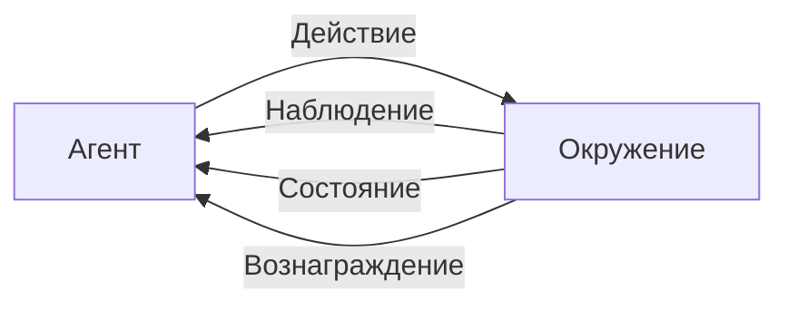
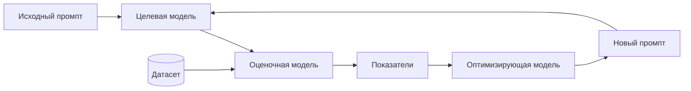

# aiagents-improvement-loops — knowledge units

Source book: «Building Applications with AI Agents» (Albada), рус. пер., ISBN 978-601-14-1158-5.
Глава 11 «Циклы улучшения» — с. 280–284, 286–288, 292–299, 309.

Machine-distilled, not human-reviewed against the cited pages (trust_tier 1 — routing-gated at CP3.5 2026-08-18; Tier 2 requires human review). 11 KUs.

Кластер T12 («Циклы улучшения: детекция, RCA, оптимизация промптов, приоритизация»). Все 11 KU
имеют `verified: true` — исключений по флагу `partial` в этом кластере нет.

Границы кластера внутри той же главы 11. Сюда НЕ входят и принадлежат соседям:
- KU по схемам экспериментирования (теневое развертывание, A/B, байесовские бандиты, шлюзы выката) —
  у `aiagents-release-gates-and-rollout` (кластер T11);
- `ai-apps-ch11-p280-ku18` и `ai-apps-ch11-p280-ku19` (обучение в контексте против офлайн-дообучения,
  с. 305–308) — у `aiagents-learning-strategy` (кластер T07); здесь они присутствуют только как
  «контур 3» рамки из KU01;
- телеметрия, пороги оповещений и статистические тесты дрейфа (глава 10) — у
  `aiagents-observability-and-drift` (кластер T10).

---

## KU01 — Трёхконтурный цикл улучшения агентной системы
- **type:** methodology
- **pages:** гл. 11, с. 280, 281
- **ku_id:** ai-apps-ch11-p280-ku01
- **verified:** true

**Problem:** Как устроить эволюцию агентной системы, если сбои в сложной мультиагентной среде не
аномалия, а норма, и вопрос не в их наличии, а в способности системы учиться на них.

**Content:**
Исходная посылка книги: в достаточно сложной мультиагентной системе сбои неизбежны, потому что такие
системы работают с непредсказуемым вводом, разнородными пользователями и быстро меняющимися внешними
источниками данных; настоящая проверка — насколько система учится на сбоях [p.280]. Непрерывное
улучшение подано не как отдельный механизм, а как петля обратной связи из диагностики, экспериментов
и обучения [p.280].

Три последовательных контура [p.280-281]:
1. ПАЙПЛАЙН ОБРАТНОЙ СВЯЗИ — обнаружить сбой, понять его природу, классифицировать; сочетает
   автоматизированный анализ в масштабе с ревью человеком (human-in-the-loop), превращая сырую
   телеметрию и реальные взаимодействия в выводы для действий [p.280].
2. СХЕМЫ ЭКСПЕРИМЕНТИРОВАНИЯ — проверить предложенные улучшения в контролируемой среде: теневое
   развертывание, A/B-тестирование, байесовские бандиты; они дают структурированные маршруты
   инкрементного выката с минимальным риском [p.280].
3. НЕПРЕРЫВНОЕ ОБУЧЕНИЕ — встроить улучшение в систему: оперативные настройки в контексте либо
   периодическое офлайн-дообучение [p.280].

Аналогия, задающая рамку главы: петля повторяет обучение с подкреплением, где агент осваивает
поведение через итеративное взаимодействие с окружением [p.280].

Реконструкция рис. 11.1 [p.281]:


Организационная сторона названа наравне с технической: контуры требуют согласования разработчиков,
специалистов по data science, продуктовых и UX-команд, систем для документирования инсайтов,
приоритизации и защиты от непредвиденных последствий, а также культуры, где сбой — источник
сведений [p.281].

Пробел, который глава закрывает: многие команды берут предобученные фундаментальные модели, не обучая
своих агентов, и структурированных циклов улучшения вообще не имеют [p.281].

**Applicability:** Мультиагентные системы в эксплуатации, где ввод и внешние источники меняются со
временем [p.280]; команды на предобученных моделях без собственного контура улучшения [p.281].

**Limits:** Тонкая настройка (глава 7) — лишь один из способов; глава сознательно берёт более широкий
спектр методов [p.281]. Улучшение — задача не только техническая, но и организационная, и без
согласования команд контур не работает [p.281].

---

## KU02 — Какой контур улучшения включать: обратная связь, эксперименты или обучение
- **type:** tradeoff-table
- **pages:** гл. 11, с. 282, 309
- **ku_id:** ai-apps-ch11-p280-ku02
- **verified:** true

**Problem:** Три семейства методов цикла улучшений решают разные задачи и стоят по-разному; нужен
критерий, какой из них уместен в конкретной ситуации.

**Content:**
По мотивам табл. 11.1, гл. 11, с. 282 — реструктурировано вокруг вопроса «какая задача сейчас стоит
перед командой»:

| Задача сейчас | Берите | Что получаете | Чем платите |
|---|---|---|---|
| Разобраться, что и почему ломается: диагностика сбоев, поиск закономерностей, построение плана усовершенствований; уместно в сложных системах большого объёма [p.282] | Пайплайны обратной связи — наблюдение, анализ и приоритизация проблем взаимодействия ради выводов для действий [p.282] | Обработка данных в масштабе; слияние автоматики с человеческим контролем; проактивное обнаружение рисков; фундамент для остальных контуров [p.282] | Результат упирается в качество данных; ранее не встречавшиеся проблемы могут пройти мимо, если нет эскалации [p.282] |
| Проверить конкретное улучшение перед выкатом: инкрементное развертывание, сравнение вариантов, динамическая среда с потребностью в быстрой обратной связи [p.282] | Эксперименты — проверка изменений в контролируемых средах с измерением последствий и снижением риска развертывания [p.282] | Решения на данных; минимизация риска; сравнимость вариантов; адаптация к реальным условиям [p.282] | Нужен ощутимый объём данных; ресурсоёмко; в средах сверхвысокого риска неприменимо без шлюзов [p.282] |
| Закрепить адаптацию: подстройка под закономерности, персонализация, устранение систематических проблем; сильнее всего в быстро меняющихся средах и там, где нужна немедленная коррекция [p.282] | Непрерывное обучение — динамические адаптации по взаимодействиям и меняющимся потребностям [p.282] | Адаптивность в реальном времени; учёт пользовательских изменений; рост стабильности; поддержка персонализации [p.282] | Риск переобучения и регрессий; высокие вычислительные затраты; требует надёжного мониторинга [p.282] |

Контуры не взаимозаменяемы, а связаны: обратная связь поставляет данные экспериментам, эксперименты
направляют повторное обучение и тонкую настройку [p.309].

Замечание к источнику: в корпусе строка «Непрерывное обучение» табл. 11.1 разъехалась по колонкам —
столбец «Предназначение» напечатан после столбца «Когда используется» [p.282]; в таблице выше поля
восстановлены по смыслу заголовков.

**Applicability:** Выбор метода цикла улучшений под текущую задачу команды — по колонке «Когда
используется» табл. 11.1 [p.282].

**Limits:** Эксперименты не годятся для сред сверхвысокого риска без дополнительных шлюзов [p.282];
непрерывное обучение без надёжного мониторинга опасно регрессиями [p.282].

---

## KU03 — Контур автоматической оптимизации промптов
- **type:** methodology
- **pages:** гл. 11, с. 282, 283, 286, 287
- **ku_id:** ai-apps-ch11-p280-ku03
- **verified:** true

**Problem:** Ручной промпт-инжиниринг методом проб и ошибок не масштабируется на объёмы, которые
порождает мультиагентная система в эксплуатации [p.282, 283].

**Content:**
Типовой автоматизированный цикл, применяемый во фреймворках класса DSPy и APO [p.283]:
1. Исходный промпт подаётся целевой модели.
2. Целевая модель порождает результаты.
3. Оценочная модель проверяет эти результаты по датасету и выдаёт показатели.
4. Оптимизирующая модель по показателям итеративно уточняет промпт и предлагает новый.

Цикл замыкается: улучшения идут непрерывно и управляются данными, без ручного вмешательства [p.283].

Реконструкция рис. 11.2 [p.283]:


Что даёт контур на уровне системы: инструменты обратной связи умеют распространять текстовую обратную
связь назад (back-propagate) на промпты, параметры навыков (skill parameters) и стратегию формирования
рассуждений [p.286]. Два типовых применения:
- инструкции, регулярно дающие неоднозначные результаты, → предложение более точных формулировок,
  регулировки ограничений или переупорядочения этапов рассуждения [p.286];
- многократные сбои вызова инструмента из-за неверно сформированных параметров → рекомендация правок
  в построении параметров, шаги проверки, динамические возвраты [p.286].

Отдельная роль — ПРОАКТИВНАЯ оптимизация: непрерывный анализ входных данных выявляет зоны отложенного
риска до того, как те проявятся критическим сбоем; например, ранняя детекция дрейфа в закономерностях
пользовательских запросов запускает корректировку промптов [p.286].

**Applicability:** Масштабируемые пайплайны обратной связи в агентных рабочих потоках [p.283];
фреймворки DSPy, Microsoft Trace, APO [p.282].

**Limits:** Автоматизированные пайплайны не безупречны: они хороши в выявлении закономерностей и
предложении изменений, но не могут полностью учесть нюансы контекста и расставить приоритеты по
стратегическим целям — рецензирование, проверка и отклонение рекомендаций остаются за
инженерами [p.287].

---

## KU04 — DSPy или Microsoft Trace: выбор фреймворка автооптимизации
- **type:** decision-framework
- **pages:** гл. 11, с. 283, 284
- **ku_id:** ai-apps-ch11-p280-ku04
- **verified:** true
- **aliases:** Declarative Self-Improving Language Programs; APO (Automatic Prompt Optimization)

**Problem:** Два открытых фреймворка решают задачу автоматического улучшения систем на фундаментальных
моделях по-разному; нужен критерий выбора под свою систему.

**Content:**
DSPy — открытый Python-фреймворк из Стэнфорда (группа обработки естественных языков); назначение —
автоматически оптимизировать системы, построенные на фундаментальных моделях [p.283]. Его модель
работы: пайплайн языковой модели трактуется как модульная декларативная программа, уточняемая по
данным систематически, а не ручным перебором [p.283-284].

Три уровня конструкции [p.284]:
- СИГНАТУРЫ — спецификации ввода/вывода задачи;
- МОДУЛИ — композиция сигнатур (цепочка рассуждений, ReAct для заключений и работы с инструментами);
- ОПТИМИЗАТОРЫ (BootstrapFewshot, MIPROv2) — автоматически генерируют более эффективные промпты,
  few-shot-примеры и даже настраивают поведение модели по датасетам с примерами и метрикам (точное
  совпадение, семантическое сходство).

Интеграция: популярные API языковых моделей (упомянуты OpenAI, Anthropic), поддержка многоэтапной
компиляции для сложных рабочих потоков [p.284].

Microsoft Trace — открытый фреймворк генеративной оптимизации ИИ-систем [p.284]. Ключевое отличие: он
обучает и улучшает агентов по ОБЩИМ сигналам обратной связи — баллам, текстовым оценкам, попарным
сравнениям — вместо градиентов и дифференцируемых функций потерь [p.284]. Оптимизация трактуется как
генеративный процесс: фундаментальная модель сама итеративно предлагает и оценивает улучшения [p.284].

Правило выбора [вывод экстрактора, опирается на p.284]: система «чёрный ящик», где градиентные методы
неприменимы, а сигнал приходит в виде оценок или сравнений, — Trace, прямо названный подходящим для
таких систем и особенно ценный там, где надо донастроить поведение агента в изменчивой многошаговой
среде [p.284]; задача сводится к оптимизации промптов и few-shot-примеров по размеченному датасету с
измеримой метрикой — DSPy [p.284].

**Applicability:** Trace — уточнение стратегий рассуждения и вызова инструментов по сгруппированным
ошибкам в многошаговых средах [p.284]. DSPy — проактивная оптимизация в агентных системах, где инсайты
из анализа сбоев возвращаются в промпты, инструменты и стратегии заключений [p.284].

**Limits:** Оба фреймворка автоматизируют предложение изменений, но не снимают требование проверки
человеком [p.287]. Книга не приводит сравнительных измерений качества двух фреймворков.

---

## KU05 — Что должен ловить детектор проблем в агентной системе
- **type:** checklist
- **pages:** гл. 11, с. 282, 283, 287, 288
- **ku_id:** ai-apps-ch11-p280-ku05
- **verified:** true

**Problem:** Ручной мониторинг и отладка перестают масштабироваться по мере роста сложности агентных
систем [p.287]; нужен перечень сигналов, на которые настраивают автоматику.

**Content:**
Механика детектора — комбинация трёх средств сразу: триггеры на правилах, алгоритмы обнаружения
аномалий и статистическая группировка, просеивающие большие объёмы логов и событий [p.287].

Закономерности, которые такая система должна распознавать [p.287]:
- [ ] Сбои, повторяющиеся на одном конкретном инструменте или навыке.
- [ ] Резкие всплески частоты ошибок либо времени реакции.
- [ ] Аномалии метрик вовлечённости и удовлетворённости пользователя.
- [ ] Расхождения поведения между версиями агента или средами развертывания.

Сверх этого современные пайплайны подключают ML или статистические методы, чтобы поймать неочевидное:
постепенный дрейф в решениях агента, корреляции конкретного пользовательского ввода с последующими
сбоями [p.287-288].

Иллюстрация из примера с агентом SOC, обрабатывающим сотни оповещений в день [p.287]: детектор
фиксирует всплеск неудачных обращений к `query_logs`, у которых параметр запроса сформирован неверно:
агент порождает чрезмерно сложные SQL-подобные запросы, которые бэкенд не разбирает [p.287].
Инструмент вроде Trace логирует каждый вызов, сводит однотипные ошибки в группу — в примере это
«недопустимый синтаксис запроса» [p.287] — и привязывает группу к тому шагу рассуждения, который ей
предшествовал в промпте [p.287].

Базовая функция всего слоя — систематически находить ПОВТОРЯЮЩИЕСЯ проблемы: например, регулярные
сбои выбора навыка указывают на рассогласование намерения пользователя с рассуждением агента, а
устойчивые ошибки вызова инструментов вскрывают неоднозначность генерации их параметров [p.282].

**Applicability:** Системы в эксплуатации с объёмом событий, при котором ручной разбор логов и
трассировок нерентабелен [p.283, 287].

**Limits:** Даже группируя ошибки, автоматика может упустить ранее не встречавшиеся проблемы, если не
настроена эскалация [p.282].

---

## KU06 — RCA в агентных системах: четыре шага от «что» к «почему»
- **type:** methodology
- **pages:** гл. 11, с. 286, 288
- **ku_id:** ai-apps-ch11-p280-ku06
- **verified:** true
- **aliases:** Root Cause Analysis

**Problem:** Обнаружения сбоя недостаточно: нужно установить причину в связке «намерение пользователя —
рассуждение агента — архитектура системы — внешнее окружение» [p.288].

**Content:**
Анализ корневых причин (Root Cause Analysis, RCA) отвечает не на вопрос, что не сработало, а на вопрос
почему; это не разовая отладка после сбоя, а постоянный итеративный процесс [p.288].

Четыре шага процедуры [p.288]:
1. ТРАССИРОВКА РАБОЧЕГО ПОТОКА — восстановить сквозную цепочку решений агента, вызовов инструментов и
   взаимодействий с пользователем, приведшую к сбою.
2. ЛОКАЛИЗАЦИЯ СБОЕВ — выделить ответственный компонент: неверно понятый промпт, ошибочный выбор
   навыка, инструмент с чрезмерно жёсткой логикой параметров.
3. РАСПОЗНАВАНИЕ ЗАКОНОМЕРНОСТЕЙ — установить, единичный это инцидент или часть повторяющегося
   паттерна, привязанного к действиям пользователей, вводу или состояниям системы.
4. ОЦЕНКА ПОСЛЕДСТВИЙ — измерить частоту и критичность, чтобы назначить приоритет реакции.

Главный практический вывод книги: сбои в агентных системах часто НЕ чисто технические — источником
бывают неоднозначные определения задач, пробелы в обучающих данных или изменившиеся ожидания
пользователей, на которые система не рассчитывалась [p.288]. Иногда RCA вскрывает организационные
слепые пятна: метрики успеха, поощряющие неверное поведение, или рабочие потоки, переставшие
соответствовать потребностям пользователей [p.288]. Поэтому итог RCA — не поиск виновника, а перечень
возможностей улучшения: уточнение промптов и вызовов инструментов, изменение оркестрации навыков,
вплоть до пересмотра представления о потребностях пользователей [p.288].

Пример класса первопричины из главы: промпт агента SOC исходит из устаревших паттернов угроз (упор на
входы по IP, тогда как атакующие перешли на подстановку учётных данных) — результатом становятся
многократные ложноотрицательные срабатывания; лечится уточнением промпта с обновлёнными примерами или
добавлением этапов проверки в инструментах [p.286].

**Applicability:** Любой обнаруженный сбой агентной системы, для которого решается вопрос приоритета и
вида вмешательства [p.288].

**Limits:** RCA переводит команду с непрерывной обработки инцидентов на процесс, управляемый
инсайтами, но это лишь первый шаг от телеметрии к изменениям — далее нужны эксперименты и непрерывное
обучение [p.288].

---

## KU10 — Уточнение промпта: диагноз по симптому и четыре приёма правки
- **type:** checklist
- **pages:** гл. 11, с. 292, 293, 294, 297
- **ku_id:** ai-apps-ch11-p280-ku10
- **verified:** true

**Problem:** Промпт — мост между намерением пользователя и действиями агента, и малое изменение
формулировки, структуры или контекста радикально меняет интерпретацию, ход рассуждений и
результат [p.292].

**Content:**
СИМПТОМЫ, которые обычно вскрывают контуры обратной связи [p.292]:
- неоднозначные инструкции → непоследовательные или нерелевантные ответы;
- чрезмерно обобщённые промпты → галлюцинации и результаты мимо задачи;
- жёсткие узкие промпты → неспособность обобщить разнообразие реального мира;
- непрояснённые границы задач, порядок эскалации и обработка ошибок.

ДИАГНОСТИКА предшествует правке: проверить ложные срабатывания, отследить рассуждения агента и
изолировать ту часть промпта, которая привела к нежелательному результату [p.292].

ЧЕТЫРЕ ПРИЁМА правки [p.292-293]:
- [ ] ПЕРЕФОРМУЛИРОВКА — переписать инструкцию яснее, снять неоднозначность, задать ожидаемые форматы
      ответа.
- [ ] ДОБАВЛЕНИЕ ПРИМЕРОВ — внести в промпт и положительные, и отрицательные образцы как опору для
      рассуждений агента.
- [ ] ДЕКОМПОЗИЦИЯ ЗАДАЧ — разрезать сложную многошаговую инструкцию на цепочку более коротких
      промптов либо на промежуточные фазы рассуждения.
- [ ] РАСШИРЕНИЕ КОНТЕКСТА — подмешать дополнительные сведения, ограничения либо релевантную справочную
      информацию.

Примечание конвейера дистилляции: в источнике перечень симптомов и перечень приёмов даны как ДВА
независимых списка — соответствия «симптом → приём» книга не проводит, и в навыке такая таблица
сознательно не построена.

ГЕЙТ на автоматизацию: в системах с развитой обратной связью корректировку промптов можно
автоматизировать по наблюдаемым закономерностям ошибок, но КАЖДОЕ изменение обязано пройти проверку —
предпочтительно автономным тестированием И живым теневым развертыванием — иначе возможны регрессии и
непреднамеренные побочные эффекты [p.294].

ДИСЦИПЛИНА ЗАПИСИ, общая для промптов и инструментов [p.297]: у каждого уточнения документируются три
вещи — какая проблема наблюдалась, что изменено и чем будет измеряться эффект. Это делает уточнения
отслеживаемыми и воспроизводимыми и оставляет следующим командам знание о том, какие приёмы срабатывают
и по какой причине.

**Applicability:** Момент применения — когда контуры обратной связи вместе с ревью человека уже
накопили достаточную базу инсайтов; среди механизмов улучшения книга называет этот самым
прямолинейным и важным [p.292].

**Limits:** Одних промптов в современных агентных архитектурах недостаточно — агенты опираются на
внешние инструменты, и их уточнение требуется отдельно [p.294]. Правка промпта, на глаз выглядящая
косметической, способна отозваться по всей системе, и тем сильнее, чем сложнее архитектура и чем
больше в ней взаимодействующих агентов; отсюда требование книги считать ОЧЕНЬ ВАЖНЫМ мониторинг
производительности после развертывания [p.297].

---

## KU11 — Оптимизация модуля ReAct через DSPy MIPROv2
- **type:** case-pattern
- **pages:** гл. 11, с. 293, 294
- **ku_id:** ai-apps-ch11-p280-ku11
- **verified:** true
- **aliases:** MIPROv2
- **related:** ai-apps-ch05-p117-ku02, ai-apps-ch05-p117-ku03, ai-apps-ch01-p24-ku05
- **skill_worthiness:** medium (переоценено high→medium: иллюстрация контура KU03, не самостоятельное решение)

**Problem:** Агент SOC даёт несогласованный вывод и неоптимально выбирает инструменты; нужно подтянуть
внутренние промпты модуля ReAct без ручной настройки [p.293].

**Content:**
Цель уточнения: согласовать рассуждения и вызовы инструментов агента с ожидаемыми ответами при
обработке оповещений [p.293].

Скелет решения (ФАКТЫ, verbatim из листинга [p.293-294]):
```python
import dspy
dspy.configure(lm=dspy.OpenAI(model="gpt-4o-mini"))

# trainset — набор dspy.Example(alert=..., response=...).with_inputs('alert')

react = dspy.ReAct("alert -> response", tools=[lookup_threat_intel, query_logs])

tp = dspy.MIPROv2(metric=dspy.evaluate.answer_exact_match, auto="light",
                  num_threads=24)
optimized_react = tp.compile(react, trainset=trainset)
```

Что здесь важно как инженерное know-how:
1. РАЗМЕР ОБУЧАЮЩЕГО НАБОРА. В листинге пять синтетических примеров, но книга явно предупреждает: на
   практике для улучшения результатов набор стоит расширить до 100+ примеров с аннотациями [p.293];
   источник самих примеров на практике — реальные журналы либо аннотации сбоев [p.293].
2. МЕТРИКА. `answer_exact_match` взята для демонстрации; в рабочей версии рекомендована менее
   прямолинейная метрика, например семантическое сходство [p.294].
3. ФОРМА ПРИМЕРА. Каждый пример — пара «сигнал → ожидаемый ответ», где ответ описывает
   ПОСЛЕДОВАТЕЛЬНОСТЬ действий агента: поиск информации об угрозах, исследование журналов,
   классификация как истинное или ложное срабатывание. Завершающее действие меняется от примера к
   примеру: изоляция хоста (первые два примера), отправка ответа с аналитикой (пример про фишинг),
   либо только классификация [p.293-294].
4. РЕЗУЛЬТАТ. Полученный `optimized_react` встраивается в рабочий поток агента SOC и, по утверждению
   книги, повышает надёжность обработки разнообразных сигналов и сокращает галлюцинации и
   нерелевантные ответы [p.294].

Замечание к источнику: в корпусе листинг `trainset` разорван колонтитулом страницы — закрывающая
скобка списка `]` напечатана в самом начале с. 294, ПЕРЕД продолжением второго примера и тремя
последними элементами, а сами Python-строки потеряли отступы при оцифровке [p.293-294]; порядок и
индентацию нужно восстановить при переносе кода.

**Applicability:** Модули ReAct поверх DSPy, когда обратная связь показала несогласованный вывод или
неоптимальный выбор инструментов [p.293].

**Limits:** Пять примеров листинга — демонстрация, а не рабочая конфигурация [p.293]; точное совпадение
как метрика в проде не рекомендовано [p.294]. Все изменения ДОЛЖНЫ проверяться, причём автономное
тестирование и «живые» теневые развертывания названы ЖЕЛАТЕЛЬНЫМ способом такой проверки [p.294].

---

## KU12 — Уточнение инструментария: закрыть пробел новым инструментом и переоптимизировать
- **type:** case-pattern
- **pages:** гл. 11, с. 293, 294, 295, 296, 297
- **ku_id:** ai-apps-ch11-p280-ku12
- **verified:** true
- **aliases:** BootstrapFewshotWithRandomSearch
- **skill_worthiness:** medium (переоценено high→medium: уточнение инструментария на одном кейсе — иллюстрация цикла KU01/KU06)

**Problem:** Контур обратной связи показал пробел в инструментарии для классификации инцидентов —
агент ЧАСТО пропускает шаги классификации, и решения выходят неоптимальными [p.295].

**Content:**
ЧЕТЫРЕ КЛАССА проблем с инструментами, которые обычно вскрывают пайплайны [p.295]:
- неверный или неоптимальный выбор инструмента под задачу пользователя;
- параметры не соответствуют ожидаемым либо ввод при вызове сформирован некорректно;
- пробел инструментария: задача невыполнима, потому что нужного инструмента нет или он неполон;
- обрыв ЦЕПОЧКИ: выход предыдущего шага отформатирован не так, как ждёт следующий.

ТРИ УРОВНЯ уточнения [p.295]:
1. Внутренняя логика — оптимизация промптов или моделей внутри инструмента ради качества обработки и
   классификации данных.
2. Расширение возможностей — покрыть более широкий спектр сценариев за счёт внедрения оптимизированной
   логической обработки.
3. Интеграция — добиться, чтобы инструменты выдавали надёжные, пригодные к действию результаты под
   нужды агента.

Примечание конвейера дистилляции: четыре класса проблем и три уровня уточнения даны в источнике как
ДВА независимых списка; сопоставления «класс → уровень» книга не проводит, и в навыке такая таблица
сознательно не построена.

ПРОЦЕДУРА закрытия пробела, шаг за шагом [p.295]: завести новый (в примере — фиктивный) инструмент
классификации; включить его в модуль ReAct; дополнить обучающий набор примерами, где подчёркнута верная
ЦЕПОЧКА вызовов; запустить оптимизацию заново — так подтягиваются эвристики выбора инструмента и его
интеграции.

Скелет решения — СОКРАЩЁННАЯ выжимка из листинга, а не verbatim: имена, сигнатуры, метрика и числовые
аргументы сохранены дословно, но текст `desc=…` внутри `InputField` / `OutputField` и комментарии
свёрнуты до `...` [p.295-297]:
```python
class ThreatClassifier(dspy.Signature):
    indicator: str = dspy.InputField(...)      # IP, URL или файловый хеш
    threat_level: str = dspy.OutputField(...)  # 'benign' | 'suspicious' | 'malicious'

class ThreatClassificationModule(dspy.Module):
    def __init__(self):
        super().__init__()
        self.classify = dspy.ChainOfThought(ThreatClassifier)
    def forward(self, indicator):
        return self.classify(indicator=indicator)

def threat_match_metric(example, pred, trace=None):
    return example.threat_level.lower() == pred.threat_level.lower()

optimizer = dspy.BootstrapFewshotWithRandomSearch(metric=threat_match_metric,
                                                  max_bootstrapped_demos=4,
                                                  max_labeled_demos=4)
optimized_module = optimizer.compile(ThreatClassificationModule(),
                                     trainset=trainset)
```

Числовой ориентир по данным: синтетический размеченный набор в листинге содержит семь примеров, но
комментарий в самом листинге предписывает брать боевой материал — журналы SOC — и доводить объём до
50-200+ примеров [p.296]. В наборе ГРАНИЧНЫМ СЛУЧАЕМ прямо помечен только искажённый URL с
параметрами; отдельным комментарием отмечен также хеш новой угрозы [p.296]. Оптимизированный модуль
затем вызывается из обычной функции-инструмента `classify_threat` [p.297]. Эффект, заявленный книгой:
инструмент точнее классифицирует уровни угроз по реальным данным API и покрывает более широкий спектр
ответов — пустой результат, частичное совпадение, проявляющуюся угрозу [p.297].

Замечания к источнику [p.293, 295, 296]:
- два соседних листинга конфигурируют DSPy несовместимо: `dspy.OpenAI(model="gpt-4o-mini")` в
  первом [p.293] и `dspy.LM("openai/gpt-4o-mini")` во втором [p.295];
- в наборе примеров комментарий к индикатору 203.0.113.45 называет его известным вредоносным, а
  эталонная метка стоит `suspicious` — комментарий и метка расходятся.

**Applicability:** Агенты с внешними инструментами — API, программными функциями, запросами к БД,
нестандартными навыками [p.294].

**Limits:** Оптимизация закрывает выбор и связывание инструментов, но не создаёт недостающую
функциональность сама по себе: пробел инструментария закрывается добавлением инструмента
вручную [p.295].

---

## KU13 — Агрегирование инсайтов в единый бэклог улучшений
- **type:** checklist
- **pages:** гл. 11, с. 297, 298, 299
- **ku_id:** ai-apps-ch11-p280-ku13
- **verified:** true
- **skill_worthiness:** high (переоценено medium→high: агрегирование инсайтов + приоритизация (KU14) — рабочая процедура цикла улучшений)

**Problem:** Поток инсайтов растёт вместе со сложностью системы; если его не сводить в одно место и не
ранжировать, силы уходят либо на ворох безрезультатных мелких правок, либо на симптомы — а системные,
корневые дефекты остаются нетронутыми [p.297].

**Content:**
Первый шаг — консолидация инсайтов из разных источников в одно доступное представление; обратная связь
приходит от автоматического мониторинга, отчётов RCA, жалоб пользователей, результатов HITL-ревью и
прямых инженерных наблюдений [p.298]. Инструменты агрегирования, названные книгой: централизованные
дашборды, средства наблюдаемости, структурированные трекеры проблем [p.298].

Три практики агрегирования [p.298]:
- [ ] ДЕДУПЛИКАЦИЯ — сгруппировать однотипные проблемы (повторяющиеся сбои промптов, ошибки вызова
      инструментов), чтобы усилия не дробились.
- [ ] РАЗМЕТКА И КЛАССИФИКАЦИЯ — навесить теги: корневая причина, затронутый рабочий поток, эффект для
      пользователя, компонент системы; по ним потом сортируют и фильтруют.
- [ ] СВЯЗЫВАНИЕ С КОНТЕКСТОМ — приложить к каждому пункту вспомогательные логи, трассировки, отчёты
      пользователей и документацию RCA, чтобы очередь и действия выбирались осмысленно.

Режим ведения бэклога [p.299]: это не замороженный перечень задач, а документ, который переписывают по
ходу дела. Ритуалы пересмотра, названные книгой, — плановое ревью, разбор ошибок и кросс-функциональная
синхронизация; их назначение в том, чтобы приоритеты переоценивались при каждом новом инциденте, сдвиге
пользовательских потребностей или развороте стратегии. Замыкание петли: уроки, добытые на реализованных
и проверенных улучшениях, ДОЛЖНЫ возвращаться во вход агрегирования [p.299].

**Applicability:** Команды, где поток инсайтов растёт вместе со сложностью системы и где чинить всё
найденное сразу невозможно да и не нужно [p.297].

**Limits:** Агрегирование само по себе ничего не выбирает — за ним обязательно следует приоритизация,
поскольку улучшения изначально неравноценны [p.298-299].

---

## KU14 — Пять осей приоритизации улучшений агентной системы
- **type:** decision-framework
- **pages:** гл. 11, с. 298, 299
- **ku_id:** ai-apps-ch11-p280-ku14
- **verified:** true

**Problem:** Ограниченные ресурсы нужно направить на изменения с наибольшим эффектом, а не на те, что
первыми попались в бэклоге [p.298].

**Content:**
Приоритет назначается балансировкой пяти показателей [p.298-299]:
1. ЧАСТОТА — как часто проблема возникает. Ловушка, названная книгой: затруднения, каждое из которых по
   отдельности некритично, но случается регулярно, в сумме заметно тормозят пользователя и утяжеляют
   счёт за эксплуатацию [p.298].
2. КРИТИЧНОСТЬ / ВЛИЯНИЕ — каковы последствия для бизнеса или пользователя. Наверх списка идёт то, что
   даёт критические сбои, риски безопасности или сильное раздражение пользователя [p.298].
3. ОСУЩЕСТВИМОСТЬ — насколько трудно чинится. Дешёвые правки с ощутимым эффектом книга зовёт «быстрыми
   победами» [p.298] и обычно ставит их вперёд; тяжёлое улучшение сперва прорабатывают, а то и режут на
   последовательные этапы [p.298].
4. СООТВЕТСТВИЕ ОБЩЕЙ СТРАТЕГИИ — согласуется ли улучшение с целями продукта, запланированными
   возможностями или нормативными требованиями. Отдельно оговорено: исправление бывает критичным не
   из-за частоты, а из-за роли в крупной инициативе или нормативной контрольной точке [p.299].
5. ПОВТОРЯЕМОСТЬ И РИСК — насколько вероятен рецидив при бездействии. Системные проблемы — те, чей
   корень лежит в архитектуре, в обучающих данных либо в самой структуре рассуждения агента, —
   помечаются для более внимательного разбора [p.299].

Инструментарий тянется от матрицы «влияние/усилия» до формальных практик Agile и Kanban — они МОГУТ
ПОМОЧЬ достичь консенсуса и скорректировать планы развития системы [p.299].

Зачем это в агентных системах: когда скудный ресурс уходит только на изменения, которые разом и дают
эффект, и реализуемы, и работают на стратегию, система эволюционирует быстрее, пользователь начинает ей
доверять, а технический долг не накапливается; при быстром темпе изменений и высоких ставках такой
процесс назван необходимостью, а не роскошью [p.299].

**Applicability:** Ведение бэклога улучшений агентной системы; регулярные циклы ревью и разборы
ошибок [p.299].

**Limits:** Оси задают рамку сравнения, но книга не даёт весов или формулы их свёртки; матрицы
«влияние/усилия» и более формальные методологии Agile или Kanban лишь МОГУТ ПОМОЧЬ командам достичь
консенсуса [p.299].
