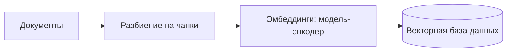
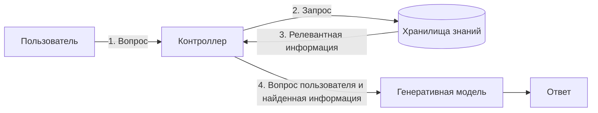

# Knowledge & memory design — how far up the mechanism ladder this agent has to climb, and what store each layer gets

## Output
A knowledge-and-memory design recommendation for the ADR / architecture step: which layers the agent has
(session state, durable knowledge, workflow durability), which mechanism sits on each layer (sliding
window, keyword index, vector store + RAG, experience memory, knowledge graph / GraphRAG), which store
backs it, the concrete chunking / embedding / retrieval parameters, and — if a graph is involved — the
construction checklist plus the production and dynamic-graph risk register.

## When to use / NOT
- **Use when:** deciding whether the agent needs external knowledge at all or only its own history;
  choosing between keyword and semantic retrieval; sizing an investment in memory (is a rolling window
  enough, or does this need a durable layer?); designing a RAG pipeline and its chunking; diagnosing an
  agent that answers point questions but cannot join facts across documents; deciding whether the workload
  justifies a knowledge graph; splitting memory layers across agents in a multi-agent system; planning the
  move from a graph prototype to a production graph database.
- **NOT for:** the token budget of the context window, what to place where inside one prompt, or where the
  session's state physically lives — client, server or hybrid. That is
  → `aiagents-context-engineering`; do not answer it from this skill. Not `agentdb-memory` (that is one product's API — this
  skill is the vendor-neutral design decision that precedes it). Not `context-window-management`
  (packing mechanics). Not `knowledge-extractor` (distilling a document for a human reader). Not how the
  agent improves itself from what it remembers → `aiagents-learning-strategy`. Not judging whether the
  memory subsystem is any good → `aiagents-evaluation-design`.

## Decision criteria

### 1. Знания или память — two mechanisms, not one (KU: ch06-ku01)
The book keeps these apart deliberately, because their content and lifetimes differ:

| Mechanism | What it supplies | Typical realisation |
|---|---|---|
| **Знания (knowledge)** | Factual or domain content that the model does not carry: технические спецификации, документы политик, каталоги товаров, клиентские и системные журналы [p.144] | Usually RAG — the content is injected at generation time [p.144] |
| **Память (memory)** | The agent's own record: past dialogues, what tools returned, state changes — continuity across turns and across sessions, and grounding for future decisions [p.144] | The memory layers of §2, escalated per the ladder of §3 |

The chapter's own framing of the link to context engineering: «память — место, в котором хранятся знания,
а контекст-инжиниринг — механизм использования знаний для получения интеллектуального поведения» [p.144].
Practical consequence for this skill: it decides **what goes into a store**; the packing mechanism is the
adjacent decision, owned by → `aiagents-context-engineering`.

> Source defect to know about: the translated sentence on p.144 says knowledge attaches information
> *stored in the model's own weights*, which contradicts the paragraph around it — the passage is about
> information the weights do **not** contain. Read the paragraph, not that clause (recorded in ch06-ku01).

### 2. Layers and the store each one deserves (KU: ch02-ku10, ch08-ku26)
The book cuts memory **twice**, in two different chapters, and does **not** align the two cuts. Keep them
separate; do not assume эпизодическая == краткосрочная.

**Cut A — гл. 2, by lifetime [p.50-51]:**

| Layer | Holds | Named realisation |
|---|---|---|
| Краткосрочная | The current task or dialogue; the context that keeps in-session decisions consistent (a support agent that recalls earlier requests of the same session answers more precisely) [p.50-51] | Скользящее окно контекста (rolling context window): recent data in focus, stale data gradually displaced; fits chat-bots and assistants that do not need old detail [p.51] |
| Долгосрочная | Knowledge and experience accumulated over a long horizon, used to ground future actions; needed by agents that must get better interaction over interaction, and by agents that adapt to an individual user's tastes [p.51] | Базы данных, графы знаний, тонко настроенные модели; structured records such as user preferences and historical metrics (health-monitoring agent keeping long-horizon patient data to spot patterns) [p.51] |

**Cut B — гл. 8, by the nature of the memory and the coordination required [p.235-236]:**

| Kind | Durability requirement | Store the book names |
|---|---|---|
| Эпизодическая | Short-lived state of one concrete task | Оперативное либо временное хранилище, almost no durability [p.235] |
| Семантическая | Knowledge that must survive beyond a single interaction | A durable layer with search or a vector index [p.236] |
| Долговременность рабочего потока | Survival of a failure in mid-process | Integrated mechanisms such as **Temporal** or **Orleans**, which checkpoint progress and state automatically [p.236] |

**Top-level routing rule [p.236]:** systems with hard service-level agreements, inter-agent dependencies
or real-time coordination requirements gain when the durability layer is **built into the workflow**; more
modular or exploratory systems are better served by explicit state management through a database, which
gives more control and more visibility into the data.

**Management practices гл. 2 names** [p.51] — organising and indexing what was stored so it reads back
easily; separating the essential from the extraneous and surfacing it without delay; and dropping some
information so the store does not fill with the obsolete, with fresher data given higher priority
(illustrated by a recommender agent whose users' preferences shift over time).

> Scope note (KU ch02-ku10 is `verified: partial`): treat these as practices the chapter names, **not** as
> a closed, mandatory set of exactly three operations. The book presents forgetting as needed in some
> cases rather than always, and gives the recency-priority rule through the recommender example rather
> than as a universal law. The stronger reading was refused by the verifier and is excluded here.

### 3. The ladder — where to stop (KU: ch06-ku18)
The chapter's own position at its close: a context window carrying recent interactions covers many tasks,
and the harder scenarios are where you should invest in a solid solution — «в более сложных сценариях
рекомендуется инвестировать в построение более надежного решения» [p.163].

| Rung | Mechanism | What the next rung buys you | Pages |
|---|---|---|---|
| 1 | Скользящее окно контекста | Session continuity for near-zero effort | [p.146] |
| 2 | Память на ключевых словах (инвертированный индекс + BM25) | Exact historical context without shipping every past message | [p.147-148] |
| 3 | Семантическая память на векторном хранилище + RAG | Meaning-based retrieval and external domain knowledge | [p.148-152] |
| 4 | Семантическая память с учётом опыта | Personalisation from the accumulated history | [p.152] |
| 5 | Графы знаний и GraphRAG, вплоть до динамических графов | Multi-hop reasoning over connected data | [p.152-162] |

Two honesty constraints carried from the KU: the chapter groups rungs 1-2 together as sufficient for a
broad range of practical scenarios [p.145]; and the **numbering is a reconstruction of the chapter's order
of presentation, not a prescribed escalation** — the book offers no measurable criterion for crossing from
one rung to the next (the one explicit crossing rule it does give is the GraphRAG rule in §8).

### 4. Rung 1 — скользящее окно контекста, and exactly where it hurts (KU: ch06-ku04)
Mechanics: the whole interaction history is handed to the model; once the window is full, the oldest parts
are displaced by new ones, «первым пришел, первым ушел» (FIFO) [p.146]. In the simplest form the window
holds the current question plus everything earlier in this session, and on overflow only the most recent
survives [p.146].

- **Why you would take it:** trivial to implement, low complexity, and adequate for many scenarios [p.146].
- **The single failure mode:** eviction is blind to importance and relevance — any fragment leaves the
  moment enough interactions have piled up behind it, and with large prompts or verbose model output that
  point arrives quickly [p.146].
- **Wiring trap from the book's own listing:** a plain LangGraph graph over `MessagesState` that just calls
  the model keeps no dialogue state at all — on the second turn the name given on the first is already
  gone [p.146].

```python
from typing import Annotated, TypedDict
from langchain_openai import ChatOpenAI
from langgraph.graph import StateGraph, MessagesState, START
llm = ChatOpenAI(model="gpt-5")
def call_model(state: MessagesState):
    response = llm.invoke(state["messages"])
    return {"messages": [response]}
builder = StateGraph(MessagesState)
builder.add_node("call_model", call_model)
builder.add_edge(START, "call_model")
graph = builder.compile()
# Не поддерживает состояние в диалоге
```

> Deliberately **not** carried over: the companion prompt-placement heuristic attached to this KU. The KU
> is `verified: partial` and that specific formulation was the flagged over-claim — see
> `references/knowledge-units.md`.

### 5. Rung 2 — keyword memory: инвертированный индекс + BM25 (KU: ch06-ku05)
Four stages [p.147]:

1. **Индексирование** — the inverted index pre-processes all the text: tokenisation, normalisation
   (lower-casing, стемминг), stop-word removal; every term is tied to the list of fragments and documents
   it appears in.
2. **Выборка** — the agent walks that term's posting list instead of scanning every stored message, and
   gets exactly the fragments carrying the query's keywords.
3. **Ранжирование** — the BM25 scoring function weighs occurrences by three multipliers: term frequency,
   inverse document frequency (how rare the term is across the corpus), and normalised document length
   (which penalises fragments that are too long and too short).
4. **Запрос** goes through the *same* text pipeline as indexing; BM25 returns a sorted top-K list, often
   truncated, and that list is injected straight into the prompt.

The point of the rung: exact historical context in the prompt without sending every past message and
without blowing the context length [p.148].

```python
# pip install rank_bm25
from rank_bm25 import BM25Okapi
corpus: list[list[str]] = [
    "Агент J - новичок со своим особым характером".split(),
    "Агент K – опытный ветеран MIB с фирменным нейролизером".split(),
    "Галактику спасают два агента в черном".split(),
]
# 2. Построение индекса BM25
bm25 = BM25Okapi(corpus)
# 3. Выполнение выборки для запроса
query = "Кто новичок?".split()
top_n = bm25.get_top_n(query, corpus, n=2)
```

In production the store is normally a database rather than an in-process list [p.147].

### 6. Ключевые слова или семантика — which kind of miss hurts more (KU: ch06-ku06)
Restructured from the full-text-search and semantic-search sections, гл. 6, с. 147-149, around the
question *which failure you can least afford*:

| If the critical need is… | Mechanism | What you pay |
|---|---|---|
| Hitting an exact or highly specific term [p.148] | Инвертированный индекс + BM25 [p.147] | Misses general themes, paraphrases and conceptual links not literally present in the text [p.148] |
| Understanding the context and intent of the query and returning what is relevant without a literal word match [p.148] | Семантический поиск на эмбеддингах [p.148] | Vector indexing and storage, i.e. the vector-database infrastructure [p.149] |

What semantic search does differently: it works from the sense of the phrases rather than string equality,
using ML to take apart context, synonyms and word relations so that contextually appropriate results come
back even where the searched-for terms never occur [p.148]. The substrate is эмбеддинги — vector
representations that carry meaning learned from usage across large corpora, placing semantically similar
words close together in a high-dimensional space; the book names **Word2Vec, GloVe, BERT** [p.148], and
attributes the quality gains to the scale of the embedding model itself and to the volume and diversity of
its training data [p.148].

The book gives **no quantitative threshold** for switching, and does not describe hybrid retrieval
(BM25 + vectors) in this section — treat a hybrid as your own engineering call, not as a book claim.

### 7. Rung 3 — semantic memory on a vector store, and the RAG pipelines around it (KU: ch06-ku07, ch06-ku08)
**Семантическая память** is the long-term-memory variety holding generalised knowledge, concepts and
prior experience available for fast retrieval; it is usually built on vector databases precisely for fast
indexing and retrieval at scale [p.148]. Three steps [p.149]:

1. Generate embeddings for the concepts and knowledge you are storing — with foundation models or other
   NLP machinery; they encode text into compact vectors carrying meaning and mutual position in a
   continuous space.
2. Store the vectors in a database designed for high-dimensional data. The book names **VectorDB, FAISS**
   (Facebook AI Similarity Search) and **Annoy** (Approximate Nearest Neighbors Oh Yeah), optimised for
   fast similarity search [p.149].
3. On a query, run similarity search from the query's embedding, lift the most relevant vectors and ground
   the answer on them; the search is fast enough for operational analysis over large volumes [p.149].

```python
from vectordb import Memory
memory = Memory(chunking_strategy={'mode':'sliding_window',
                                   'window_size': 128, 'overlap': 16})
memory.save(text, metadata)          # metadata: {"title": ..., "url": ...}
results = memory.search(query, top_n=3)
```

**RAG is two pipelines, not one.** *Индексирование* runs offline; the motive for chunking is that the
model, like a person, does not need the whole bulky resource — only the small relevant part of it [p.150]:



*Выполнение* runs per request; the step numbering follows Рис. 6.2 [p.151]:



The retrieval phase searches a large corpus or vector store for what is relevant to the query, and its
quality is bounded by the search machinery; the generation phase hands the hits to the generative model,
which fuses them with its own knowledge into one coherent, contextually appropriate answer [p.151]. Reach
for this whenever domain- or company-specific information and policies must influence the result [p.152].

Parameter honesty: 128/16 above is the listing's chunk size and overlap; the book discusses **no other
values** and offers **no retrieval-quality metric** — choose and measure those yourself (measurement is
`aiagents-evaluation-design`).

### 8. Rung 4 — семантическая память с учётом опыта (KU: ch06-ku09)
Solves two problems at once: an agent that starts every session from a blank page, and complex or
long-running tasks whose context stops fitting the window over time [p.152]. Per user input [p.152]:

1. Turn the input text into a vector with an embedding model.
2. Use that embedding as the query for a vector search across **all** prior interactions in the memory
   store.
3. **Reserve a part of the context window** for the best matches from that memory.
4. Split the remaining space between the system message, the latest user input, and the most recent
   interactions.

The effect the book claims: the agent both draws on a broad knowledge base and tunes its answers and
actions to accumulated experience, which yields more personalised behaviour [p.152]. The structural change
versus rung 1: eviction stops being purely temporal — an old interaction returns to the context when it is
semantically close to the current input.

Left open by the book, and therefore yours to decide: the size of the reserved share, and any
eviction/ageing policy for the experience store itself.

### 9. Rung 5 — the explicit trigger for GraphRAG (KU: ch06-ku10)
Basic RAG works well for simple fact lookup and direct question answering [p.152]. Three situations where
it stumbles [p.152-153]:

1. The answer requires joining information scattered across several documents — the book's phrase for this
   is «соединение точек» [p.152].
2. The query implies a summary of the dataset's high-level semantic themes [p.153].
3. The dataset is large, weakly structured, or built as a narrative rather than as a pile of discrete
   facts [p.153].

The book's illustration: a question of the form «чем занимался Джеффри Хинтон?» may go unanswered by a
basic RAG system if no retrieved chunk carries a detailed description of his activity [p.153].

GraphRAG's answer to this is a граф знаний built by lifting entities and their relations out of the
dataset, which opens up multi-hop reasoning, chains of relations and structured summaries [p.153]. The
crossing rule stated outright [p.154]: when the dataset is large and the usual chunks-plus-embedding-search
combination is hitting its limits, go to GraphRAG — «Это более затратный и сложный подход, но он часто
приводит к лучшим результатам» [p.154]. The threshold is qualitative; the book gives no metric and
deliberately withholds algorithm detail, pointing at open-source implementations instead [p.154].

### 10. Building the graph: eight steps and how to materialise it (KU: ch06-ku12, ch06-ku13)
The chapter's methodology, as a checklist [p.154-155]:

- [ ] 1. **Сбор данных** — databases, text documents, web sites, user-generated content; diversity and
      quality of sources matter. Inside a company this is usually the body of internal policies and
      reference documents that frames how the agent may work [p.154].
- [ ] 2. **Очистка и предобработка** — drop the irrelevant and redundant, fix errors, standardise formats;
      this lowers noise and raises the accuracy of the entity extraction that follows [p.154].
- [ ] 3. **Распознавание и выделение сущностей** — the future vertices: people, places, organisations,
      concepts. The standard method is NER (named entity recognition), including ML models trained on
      large datasets [p.155].
- [ ] 4. **Выделение отношений** — parse for the predicates that connect entities and become edges. Hard
      on unstructured data, though foundation models have grown more effective at it over time [p.155].
- [ ] 5. **Проектирование онтологии** — the schema listing entity types and the relations permitted
      between them; it sets the backbone structure and enables more effective querying and search [p.155].
- [ ] 6. **Заполнение графа** with vertices and edges following the ontology. Named database engines:
      **Neo4j, OrientDB, Amazon Neptune** [p.155].
- [ ] 7. **Интеграция и проверка** — link to other databases, remove duplicate entities, confirm the
      domain is represented accurately enough. Validation is either user testing or automated integrity
      and usability checks [p.155].
- [ ] 8. **Сопровождение и обновления** — the graph is not static: new data arrives, existing data
      changes, and the ontology needs refining as new entity or relation types appear; automation and ML
      models matter here [p.155].

**Extraction (Рис. 6.3, [p.156]).** Multi-hop retrieval improves when you lift semantic triplets in the
RDF (Resource Description Framework) data model — the «субъект — предикат — объект» structure. Foundation
models extract them well enough that graphs can be built at scale [p.156]. Flow: документы → триплеты →
граф знаний [p.156].

```text
Субъект, отношение, объект
Джей, муж, Бейонсе
Бейонсе, мать, Айви
Бейонсе, сестра, Соланж
Джей, родился в, Бруклине
```

**Zero-code start** — Microsoft's GraphRAG CLI gets you global analytical findings and local context in
minutes without writing Python [p.153, p.156]; the two query methods split by purpose, `global` for
dataset-level findings and `local` for local context [p.156]:

```bash
pip install graphrag
mkdir -p ./ragtest/input
curl https://www.gutenberg.org/ebooks/103.txt.utf-8 -o ./ragtest/input/book.txt
graphrag init --root ./ragtest
graphrag index --root ./ragtest
graphrag query --root ./ragtest --method global --query "Какие ключевые темы этого романа?"
graphrag query --root ./ragtest --method local --query "Кто такой Филеас Фогг и зачем он отправился в путешествие?"
```

**Population discipline in Neo4j** [p.157]: load or match the existing vertices first, so duplicates are
not multiplied, and only then create each relation with its own `CREATE`. Splitting the script into the
stages *create nodes → match nodes → create relations* makes it readable and makes debugging and later
extension of the graph easier [p.157].

```cypher
CREATE (:Concept {name: 'Machine Learning'});
CREATE (:Tool {name: 'TensorFlow', creator: 'Google'});
CREATE (:Model {name: 'BERT', year: 2018});
MATCH
(ai:Concept {name:'Artificial Intelligence'}),
(ml:Concept {name:'Machine Learning'})
CREATE (ml)-[:SUBSET_OF]->(ai);
```

The queries this whole build exists for [p.158-159] — a loaded graph supports multi-hop traversals such as
`shortestPath` and extended relation patterns whose expressiveness goes beyond flat tables and vector
stores [p.159]:

```cypher
MATCH path = shortestPath(
(concept1:Concept {name: 'Natural Language Processing'})-[*]-(concept2:Concept
{name: 'Deep Learning'})
)
RETURN path;
MATCH (model:Model)-[:BUILT_WITH]->(tool:Tool {name: 'TensorFlow'})
RETURN model.name AS model, model.year AS year;
```

Watch out: those listings use `CREATE` without `MERGE`, so by themselves they do **not** protect against
duplicates — `MERGE` is recommended separately, in the scaling section [p.157].

### 11. Prototype → production, and the dynamic-graph risk register (KU: ch06-ku14, ch06-ku16)
Graph prototypes go up relatively easily; a solution ready for real operation is a serious undertaking
[p.160]. The tooling ladder the book lays out [p.153, p.156-157]:

| Stage | Tooling | Note |
|---|---|---|
| Learning and local experiments | Community projects **nano-graphrag** and example repositories such as **example-graphrag** | They fit the same end-to-end chain into a few hundred lines of Python [p.153]; the duplicated paragraph on p.157 says «в нескольких строках Python» — an internal inconsistency of the book |
| Control and flexibility | **neo4j-graphrag-python** | Configure the Neo4j connection, define an embedder and a retriever, and full GraphRAG functionality is available [p.153, p.157] |
| Production | **Neo4j** | The book calls it the most reliable and time-proven enterprise-grade graph database on the market [p.157] |

The book's argument for that production choice [p.157]: a native graph storage engine plus index-free
adjacency keeps traversal cost near-constant even when scaling to billions of vertices and relations; and
Neo4j Enterprise and AuraDB add clustering, fault tolerance, ACID guarantees and multi-region operation.
**Bias flag:** this section is a pronounced single-vendor recommendation — OrientDB and Amazon Neptune
appear only as engine options at the population step [p.155] and are not compared on these criteria.

Transition checklist [p.157]:

- [ ] Population through Cypher using `CREATE` **and** `MERGE`, to build clean graphs without duplicates.
- [ ] Incremental-load logic, so new data updates the graph without duplication.
- [ ] Performance scaling: read/write clustering, cache sharding, and Neo4j's optimised query planner.

**If the graph is dynamic** (continuously updated), the book's case for it is real-time data handling in
constantly changing environments — новости, социальные сети, системы мониторинга; adaptive learning that
updates on new data without periodic retraining or manual edits, which matters in medicine, technology and
finance; and a structured format that can be markedly more flexible than a vector store when you need the
rich context of one entity [p.161]. Each named risk carries the mitigation the book names for it:

| Risk | What breaks | Mitigation named by the book [p.162] |
|---|---|---|
| Сложность в сопровождении [p.161] | Holding a dynamic graph accurate and reliable is far harder than a static one; the continuous inflow of new data breeds errors and inconsistencies that spread through the graph if not caught in time [p.161] | Stable validation machinery — automated tools and processes for continuous control of data accuracy and reliability |
| Интенсивное потребление ресурсов [p.161] | Updating, checking and maintaining takes significant compute; as the graph's size and complexity grow this bounds scalability [p.161-162] | A scalable architecture: distributed databases and cloud compute |
| Безопасность и конфиденциальность [p.162] | The real-time factor makes data-protection compliance harder, and any oversight leads to serious incidents [p.162] | Encryption, access control, anonymisation — across all data input and integration |
| Чрезмерная зависимость [p.162] | Decisions driven purely by automated graph analytics miss external factors the graph does not represent [p.162] | Human oversight on critical decisions |

Mitigations are stated as classes of solution — no concrete tools, thresholds or control metrics.

## Key facts & formulas
- BM25 weighs a hit by three multipliers: term frequency, inverse document frequency, and normalised
  document length [p.147].
- Retrieval returns a sorted top-K list, often truncated before injection into the prompt [p.147].
- Named embedding models: Word2Vec, GloVe, BERT [p.148].
- Named vector stores: VectorDB, FAISS (Facebook AI Similarity Search), Annoy (Approximate Nearest
  Neighbors Oh Yeah) [p.149].
- The book's chunking parameters: `sliding_window` mode, `window_size` **128**, `overlap` **16**; search
  `top_n=3` [p.149].
- Knowledge-graph construction is **8 steps**, from data collection through maintenance [p.154-155].
- Named graph engines: Neo4j, OrientDB, Amazon Neptune [p.155].
- RDF triplet = субъект — предикат — объект [p.156].
- GraphRAG CLI query methods: `global` for dataset-level findings, `local` for local context [p.156].
- Neo4j's production argument: native graph storage engine + index-free adjacency → near-constant
  traversal cost at billions of vertices and relations; Enterprise/AuraDB add clustering, fault tolerance,
  ACID and multi-region [p.157].
- Dynamic knowledge graphs: **4 named risks**, each with **1 named mitigation** [p.161-162].
- Workflow-durability mechanisms named for mid-process failure: Temporal, Orleans [p.236].

## Anti-patterns
| Anti-pattern | Why it fails | Source |
|---|---|---|
| Leaning on a sliding window for anything whose loss would hurt | FIFO eviction ignores importance and relevance; the fragment you needed leaves as soon as enough turns pile up behind it | ch06-ku04 |
| Keyword memory for conceptual or paraphrased queries | BM25 matches terms — general themes, paraphrases and links not literally present go missing | ch06-ku05, ch06-ku06 |
| Adopting a hybrid keyword+vector retriever "because the book says so" | The book gives no switching threshold and does not describe hybrid retrieval in this section — that is your engineering call, unbacked here | ch06-ku06 |
| Expecting basic RAG to join facts across documents or summarise a dataset's themes | Those are the two named failure cases of chunk+embedding retrieval, alongside large/unstructured/narrative datasets | ch06-ku08, ch06-ku10 |
| Copying `window_size` 128 / `overlap` 16 as a tuned default | They are the listing's values; the book discusses no alternatives and offers no retrieval-quality metric | ch06-ku07 |
| Building experience memory without deciding the reserved window share or an ageing policy | The scheme reserves part of the window for the best matches but the book fixes neither the fraction nor eviction/ageing of the experience store | ch06-ku09 |
| Populating a graph with `CREATE` only | The book's own listings do not protect against duplicates; `MERGE` is the recommended dedup path, and incremental loads need it | ch06-ku13, ch06-ku14 |
| Creating relations before the nodes are loaded or matched | The stated discipline is load/match existing vertices first, then create each relation separately — otherwise duplicates multiply and the script gets hard to debug | ch06-ku13 |
| Declaring the graph done after population (skipping steps 7-8) | Integration/validation removes duplicate entities and proves domain coverage; maintenance exists because the graph is not static | ch06-ku12 |
| Running a continuously updated graph without validation machinery | Errors and inconsistencies from the inflow spread through the graph if not caught in time | ch06-ku16 |
| Letting automated graph analytics decide critical cases alone | The graph does not encode external factors; the named mitigation is human oversight | ch06-ku16 |
| One store for every kind of memory | Store choice follows the memory's nature: short-lived task state and knowledge that must outlive an interaction have different durability needs | ch08-ku26 |
| Explicit database-managed state for a system with hard SLAs and real-time inter-agent coordination | That profile is exactly the one the book routes to workflow-embedded durability; DB-managed state is its recommendation for modular/exploratory systems | ch08-ku26 |
| Treating гл.2's short/long split and гл.8's episodic/semantic/workflow split as one axis | Two separate cuts made in two chapters; the book does not align them | ch02-ku10, ch08-ku26 |

## Related decisions
- Reserved part of the window for retrieved memory, or picked a rung on the ladder →
  `aiagents-context-engineering`: the **token budget** of that window, the packing order inside the
  prompt, and where between-call session state lives belong there. Coupling: the rung chosen here fixes
  how much retrieved material arrives per call — climbing from a sliding window to GraphRAG hands that
  skill a bigger, less predictable payload to fit into the same budget. Do not answer that from here.
- Chose a durable long-term store that accumulates experience → `aiagents-learning-strategy`: this skill
  decides *where the experience is kept*; how the agent's behaviour changes because of it is separate.
- Chose semantic retrieval or GraphRAG → `aiagents-evaluation-design`: the book gives no retrieval-quality
  metric, so the acceptance criterion has to be designed there.
- Chose a dynamic, continuously updated graph → `aiagents-observability-and-drift`: the book's first
  mitigation is continuous automated validation of accuracy and reliability — that is a monitoring surface,
  not a build-time task.
- Split memory layers across agents, or need durability built into the workflow → `aiagents-single-vs-multi-agent`:
  inter-agent dependencies and real-time coordination are precisely the trigger the book names for
  workflow-embedded durability rather than DB-managed state [p.236].
- The knowledge store holds internal policies, customer records or system logs → `aiagents-agent-security`:
  encryption, access control and anonymisation across data input and integration are the named mitigations.
- Retrieval is exposed to the agent as a callable tool rather than pre-fetched by the controller →
  `aiagents-tool-design-and-selection`: the retrieval step becomes a tool contract with its own selection
  problem.
- A very long context window is on the table as an alternative to retrieval → `aiagents-agent-fit-and-model-choice`
  for the model side; the long-context-versus-retrieval trade itself sits in the not-yet-distilled
  context-engineering cluster.

## Источник
Derived from «Building Applications with AI Agents» (Albada, рус. пер., ISBN 978-601-14-1158-5):
глава 6 «Знания и память» (с. 144-163), глава 2 «Проектирование агентных систем» (с. 50-51),
глава 8 «От одного агента ко многим» (с. 235-236) — page ranges computed from the `sources:` blocks of
the 15 consumed KUs.

KUs: ai-apps-ch06-p144-ku01, ku04, ku05, ku06, ku07, ku08, ku09, ku10, ku12, ku13, ku14, ku16, ku18;
ai-apps-ch02-p41-ku10; ai-apps-ch08-p193-ku26. Deep reference: `references/knowledge-units.md`.

Anchor quotes for human spot-check:
- Knowledge/memory framing: «память — место, в котором хранятся знания, а контекст-инжиниринг — механизм
  использования знаний для получения интеллектуального поведения» [p.144].
- GraphRAG crossing rule: «Это более затратный и сложный подход, но он часто приводит к лучшим
  результатам» [p.154].

## Self-check
- [x] Every criterion traces to a listed KU?
- [x] Facts carry page anchors?
- [x] Both `partial` KUs' flagged over-claims excluded and marked in place?
- [x] trust_tier 1 (machine-distilled, routing-gated at CP3.5, not yet human-reviewed)?

## Examples
- «Агент отвечает на точечные вопросы по регламенту, но не может собрать ответ из трёх документов —
  что менять?» → this is failure case 1 of basic RAG («соединение точек»); the crossing rule points at
  GraphRAG, with the eight-step construction checklist and the cost caveat.
- "Do we need a vector database, or is BM25 enough for our support agent's history?" → decide by which
  miss hurts more: exact/specific terms → inverted index + BM25; intent and paraphrase without literal
  overlap → embeddings, at the price of vector infrastructure. No numeric threshold exists in the book.
- «Где хранить память у мультиагентной системы с жёсткими SLA?» → split by memory nature: episodic in
  volatile/temporary storage, semantic in a durable searchable/vector layer, and — given hard SLAs,
  inter-agent dependencies and real-time coordination — durability built into the workflow (Temporal,
  Orleans) rather than DB-managed state.
- "Our knowledge-graph prototype works — what does production actually require?" → the tooling ladder
  (nano-graphrag → neo4j-graphrag-python → Neo4j), the `CREATE`+`MERGE`/incremental-load/scaling checklist,
  and, if the graph updates continuously, the four-risk register with its mitigations.
- «Наш агент забывает всё между сеансами, задачи длинные» → rung 4: embed each input, vector-search the
  whole interaction store, reserve part of the window for the best matches, and split the rest between the
  system message, the latest input and the most recent turns.
