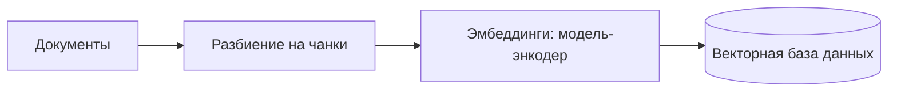
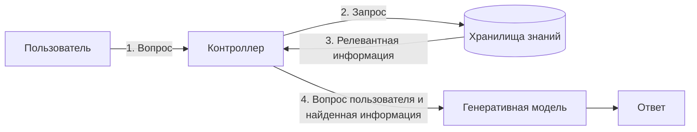

# Knowledge Units — `aiagents-knowledge-and-memory`

Source: «Building Applications with AI Agents» (Albada, рус. пер.), ISBN 978-601-14-1158-5 —
глава 6 «Знания и память» (с. 144-163), глава 2 «Проектирование агентных систем» (с. 50-51),
глава 8 «От одного агента ко многим» (с. 235-236).

Machine-distilled, not human-reviewed against the cited pages (trust_tier 1 — routing-gated at CP3.5 2026-08-18; Tier 2 requires human review). 15 KUs.

Two KUs are `verified: partial`. The claim the cross-model verifier refused is named in that KU's
section below and is **excluded** from SKILL.md; everything else in the KU is used.

---

## KU01 — Знания против памяти: два разных механизма обогащения контекста
- **type:** definition
- **pages:** 144
- **ku_id:** ai-apps-ch06-p144-ku01
- **verified:** true

**Problem:** Разделить два источника дополнительного контекста агента, чтобы не проектировать их одним
механизмом и не смешивать их сроки жизни.

**Content:**
Книга разводит два взаимодополняющих, но разных механизма [p.144]:
1. ЗНАНИЯ — чаще всего реализуются через RAG (retrieval-augmented generation, генерация, дополненная
   поиском). Подключают фактический или предметный контент на стадии генерации: технические
   спецификации, документы политик, каталоги товаров, клиентские и системные журналы [p.144].
2. ПАМЯТЬ — история самого агента: прошлые диалоги, то, что вернули инструменты, изменения состояния.
   Даёт неразрывность между репликами и сеансами и обосновывает будущие решения прошлыми [p.144].

Связка с главой 5: память — фундамент контекст-инжиниринга; она поставляет знания, историю и факты,
а контекст-инжиниринг — механизм их отбора и сборки в промпт [p.144]. Формулировка книги: память — место
хранения знаний, контекст-инжиниринг — механизм их использования для интеллектуального поведения [p.144].

Замечание к источнику: в переводе на с. 144 фраза о том, что знания подключают информацию, «хранящуюся
в самой модели (ее весах и смещениях), за пределами непосредственного диалога» [p.144], противоречит
смыслу абзаца — по контексту речь идёт об информации, которой в весах модели НЕТ. Опираться на смысл
абзаца, не на эту фразу.

**Applicability:** Разграничение двух механизмов обогащения контекста агента [p.144]; отсюда решение,
что класть в базу знаний, а что в историю сеанса.

**Limits:** Разграничение концептуальное: с. 144 задаёт его определениями и не описывает механизмов
реализации.

---

## KU04 — Скользящее окно контекста: FIFO-вытеснение и его цена
- **type:** heuristic
- **pages:** 146
- **ku_id:** ai-apps-ch06-p144-ku04
- **verified:** partial — **ИСКЛЮЧЕНО из скилла:** сопутствующая эвристика о размещении промпта.
  Вердикт верификатора: в книге размещение самого релевантного контекста ближе к концу промпта дано как
  ВОЗМОЖНОСТЬ («может повысить вероятность»), тогда как KU утверждал это категорически и добавлял
  отсутствующее в тексте требование выделять такой контекст ЯВНО. Формулировка была приведена к книжной
  уже после повторного вызова верификатора, поэтому исправление вердиктом не переподтверждено. Ни
  категорическая, ни смягчённая версия этой эвристики в SKILL.md не используется.

**Problem:** Простейший способ дать агенту память о сеансе [p.146] — и понимание, где именно он начнёт
терять важное.

**Content:**
Механика: в модель передаётся вся история взаимодействия; при заполнении окна самые старые части
вытесняются и заменяются новыми по принципу «первым пришел, первым ушел» (FIFO) [p.146]. В простейшем
варианте окно содержит текущий вопрос и все предшествующие взаимодействия текущего сеанса, а при
переполнении — только самые последние [p.146].

Плюсы: лёгкая реализация, низкая сложность, достаточность для многих сценариев [p.146].
Главный недостаток: информация теряется независимо от её важности или релевантности — любой фрагмент
удаляется, как только накопилось достаточно взаимодействий для его вытеснения; при больших промптах или
обширных ответах модели это наступает быстро [p.146].

Каркас стандартной реализации памяти в агенте LangGraph [p.146]:

```python
from typing import Annotated, TypedDict
from langchain_openai import ChatOpenAI
from langgraph.graph import StateGraph, MessagesState, START
llm = ChatOpenAI(model="gpt-5")
def call_model(state: MessagesState):
    response = llm.invoke(state["messages"])
    return {"messages": [response]}
builder = StateGraph(MessagesState)
builder.add_node("call_model", call_model)
builder.add_edge(START, "call_model")
graph = builder.compile()
# Не поддерживает состояние в диалоге
```

Комментарий в самом листинге предупреждает, что этот граф состояние диалога НЕ поддерживает: на второй
реплике «what's my name?» имя из первой уже недоступно [p.146].

Замечание к источнику: в извлечённом тексте у листинга потеряны отступы Python (тела функции идут
с нулевой колонки) — отступы восстановлены здесь по синтаксису.

**Applicability:** Простые сценарии использования [p.146]; там, где потеря старых реплик приемлема.

**Limits:** Не различает важность фрагментов [p.146]; на длинных задачах теряет ровно то, что могло быть
нужно.

---

## KU05 — Полнотекстовый поиск на BM25 как память по ключевым словам
- **type:** methodology
- **pages:** 147, 148
- **ku_id:** ai-apps-ch06-p144-ku05
- **verified:** true

**Problem:** Внедрить точный исторический контекст в промпт, не передавая все прошлые сообщения и не
выходя за ограничение длины контекста [p.148].

**Content:**
Пайплайн [p.147]:
1. ИНДЕКСИРОВАНИЕ: инвертированный индекс предварительно обрабатывает весь текст — токенизация,
   нормализация (приведение к нижнему регистру, стемминг), удаление стоп-слов; каждый термин связывается
   со списком фрагментов и документов, где он встречается.
2. ВЫБОРКА: агент не сканирует все сохранённые сообщения, а идёт по списку вхождений термина и получает
   ровно те фрагменты, где есть ключевые слова запроса.
3. РАНЖИРОВАНИЕ: функция оценки BM25 взвешивает вхождения по трём множителям — частоте термина, обратной
   частоте документа (редкость термина по корпусу) и нормализованной длине документа (штраф слишком
   длинным и слишком коротким фрагментам).
4. ЗАПРОС обрабатывается ТЕМ ЖЕ текстовым пайплайном, что и индексирование; BM25 отдаёт отсортированный
   список топ-K кандидатов, который — часто усечённый — внедряется прямо в промпт фундаментальной модели.

Минимальная реализация из книги (в продакшене хранение обычно в базе данных [p.147]):

```python
# pip install rank_bm25
from rank_bm25 import BM25Okapi
corpus: list[list[str]] = [
    "Агент J - новичок со своим особым характером".split(),
    "Агент K – опытный ветеран MIB с фирменным нейролизером".split(),
    "Галактику спасают два агента в черном".split(),
]
# 2. Построение индекса BM25
bm25 = BM25Okapi(corpus)
# 3. Выполнение выборки для запроса
query = "Кто новичок?".split()
top_n = bm25.get_top_n(query, corpus, n=2)
```

Замечание к источнику: нумерация комментариев в листинге начинается с «# 2» — шаг 1 (подготовка корпуса)
комментарием не помечен; отступы списка в извлечённом тексте потеряны и восстановлены здесь.

**Applicability:** Нахождение точных или очень специфических терминов [p.148].

**Limits:** Упускает более общие темы, перифразы и те концептуальные связи, которых в исходном тексте нет
буквально [p.148]; за «смысловой» памятью — к семантической выборке [p.148].

---

## KU06 — Ключевые слова или семантика: чем платить за какой промах
- **type:** tradeoff-table
- **pages:** 147, 148, 149
- **ku_id:** ai-apps-ch06-p144-ku06
- **verified:** true

**Problem:** Какой механизм выборки поставить под задачу поиска в памяти агента.

**Content:**
По мотивам разделов «Традиционный полнотекстовый поиск» и «Семантический поиск», гл. 6, с. 147-149 —
реструктурировано вокруг вопроса «каких промахов вы боитесь больше»:

| Если критично… | Механизм | Чем платите |
|---|---|---|
| Найти точный или очень специфический термин [p.148] | Инвертированный индекс + BM25 [p.147] | Пропускает общие темы, перифразы и явно не выраженные концептуальные связи [p.148] |
| Понять контекст и намерение запроса, вернуть релевантное без точного совпадения слов [p.148] | Семантический поиск на эмбеддингах [p.148] | Индексация и хранение векторов, инфраструктура векторной БД [p.149] |

Что именно делает семантический поиск: опирается на смысл фраз, а не на буквальное совпадение строк;
методами ML разбирает контекст, синонимы и связи между словами, чтобы вернуть контекстно уместные
результаты даже там, где искомые термины не встретились [p.148].

Основа — эмбеддинги: векторные представления, отражающие смысл слов по их употреблению в больших
корпусах; семантически похожие слова оказываются рядом в пространстве высокой размерности. Названные
книгой модели: Word2Vec, GloVe, BERT [p.148]. Качество дополнительно выросло за счёт масштаба самой
эмбеддинг-модели и за счёт объёма и разнородности обучающих данных [p.148].

**Applicability:** Выбор механизма выборки для памяти и базы знаний; извлечение из документов, не
содержащих одинаковых ключевых слов [p.149].

**Limits:** Книга не даёт количественного порога перехода и не описывает гибридную выборку (BM25 +
векторы) в этом разделе.

---

## KU07 — Семантическая память на векторном хранилище: сборка
- **type:** methodology
- **pages:** 148, 149, 150
- **ku_id:** ai-apps-ch06-p144-ku07
- **verified:** true

**Problem:** Сохранять концепции, знания и прошлый опыт так, чтобы позднее быстро поднимать именно
релевантное для повышения качества ответов [p.148-149].

**Content:**
Определение: семантическая память — разновидность долгосрочной памяти, где лежат обобщённые знания,
понятия и накопленный ранее опыт, доступные для быстрой выборки; чаще всего строится на векторных базах
данных ради быстрого индексирования и выборки в большом масштабе [p.148].

Шаги [p.149]:
1. Сгенерировать эмбеддинги для сохраняемых концепций и знаний — фундаментальными моделями или другими
   механизмами NLP (natural language processing); они кодируют текст в компактные векторы, которые несут
   смысл и взаимное расположение объектов данных в непрерывном пространстве.
2. Сохранить векторы в базе, спроектированной под данные высокой размерности. Названные книгой
   хранилища: VectorDB, FAISS (Facebook AI Similarity Search), Annoy (Approximate Nearest Neighbors
   Oh Yeah) — они оптимизированы под быстрый поиск по сходству [p.149].
3. На запрос агента выполнить поиск по сходству от эмбеддинга запроса, поднять самые релевантные векторы
   и обосновать ими ответ; поиск быстрый, поэтому годится для оперативного анализа больших объёмов [p.149].

Параметры чанкинга из листинга книги [p.149]:

```python
from vectordb import Memory
memory = Memory(chunking_strategy={'mode':'sliding_window',
                                   'window_size': 128, 'overlap': 16})
memory.save(text, metadata)          # metadata: {"title": ..., "url": ...}
results = memory.search(query, top_n=3)
```

Замечание к источнику: листинг на с. 149-150 начинается с импортов LangGraph и определения `call_model`,
которые в дальнейшем примере не используются — граф не собирается и не запускается; пример по факту
демонстрирует только VectorDB [p.149-150].

**Applicability:** Долгосрочная память агента и предметные базы знаний; масштаб, при котором перечисление
всего в промпте невозможно.

**Limits:** Книга не обсуждает выбор размера чанка/перекрытия помимо приведённых 128/16 и не даёт метрик
качества выборки.

---

## KU08 — RAG: два пайплайна — офлайн-индексирование и рантайм-выборка
- **type:** methodology
- **pages:** 150, 151, 152
- **ku_id:** ai-apps-ch06-p144-ku08
- **verified:** true

**Problem:** Дать модели доступ к предметным или корпоративным сведениям и политикам, которые должны
влиять на результат [p.152], не помещая весь корпус в промпт.

**Content:**
RAG (retrieval-augmented generation) объединяет методы извлечения информации с генеративными моделями:
механизмы получения информации интегрируются с фундаментальной моделью, что даёт более информированные и
контекстно-обогащённые ответы [p.150].

ПАЙПЛАЙН 1 — индексирование (Рис. 6.1, [p.150-151]). Мотив разбиения на чанки: модели, как и человеку,
не нужен весь объёмный ресурс — нужна небольшая релевантная часть [p.150].



Результат: очень быстрый семантический поиск при обработке запроса [p.151].

ПАЙПЛАЙН 2 — выполнение (Рис. 6.2, [p.151]). Нумерация шагов — как на рисунке:



Фаза извлечения ищет по большому корпусу или векторному хранилищу информацию, релевантную запросу, и
зависит от эффективности механизмов поиска; фаза генерации передаёт найденное генеративной модели,
которая синтезирует его с собственными знаниями в связный контекстно-соответствующий ответ [p.151].

**Applicability:** Интеграция информации или политик, специфических для предметной области либо
конкретной компании, которые должны влиять на результат [p.152].

**Limits:** Базовый RAG плохо отвечает, когда нужно соединить сведения из нескольких документов, обобщить
высокоуровневые темы датасета или когда датасет большой, плохо структурированный либо повествовательный
[p.152-153] — см. KU10 про GraphRAG.

---

## KU09 — Семантическая память с учётом опыта: резерв окна под прошлые взаимодействия
- **type:** case-pattern
- **pages:** 152
- **ku_id:** ai-apps-ch06-p144-ku09
- **verified:** true

**Problem:** Две проблемы разом: агент начинает каждый сеанс с чистого листа, а контекст сложных или
долгих задач со временем перестаёт умещаться в окне [p.152].

**Content:**
Схема semantic experience memory на каждый пользовательский ввод [p.152]:
1. Преобразовать текст ввода в вектор моделью эмбеддингов.
2. Использовать этот эмбеддинг как запрос к векторному поиску по ВСЕМ предшествующим взаимодействиям
   в хранилище памяти.
3. Зарезервировать ЧАСТЬ окна контекста под лучшие совпадения из этой памяти.
4. Оставшееся пространство распределить между системным сообщением, последним вводом пользователя и
   самыми недавними взаимодействиями.

Эффект: агент не только черпает из обширной базы знаний, но и подстраивает ответы и действия под
накопленный опыт, а это даёт более персонализированное поведение [p.152].

Отличие от скользящего окна: вытеснение перестаёт быть чисто временным — старое взаимодействие
возвращается в контекст, если оно семантически близко текущему вводу (следует из шагов 2-3 [p.152]).

**Applicability:** Агент, начинающий каждый сеанс с чистого листа, и сложные либо долго выполняемые
задачи, чей контекст со временем перестаёт умещаться в окне [p.152].

**Limits:** Книга не задаёт размер резервируемой доли окна и не описывает вытеснение/старение записей
самой памяти опыта.

---

## KU10 — Когда базового RAG мало и пора брать GraphRAG
- **type:** decision-framework
- **pages:** 152, 153, 154
- **ku_id:** ai-apps-ch06-p144-ku10
- **verified:** true

**Problem:** Определить порог, за которым чанки плюс поиск по эмбеддингам перестают отвечать на вопросы
пользователя.

**Content:**
Базовый RAG работает эффективно для простого поиска фактов и прямых ответов на вопросы [p.152]. Три
ситуации, где он спотыкается [p.152-153]:
1. Ответ требует объединить информацию, разбросанную по нескольким документам — книга называет это
   «соединением точек» [p.152].
2. Запрос подразумевает обобщение высокоуровневых семантических тем датасета [p.153].
3. Датасет велик, слабо структурирован либо построен как повествование, а не как набор разрозненных
   фактов [p.153].

Иллюстрация книги: на вопрос вида «чем занимался Джеффри Хинтон?» базовая RAG-система может не ответить,
если ни в одном прочитанном чанке нет подробного описания его деятельности [p.153].

Чем отвечает GraphRAG: строит граф знаний, вынося из датасета сущности и связи между ними; это открывает
многоступенчатые рассуждения, цепочки отношений и структурированные резюме [p.153].

Явное правило перехода [p.154]: если датасет велик, а привычная связка «чанки + поиск по эмбеддингам»
упирается в ограничения — берите GraphRAG. Подход дороже и сложнее, зато результат чаще выходит лучше.

**Applicability:** Ревизия работающего RAG, когда пользователи задают агрегирующие или
«многодокументные» вопросы.

**Limits:** Порог качественный, без метрик; книга сознательно не приводит деталей алгоритма и отсылает
к готовым реализациям с открытым кодом [p.154].

---

## KU12 — Восемь шагов построения графа знаний
- **type:** checklist
- **pages:** 154, 155
- **ku_id:** ai-apps-ch06-p144-ku12
- **verified:** true

**Problem:** Провести граф знаний от сырых источников до сопровождаемого продакшен-артефакта, ничего
не пропустив.

**Content:**
Методология книги — восемь шагов [p.154-155]:
- [ ] 1. СБОР ДАННЫХ. Источники: базы данных, текстовые документы, веб-сайты, контент, сгенерированный
      пользователем. Важны разнообразие и качество источников. В компании это обычно свод внутренних
      политик и справочных документов — всё, что задаёт агенту рамки работы [p.154].
- [ ] 2. ОЧИСТКА И ПРЕДОБРАБОТКА. Удалить нерелевантное и избыточное, исправить ошибки, стандартизировать
      форматы. Снижает шум и повышает точность последующего извлечения сущностей [p.154].
- [ ] 3. РАСПОЗНАВАНИЕ И ВЫДЕЛЕНИЕ СУЩНОСТЕЙ — будущих вершин: люди, места, организации, концепции.
      Типовой метод — NER, распознавание именованных сущностей (named entity recognition), в том числе
      ML-моделями, обученными на больших датасетах [p.155].
- [ ] 4. ВЫДЕЛЕНИЕ ОТНОШЕНИЙ. Данные парсятся ради предикатов, которые соединяют сущности и становятся
      рёбрами графа. Нетривиально на неструктурированных данных, но фундаментальные модели со временем
      показали рост эффективности [p.155].
- [ ] 5. ПРОЕКТИРОВАНИЕ ОНТОЛОГИИ. Схема, в которой перечислены типы сущностей и допустимые между ними
      отношения; она задаёт основную структуру и поддерживает более эффективные запросы и поиск [p.155].
- [ ] 6. ЗАПОЛНЕНИЕ ГРАФА вершинами и рёбрами по структуре онтологии. Названные СУБД: Neo4j, OrientDB,
      Amazon Neptune [p.155].
- [ ] 7. ИНТЕГРАЦИЯ И ПРОВЕРКА. Связывание с другими базами, удаление дубликатных сущностей, проверка
      достаточной точности представления области. Валидация — пользовательское тестирование либо
      автоматические проверки целостности и удобства использования [p.155].
- [ ] 8. СОПРОВОЖДЕНИЕ И ОБНОВЛЕНИЯ. Граф не статичен: добавление новых данных, обновление существующих,
      уточнение онтологии при появлении новых типов сущностей или отношений; здесь важны автоматизация
      и ML-модели [p.155].

**Applicability:** Построение графа знаний, способного повысить производительность GraphRAG-системы
[p.154]; шаги 7-8 покрывают интеграцию, проверку и сопровождение уже заполненного графа [p.155].

**Limits:** Шаги описаны качественно, без критериев готовности каждого шага и без оценок трудоёмкости.

---

## KU13 — От документов к графу: RDF-триплеты, GraphRAG CLI и дисциплина Cypher
- **type:** methodology
- **pages:** 153, 156, 157, 158, 159
- **ku_id:** ai-apps-ch06-p144-ku13
- **verified:** true

**Problem:** Как практически материализовать граф знаний — от извлечения троек до скрипта заполнения,
который потом можно отлаживать.

**Content:**
ИЗВЛЕЧЕНИЕ (Рис. 6.3, [p.156]). Многоступенчатый поиск улучшают через выделение семантических триплетов
по модели данных Resource Description Framework (RDF); триплет — структура «субъект — предикат — объект».
Фундаментальные модели извлекают их достаточно хорошо, что позволяет строить такие графы в масштабе
[p.156]. Примеры троек с рисунка [p.156]:

```text
Субъект, отношение, объект
Джей, муж, Бейонсе
Бейонсе, мать, Айви
Бейонсе, сестра, Соланж
Джей, родился в, Бруклине
```

Поток: документы → триплеты → граф знаний [p.156].

БЫСТРЫЙ СТАРТ БЕЗ КОДА — GraphRAG CLI компании Microsoft; глобальные аналитические выводы и локальный
контекст получаются за несколько минут, не написав ни строчки Python [p.153, p.156]:

```bash
pip install graphrag
mkdir -p ./ragtest/input
curl https://www.gutenberg.org/ebooks/103.txt.utf-8 -o ./ragtest/input/book.txt
graphrag init --root ./ragtest
graphrag index --root ./ragtest
graphrag query --root ./ragtest --method global --query "Какие ключевые темы этого романа?"
graphrag query --root ./ragtest --method local --query "Кто такой Филеас Фогг и зачем он отправился в путешествие?"
```

Два метода запроса разделены по назначению: `global` — глобальные аналитические выводы, `local` —
локальный контекст [p.156].

ДИСЦИПЛИНА ЗАПОЛНЕНИЯ В NEO4J [p.157]: сначала загрузить или сопоставить существующие вершины (чтобы не
плодить дубликаты), затем отдельной командой CREATE создать каждое отношение. Разделение скрипта на шаги
«создание узлов → сопоставление узлов → создание отношений» делает его понятнее и упрощает отладку и
расширение графа по мере роста [p.157]. Форма [p.158]:

```cypher
CREATE (:Concept {name: 'Machine Learning'});
CREATE (:Tool {name: 'TensorFlow', creator: 'Google'});
CREATE (:Model {name: 'BERT', year: 2018});
MATCH
(ai:Concept {name:'Artificial Intelligence'}),
(ml:Concept {name:'Machine Learning'})
CREATE (ml)-[:SUBSET_OF]->(ai);
```

Запросы, ради которых всё строилось [p.158-159]:

```cypher
MATCH path = shortestPath(
(concept1:Concept {name: 'Natural Language Processing'})-[*]-(concept2:Concept
{name: 'Deep Learning'})
)
RETURN path;
MATCH (model:Model)-[:BUILT_WITH]->(tool:Tool {name: 'TensorFlow'})
RETURN model.name AS model, model.year AS year;
```

Загруженный граф поддерживает многоступенчатые обходы (например, shortestPath) и расширенные паттерны
отношений, выразительно превосходящие плоские таблицы и векторные хранилища [p.159].

Замечание к источнику: в листинге на с. 156 после команды `curl` идёт «висячая» строка
`./ragtest/input/book.txt` — артефакт вёрстки, при копировании её надо убрать [p.156].
Замечание к источнику: абзац про GraphRAG CLI, neo4j-graphrag-python, nano-graphrag и example-graphrag
напечатан дважды — на с. 153 и почти дословно на с. 156-157 [p.153, p.156-157].

**Applicability:** Переход от идеи графа знаний к работающему пайплайну: прототип на CLI, продакшен —
на графовой СУБД.

**Limits:** Приведённые Cypher-примеры используют CREATE без MERGE, то есть сами по себе не защищают от
дубликатов — MERGE книга рекомендует отдельно, в разделе про масштабирование [p.157].

---

## KU14 — Путь от прототипа графа к продакшену на Neo4j
- **type:** checklist
- **pages:** 153, 155, 157, 160
- **ku_id:** ai-apps-ch06-p144-ku14
- **verified:** true

**Problem:** Прототипы графов знаний строятся относительно легко, но решение, готовое к реальной
эксплуатации, — весьма серьёзное дело [p.160].

**Content:**
Инструментальная лестница по книге [p.153, p.156-157]:
- обучение и локальные эксперименты — облегчённые проекты сообщества nano-graphrag и репозитории
  примеров вроде example-graphrag, укладывающие ту же сквозную цепочку в несколько сотен строк на Python
  [p.153] (в дублирующем абзаце на с. 157 то же сказано как «в нескольких строках Python» — расхождение
  внутри книги);
- контроль и гибкость — пакет neo4j-graphrag-python: настроить подключение Neo4j, определить
  преобразователь эмбеддингов (embedder) и ретривер (retriever) — и полная функциональность GraphRAG
  доступна сразу [p.153, p.157];
- продакшен — Neo4j; книга называет её самой надёжной и проверенной временем графовой базой
  корпоративного уровня на рынке [p.157].

Почему именно она, по аргументации книги [p.157]:
- собственный графовый движок хранения и безындексная смежность держат обход графа практически на
  постоянной стоимости даже при масштабировании до миллиардов вершин и отношений;
- Neo4j Enterprise и AuraDB добавляют кластеризацию, устойчивость к отказам, гарантии ACID (атомарность,
  согласованность, изоляция, устойчивость) и работу в нескольких регионах.

Чек-лист перехода [p.157]:
- [ ] Заполнение через Cypher: команды CREATE и MERGE — строить чистые графы без дубликатов.
- [ ] Логика инкрементной загрузки — обновлять граф новыми данными без дублирования.
- [ ] Масштабирование производительности: кластеризация чтения/записи, сегментация кэша, оптимизированный
      планировщик запросов Neo4j.

**Applicability:** Планирование продакшен-развёртывания GraphRAG после успешного прототипа.

**Limits:** Раздел содержит выраженную рекомендацию одного вендора; альтернативы (OrientDB, Amazon
Neptune названы лишь как варианты СУБД на шаге заполнения [p.155]) по этим критериям не сравниваются.

---

## KU16 — Динамические графы знаний: четыре риска и четыре меры против них
- **type:** tradeoff-table
- **pages:** 161, 162
- **ku_id:** ai-apps-ch06-p144-ku16
- **verified:** true

**Problem:** Постоянно обновляемый граф даёт актуальность и адаптивность, но его динамическая природа
требует тщательного управления и надзора [p.162].

**Content:**
ЗА что берут динамический граф [p.161]:
- обработка данных реального времени — особенно в средах с постоянно меняющейся информацией: новости,
  социальные сети, системы мониторинга; ответы системы всегда опираются на самую свежую информацию;
- адаптивное обучение — граф обновляется на новых данных без периодического повторного обучения
  (retraining) и ручных правок; критично для медицины, технологии и финансов;
- структурированный формат, удобный для обработки и анализа; книга отмечает, что графы бывают заметно
  гибче векторных хранилищ и особенно полезны, когда нужно понять богатый контекст отдельной сущности
  [p.161].

По мотивам раздела «Перспективы и риски динамических графов знаний», гл. 6, с. 161-162 — каждый риск
сопоставлен с названной книгой мерой:

| Риск | Что именно ломается | Мера смягчения [p.162] |
|---|---|---|
| Сложность в сопровождении [p.161] | Держать точность и надёжность динамического графа заметно труднее, чем статического; непрерывный поток новых данных порождает ошибки и несоответствия, которые расползутся по графу, если их не поймать вовремя [p.161] | Стабильные механизмы проверки с автоматизированными инструментами и процессами для непрерывного контроля точности и надёжности данных |
| Интенсивное потребление ресурсов [p.161] | Обновление, проверка и сопровождение требуют значительных вычислительных мощностей; с ростом размера и сложности графа это ограничивает масштабируемость [p.161-162] | Масштабируемая архитектура: распределённые базы данных и облачные вычисления |
| Безопасность и конфиденциальность [p.162] | Фактор реального времени усложняет соблюдение нормативов защиты данных; любой недосмотр ведёт к серьёзным инцидентам [p.162] | Шифрование, контроль доступа, методы анонимизации — на всём вводе и интеграции данных |
| Чрезмерная зависимость [p.162] | Решения, определяемые исключительно автоматизированной аналитикой графа, упускают внешние факторы, в нём не отражённые [p.162] | Надзор человека в принятии критических решений |

**Applicability:** Оценка готовности к эксплуатации динамического графа знаний; вход в разговор о рисках
до, а не после запуска.

**Limits:** Меры описаны как классы решений без конкретных инструментов, порогов и метрик контроля.

---

## KU18 — Лестница механизмов памяти: с чего начинать и когда наращивать
- **type:** heuristic
- **pages:** 145, 147, 148, 152, 162, 163
- **ku_id:** ai-apps-ch06-p144-ku18
- **verified:** true

**Problem:** Не переинвестировать в память там, где хватает окна недавних взаимодействий, и не
недоинвестировать там, где не хватает.

**Content:**
Позиция заключения главы [p.163]: окна контекста с недавними взаимодействиями хватает для многих задач,
а для более сложных сценариев книга советует вкладываться в построение надёжного решения.

Порядок, в котором глава разворачивает механизмы [p.145, p.163] (нумерация — реконструкция изложения,
не предписание книги):
1. Скользящее окно контекста — простейший подход; достаточность «для широкого спектра практических
   сценариев» книга относит к нему ВМЕСТЕ с памятью на ключевых словах [p.145].
2. Память на ключевых словах (инвертированный индекс + BM25) — точный исторический контекст без передачи
   всех сообщений [p.147-148].
3. Семантическая память на векторных хранилищах и RAG — смысловая выборка и внешние предметные знания
   [p.148-152].
4. Семантическая память с учётом опыта — персонализация по накопленной истории [p.152].
5. Графы знаний и GraphRAG, вплоть до динамических графов — многоступенчатые рассуждения на связанных
   данных [p.152-162].

Итоговый тезис главы: системы памяти не сводятся к хранению данных — они преобразуют сам механизм
взаимодействия агента с окружением и конечными пользователями [p.163].

**Applicability:** Выбор глубины инвестиции в память: окна недавних взаимодействий хватает для многих
задач, для более сложных сценариев книга советует надёжное решение [p.163]; отсюда применение на старте
проекта и при пересмотре архитектуры.

**Limits:** Книга не оформляет механизмы как предписанную лестницу наращивания и не даёт критериев
перехода между уровнями в измеримой форме; нумерация уровней — реконструкция порядка изложения главы.

---

## ch02-KU10 — Двухслойная память агента и три операции управления ею
- **type:** methodology
- **pages:** 50, 51
- **ku_id:** ai-apps-ch02-p41-ku10
- **verified:** partial — **ИСКЛЮЧЕНО из скилла:** подача трёх операций управления памятью как ЗАКРЫТОГО
  ОБЯЗАТЕЛЬНОГО набора. Вердикт верификатора: в источнике забывание нужно «в некоторых случаях», а более
  высокий приоритет свежих данных дан на примере рекомендательного агента, а не как универсальное
  правило. В SKILL.md операции приведены как названные главой практики с явной пометкой, что это не
  закрытый обязательный набор.

**Problem:** Агенту нужно поддерживать контекст, учиться на прошлых взаимодействиях и повышать качество
решений со временем [p.50], не переполняя память устаревшими подробностями [p.51].

**Content:**
КРАТКОСРОЧНАЯ память — информация текущей задачи/диалога; формирует контекст взаимодействия для
согласованных решений в реальном времени (агент поддержки, помнящий предыдущие запросы сеанса, отвечает
точнее) [p.50-51]. Типовая реализация — скользящее окно контекста (rolling context window): в фокусе
последние данные, устаревшие постепенно замещаются; подходит чат-ботам и виртуальным помощникам, которым
старые подробности не нужны [p.51].

ДОЛГОСРОЧНАЯ память — накопленные за долгий срок знания и опыт, которыми агент обосновывает будущие
действия; без неё не обходятся два класса агентов — те, кто обязан становиться лучше от взаимодействия
к взаимодействию, и те, кто подстраивает общение под вкусы конкретного пользователя [p.51]. Реализации:
базы данных, графы знаний, тонко настроенные модели; хранение структурированных данных —
пользовательских предпочтений, исторических метрик (пример: агент мониторинга здоровья хранит
долгосрочные данные пациента для поиска закономерностей) [p.51].

Управление памятью — три операции [p.51]:
1. Организация и индексирование сохранённых данных для лёгкого чтения.
2. Отделять существенное от постороннего и без задержек поднимать то, что понадобилось.
3. Забывать часть информации, чтобы избежать переполнения устаревшим; назначать более высокий приоритет
   свежим данным (пример: рекомендательный агент — предпочтения пользователей меняются со временем).

**Applicability:** Агенты, которым нужно поддерживать контекст, учиться на прошлых взаимодействиях и
адаптироваться по историческим данным; подробнее — в главе 6 [p.50].

**Limits:** Обзорный уровень: конкретные схемы индексирования и политики забывания глава не задаёт.

---

## ch08-KU26 — Хранилище под тип памяти: эпизодическая, семантическая, долговременность рабочего потока
- **type:** decision-framework
- **pages:** 235, 236
- **ku_id:** ai-apps-ch08-p193-ku26
- **verified:** true

**Problem:** Правильный выбор хранилища зависит от природы памяти и требуемой координации [p.235].

**Content:**
Три случая, разделённые в книге [p.235-236]:
1. ЭПИЗОДИЧЕСКАЯ память — краткоживущее состояние конкретной задачи: хватает оперативного либо
   временного хранилища, почти не обеспечивающего долговременность [p.235].
2. СЕМАНТИЧЕСКАЯ память — знания, которые должны пережить отдельное взаимодействие: как правило нужен
   долговременный слой с поиском или векторным индексом [p.236].
3. ДОЛГОВРЕМЕННОСТЬ РАБОЧЕГО ПОТОКА — устойчивость к сбоям в середине процесса: наибольшую пользу дают
   интегрированные механизмы вроде Temporal или Orleans, автоматически создающие контрольные точки
   прогресса и состояния [p.236].

Правило верхнего уровня [p.236]: системы с жёсткими соглашениями уровня сервиса, межагентными
зависимостями или требованиями к координации в реальном времени выигрывают тогда, когда слой
долговременности ВСТРОЕН прямо в рабочий поток; более модульным или исследовательским системам
предпочтительнее явное управление состоянием через базу данных — оно даёт больше контроля и видимости
данных.

**Applicability:** Разделение слоёв памяти агентной системы на этапе проектирования [p.236].

**Limits:** Классификация памяти дана без формальных определений границ между эпизодической и
семантической.
