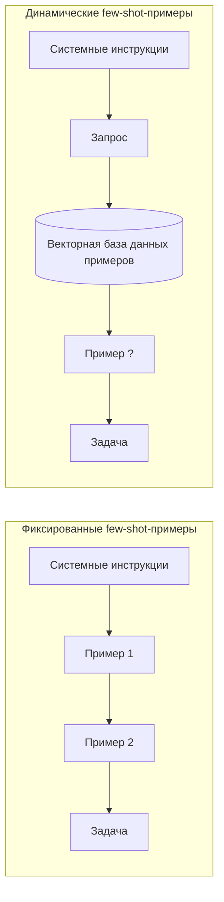
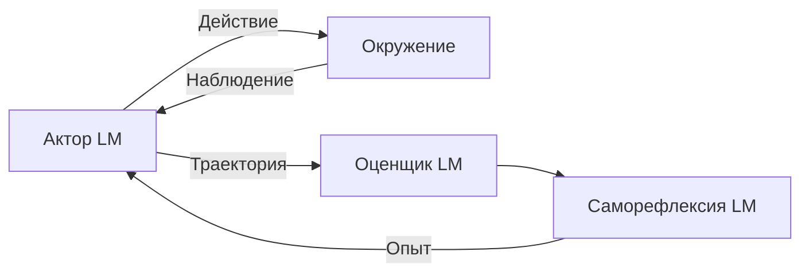

# aiagents-learning-strategy — knowledge units

Source book: «Building Applications with AI Agents» (Albada), рус. пер., ISBN 978-601-14-1158-5.
Глава 7 «Обучение в агентных системах» (с. 164–192) и глава 11 «Циклы улучшения» (с. 305–308).

Machine-distilled, not human-reviewed against the cited pages (trust_tier 1 — routing-gated at CP3.5 2026-08-18; Tier 2 requires human review). 15 KUs.

Кластер T07. Не входят сюда: `ai-apps-ch07-p164-ku10` (малые модели — у
`aiagents-agent-fit-and-model-choice`) и `ai-apps-ch07-p164-ku15` (определение RLVR, re-scored
medium; RLVR присутствует здесь только как расширение RFT по `ku08` [p.192]).

---

## KU01 — Нужен ли агенту механизм обучения и какого класса
- **type:** decision-framework
- **pages:** гл. 7, с. 164, 192
- **ku_id:** ai-apps-ch07-p164-ku01
- **verified:** partial — ИСКЛЮЧЕНО: утверждение из поля `limits`, что глава далее даёт
  «операционные критерии применимости» тонкой настройки. Кросс-модельный судья отказал: страницами
  164 и 192, на которые опирается KU, это не подтверждается. В навыке эта клауза не используется;
  критерии «за/против» берутся из `ai-apps-merged-ku05` (с. 175–178), где они действительно есть.

**Problem:** Решить, встраивать ли в агентную систему обучение вообще, и если да — менять ли
параметры модели или обойтись без этого.

**Content:**
Рабочее определение: обучение — повышение производительности агентной системы через взаимодействие
с её окружением; оно даёт приспособление к изменяющимся условиям, уточнение стратегий и рост общей
эффективности [p.164].

Первая развилка — класс метода [p.164]:
- **НЕПАРАМЕТРИЧЕСКОЕ** обучение: автоматическое улучшение производительности БЕЗ изменения
  параметров задействованной модели.
- **ПАРАМЕТРИЧЕСКОЕ** обучение: целенаправленное обучение или тонкая настройка (fine-tuning)
  параметров фундаментальной модели.

Вторая развилка — стоит ли вообще: книга подчёркивает, что обучение не является обязательным
элементом проектирования, поскольку добавляет отдельный контур работ — проектирование, оценку,
мониторинг, — а он в конкретном приложении может и не окупиться [p.164].

Порядок освоения, заданный главой: сначала непараметрические методы, затем параметрические (SFT и
DPO), затем адаптация весов под целенаправленные улучшения [p.164].

Итоговая рамка выбора [p.192]: непараметрическое обучение выигрывает простотой, скоростью и
отзывчивостью в реальных условиях; параметрическое даёт более глубокую специализацию (SFT —
структурированный вывод и вызов функций, DPO — качество вывода с учётом человеческих суждений);
методы взаимодополняющие, а не взаимоисключающие.

**Applicability:** Решение о том, встраивать ли обучение в агентную систему и какого класса [p.164];
применяется до выбора конкретного метода.

**Limits:** Это рамка выбора класса, а не критерии по конкретному методу.

---

## KU02 — Обучение по образцу: от фиксированных few-shot к динамическому выбору из банка памяти
- **type:** methodology
- **pages:** гл. 7, с. 164, 165, 166
- **ku_id:** ai-apps-ch07-p164-ku02
- **verified:** true

**Problem:** Как дёшево улучшать агента на конкретных задачах, не трогая веса модели, и что делать,
когда полезных примеров становится слишком много для промпта.

**Content:**
Простейший непараметрический метод — обучение по образцу (exemplar learning): агент при выполнении
задачи получает метрику качества, и полученные примеры идут в few-shot-обучение в контексте [p.164].

Две конфигурации (Рис. 7.1) [p.164-165]:
- **ФИКСИРОВАННАЯ**: небольшой набор примеров жёстко закодирован в системном промпте и не
  изменяется [p.164].
- **ДИНАМИЧЕСКАЯ**: во время выполнения из векторной базы данных примеров подгружаются самые
  релевантные, что делает промпт адаптивным и соответствующим контексту [p.165].

Триггер перехода ко второй: дальнейшее добавление образцов в промпт в итоге увеличивает затраты и
задержку, и вдобавок полезность примера зависит от конкретного ввода [p.165].

Устройство банка памяти [p.165]: по каждому взаимодействию сохраняются контекст, выполненные
действия, результаты и любая полученная обратная связь. Для новой задачи агент отыскивает в памяти
похожие прошлые случаи — каждый описан как задача, применённое решение и результат — разбирает
применённые решения и адаптирует их под новые обстоятельства; отсюда высокая гибкость и непрерывное
уточнение стратегий.

Эмпирика, на которую опирается книга [p.165]: сохранение успешных примеров в долгосрочном хранилище
с последующим чтением и включением в промпт значительно повышает производительность на широком круге
вопросов, и это подтверждено в разных областях (со ссылкой на источник).

Масштабирование [p.166]: когда успешных примеров становится много, отбирать наиболее релевантные и
успешные по типу с помощью текстового или семантического поиска. Метод применим как к агентной задаче
целиком, так и независимо к её подмножествам.

Реконструкция Рис. 7.1 [p.164-165]:


**Applicability:** Простой, прозрачный и облегчённый способ быстро улучшить быстродействие агента на
конкретных задачах [p.166]; целиком или по подзадачам [p.166].

**Limits:** Наращивание числа примеров в промпте упирается в затраты и задержку [p.165]; пример,
полезный на одном вводе, для другого бесполезен [p.165]. Числового порога «сколько примеров
достаточно» книга не даёт (вывод экстрактора).

---

## KU03 — Цикл рефлексии: пятишаговая петля самокритики без изменения весов
- **type:** methodology
- **pages:** гл. 7, с. 166, 167
- **ku_id:** ai-apps-ch07-p164-ku03
- **verified:** true

**Problem:** Агент повторно проваливает одну и ту же задачу; нужен механизм улучшения стратегии,
не требующий повторного обучения модели.

**Content:**
Рефлексия даёт агенту привычку самокритики на естественном языке: после каждой неудачной попытки он
записывает краткий разбор — что пошло не так и как улучшить следующий заход; разбор хранится в
«буфере памяти» рядом с прошлыми действиями и наблюдениями, а перед новой попыткой перечитывается и
корректируется [p.166].

Петля целиком [p.166]:
1. **ПРОГОН** — агент действует в окружении обычным управляемым промптом планированием.
2. **РЕГИСТРАЦИЯ** — каждый шаг (предпринятые действия, наблюдения, успех или неудача) журналируется
   в постоянное хранилище: файл JSON либо таблица базы данных.
3. **ГЕНЕРАЦИЯ** — при неудаче собирается короткий «промпт рефлексии» с историей недавних
   взаимодействий и шаблонным вопросом об упущенной стратегии; LLM возвращает сжатый план.
4. **ОБНОВЛЕНИЕ ПАМЯТИ** — служебная функция `update_memory` поднимает журналы прошлых заходов,
   обращается к LLM за рефлексией и складывает свежую аналитику в память агента.
5. **ВНЕДРЕНИЕ** — при следующей попытке той же или похожей задачи самая свежая аналитика
   присоединяется к промпту и направляет модель к улучшенной стратегии.

Цена и охват [p.166]: веса не меняются — фундаментальная модель используется как собственный
наставник; годится и числовая обратная связь (например, флаг успеха), и комментарии в свободной
форме; выигрыш зафиксирован на задачах от отладки кода до многошаговых рассуждений.

Реконструкция Рис. 7.2 [p.167]:


**Applicability:** Повторяемые задачи с наблюдаемым исходом попытки; требует минимальных
дополнительных усилий [p.166].

**Limits:** Петля запускается по факту неудачи — она улучшает следующую попытку, а не текущую
[p.166]. Веса модели не изменяются, поэтому её базовые способности остаются прежними [p.166].

---

## KU04 — Сборка промпта рефлексии и обвязки под него
- **type:** checklist
- **pages:** гл. 7, с. 169, 170
- **ku_id:** ai-apps-ch07-p164-ku04
- **verified:** true

**Problem:** Как именно сформулировать промпт, превращающий модель в наставника самой себе, и как
подключить его к рабочему потоку агента.

**Content:**
Структура промпта — три части плюс завершающее слово [p.169]:
- [ ] **УПРАВЛЯЮЩАЯ ИНСТРУКЦИЯ**: сообщить, что попытка провалена, потребовать разбирать
      стратегические недочёты вместо описания окружения и выдать план после слова «Plan».
- [ ] **ПЕРЕФОРМУЛИРОВКА ЦЕЛИ**: после метки «Instruction:» повторно изложить исходное задание.
- [ ] **ПРОТОКОЛ ПРОВАЛА**: полный лог «Action/Observation» неудачного выполнения — каждый поиск,
      выбор и рассуждение; последняя строка протокола — `STATUS: FAIL`, так у модели появляются
      предметные улики того, где всё сломалось.
- [ ] **ЗАВЕРШАЮЩЕЕ «Plan:»** — переключает модель с диагностики на предписания и делает ответ
      лаконичным и пригодным для парсинга.

Обвязка (по коду главы) [p.169-170]:
- [ ] Изолировать каждый вызов LLM тонкой обёрткой `call_model(state)`, чтобы вершины графа
      оставались односоставными и переиспользуемыми [p.170].
- [ ] Писать полный протокол каждого испытания на диск; после сбоя вызывать `update_memory(...)`,
      которая читает журналы и дописывает новую самокритику в список памяти [p.170].
- [ ] Ограничить объём подключаемой истории: в примере в контекст идут не более трёх последних
      сохранённых аналитик — `env['memory'][-3:]` [p.169].
- [ ] Пропускать рефлексию для успешных и явно помеченных к пропуску конфигураций окружения:
      условие в примере — `if not env['is_success'] and not env['skip']:` [p.169].
- [ ] Добавить один узел рефлексии в `StateGraph`, присоединив его к `START`, — тогда каждый запуск
      агента автоматически прогоняет промпт и дополняет состояние свежим «Plan: …» [p.170].

Масштаб решения: базовые идеи примера укладываются менее чем в 20 строк кода [p.170].

Замечание к источнику: в извлечённом тексте отступы Python-кода утрачены (pdftotext), поэтому
приведены только отдельные выражения, а не блоки целиком.

**Applicability:** Реализация рефлексии на LangGraph/LangChain-подобном стеке [p.167, 170].

**Limits:** Пример показывает единственный узел рефлексии, присоединённый к `START` [p.170];
ветвление графа и стратегии отката в нём не рассматриваются. Условный запуск рефлексии в примере
есть, но реализован внутри `update_memory`, а не в структуре графа [p.169] (вывод экстрактора).

---

## KU05 — ExpeL: обобщение инсайтов из пула опыта и межзадачное обучение
- **type:** methodology
- **pages:** гл. 7, с. 170–175
- **ku_id:** ai-apps-ch07-p164-ku05
- **verified:** true

**Problem:** Рефлексия улучшает следующую попытку той же задачи; нужен перенос выученного МЕЖДУ
разными задачами и удержание объёма выводов в разумных рамках.

**Content:**
Обучение через опыт (experiential learning, ExpeL) добавляет к сохранению опыта в базе данных новый
этап — обобщение инсайтов из накопленного опыта для улучшения последующего поведения (политики)
агента [p.170]. Особая ценность — разбор прошлых неудач и поиск приёмов, которые сработают в будущих
похожих ситуациях [p.170].

Ядро механики [p.170]: агент ведёт ЖИВОЙ список инсайтов, извлечённых из хранилища опыта, и
динамически его правит — продвигает (promote) наиболее ценные, понижает рейтинг (demote) наименее
полезных и пересматривает выводы по мере поступления нового опыта.

Отличие от рефлексии [p.170-171]: поверх рефлексии надстроен процесс межзадачного обучения
(cross-task learning), позволяющий улучшать производительность при переходе между разными задачами
и выявлять хорошие практики, переносимые в другие ситуации.

Конвейер (Рис. 7.3 [p.171] и Рис. 7.4 [p.173]):
1. Накопить наблюдения и результаты в пуле опыта [p.171].
2. Указать фундаментальной модели поразмышлять над наблюдениями из окружения, чтобы выявить
   информацию, повышающую будущую производительность [p.171].
3. Прогнать множественные оценки модели, извлекая инсайты из ПАР успешных и неуспешных примеров
   [p.173].
4. Объединить и отфильтровать их в короткий свод высокоуровневых замечаний и правил общего характера,
   важность которых со временем повышается или понижается [p.173].
5. Направлять этим малым набором будущие решения агента [p.173].

Программный контур из примера [p.171, p.173-174]: класс `InsightAgent` держит раздельные списки
`insights`, `promoted_insights`, `demoted_insights`, `reflections`; `promote_insight` и
`demote_insight` переносят вывод между этими списками, `edit_insight` правит его на месте,
`show_insights` печатает текущее состояние, `reflect` прогоняет промпт рефлексии через граф и
складывает результат в `reflections`.

Эффект и цена [p.174-175]: при достаточном объёме обратной связи это работающий механизм обучения на
взаимодействии с окружением, дополнительно облегчающий постепенную адаптацию к нестационарным
окружениям; подход назван практичным, бюджетным и простым в реализации.

Порог перехода дальше [p.175]: когда точек данных для обучения набирается много, книга советует
смотреть в сторону тонкой настройки.

**Applicability:** Агенты, которым нужен перенос выученного между РАЗНЫМИ задачами [p.171], и
нестационарные окружения [p.174]; хорошо работает даже при небольшом количестве обучающих примеров
[p.172].

**Limits:** Процесс сложнее рефлексии — требует регулярной переоценки, корректировки и ранжирования
инсайтов [p.172]; при большом объёме данных для обучения рассматривайте тонкую настройку [p.175].

---

## KU06 — Операции над списком выученных правил: AGREE / REMOVE / EDIT / ADD
- **type:** checklist
- **pages:** гл. 7, с. 172, 173
- **ku_id:** ai-apps-ch07-p164-ku06
- **verified:** true

**Problem:** Список инсайтов растёт, дублируется и противоречит сам себе; нужен регламент, по
которому модель сама поддерживает его в компактном и полезном виде.

**Content:**
Книга задаёт четыре операции с явными условиями срабатывания — перечень переформулирован как критерии
решения [p.172-173]:
- [ ] **AGREE** — существующее правило подтверждается, когда его релевантность задаче высока.
- [ ] **REMOVE** — правило удаляется, когда оно противоречит другим правилам либо дублирует их
      (или очень на них похоже).
- [ ] **EDIT** — правило переписывается, когда его формулировка недостаточно обща по природе или иначе
      поддаётся улучшению.
- [ ] **ADD** — добавляется новое правило, отличное от существующих и релевантное другим задачам.

Дисциплина оформления [p.172-173]: каждая операция обязана строго следовать своему формату, а
умолчание по правилу равносильно его переносу без изменений — «все существующие правила, которые не
изменены, не подтверждены и не удалены, считаются скопированными» [p.172].

Форматы (ФАКТ, verbatim [p.172-173]):
```
AGREE <НОМЕР СУЩЕСТВУЮЩЕГО ПРАВИЛА>: <СУЩЕСТВУЮЩЕЕ ПРАВИЛО>
REMOVE <НОМЕР СУЩЕСТВУЮЩЕГО ПРАВИЛА>: <СУЩЕСТВУЮЩЕЕ ПРАВИЛО>
EDIT <НОМЕР СУЩЕСТВУЮЩЕГО ПРАВИЛА>: <НОВОЕ ИЗМЕНЕННОЕ ПРАВИЛО>
ADD <НОМЕР НОВОГО ПРАВИЛА>: <НОВОЕ ПРАВИЛО>
```

Что сравнивается при генерации нового списка [p.172]: результаты неудачной попытки сопоставляются с
успешной попыткой и с текущим списком правил, а критика удерживается на уровнях GENERAL или HIGH
LEVEL, чтобы предотвращать аналогичные неудачи на ДРУГИХ будущих вопросах; отдельное внимание —
критике более эффективного выполнения Thought and Action (со ссылкой на ExpeL).

Регулярность: выученные правила периодически пересматриваются и заново взвешиваются друг против друга
по значимости для накопленного опыта [p.172].

**Applicability:** Агент ExpeL-типа, ведущий растущий список выученных правил из накопленного опыта
[p.172].

**Limits:** Приём заявлен как ответ на большое число обучающих примеров [p.172]; количественных
порогов (сколько правил хранить, как часто переоценивать) книга не задаёт (вывод экстрактора).

---

## KU-merged-05 — Тонкая настройка: применять или воздержаться — основания, стоп-сигналы и порядок до инвестиции
- **type:** decision-framework
- **pages:** гл. 7, с. 175, 176, 177, 178 + с. 176, 178, 184
- **ku_id:** ai-apps-merged-ku05
- **verified:** true (слияние двух KU, оба были `true`; проверено при подготовке этого навыка)

**Problem:** Стоит ли тратить ресурсы на тонкую настройку модели или задача закрывается
промпт-инжинирингом и непараметрическими методами [p.175-178].

**Content:**
Слияние двух частей ОДНОГО решения из гл. 7: критериев «за/против» (с. 175-178) и правила
воздержания вместе с порядком действий ДО инвестиции (с. 176, 178, 184).

**ЧАСТЬ A. Пять оснований «за» и три стоп-сигнала (гл. 7, с. 175-178).**
Общий контур: параметрическое обучение — регулировка параметров предобученной модели ради
производительности на конкретных задачах; при этом часто разумнее начать с непараметрических
подходов, поскольку они проще и быстрее в реализации [p.175]. Обобщённый поток тонкой настройки
(Рис. 7.5, [p.176]): корпус текстов → предобучение → базовая модель → настройка на датасете
конкретной задачи → специализированная модель.

РАССМАТРИВАТЬ тонкую настройку в пяти ситуациях [p.177]:
1. Критична специализация предметной области — модель должна говорить на языке организации, строго
   держать руководство по стилю или работать с высокочувствительным контентом почти без ошибок;
   здесь помогают SFT или DPO.
2. Важны единообразные тон и формат — каждый ответ должен ложиться в точный шаблон (раскрытие
   финансовых данных, юридические заявления об отказе от ответственности), и тонкая настройка даёт
   нужную структуру без изощрённого конструирования промптов.
3. Нужна точность вызовов инструментов и API — регулярные обращения к внешним функциям (данные о
   дозировках лекарств, биржевые котировки); настройка резко сокращает ошибочные вызовы и лучше
   обрабатывает граничные случаи, чем контекстные промпты.
4. Есть достаточный объём качественных данных и бюджет — большим моделям нужны тысячи примеров,
   экспертные оценщики (для RFT) и часы работы GPU; при их нехватке рефлексия или обучение через
   опыт дадут лучшую окупаемость.
5. Частота повторного обучения управляема — настроенные модели требуют версионирования, графиков
   переобучения и проверок совместимости; в быстро меняющейся предметной области затраты могут
   перевесить выигрыш.

НЕ применять — три стоп-сигнала [p.177-178]:
1. Прототип или сценарий с низкой интенсивностью использования: на ранней стадии непараметрическое
   обучение и промпт-инжиниринг дают итерации с нулевой стоимостью переобучения; настраивать стоит,
   только когда сценарий и пайплайны данных стабильны.
2. Эволюция базовых моделей может обнулить работу: поставщики регулярно выпускают более сильные
   базовые модели, и месяцы переобучения пропадают — вложения в настройку всегда сопоставляйте с
   периодичностью обновления базовой модели.
3. Ограниченность ресурсов: при дефиците GPU, дорогой разметке или приоритете скорости инференса
   рассмотрите непараметрические стратегии, например RAG, — они дают большую часть тех же преимуществ
   дешевле и с меньшим сопровождением.

**ЧАСТЬ B. Правило воздержания и порядок действий до инвестиции (гл. 7, с. 176, 178, 184).**
Прямая рекомендация книги: «Если у вас возникают сомнения, не применяйте тонкую настройку» [p.178] —
часто для улучшения продукта находятся более эффективные и менее затратные механизмы [p.178].

Порядок действий ДО инвестиции в настройку [p.178]:
1. Не пытаться делать предварительное обучение: тренировка с нуля на триллионах токенов по силам
   только крупным ИИ-лабораториям, у которых есть гигантские вычислительные мощности и собственные
   закрытые данные.
2. Стартовать с качественных моделей с открытым кодом, чьи лицензии подходят вашему сценарию; многие
   из них уже прошли постобучение или настройку по инструкциям под нужный класс задач, что снимает
   потребность в дополнительной настройке полностью или сводит её к минимальным целенаправленным
   обновлениям.
3. Проверить, закрывается ли требование существующей предобученной либо инструктивно настроенной
   моделью с помощью промпт-инжиниринга, непараметрического обучения или легковесных методов
   адаптации.

Симметричное правило для конкретного случая вызова функций [p.184]: начинать с вызовов функций,
встроенных в предобученные модели, и проверки схемы на стадии выполнения; переходить к более дорогим
мероприятиям, только убедившись, что промпты и стандартные API не справляются, — и лучше всего тогда,
когда масштаб нагрузки и планка точности окупают стартовые вложения.

Обратный триггер (когда двигаться к параметрике): непараметрические методы сами требуют времени и
вычислительных ресурсов на добавление примеров и инсайтов в промпт, поэтому при накоплении
достаточного количества примеров пора рассматривать тонкую настройку [p.176].

**Applicability:** Точка принятия решения о параметрическом обучении для агентного приложения
[p.176-178].

**Limits:** Критерии качественные, без числовых порогов, кроме указания на «тысячи примеров» и часы
GPU [p.177]. Эвристика воздержания не отменяет случаев, где настройка остаётся необходимой: тесная
привязка внутренних представлений модели к реальному контексту делает её нужной для критических
приложений [p.178].

---

## KU08 — Какой метод тонкой настройки под какой дефект поведения
- **type:** tradeoff-table
- **pages:** гл. 7, с. 178, 179, 180, 192
- **ku_id:** ai-apps-ch07-p164-ku08
- **verified:** true

**Problem:** Выбрать метод параметрического обучения под конкретную проблему в поведении агента.

**Content:**
По мотивам табл. 7.1, гл. 7, с. 179 — реструктурировано вокруг вопроса «что именно ломается в
поведении модели»:

| Симптом / цель | Метод | Что подаётся на вход | Механика |
|---|---|---|---|
| Неверная классификация, разъезжающийся структурированный вывод, сбои по инструкциям [p.179] | Тонкая настройка с учителем (SFT) | Пары «промпт — идеальный ответ» как эталон [p.179] | Корректировка весов вызовами тонкой настройки OpenAI API [p.179] |
| Слабое распознавание изображений, ненадёжная обработка мультимодальных инструкций [p.179] | Визуальная тонкая настройка | Пары «изображение — метка» [p.179] | Обучение на визуальных входных данных [p.179] |
| Нужен контроль тональности/стиля, качество реферирования [p.179] | Прямая оптимизация предпочтений (DPO) | «Хороший» и «плохой» ответы на один промпт с отметкой предпочтительного [p.179] | Модель учится ранжировать и предпочитать качественные выводы [p.179] |
| Сложные рассуждения и задачи предметной области (юридические, медицинские) [p.179] | Тонкая настройка с подкреплением (RFT) | Сгенерированные варианты вывода, оценённые экспертами [p.179] | Обновление в стиле градиентного спуска, подкрепляющее цепочки рассуждений с высокими оценками [p.179] |

Куда это расширяется дальше: RLVR надстраивается над RFT, соединяя предпочтения с политикой, которую
оптимизируют по прогнозируемой ценности [p.192].

**Applicability:** Выбор метода после того, как решение «настраивать» уже принято (см.
`ai-apps-merged-ku05`) [p.178-179].

**Limits:** Таблица не квантифицирует объёмы данных и стоимость по методам; RFT прямо требует
экспертных оценщиков [p.177]. Глава сознательно не разбирает всю область: приведены лишь несколько
примеров как введение в тему [p.180].

---

## KU16 — Цена настройки БОЛЬШОЙ модели: ресурсы, данные, риски
- **type:** tradeoff-table
- **pages:** гл. 7, с. 178, 179, 180
- **ku_id:** ai-apps-ch07-p164-ku16
- **verified:** true

**Problem:** Понять, во что реально обходится тонкая настройка большой фундаментальной модели и какие
риски она приносит помимо счёта за GPU.

**Content:**
Реструктурировано вокруг вопроса «чем приходится платить» [p.179-180]:

| Ось затрат | Что именно [p.179-180] |
|---|---|
| Вычисления | Миллиарды параметров оборачиваются тяжёлыми требованиями к GPU, многочасовыми сеансами обучения и ощутимым счётом за облако [p.179] |
| Повторное обучение | Синхронизация с меняющимися данными и исправление смещения (bias) увеличивают эти затраты [p.179] |
| Инференс | При развёртывании в реальном времени возможна повышенная задержка инференса [p.179] |
| Инфраструктура | Для организаций без специализированной ML-инфраструктуры такие препятствия делают настройку больших моделей неприемлемой [p.179] |
| Данные | Нужны репрезентативные примеры, часто тысячи, чтобы модель усвоила неочевидные закономерности; сбор, разметка и проверка занимают много времени [p.179] |
| Смещение и переобучение | Малейшая неосторожность в датасете вносит смещение; без строгого управления данными и надёжного тестирования возникает риск переобучения на устаревших или нерепрезентативных примерах, что бьёт по обобщению и справедливости [p.179] |

Что покупается за эту цену [p.178, 179]: настроенная под предметную область большая модель не только
корректно разбирает терминологию, но и соблюдает принятые в организации соглашения (примеры книги —
финансовая отчётность, юридический анализ с правильной тональностью, поддержка по корпоративным
правилам) [p.178]; на узких задачах большие модели часто дают производительность выше, чем
специализированные меньшие модели, что делает их подходящими для диагностики заболеваний,
юридического анализа и сложной технической поддержки [p.179].

**Applicability:** Оценка бюджета и рисков ДО запуска проекта тонкой настройки большой модели
[p.179-180].

**Limits:** Раздел сознательно вводный: глава не разбирает всех методов, архитектур и компромиссов
области, а даёт несколько практических иллюстраций для решения, оправдает ли настройка вложения
[p.180].

---

## KU11 — SFT под вызов функций: контракт схемы, спец-маркеры, LoRA
- **type:** methodology
- **pages:** гл. 7, с. 183, 184, 185, 186, 187
- **ku_id:** ai-apps-ch07-p164-ku11
- **verified:** true

**Problem:** Промпты под вызов инструментов разрослись, параметры систематически интерпретируются
неверно, а точность не дотягивает до требований предметной области.

**Content:**
Что именно даёт SFT [p.183]: управление поведением агента на подобранных парах ввода/вывода; частный
сценарий — обучение тому, КОГДА и КАК вызывать внешние API, то есть тонкая настройка вызова функций,
где агент не только правильно форматирует вызов, но и рассуждает, нужен ли вызов вообще. Это
расширение стандартного вызова функций там, где промпт-инжиниринг перестал справляться [p.183].
Рабочий поток (Рис. 7.6, [p.184]) — частный случай общей схемы: большой корпус → предобучение →
предобученная языковая модель → SFT на датасете для конкретной задачи → тонко настроенная модель.

Когда это окупается [p.183]: аномальные случаи с громоздкими промптами, систематически неверной
интерпретацией параметров или недостаточной точностью — особенно при большом объёме трафика, где
важен каждый процент надёжности; со временем настройка способна снизить и стоимость одного обращения
относительно проприетарных эндпоинтов, где счёт идёт по токенам.

Процедура [p.183-186]:
1. Определить ЯВНУЮ СХЕМУ всех предоставляемых функций API — имена, действительные аргументы, типы,
   возвращаемые форматы; это гарантирует, что примеры обучат агента соблюдаемому контракту [p.183].
2. Собрать датасет тонкой настройки, отражающий эту точную схему, чтобы модель запомнила контракт
   инструментария [p.183].
3. Наполнить датасет структурированными примерами, где агент решает, вызывать ли функцию, правильно
   заполняет аргументы и упаковывает результат [p.184].
4. Ввести специальные маркеры и форматирование: внутренние рассуждения в `<think>…</think>`, вызов
   инструмента в `<tool_call>…</tool_call>` — это помогает модели различать диалог, мысли и действия
   [p.185].

Минимальный работоспособный паттерн [p.185]:
1. Предварительная обработка диалогов в последовательный шаблон чата с присоединением специальных
   маркеров для сегментов `<think>` и `<tool_call>`.
2. LoRA (low-rank adaptation) — экономная адаптация лишь выбранных целевых уровней.
3. Прогон обучения через `SFTTrainer` по датасету с корректными парами (промпт, ответ).

Опорные точки реализации (ФАКТЫ) [p.186-187]: токенизация через `tokenizer.apply_chat_template` с
собственным `CHAT_TEMPLATE` и дополнительными спец-токенами; загрузка модели с квантизацией — вызов
приведён дословно как ФАКТ [p.186]:
```python
BitsAndBytesConfig(load_in_4bit=True, bnb_4bit_compute_dtype=torch.bfloat16,
                   bnb_4bit_quant_type="nf4", bnb_4bit_use_double_quant=True)
```
— и обязательный `model.resize_token_embeddings(len(tokenizer))` после добавления маркеров;
разбиение датасета `train_test_split(test_size=0.1, seed=42)` [p.186]; значения по умолчанию у цикла
обучения в примере [p.186]:
```python
epochs: int = 1, lr: float = 1e-4, batch_size: int = 1,
grad_accum: int = 4, max_seq_len: int = 1500
```
`SFTTrainer` из Hugging Face TRL поддерживает упаковку последовательностей (`packing=True`) и
градиентные контрольные точки (`gradient_checkpointing=True`) [p.186-187].

Замечание к источнику: блок `SFTConfig(...)` разорван переносом страницы 186/187 — закрывающая скобка
в извлечённом тексте оказалась ПЕРЕД частью аргументов, поэтому порядок параметров в исходном листинге
по этому тексту не восстанавливается; перечислены только сами значения.

Итог по эффекту [p.187]: там, где агент зависит от надёжного использования инструментов — получение
элементов календаря, выполнение команд, запросы к базам данных, — SFT делает вызовы кардинально
надёжнее промпт-инжиниринга, снижает частоту ошибок, обучает контекстному суждению о ненужности вызова
и сокращает затраты на токены за счёт меньшего числа повторных попыток и неправильно сформированных
вызовов.

Замечание к источнику: на с. 187 в этом предложении опечатка — «SDT снижает частоту ошибок» вместо
SFT [p.187].

**Applicability:** Агенты с высокой долей инструментальных вызовов и жёсткими требованиями к их
корректности [p.183, 187].

**Limits:** Путь стоит данных, вычислений и постоянного сопровождения, поэтому книга рекомендует
сначала исчерпать встроенный вызов функций и рантайм-проверку схемы [p.184].

---

## KU12 — Сквозная схема вызова функции: от датасета до рантайм-валидации
- **type:** checklist
- **pages:** гл. 7, с. 184, 185
- **ku_id:** ai-apps-ch07-p164-ku12
- **verified:** true

**Problem:** Тонко настроенный агент всё равно может выдать неправильно сформированный или вредоносный
вызов функции.

**Content:**
Контур защиты, замыкающий обучение и исполнение [p.184-185]:
- [ ] Для КАЖДОЙ функции зафиксировать её имя, типы аргументов и форму возвращаемого значения в
      машиночитаемом формате — названы JSON Schema и TypeScript/Zod; это и есть контракт, обязательный
      для модели.
- [ ] Включить те же схемы в процесс тонкой настройки вместе с примерами, чтобы модель усвоила не
      только ЧТО вызывать, но и КАК структурировать полезную нагрузку JSON.
- [ ] На этапе выполнения проверять каждый предлагаемый вызов по той же схеме — названы библиотеки
      Zod, Ajv, Pydantic.
- [ ] Обрабатывать несоответствие одним из двух путей: исправить либо отклонить вызов, чтобы
      неправильно сформированные или вредоносные запросы не проходили дальше.
- [ ] Учесть, что тонкая настройка даёт сверх этого: модель точнее раскладывает реплику пользователя
      по допустимым аргументам, выправляется после промахов вроде забытого параметра и корректно
      отрабатывает запасной путь, когда функция не отработала [p.185].

Заявленный эффект сквозных схем [p.185]: резкое сокращение числа ошибок, упрощение отладки и защита
системы от непредвиденного ввода.

Порядок внедрения [p.184]: рантайм-проверка схемы идёт ВПЕРЕДИ тонкой настройки — она входит в дешёвый
стартовый набор вместе со встроенным вызовом функций.

**Applicability:** Любой агент, вызывающий внешние функции, независимо от того, настраивалась ли
модель [p.184-185].

**Limits:** Валидация по схеме ловит нарушения контракта (имена, типы, структура) [p.184-185]; книга
относит суждение о том, НУЖЕН ли вызов, к обучению на целевых примерах, а не к схеме [p.184].

---

## KU13 — Контекстное суждение о невызове инструмента
- **type:** heuristic
- **pages:** гл. 7, с. 184, 187
- **ku_id:** ai-apps-ch07-p164-ku13
- **verified:** true

**Problem:** Агент дёргает реальный API там, где пользователь формулирует гипотезу или условие, а не
запрашивает факт.

**Content:**
Различие, которому обучают целевыми примерами [p.184]:
- «Какая погода в Бостоне?» — настроенный агент вызывает `get_weather(location="Boston")` и встраивает
  результат в ответ.
- «Представь, что в Бостоне идёт снег, — что мне надеть?» — агент рассуждает гипотетически, НЕ
  инициируя реального вызова.

Второй пример того же класса [p.187]: услышав «Если завтра пойдёт дождь, я останусь дома», агент
заключает, что обращаться к API незачем, и отвечает обычным текстом.

Механизм: SFT добавляет ещё один слой рассуждения — модель вправе решить, что инструмент вызывать не
надо [p.187]; подобные контекстные суждения изучаются на целенаправленных примерах [p.184].

Проектное следствие: в датасет тонкой настройки нужно осознанно класть НЕГАТИВНЫЕ примеры —
гипотетические и условные формулировки без вызова, а не только удачные вызовы (вывод экстрактора).

**Applicability:** Датасеты тонкой настройки под вызов функций; сценарии с диалоговой оболочкой вокруг
инструментов [p.184, 187].

**Limits:** Книга не даёт долей негативных примеров в датасете и метрики для этого класса ошибок
(вывод экстрактора).

---

## KU14 — DPO: обучение на парах chosen/rejected поверх SFT
- **type:** case-pattern
- **pages:** гл. 7, с. 187, 188, 189, 190, 191
- **ku_id:** ai-apps-ch07-p164-ku14
- **verified:** true

**Problem:** SFT воспроизводит эталон, но не учит модель отличать более качественный ответ от менее
качественного по человеческим меркам.

**Content:**
Суть метода [p.187-188]: DPO развивает идеи SFT и вводит обучение на предпочтениях — модель учится
предпочитать более качественные ответы менее качественным, обучаясь на парных сравнениях с
ранжированием. Отличие от SFT [p.188]: SFT просто учит воспроизводить «эталонный» результат, тогда как
DPO даёт модели усвоить суждения о предпочтениях, что улучшает её способность ранжировать и выбирать
качественные ответы на этапе инференса.

Реконструкция Рис. 7.7 [p.188]:


Формат данных [p.188-189]: датасет ранжированных пар, каждая строка — `{"prompt": ..., "chosen": ...,
"rejected": ...}`; это и позволяет модели усвоить, каким результатам отдавать предпочтение.

Стек минимального примера (ФАКТЫ) [p.188-189]: базовая контрольная точка
`BASE_SFT_CKPT = "microsoft/Phi-3-mini-4k-instruct"`, 4-битная загрузка через `BitsAndBytesConfig`,
адаптеры LoRA поверх базовой модели, обучение через `DPOTrainer` из TRL:
```python
lora_cfg = LoraConfig(
    r=8,
    lora_alpha=16,
    lora_dropout=0.05,
    target_modules=["q_proj", "k_proj", "v_proj", "o_proj", "gate_proj", "up_proj", "down_proj"],
    bias="none",
    task_type="CAUSAL_LM",
)
```
(отступы в извлечённом тексте утрачены — восстановлены при цитировании, значения не изменены).

Ключевой гиперпараметр: `beta` задаёт, насколько сильно оптимизация тянет модель к предпочтительному
варианту ответа [p.189].

CP2 / math_dense: полная конфигурация `DPOConfig` (в том числе значения `beta`, `loss_type`,
`label_smoothing`, `max_prompt_length`, `max_completion_length`, `max_length`, `truncation_mode`,
`reference_free`) находится на с. 190 источника; блок `TrainingArguments` начинается на с. 189 и
продолжается на с. 190. С. 190 помечена в конвейере оцифровки как math_dense (извлечение разорвало
пары «ключ — значение»), поэтому значения здесь НЕ воспроизводятся — см. с. 190 источника.

Замечание к источнику: на с. 190 извлечение разорвало пары «ключ — значение» построчно, поэтому
соответствие имён и величин по этому тексту не восстанавливается; в листинге на с. 189 видна
незакрытая кавычка в строке логгера — дефект листинга.

Когда применять [p.191]: DPO особенно полезен, когда цель — формирование КАЧЕСТВА результата, а не
простое воспроизведение примеров; он дополняет SFT измерением обучения на предпочтениях и помогает
выдавать ответы, соответствующие человеческим ожиданиям с их неочевидными нюансами.

**Applicability:** Реферирование, контроль тональности и стиля, качество ответов справочной службы
[p.179, 188].

**Limits:** Требуются размеченные человеком пары предпочтений [p.188]; заявленное превосходство над
стандартным SFT в книге дано как утверждение по итогам примера, без замеров [p.190].

---

## KU-ch11-18 — Контекстное обучение или автономное повторное обучение: где закреплять улучшение
- **type:** decision-framework
- **pages:** гл. 11, с. 305, 306, 307, 308
- **ku_id:** ai-apps-ch11-p280-ku18
- **verified:** true

**Problem:** Найденное улучшение можно внести мгновенно в промпт текущего сеанса либо накопить и
закрепить пакетным обновлением; выбор определяет и скорость, и долговечность эффекта [p.305].

**Content:**
Непрерывное обучение опирается на два базовых механизма — контекстное (in-context learning) и
онлайн/оперативное обучение; масштаб их эффекта разный: от подстройки прямо внутри сеанса, в реальном
времени, до инкрементных обновлений, охватывающих рабочие потоки целиком [p.305]. Место в общем
контуре: пайплайны обратной связи выявляют проблемы, эксперименты проверяют исправления, непрерывное
обучение внедряет их с мгновенными или отложенными последствиями [p.305].

| Вопрос к ситуации | Контекстное обучение | Автономное повторное обучение |
|---|---|---|
| Как быстро нужен эффект | Мгновенно: правка промпта вступает в силу сразу, без полномасштабного переобучения [p.306] | Периодически, по расписанию пакетных обновлений [p.308] |
| Область действия | Ограничена текущим сеансом; после его завершения адаптации теряются [p.306] | Сохраняется между сеансами и для разных пользователей, согласуясь с меняющейся средой в долгую [p.308] |
| Что чинит | Сбои конкретного сеанса, быстрые итерации мелких уточнений, динамичный непредсказуемый ввод [p.306-307] | Накопившиеся системные проблемы — регулярные рассогласования в рассуждении или в работе с инструментами; эксплуатация при этом не прерывается [p.307] |
| Риск | Минимальный — первая линия адаптации для проверки улучшений на живых взаимодействиях [p.306, 307] | Снижен офлайн-природой метода: тестировать можно тщательнее, регрессий меньше [p.308] |
| Цена | Требует надёжного управления контекстом: окно не бесконечно [p.306] | Вычислительные затраты (снижаемые эффективными методами вроде LoRA) и необходимость периодического планирования [p.308] |

ПРАВИЛО ПРОМОУШЕНА — ключевой стык двух механизмов: контекстные адаптации временны, поэтому удачные
контекстные стратегии должны повышаться до долговременных механизмов — промпт-инжиниринга, обновления
рабочих потоков или полного повторного обучения модели [p.306, 307]. Практический порядок: контекстное
обучение служит первой линией и обкаткой новых стратегий рассуждения и структур промптов ДО того, как
их закрепят в масштабах системы [p.306-307].

УПРАВЛЕНИЕ КОНТЕКСТОМ как условие работоспособности первого механизма [p.306]: система обязана
следить, что попадает в промпт, как оно структурировано и когда устаревшие детали удаляются или
сжимаются; названные приёмы — скользящие окна контекста, семантическое сжатие, векторное извлечение
данных из памяти.

Три выгоды контекстного обучения [p.306]: адаптация под конкретного пользователя (персонализированные
ответы под предпочтения и повторяющиеся проблемы); внедрение обратной связи в реальном времени
(реакция на пояснения и уточняющие инструкции прямо в ходе взаимодействия); управляемые рассуждения
(явные этапы или промежуточные результаты ведут агента к более надёжным и интерпретируемым выводам).

Иллюстрация [p.305-306]: агент, помогающий отлаживать код, регулярно спотыкается на определённом типе
ошибок — инженер добавляет в промпт пояснительный пример правильного решения, и эффект наступает
немедленно.

**Applicability:** Выбор механизма закрепления улучшения после того, как эксперимент подтвердил его
пользу [p.305].

**Limits:** Контекстные изменения не переживают завершения сеанса [p.306]; автономное повторное
обучение требует управления против переобучения на исторических данных и игнорирования формирующихся
трендов [p.308]. Оговорка к терминологии: книга называет ДВУМЯ базовыми механизмами непрерывного
обучения контекстное (in-context) и ОНЛАЙН/оперативное обучение — именно про эту пару сказано, что она
строится на непараметрических основах (получение образцов, рефлексия) и может включать параметрические
методы вроде тонкой настройки (глава 7) [p.305]; таблица выше сопоставляет контекстное обучение с
АВТОНОМНЫМ повторным обучением (с. 307-308), которое книга разбирает отдельным разделом (вывод
экстрактора).

---

## KU-ch11-19 — Автономное повторное обучение: три шага замыкания цикла улучшений
- **type:** methodology
- **pages:** гл. 11, с. 307, 308
- **ku_id:** ai-apps-ch11-p280-ku19
- **verified:** true

**Problem:** Обратная связь показала системный паттерн — например устойчивую долю ложноположительных
срабатываний в классификации угроз, вызванную тем, что векторы атаки эволюционируют; исправление надо
закрепить надолго, не трогая эксплуатацию [p.307].

**Content:**
Суть метода: собрать пакеты данных взаимодействий — запросы пользователей, вывод агентов, размеченные
результаты — и по ним обновить промпты и инструменты либо провести тонкую настройку моделей в
контролируемой среде [p.307]. Материал берётся из накопленного пайплайнами обратной связи и
экспериментами [p.307]. В примере с агентом SOC команда накапливает исторические логи и аннотации в
датасеты, затем применяет DSPy для оптимизации промптов или настраивает упрощённый адаптер поверх
базовой фундаментальной модели (механика — глава 7) [p.307].

Три шага процесса [p.307-308]:
1. **ПОДГОТОВКА ДАННЫХ** — собрать и разметить примеры из эксплуатационных трассировок, обеспечив
   разнообразие и баланс, чтобы не внести смещения.
2. **ОБНОВЛЕНИЯ МОДЕЛИ** — few-shot-оптимизация либо полная тонкая настройка на контрольных данных
   (в книге дублировано по-английски: full fine-tuning on held-out data), с прицелом на метрики вроде
   доли верных результатов или задержки.
3. **ВАЛИДАЦИЯ** — автономно протестировать переобученные компоненты, сравнить с эталонными
   показателями и только затем применить теневое развертывание.

Три преимущества [p.308]: долговечность (изменения живут между сеансами и пользователями);
масштабируемость (пакетные обновления эффективны для высоконагруженных систем и позволяют работать с
большими датасетами без накладных расходов реального времени); снижение рисков (офлайн-природа
допускает более тщательное тестирование).

Где применять по книге [p.308]: фундаментальные уточнения — обновление промпта агента SOC новыми
примерами угроз, переобучение классификаторов инструментов на свежих журналах. Роль в общей картине:
в связке с контуром обратной связи и экспериментами автономное повторное обучение замыкает цикл,
превращая инсайты в долгосрочные изменения; для команд на предобученных моделях оно даёт настройку
без постоянных онлайн-корректировок [p.308].

**Applicability:** Системные проблемы, проявляющиеся со временем, а не в отдельном сеансе [p.307];
высоконагруженные системы, где пакетное обновление эффективнее потокового [p.308].

**Limits:** Нужно тщательное управление против переобучения на исторических данных и против
игнорирования формирующихся трендов; ограничения — вычислительные затраты (снижаются эффективными
методами, назван LoRA) и необходимость периодического планирования ради актуальности модели [p.308].
