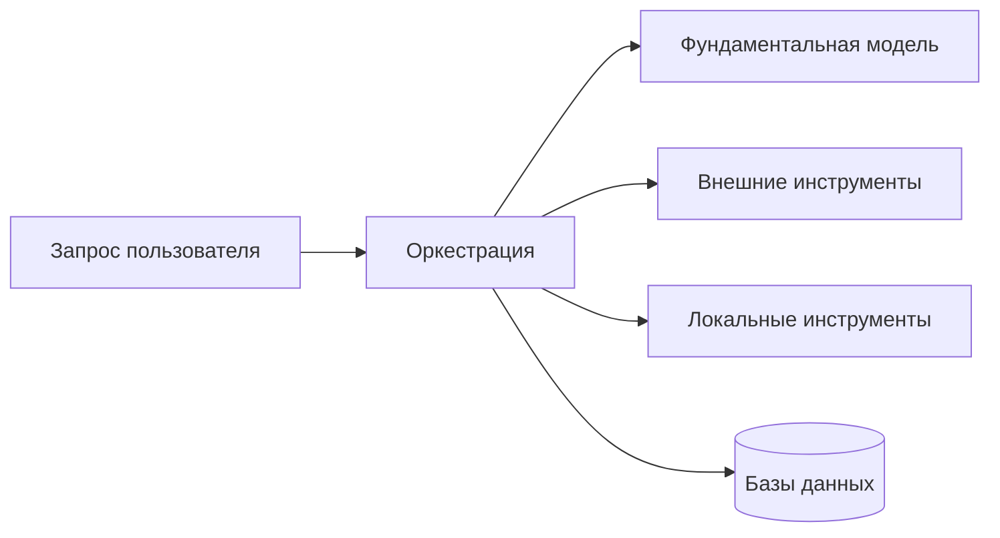

# Orchestration and planning — pick the flow's shape, then keep it the simplest shape the scenario tolerates

## Output
A control-flow recommendation that lands in an ADR, an architecture step or a code review: the chosen
archetype (reflex / ReAct / planner-executor / query decomposition / reflection / deep-research composite)
with the requirement that decided it and the cost the book attaches to it; the execution mode (single
tool, parallel, chain, graph) with the maximum chain length, the depth and branching caps for a graph, and
the merge points; whether the plan is built once up front or corrected incrementally after each
observation; the routing-node test plan and the trace check that every path reaches a terminal node; and
the explicit statement of which parts of this choice the book fixes with a rule and which parts it leaves
to your measurement.

## When to use / NOT
- **Use when:** one tool call has stopped covering the task and you must decide what runs the sequence;
  choosing between ReAct, a planner-executor split, self-ask decomposition, a reflection layer, or a
  deep-research composite; deciding whether the flow is a linear chain or a branching graph; setting a cap
  on chain length because errors compound; laying out graph nodes, conditional edges and consolidation
  points, and deciding what to unit-test in them; deciding whether the plan is produced whole up front or
  revised step by step; sizing planning depth against latency; deciding how much of the flow the first
  prototype should contain.
- **NOT for:** the number of agents and their coordination scheme (→ `aiagents-single-vs-multi-agent`);
  the runtime plumbing that executes the topology — transport, brokers, actor/orchestrator frameworks,
  shared storage (→ `aiagents-multi-agent-infrastructure`); the tools themselves — naming, schemas, error
  contracts, tool-choice mode, semantic/hierarchical selection, and the retrieve-then-filter mechanics of
  parallel calls, which live in KU `ai-apps-ch05-p117-ku11` and are deliberately outside this skill's
  `derived_from` (→ `aiagents-tool-design-and-selection`); whether an agent is the right level of solution
  at all, and which model runs it (→ `aiagents-agent-fit-and-model-choice`); what each model call receives
  in its window and how the token budget is spent — KU `ai-apps-ch05-p117-ku13`, also outside this
  `derived_from` (→ `aiagents-context-engineering`); building the evaluation set and metrics that let you
  compare two planning approaches (→ `aiagents-evaluation-design`); optimising an already-shipped ReAct
  module from production failures — KU `ai-apps-ch11-p280-ku11` (→ `aiagents-improvement-loops`). Also NOT
  generic reasoning scaffolds for a human or a single prompt (→ `structured-reasoning`,
  `problem-solver-enhanced`), NOT this harness's own loop machinery (→ `autonomous-loops`,
  `agentic-engineering`), NOT a batch/ETL DAG (→ `data-pipeline`).

## Decision criteria

### 1. What orchestration is actually deciding (KU: ai-apps-merged-ku03)
Two definitions of the same layer, from two chapters, and they answer different halves of the question.

**As the joining logic between skills** [p.52]: orchestration is what turns separate pieces of
functionality into an end-to-end solution — it links the agent's skills, fixes their order, and keeps
execution under control so each step picks up the previous one and all of them aim at one clear goal
[p.52]. Its mechanism is to weigh possible sequences of tool and skill calls, predict what each would
produce, and take the path most likely to succeed on a multi-phase task; the book's own illustrations are
a delivery route balancing traffic, time windows and transport, and the assembly of a data-processing
pipeline [p.52]. Skipping this layer is named as a real failure mode: without a thought-through
orchestration layer the agent's skills start to conflict, up to the point where work stops [p.52].

**As resource coordination and per-step context assembly** [p.117]: orchestration is the base logic that
takes the user's request and coordinates the resources — foundation-model calls, external tools, local
tools, databases [p.117]. It does not reduce to "when do I call which tool": every model call also needs
the right context assembled so that the action is justified [p.117]. Simple tasks need one tool and
minimal context; complex workflows need planning, memory reads and dynamic context assembly at each step
[p.117] — and that second half is `aiagents-context-engineering`'s subject, not this skill's.

Reconstruction of Рис. 5.1 [p.117]:

**Liveness requirement** [p.52]: the situation can invert instantly — new data arrives, priorities move, a
needed resource drops out. The orchestrator is therefore expected to keep watching both the work in
progress and the environment, holding flows back or rerouting them [p.52]. This is what makes §8's
incremental replanning a property of the layer rather than an optional extra.

Note on scope: chapter 2 states the definition and the requirements; it does not describe the concrete
mechanisms [p.52]. Those are §2–§6 below.

### 2. Pick the archetype from what DOMINATES the requirement (KU: ai-apps-ch05-p117-ku02)
The archetype choice acts directly on performance, cost and what the system is capable of [p.118].
Re-derived from табл. 5.1 [p.122] around the question "what dominates this task". The right-hand column
is the weakness the table itself names for that row — it is not a claim that the row above it is a lesser
version of the row below:

| What dominates the task | Archetype | The cost the table names |
|---|---|---|
| Immediate response to known triggers (keyword routing, simple lookup) | Reflex agent — a direct «если условие → действие» with no internal inference [p.118] | Does not cope with multi-step reasoning [p.118] |
| Adaptation to intermediate results (research, diagnostics) | ReAct — the reason → tool call → observation cycle [p.118] | Higher latency and API cost [p.119] |
| Explicit decomposition of a multi-step process | Planner-executor — the planning phase is separated from execution [p.119] | The cost of the planning phase itself [p.122] |
| Factual questions that need external search | Query decomposition (self-ask with search) [p.119] | Multiple tool calls [p.122] |
| A high price for an early mistake (finance, medicine, incidents) | Agent with reflection / meta-reasoning [p.120] | Extra computation and latency [p.122] |
| Open-ended multi-phase investigation (literature review, market analysis) | Deep-research agent [p.120] | High cost and very high latency [p.122] |

Two constraints the authors attach to this table, and both matter when you cite it:

- It is a starting point, not a final taxonomy — new hybrid patterns keep appearing and the classification
  will keep splitting [p.121].
- The types **combine**: the deep-research agent is itself built out of a planner, decomposition and ReAct
  cycles [p.120]. Reading the rows as mutually exclusive options is the misuse.

### 3. ReAct — interleaved reasoning and action (KU: ai-apps-ch05-p117-ku03)
The model runs an iterative loop: it produces a conclusion, picks and calls a tool, observes the result,
and repeats [p.118]. That is what lets a complex task be split into stages and the plan corrected while it
runs. Named implementations in LangChain [p.118]: `ZERO_SHOT_REACT_DESCRIPTION` puts tools and
instructions into a single prompt with no examples; `CHAT_ZERO_SHOT_REACT_DESCRIPTION` adds the dialogue
history so the next action can be chosen from it.

Side benefit worth designing for: the loop leaves a legible chain of reasoning, which makes debugging and
auditing easier [p.119]. Fit: research-flavoured scenarios — dynamic data analysis, aggregation across
sources, diagnostics [p.119]. Price: the adaptivity is paid for in latency and API spend [p.119].

### 4. Planner-executor — separate the plan from its execution (KU: ai-apps-ch05-p117-ku04)
The task is cut into two phases: planning, where the model generates a multi-step plan, and execution,
where each step is carried out by tool calls [p.119]. Three benefits the book names [p.119]:

1. **Clear decomposition** — the complex thing is broken into sub-tasks that can actually be executed.
2. **Debuggability** — an explicit plan shows which step failed and why, and that step can be re-planned
   on its own rather than the whole run.
3. **Cost efficiency** — execution is driven by smaller models or by fewer LLM calls, and the large models
   are held back for planning.

Fit: complex multi-step processes [p.122]. Price: the extra spend of the planning phase [p.122]. Note what
this implies for §7's latency question — you are buying an artefact (the plan) that you can inspect, test
and re-run, at the cost of one more model round before any work starts.

### 5. Query decomposition — self-ask with search (KU: ai-apps-ch05-p117-ku05)
An iterative scheme: "which question do I need next?" → run the search → "what is the next question?" → …
→ "what is the final answer?" [p.119]. The book's worked case (`SELF_ASK_WITH_SEARCH`): the question of
who lived longer, X or Y, splits into two self-questions about the lifespan of X and of Y, each its own
search call, after which the retrieved facts are compared to produce the answer [p.119].

The property that makes this archetype worth its extra calls: each fact demonstrably rests on a tool
result **before** the final answer is assembled [p.120]. Fit: question-answering tasks that pull external
information [p.120, p.122]. The weakness табл. 5.1 names for it is the multiplicity of tool calls [p.122].

### 6. Reflection and meta-reasoning — for flows where an early error is expensive (KU: ai-apps-ch05-p117-ku06)
An extension of ReAct: besides alternating reasoning and action, the agent analyses its previous steps and
corrects mistakes before continuing [p.120]. In the ReflAct framework the agent continuously compares the
current state against the target state (goal-state reflections) and adjusts the plan on divergence [p.120].

The operational point, and the reason this belongs in the flow design rather than in a prompt: by pairing
every action with a reflection step, the agent sees that a tool's result diverged from what was expected
and still has time to rebuild the plan or roll back what it did **before** irreversible operations are
committed [p.120]. So the placement question is concrete — put the reflection step upstream of the first
step that cannot be undone.

Fit: tasks where correctness and reliability outrank speed [p.120] — the book's domains are financial
transactions, medical diagnostics, critical incidents [p.120]. Price: meta-reasoning adds latency and
compute [p.120].

### 7. The deep-research agent — a composite, not a seventh primitive (KU: ai-apps-ch05-p117-ku07)
It composes three patterns [p.120]: planner-executor to plan the research flow, query decomposition to
break large requests apart, and ReAct cycles to refine hypotheses as findings arrive. The typical cycle
[p.120-121]:

1. Plan the search strategy — key sub-topics, data sources.
2. Decompose each sub-topic into concrete queries (`SELF_ASK` and its analogues).
3. Call the tools — from academic APIs to domain databases — judging each result for relevance and
   trustworthiness.
4. Synthesise the conclusions into a report or a set of recommendations, with LLM summarisation and
   critique at every step.

Strengths [p.121]: it survives many stages, it adapts its course, and it stays transparent enough to
audit. Fit: long-running expert-level tasks where depth and precision outrank speed [p.121]. Limits
[p.121]: high model and API spend; every added layer of planning or reflection adds latency; and
brittleness — the result depends on the quality of external sources, so error-handling and fallback
strategies are required, not optional.

### 8. Build the plan whole, or correct it as you go (KU: ai-apps-merged-ku03, ai-apps-ch05-p117-ku14)
The book's incremental-planning pattern: the plan is **not** built in full in advance — the agent walks
part of the steps, then revises and edits the remainder of the route using what it has just learned
[p.52]. Its example: a conversational assistant checks the outcome of the current task with the user, and
only then starts planning the next one [p.52].

The checklist question that decides this for your scenario [p.143]: estimate **how much of the plan will
have to change** as a consequence of earlier actions. Where substantial adaptation is expected, take a
method that allows the plan to be corrected step by step [p.143]. Where it is not, an up-front plan keeps
the artefact inspectable (§4).

### 9. The execution mode: one tool, parallel, chain, graph (KU: ai-apps-ch05-p117-ku17, ai-apps-ch05-p117-ku12)
The book's opening position: most chatbots today perform the single operation they were asked for and
cannot plan a sequence of actions — «такой подход проще реализуется и обладает более низкой задержкой»
[p.134]. It gives explicit permission to stop there when the team is building its first agentic system or
when one call satisfies the first scenario [p.134].

The four modes, in the order the «Топологии инструментов» section presents them. **This is a presentation
order, not an escalation ladder the book draws**: it states a transition rule only for the chain/graph fork
[p.141] and an explicit permission to stop at one tool [p.134], and it gives no numeric threshold for
moving between any two modes.

| Mode | What the book presents it for | The cost it names |
|---|---|---|
| **One tool** | Planning collapses to choosing a suitable tool, parameterising it correctly per its definition, executing it and forming the answer from the result (рис. 5.5-5.6, «Какая погода в Нью-Йорке?» → `get_weather`) [p.135]. Minimal planning is the base the more complex schemes are built on [p.135] | — (this is the low-latency baseline [p.134]) |
| **Parallel** | «Первое возрастание сложности возникает при использовании инструментов параллельно» [p.135] — several independent actions over one input, where it is not known in advance how many tools will be needed; the book's case is assembling a patient's medical record from several sources [p.135-136] | The mechanics (retrieve-then-filter) are a separate KU owned by `aiagents-tool-design-and-selection` |
| **Chain** | A sequence of actions where each depends on the success of the previous one [p.136-137]; taken when the task is strictly linear [p.141] | Errors accumulate and amplify as length grows — set a maximum chain length [p.137, p.141] |
| **Graph** | Only where branching or late consolidation of several flows is needed [p.141] | Noticeably more model calls than a chain → latency and spend; and new error classes: cycles, unreachable nodes, merges of conflicting states [p.138] |

The selection principle the section closes on [p.134]: you implement the tools and fix the topology the
agent is allowed to work within, and the agent constructs the exact composition dynamically from the
context and the task at hand.

### 10. Chain or graph — the one explicit rule, and the graph's anatomy (KU: ai-apps-ch05-p117-ku12)
The rule, verbatim: «Начните с цепочки, если ваша задача строго линейна (например, промпт → модель →
парсер)» [p.141] — a chain is easier to reason about and to debug; the graph is taken only where you need
branching or a late consolidation of several flows, such as parallel analyses merged into one summary
[p.141].

**Chains** [p.136-138]: a sequence in which each action depends on the previous one succeeding. Cap the
maximum length, because errors accumulate and amplify with it [p.137]. Where there is no branching into
parallel sub-tasks, the chain is the best compromise between dependency-aware planning and low complexity
[p.137-138].

**Graphs** [p.138]: a node is a tool call or a logic step; edges — including conditional ones
(`add_conditional_edges`) — encode the permitted transitions; converging edges let parallel branches merge
in a shared consolidation node. The cost is the extra model calls, and the new failure classes listed in
§9.

**Graph discipline** [p.141] — five practices, all of them things you can put in a review checklist:

- [ ] Sketch the topology first — nodes, permitted transitions, merge points.
- [ ] Bound the depth and the branching factor.
- [ ] Unit-test every routing node.
- [ ] Use the built-in tracing (LangGraph) to confirm that every path terminates in a terminal node.
- [ ] Keep the structure minimally complex: each surplus node or edge multiplies the execution paths and
      the errors; complexity is added only when the task demands it.

### 11. Choosing the planning strategy: the five practices (KU: ai-apps-ch05-p117-ku14)
From the chapter's conclusion [p.143]:

- [ ] Weigh the latency requirement against the accuracy requirement — the chapter states there is an
      evident tradeoff between the two [p.143].
- [ ] Determine the typical **number of actions** the scenario needs: as a rule, the higher that number,
      the more complex the planning method you will have to apply [p.143].
- [ ] Estimate what share of the plan will have to change based on the results of earlier actions; where
      substantial adaptation is needed, take a method that corrects the plan step by step [p.143].
- [ ] Design a representative set of test cases and compare the different planning approaches on it —
      building that set and its metrics is `aiagents-evaluation-design`'s subject [p.143].
- [ ] Choose the **simplest** planning method that satisfies the scenario's requirements [p.143].

Starting strategy [p.143]: begin small — well-worked-out scenarios and a simpler approach to orchestration
— and grow the complexity only as the specific use case requires it.

This checklist is high-level by construction: no numeric thresholds appear on that page.

### 12. How much flow to build in the first iteration (KU: ai-apps-ch02-p41-ku16)
The first build is never the right one, so the working mode is small functional prototypes that are
evaluated, improved and refined in repeating cycles with feedback folded in continuously [p.60]. Benefits
named [p.60-61]: defects surface early — design flaws and performance bottlenecks are found before they
are deeply embedded, which cuts long-term cost; the system stays aimed at its users, because frequent
feedback from developers, stakeholders and end users keeps it aligned with expectations; and it scales,
because starting from an MVP or a basic agent means growth arrives in manageable increments, each tested
before full deployment.

The procedure [p.61]:

1. Prototype fast — concentrate on the base functionality without chasing perfection; produce something
   that works and delivers value.
2. At the end of each turn, run the tests and gather responses; those are what set what to improve next
   and in which order.
3. Refine and repeat the cycle until the system meets its goals for performance, usability and
   scalability.

*(This KU is `verified: partial`. The judge refused its statement about what the book does **not** provide
in the way of stopping criteria — a global claim about the whole book that p.61 does not establish. That
statement is deleted, not softened; what remains above is the procedure and its three named benefits.)*

## Key facts & formulas
- Orchestration, chapter 2 sense: the logic that links the agent's skills, orders them and holds execution
  together toward one goal [p.52]. Chapter 5 sense: the base logic that processes the user request and
  coordinates foundation-model calls, external tools, local tools and databases [p.117].
- Рис. 5.1 — the orchestration hub with four coordinated resource classes [p.117].
- Табл. 5.1 — six archetypes with their strong and weak sides [p.122]; the authors call it a starting
  point, not a final taxonomy [p.121].
- ReAct loop: conclusion → tool call → observation → repeat [p.118]. LangChain constants named:
  `ZERO_SHOT_REACT_DESCRIPTION`, `CHAT_ZERO_SHOT_REACT_DESCRIPTION` [p.118].
- Planner-executor benefits: decomposition, debuggability, cost efficiency — large models reserved for
  planning [p.119].
- Query decomposition: `SELF_ASK_WITH_SEARCH`; the worked example is a "who lived longer, X or Y" question
  split into two lifespan self-questions, one search call each [p.119].
- Reflection framework named: ReflAct, with goal-state reflections comparing current state to target state
  [p.120].
- Deep-research agent = planner-executor + query decomposition + ReAct cycles [p.120]; four-step cycle
  plan → decompose → call tools with relevance/reliability judgement → synthesise with critique
  [p.120-121].
- Рис. 5.5-5.6 — the single-tool flow, «Какая погода в Нью-Йорке?» → `get_weather` [p.135].
- Chains: each action depends on the previous one succeeding; set a maximum length because errors
  accumulate and amplify with it [p.136-137, p.141].
- Graphs: nodes = tool calls or logic steps; `add_conditional_edges` for conditional transitions;
  converging edges for a consolidation node; LangGraph's built-in tracing verifies every path reaches a
  terminal node [p.138, p.141].
- Graph failure classes named: cycles, unreachable nodes, merges of conflicting states [p.138].
- Planning-design checklist: five practices [p.143]; start small and grow complexity only as needed
  [p.143].
- Iterative design: start from an MVP / basic agent, three-step prototype → test-and-collect-feedback →
  refine cycle [p.60-61].
- No numeric thresholds are given anywhere in this frame: not for chain length, not for graph depth or
  branching factor, not for the number of actions that should trigger a more complex planning method
  [p.137, p.141, p.143].

## Anti-patterns
| Anti-pattern | Why it fails | Source |
|---|---|---|
| Wiring skills together without an orchestration layer | The agent's skills start to conflict, up to the point where the work stops | ai-apps-merged-ku03 |
| Treating orchestration as "which tool do I call when" | Each model call also needs the right context assembled, or the action is not justified | ai-apps-merged-ku03 |
| A plan built once and never revised in a changing environment | New data, shifted priorities and a lost resource are named as things that invert the situation instantly; the orchestrator is expected to keep watching and reroute | ai-apps-merged-ku03 |
| Reading табл. 5.1's rows as mutually exclusive archetypes | The types combine — the deep-research agent is itself a planner plus decomposition plus ReAct cycles | ai-apps-ch05-p117-ku02 |
| Freezing табл. 5.1 as the taxonomy of agents | The authors warn it is a starting point and that hybrid patterns keep splitting the classification | ai-apps-ch05-p117-ku02 |
| A reflex agent on a task that needs multi-step reasoning | The named weakness of that row is exactly the absence of multi-step reasoning | ai-apps-ch05-p117-ku02 |
| Choosing ReAct for a latency-sensitive path | Adaptivity is paid for in latency and API cost | ai-apps-ch05-p117-ku03 |
| Putting the reflection step after the irreversible operation | Its whole value is catching the divergence in time to re-plan or roll back before irreversible operations are committed | ai-apps-ch05-p117-ku06 |
| Building a deep-research agent without fallback strategies | Brittleness is a named limit — the result depends on the quality of external sources, so error handling and fallbacks are required | ai-apps-ch05-p117-ku07 |
| An unbounded chain | Errors accumulate and amplify as the chain grows; a maximum length is prescribed | ai-apps-ch05-p117-ku12 |
| Reaching for a graph on a strictly linear task | The stated rule starts from a chain for linear tasks; chains are easier to analyse and debug | ai-apps-ch05-p117-ku12 |
| A graph assembled node-by-node without sketching the topology first | Nodes, permitted transitions and merge points are meant to be laid out before implementation | ai-apps-ch05-p117-ku12 |
| Routing nodes left untested | Unit tests on every routing node are part of the prescribed graph discipline | ai-apps-ch05-p117-ku12 |
| Shipping a graph without checking that every path terminates | Built-in tracing exists precisely to confirm each path reaches a terminal node; cycles and unreachable nodes are named error classes | ai-apps-ch05-p117-ku12 |
| Adding nodes and edges "just in case" | Every surplus node or edge multiplies execution paths and errors | ai-apps-ch05-p117-ku12 |
| Picking the most capable planning method available | The prescribed choice is the simplest method that satisfies the scenario | ai-apps-ch05-p117-ku14 |
| Comparing planning approaches by intuition | A representative set of test cases for that comparison is one of the five practices | ai-apps-ch05-p117-ku14 |
| Ignoring the scenario's typical number of actions | That number is the stated driver of how complex the planning method must be | ai-apps-ch05-p117-ku14 |
| Building the full orchestration before anything has been evaluated | The prescribed mode is small prototypes evaluated and refined in cycles, starting from an MVP | ai-apps-ch02-p41-ku16 |

## Related decisions
- **`aiagents-tool-design-and-selection`** — this skill fixes the topology the agent may work inside; that
  skill fixes what the nodes call. The parallel rung's mechanics (retrieve-then-filter,
  `ai-apps-ch05-p117-ku11`) live there. Coupling: a bigger or more overlapping toolbox raises the number of
  candidate sequences §1 has to weigh, and a chain's error accumulation (§10) starts from a single
  mis-parameterised call.
- **`aiagents-context-engineering`** — §1's second definition splits here: orchestration decides which
  steps happen, context engineering decides what each step sees (`ai-apps-ch05-p117-ku13`). Coupling:
  every extra node in a graph is another call whose context must be assembled, so graph width buys latency
  in two places, not one.
- **`aiagents-single-vs-multi-agent`** — decide how many agents there are before you shape one agent's
  flow. Coupling: crossing to multi-agent replaces a chain/graph inside one agent with a coordination
  scheme between agents, and the graph discipline of §10 does not transfer to it unchanged.
- **`aiagents-multi-agent-infrastructure`** — the transport, actor/orchestrator runtime and storage layers
  that actually execute the topology chosen here. Coupling: a graph with conditional edges and
  consolidation nodes imposes state-merge requirements on that runtime.
- **`aiagents-agent-fit-and-model-choice`** — the archetype table (§2) is downstream of deciding an agent
  is warranted at all; the practical taxonomy of agent types is `ai-apps-ch01-p24-ku05`, held there.
  Coupling: the planner-executor split (§4) presumes two model tiers, which makes it a model-selection
  decision as much as a flow decision.
- **`aiagents-evaluation-design`** — practice 4 of §11 hands off here: the representative test set and the
  planner metrics that compare two approaches are built there. Coupling: any chain-length or graph-depth
  cap you set is a hypothesis until that set measures it.
- **`aiagents-improvement-loops`** — once a ReAct module is live and behaving inconsistently, its
  optimisation is that skill's cycle (`ai-apps-ch11-p280-ku11`), not a re-run of this choice. Coupling:
  §12's iterate-from-MVP mode is the pre-release half of the same idea.
- **`aiagents-observability-and-drift`** — the trace that §10 uses to prove every path terminates is a
  development-time check; the production telemetry, thresholds and drift detection over the same flow are
  decided there.

## Источник
Derived from «Building Applications with AI Agents» (Albada, рус. пер., ISBN 978-601-14-1158-5):
глава 2, с. 52 и с. 60–61; глава 5, с. 117–122, с. 134–138, с. 141 и с. 143.
KUs: ai-apps-merged-ku03, ai-apps-ch05-p117-ku02, ai-apps-ch05-p117-ku03, ai-apps-ch05-p117-ku04,
ai-apps-ch05-p117-ku05, ai-apps-ch05-p117-ku06, ai-apps-ch05-p117-ku07, ai-apps-ch05-p117-ku12,
ai-apps-ch05-p117-ku14, ai-apps-ch05-p117-ku17, ai-apps-ch02-p41-ku16.
Deep reference: `references/knowledge-units.md`.
- Topology anchor: «Начните с цепочки, если ваша задача строго линейна (например, промпт → модель →
  парсер)» [p.141].
- Planning-depth anchor: «Выберите простейший метод планирования, который будет удовлетворять требованиям
  вашего сценария использования» [p.143].

## Self-check
- [x] Every criterion and anti-pattern traces to a KU listed in `derived_from`?
- [x] «Источник» pages computed from the consumed KUs' `sources:` blocks?
- [x] trust_tier 1 (machine-distilled, routing-gated at CP3.5, not yet human-reviewed)?
- [x] The one `partial` KU's over-claim (`ai-apps-ch02-p41-ku16`) deleted, and the deletion marked in §12?
- [x] The §9 mode table headed as presentation order, not as an escalation ladder the book draws?
- [x] Boundary clause names real sibling ids, including `ai-apps-ch05-p117-ku11` and `ku13` as siblings' property?

## Examples
- «У нас диагностический агент, план должен меняться по ходу — ReAct или планировщик-исполнитель?» → ReAct
  is the row for adaptation to intermediate results, at the price of latency and API cost; the
  planner-executor split is for explicit decomposition of a known multi-step process and buys an
  inspectable plan plus a cheaper execution tier — and the deciding checklist question is how much of the
  plan you expect to rewrite after each action.
- "Should this multi-step flow be a chain or a graph?" → start from a chain if the task is strictly linear
  (prompt → model → parser); take a graph only where you need branching or late consolidation of several
  flows, and pay for it with noticeably more model calls plus three new error classes — cycles,
  unreachable nodes and merges of conflicting states.
- «Цепочка из 12 шагов начала врать к концу» → the book's own prescription is a cap on maximum chain
  length, because errors accumulate and amplify as the chain grows; the answer is to bound the length and
  reconsider whether the tail is really linear, not to add retries at every step.
- "We're wiring a LangGraph flow with conditional edges — what's the review checklist?" → sketch nodes,
  permitted transitions and merge points before implementing; bound depth and branching factor; unit-test
  every routing node; use the built-in tracing to confirm every path reaches a terminal node; and delete
  any node or edge the task does not demand, since each one multiplies execution paths and errors.
- «Агент проводит финансовую операцию — где ставить рефлексию?» → upstream of the first irreversible step:
  the value of the reflection layer is that pairing each action with a reflection lets the agent notice a
  tool result diverging from the expectation and re-plan or roll back before irreversible operations are
  committed; the price is latency and compute.
- "How do I pick the planning depth for a new use case?" → five practices: weigh latency against accuracy,
  count the typical number of actions the scenario needs (higher ⇒ more complex planning), estimate how
  much of the plan gets rewritten by earlier results, compare candidate approaches on a representative test
  set, and then take the simplest method that still satisfies the scenario — starting small and growing
  complexity only as required.
- «Нужен обзор литературы с проверяемыми фактами — какой архетип?» → the deep-research composite: a
  planner for the search strategy, query decomposition for each sub-topic, ReAct cycles to refine
  hypotheses on new findings, and synthesis with critique at each step — budgeting for high model/API spend,
  very high latency, and explicit fallback strategies, since the output is only as good as the external
  sources.
