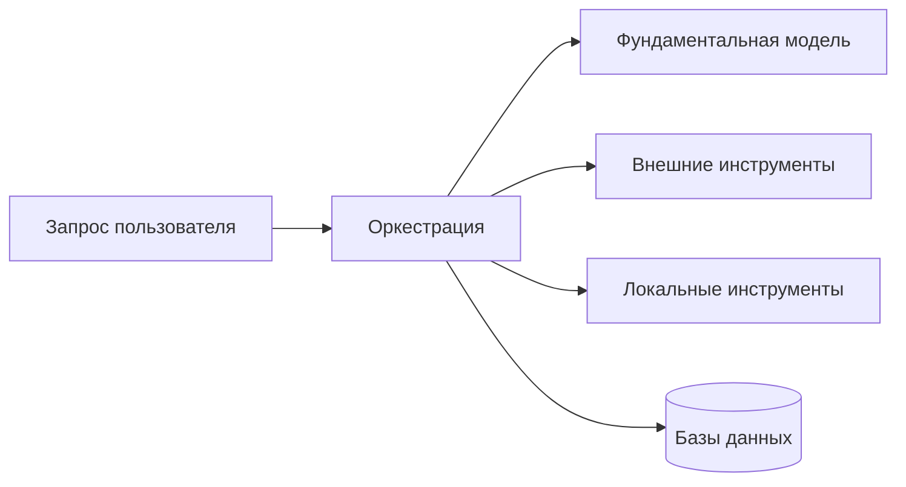

# Knowledge units — `aiagents-orchestration-and-planning`

Source book: «Building Applications with AI Agents» (Albada, рус. пер.), ISBN 978-601-14-1158-5 —
глава 2, с. 52 и с. 60–61; глава 5, с. 117–122, с. 134–138, с. 141 и с. 143.

Machine-distilled, not human-reviewed against the cited pages (trust_tier 1 — routing-gated at
CP3.5 2026-08-18; Tier 2 requires human review). 11 KUs.

Ten of the eleven carry `verified: true` in the canon. One is `verified: partial` —
`ai-apps-ch02-p41-ku16`; its refused over-claim is deleted below and marked in place.

Deliberately **not** consumed (adjacent material owned by a sibling — point at it, do not fold it in):
`ai-apps-ch05-p117-ku11` (параллельное выполнение инструментов, retrieve-then-filter) →
`aiagents-tool-design-and-selection`; `ai-apps-ch05-p117-ku13` (контекст-инжиниринг, четыре принципа
сборки контекста) → `aiagents-context-engineering`; `ai-apps-ch11-p280-ku11` (оптимизация ReAct-модуля
через DSPy MIPROv2) → `aiagents-improvement-loops`; `ai-apps-ch01-p24-ku05` (практическая таксономия
типов агентов) → `aiagents-agent-fit-and-model-choice`.

---

## KU-merged03 — Оркестрация агентной системы: определение, механизм выбора пути, инкрементальное перепланирование
- **type:** definition
- **pages:** 52 (гл. 2, unit_title: «Оркестрация»); 117 (гл. 5)
- **ku_id:** ai-apps-merged-ku03
- **aliases:** orchestration, ai-apps-ch02-p41-ku11, ai-apps-ch05-p117-ku01
- **verified:** true (reduce: оба источника были true → true)

**Problem:** Что именно проектируется на этапе «оркестрации» и почему это больше, чем маршрутизация
вызовов инструментов [p.117]; без продуманного слоя оркестрации навыки агента начнут конфликтовать
вплоть до остановки работы [p.52].

**Content:**
[reduce] Слияние ДВУХ определений одного понятия — из гл. 2 (с.52) и гл. 5 (с.117).

*ЧАСТЬ A. Оркестрация как логика связывания навыков (гл. 2, с.52).*
Оркестрация — та самая логика, которая сшивает разрозненные куски функциональности в сквозное
решение: она связывает навыки агента, выстраивает их очерёдность и держит исполнение под контролем,
так что каждый шаг подхватывает предыдущий и все они ведут к одной ясной цели [p.52]. Механизм:
оценка возможных последовательностей вызовов инструментов/навыков, прогноз их результатов и выбор
пути с наибольшей вероятностью успеха в многофазных задачах (примеры: маршрут доставки с балансом
трафика, временных окон и транспорта; сборка пайплайна обработки данных) [p.52].

Требование к живучести: обстановка способна перевернуться мгновенно — пришли новые данные,
сместились приоритеты, отвалился нужный ресурс. Поэтому оркестратору положено безостановочно следить
и за ходом работы, и за средой, притормаживая либо переводя потоки на другой маршрут [p.52].

Паттерн инкрементального планирования: план не строится целиком заранее — агент проходит часть
шагов, после чего пересматривает и правит остаток маршрута с учётом только что полученного.
Диалоговый помощник, например, сверяет итог очередной задачи с пользователем и лишь потом берётся
планировать следующую [p.52].

*ЧАСТЬ B. Оркестрация как координация ресурсов и сборка контекста (гл. 5, с.117).*
Оркестрация — базовая логика агентной системы, которая обрабатывает запрос пользователя и
координирует ресурсы: вызовы фундаментальной модели, внешние и локальные инструменты, базы данных
[p.117]. Она не сводится к выбору «когда и какой инструмент вызвать»: для каждого вызова модели нужно
ещё и собрать правильный контекст, чтобы действие было обоснованным [p.117]. Простым задачам
достаточно одного инструмента и минимального контекста; сложные рабочие процессы требуют
планирования, чтения памяти и динамической сборки контекста на каждом шаге [p.117].

Реконструкция Рис. 5.1 [p.117]:

**Applicability:** Терминологическая рамка перед выбором архетипа агента, топологии потока и стратегии
планирования.

**Limits:** Определение и требования; конкретные механизмы оркестрации глава 2 не описывает [p.52],
компромиссы — в KU по типам агентов и топологиям.

**Related:** `ai-apps-ch05-p117-ku02`, `ai-apps-ch05-p117-ku12`, `ai-apps-ch05-p117-ku14`,
`ai-apps-ch05-p117-ku13` (последний — у `aiagents-context-engineering`).

---

## KU02 — Выбор архетипа агента под задачу
- **type:** tradeoff-table
- **pages:** 118, 122 (unit_title: «Типы агентов; табл. 5.1»)
- **ku_id:** ai-apps-ch05-p117-ku02
- **verified:** true

**Problem:** Какой тип агента выбрать под задачу: выбор архетипа напрямую влияет на производительность,
стоимость и возможности системы [p.118].

**Content:**
По мотивам табл. 5.1, гл. 5, с. 122 — реструктурировано вокруг вопроса «что доминирует в требованиях
задачи»:

| Если в задаче доминирует… | Берите | Цена выбора |
|---|---|---|
| Мгновенный отклик на известные триггеры (маршрутизация по ключевым словам, простой поиск) | Рефлекторный агент — прямое «если условие → действие», без внутренних умозаключений [p.118] | Не справляется с многошаговыми рассуждениями [p.118] |
| Адаптация по промежуточным результатам (исследование, диагностика) | ReAct — цикл «рассуждение → вызов инструмента → наблюдение» [p.118] | Выше задержка и затраты API [p.119] |
| Явная декомпозиция многошагового процесса | «Планировщик-исполнитель» — фаза плана отделена от исполнения [p.119] | Затраты на планирование [p.122] |
| Фактологические вопросы с внешним поиском | Декомпозиция запросов (self-ask with search) [p.119] | Множественные вызовы инструментов [p.122] |
| Цена ранней ошибки высока (финансы, медицина, инциденты) | Агент с рефлексией/метарассуждениями [p.120] | Лишние вычисления и задержка [p.122] |
| Открытое многофазное исследование (обзор литературы, анализ рынка) | Агент глубокого исследования [p.120] | Высокие затраты и очень высокая задержка [p.122] |

Авторы прямо предупреждают: это отправная точка, а не финальная таксономия — появляются новые
гибридные паттерны, и классификация будет дробиться [p.121].

**Applicability:** Этап проектирования системы, до выбора топологии инструментов.

**Limits:** Таксономия быстро устаревает [p.121]; типы комбинируются (глубокое исследование само
состоит из планировщика, декомпозиции и ReAct-циклов [p.120]).

**Related:** `ai-apps-ch05-p117-ku03`; `ai-apps-ch11-p280-ku11` (→ `aiagents-improvement-loops`);
`ai-apps-ch01-p24-ku05` (→ `aiagents-agent-fit-and-model-choice`).

---

## KU03 — Паттерн ReAct: чередование рассуждения и действия
- **type:** case-pattern
- **pages:** 118, 119
- **ku_id:** ai-apps-ch05-p117-ku03
- **verified:** true

**Problem:** Задачи, где план должен обновляться по промежуточным результатам инструментов.

**Content:**
Модель в итеративном цикле: генерирует заключение → выбирает и вызывает инструмент → наблюдает
результат → повторяет [p.118]. Это позволяет разбивать сложную задачу на этапы и корректировать план
на ходу. В LangChain: `ZERO_SHOT_REACT_DESCRIPTION` — инструменты и инструкции в одном промпте без
примеров; `CHAT_ZERO_SHOT_REACT_DESCRIPTION` — плюс история диалога для выбора следующего действия
[p.118]. Побочная ценность: цикл даёт прозрачную «цепочку размышлений», упрощающую отладку и аудит
[p.119].

**Applicability:** Исследовательские сценарии: динамический анализ данных, агрегирование источников,
диагностика [p.119].

**Limits:** Адаптивность оплачивается задержкой и затратами API [p.119].

**Related:** `ai-apps-ch05-p117-ku02`; `ai-apps-ch11-p280-ku11` (→ `aiagents-improvement-loops`);
`ai-apps-ch01-p24-ku05` (→ `aiagents-agent-fit-and-model-choice`).

---

## KU04 — Планировщик-исполнитель: дорогая модель планирует, дешёвая исполняет
- **type:** case-pattern
- **pages:** 119
- **ku_id:** ai-apps-ch05-p117-ku04
- **verified:** true

**Problem:** Сложные многошаговые процессы, где нужны обозримость плана и контроль затрат.

**Content:**
Задача разбивается на две фазы: планирование (модель генерирует многошаговый план) и исполнение
(каждый шаг выполняется вызовами инструментов) [p.119]. Три выгоды [p.119]:

1. Чёткая декомпозиция — сложное разбито на выполнимые подзадачи.
2. Удобство отладки — явный план показывает, какой шаг упал и почему; шаг можно перепланировать
   точечно.
3. Эффективность по затратам — исполнением управляют меньшие модели или меньшее число вызовов LLM,
   большие модели резервируются для планирования.

**Applicability:** Сложные многошаговые процессы [p.122].

**Limits:** Дополнительные затраты на фазу планирования [p.122].

---

## KU05 — Декомпозиция запросов (self-ask with search)
- **type:** methodology
- **pages:** 119, 120, 122
- **ku_id:** ai-apps-ch05-p117-ku05
- **verified:** true

**Problem:** Сложный фактологический вопрос, требующий нескольких внешних поисков.

**Content:**
Итеративная схема: «какой следующий вопрос мне нужен?» → вызов поиска → «каков следующий вопрос?» → …
→ «каков итоговый ответ?» [p.119]. Пример из книги (`SELF_ASK_WITH_SEARCH`): вопрос «кто прожил
дольше, X или Y?» [p.119] раскладывается на два самовопроса о продолжительности жизни X и Y (каждый —
отдельный вызов поиска), после чего полученные факты сопоставляются в ответе [p.119].

Ключевое свойство: каждый факт проверяемо опирается на результат инструмента до того, как строится
итоговый ответ [p.120].

**Applicability:** Вопросно-ответные задачи с извлечением внешней информации [p.120, 122].

**Limits:** Названная в табл. 5.1 слабая сторона архетипа — множественные вызовы инструментов [p.122].

---

## KU06 — Рефлексия и метарассуждения для критических потоков
- **type:** case-pattern
- **pages:** 120
- **ku_id:** ai-apps-ch05-p117-ku06
- **verified:** true

**Problem:** Рабочие потоки, где ранняя ошибка перерастает в дорогостоящий сбой (финансовые
транзакции, медицинская диагностика, критические инциденты) [p.120].

**Content:**
Расширение ReAct: агент не только чередует рассуждение и действие, но и анализирует прошлые шаги,
исправляя ошибки до продолжения [p.120]. Во фреймворке ReflAct агент постоянно сверяет текущее
состояние с целевым (goal-state reflections) и корректирует план при несоответствии [p.120].
Операционный смысл: сопоставляя каждое действие с шагом рефлексии, агент видит, что результат
инструмента разошёлся с ожидаемым, и успевает перестроить план либо откатить сделанное ДО сохранения
необратимых операций [p.120].

**Applicability:** Задачи, где правильность и надёжность важнее скорости [p.120].

**Limits:** Метарассуждения добавляют задержку и вычислительные затраты [p.120].

---

## KU07 — Агент глубокого исследования: композиция паттернов
- **type:** case-pattern
- **pages:** 120, 121
- **ku_id:** ai-apps-ch05-p117-ku07
- **verified:** true
- **skill_worthiness note (reduce):** re-scored high→medium — агент глубокого исследования подан как
  иллюстрация композиции архетипов, а не как отдельная процедура.

**Problem:** Открытые многофазные исследования: обзоры литературы, научный и рыночный анализ [p.120].

**Content:**
Композиция трёх паттернов: «планировщик-исполнитель» для планирования исследовательского потока,
декомпозиция запросов для разбиения больших запросов, циклы ReAct для уточнения гипотез по новым
находкам [p.120]. Типовой цикл [p.120-121]:

1. Спланировать стратегию поиска (ключевые подтемы, источники данных).
2. Декомпозировать каждую подтему на конкретные запросы (`SELF_ASK` и аналоги).
3. Вызвать инструменты (от академических API до предметных БД), оценивая релевантность и надёжность
   каждого результата.
4. Синтезировать выводы в отчёт/рекомендации с LLM-реферированием и критикой на каждом шаге.

Сильные стороны: многоэтапность, адаптивность курса, прозрачность для аудита [p.121].

**Applicability:** Долгосрочные задачи экспертного уровня, где глубина и точность важнее скорости
[p.121].

**Limits:** Высокие затраты на модель и API; каждый уровень планирования/рефлексии добавляет задержку;
хрупкость — зависимость от качества внешних источников, нужны стратегии обработки ошибок и резервных
действий [p.121].

---

## KU12 — Цепочка или граф: выбор топологии многошагового потока
- **type:** decision-framework
- **pages:** 136, 137, 138, 141 (unit_title: «Цепочки; Графы»)
- **ku_id:** ai-apps-ch05-p117-ku12
- **verified:** true

**Problem:** Какую топологию выполнения выбрать для задачи из нескольких зависимых шагов.

**Content:**
Правило выбора: «Начните с цепочки, если ваша задача строго линейна (например, промпт → модель →
парсер)» [p.141] — цепочку проще разобрать и отладить; граф берут только там, где нужно ветвление или
поздняя консолидация нескольких потоков (параллельные анализы, сливаемые в сводку) [p.141].

ЦЕПОЧКИ: последовательность действий, каждое зависит от успеха предыдущего [p.136-137]. Устанавливайте
максимальную длину цепочки — ошибки накапливаются и усиливаются с ростом длины [p.137]. Если нет
ветвления на параллельные подзадачи, цепочка — оптимальный компромисс между планированием с
зависимостями и невысокой сложностью [p.137-138].

ГРАФЫ: вершина = вызов инструмента или логический шаг; рёбра, включая условные
(`add_conditional_edges`), кодируют допустимые переходы; сходящиеся рёбра позволяют слить параллельные
ветви в общей вершине консолидации [p.138]. Цена: заметно больше вызовов модели, чем у цепочек →
задержка и затраты; циклы, недостижимые вершины и слияния конфликтующих состояний — новые классы
ошибок [p.138].

Дисциплина работы с графами [p.141]:
- сначала набросать топологию на бумаге: вершины, допустимые переходы, точки слияния;
- ограничить глубину и коэффициент ветвления;
- юнит-тесты на каждую маршрутизирующую вершину;
- использовать встроенную трассировку (LangGraph) для проверки, что каждый путь ведёт к терминальной
  вершине;
- держать структуру минимально сложной: каждая лишняя вершина/ребро умножает пути выполнения и ошибки;
  итерации усложнения — только когда этого требует задача.

**Applicability:** Проектирование многоинструментальных потоков после того, как один инструмент
перестал покрывать задачу.

**Limits:** Графы дороже по вызовам модели и требуют валидации маршрутов [p.138]; чрезмерное
усложнение — главный названный риск [p.141].

---

## KU14 — Проектирование системы планирования: пять практик
- **type:** checklist
- **pages:** 143
- **ku_id:** ai-apps-ch05-p117-ku14
- **verified:** true

**Problem:** Как выбрать стратегию планирования/оркестрации под конкретный сценарий использования.

**Content:**
Чек-лист из заключения главы [p.143]:
- [ ] Взвесить требования к задержке против точности — между ними явный компромисс.
- [ ] Определить типичное ЧИСЛО действий сценария: рост этого числа поднимает и требуемый уровень
      сложности механизма планирования.
- [ ] Оценить, какую часть плана придётся менять по результатам предыдущих действий; при значительной
      адаптации — метод с пошаговой корректировкой плана.
- [ ] Собрать репрезентативный набор тестовых случаев и сравнить на нём разные подходы к планированию.
- [ ] Выбрать ПРОСТЕЙШИЙ метод планирования, удовлетворяющий требованиям сценария.

Стартовая стратегия: начинать с малого — проработанные сценарии и простая оркестрация, наращивая
сложность только по необходимости [p.143].

**Applicability:** Проектирование стратегии планирования под конкретный сценарий использования [p.143].

**Limits:** Чек-лист верхнеуровневый: количественных порогов на этой странице не приводится.

---

## KU17 — Режимы выполнения инструментов: один → параллельно → цепочка → граф
- **type:** decision-framework
- **pages:** 134, 135, 136, 137, 138, 141 (unit_title: «Топологии инструментов»)
- **ku_id:** ai-apps-ch05-p117-ku17
- **verified:** true

**Problem:** Какой топологией выполнять задачу. Книга описывает четыре режима и их условия [p.134-141];
постановка «бери минимальную достаточную» — рамка экстрактора, опирающаяся на явное разрешение
остановиться на одном инструменте [p.134] [вывод экстрактора].

**Content:**
Исходная позиция книги: большинство чат-ботов выполняют одну запрошенную операцию и не умеют
планировать последовательность действий — «такой подход проще реализуется и обладает более низкой
задержкой» [p.134]. Остановиться на одном инструменте допустимо, когда команда строит свою первую
агентную систему либо когда одного вызова хватает первому сценарию.

РЕЖИМ 1 — ОДИН ИНСТРУМЕНТ: планирование сводится к выбору подходящего инструмента, его корректной
параметризации по определению, выполнению и формированию итогового ответа из результата (рис. 5.5-5.6,
пример «Какая погода в Нью-Йорке?» → `get_weather`) [p.135]. Минимальное планирование служит основой
для более сложных схем [p.135].

РЕЖИМ 2 — ПАРАЛЛЕЛЬНО: «Первое возрастание сложности возникает при использовании инструментов
параллельно» [p.135] — несколько независимых действий над одним вводом, причём заранее неясно,
сколько инструментов понадобится (пример: сбор медицинской карты пациента из разных источников)
[p.135-136]. Механика — см. `ai-apps-ch05-p117-ku11` (retrieve-then-filter), которым владеет
`aiagents-tool-design-and-selection`.

РЕЖИМ 3 — ЦЕПОЧКА: последовательность действий, каждое зависит от успеха предыдущего [p.136-137];
берётся, когда задача строго линейна; книга рекомендует ограничивать максимальную длину, поскольку
ошибки накапливаются с ростом длины [p.137, 141].

РЕЖИМ 4 — ГРАФ: только там, где нужно ветвление или поздняя консолидация нескольких потоков [p.141];
цена — заметно больше вызовов модели, задержка и новые классы ошибок (циклы, недостижимые вершины,
конфликтующие слияния) [p.138].

Общий принцип отбора: сначала реализуются инструменты и определяется топология, в которой агент может
работать, а точную композицию агент конструирует динамически по контексту и задаче [p.134].

**Applicability:** Проектирование многошагового потока: выбор режима выполнения инструментов под
сценарий [p.134].

**Limits:** Порядок «один → параллельно → цепочка → граф» — реконструкция ПОРЯДКА ИЗЛОЖЕНИЯ раздела
«Топологии инструментов» [вывод экстрактора], а не лестница эскалации, нарисованная книгой. Явное
правило перехода книга задаёт только для развилки «цепочка или граф» [p.141] и явное разрешение
остановиться на одном инструменте [p.134]. Числовых порогов перехода между режимами книга не приводит.

**Related:** `ai-apps-ch05-p117-ku11` (→ `aiagents-tool-design-and-selection`),
`ai-apps-ch05-p117-ku12`, `ai-apps-ch05-p117-ku14`, `ai-apps-merged-ku03`.

---

## KU16 — Итеративное проектирование агента от MVP
- **type:** methodology
- **pages:** 60, 61 (гл. 2, unit_title: «Итеративное проектирование»)
- **ku_id:** ai-apps-ch02-p41-ku16
- **verified:** **partial**
- **excluded over-claim:** the `limits` line «критериев остановки, кроме достижения целей, книга
  не даёт» [p.61] — refused by the cross-model judge (р2, Codex) as a global statement about the whole
  book that p.61 does not establish. It is DELETED from both this file and `SKILL.md` §12, not softened;
  no hedged version of it appears anywhere in this skill.

**Problem:** Идеальной первая сборка не бывает; нужен режим работы, при котором дефекты всплывают рано,
курс правится на ходу, а система улучшается без остановок [p.60].

**Content:**
Подход: малые функциональные прототипы, которые оцениваются, улучшаются и совершенствуются в
повторяющихся циклах с непрерывным внедрением обратной связи [p.60].

Выгоды [p.60-61]:
- раннее обнаружение проблем — недостатки дизайна и узкие места производительности выявляются до
  глубокого внедрения в систему, сокращая долгосрочные затраты;
- ориентация на пользователя — частая обратная связь от разработчиков, стейкхолдеров и конечных
  пользователей держит систему в соответствии с их ожиданиями;
- масштабируемость — старт с минимально жизнеспособного продукта (MVP)/базового агента даёт рост
  управляемыми приращениями, каждое добавление тестируется до полного развертывания.

Процедура [p.61]:
1. Быстро прототипировать: сосредоточиться на базовой функциональности, не стремясь к совершенству —
   создать нечто работающее и приносящее пользу.
2. По завершении каждого витка прогонять тесты и собирать отклики; именно они задают, что улучшать
   дальше и в каком порядке.
3. Уточнять и повторять цикл, пока система не достигнет целей по производительности, удобству и
   масштабируемости.

**Applicability:** Весь жизненный цикл разработки агента, начиная с первого прототипа [p.60].

**Limits:** Цикл описан до достижения целей по производительности, удобству и масштабируемости [p.61].
*(Исходная формулировка limits снята — см. «excluded over-claim» выше.)*
