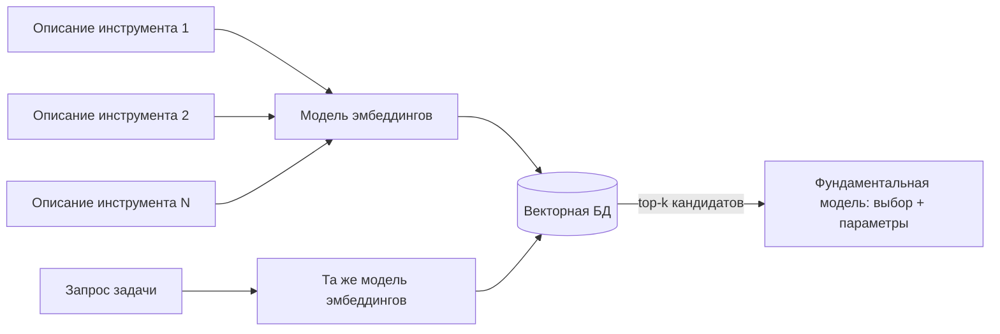
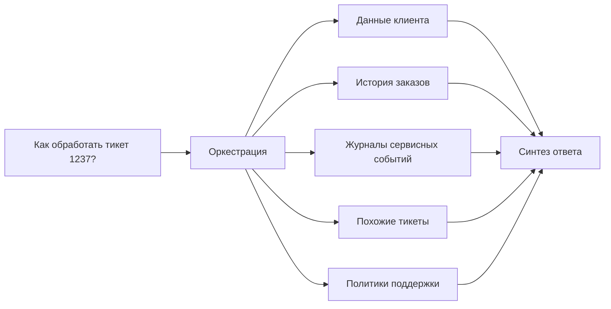

# Knowledge units — `aiagents-tool-design-and-selection`

Source book: «Building Applications with AI Agents» (Albada), рус. пер., ISBN 978-601-14-1158-5.
Chapters consumed: гл. 2 (с. 49–50), гл. 4 (с. 99–116), гл. 5 (с. 122–136).

Machine-distilled, not human-reviewed against the cited pages (trust_tier 1 — routing-gated at CP3.5 2026-08-18; Tier 2 requires human review). 16 KUs.

---

## KU01 — Три категории инструментов агента: локальные, API, MCP — и принцип модульности
- **type:** decision-framework
- **pages:** гл. 2, с. 49–50 (раздел «Инструменты»)
- **ku_id:** ai-apps-ch02-p41-ku09
- **verified:** true

**Problem:** На что агент способен, задаётся тем, насколько широк и насколько сложен его набор инструментов [p.49]; нужно подобрать категорию инструмента под задачу и не переделывать систему при каждом расширении.

**Content:**

Три категории инструментов [p.49-50]:

1. ЛОКАЛЬНЫЕ — действия на внутренней логике и вычислениях без внешних зависимостей: на основе правил или заранее определённых функций; математические вычисления, извлечение данных из локальных баз, простые решения по заранее определённым критериям (одобрение/отклонение запроса) [p.49].
2. НА БАЗЕ API — взаимодействие с внешними сервисами и источниками данных; расширяют возможности за пределы локального окружения, загружая данные в реальном времени (сводка погоды, биржевые цены, обновления соцсетей) [p.49-50].
3. НА БАЗЕ MCP (model context protocol) — передача языковым моделям структурированного контекста в реальном времени по стандартизированной схеме: внешние знания, память и состояние — непосредственно в промпт [p.50]. Обычному API-вызову нужен полный цикл исполнения; MCP работает иначе — он подмешивает насыщенный динамический контекст (профили пользователей, историю диалогов, глобальное состояние, метаданные задачи) прямо в процесс рассуждения модели без вызова отдельных инструментов [p.50]. Когда особенно эффективен: сокращение избыточного использования инструментов, сохранение состояния диалога, внедрение осведомлённости о текущей ситуации [p.50].

Принцип модульности [p.50]: каждый инструмент — самодостаточный модуль, который легко интегрируется или заменяется; это позволяет обновлять и расширять функциональность без основательной переработки системы. Паттерн роста: чат-бот поддержки начинается с базового набора инструментов для простых запросов, позднее дополняется средствами разрешения споров или расширенной диагностикой без ущерба для базовой функциональности [p.50].

**Applicability:** Проектирование инструментария под конкретную задачу агента с учётом разных условий и контекстов работы [p.49].

**Limits:** Категоризация и принцип; детали реализации выбора инструментов в главе не раскрываются [вывод экстрактора].

---

## KU02 — Метаданные и описание инструмента: чек-лист под точный выбор моделью
- **type:** checklist
- **pages:** гл. 4, с. 99 + гл. 5, с. 123
- **ku_id:** ai-apps-merged-ku02
- **verified:** true (слияние двух источников, оба true)

**Problem:** Модель решает, как и когда вызвать инструмент, по его метаданным — они «не менее важны, чем его логика» [p.99]; с ростом числа инструментов перекрытия описаний становятся источником ошибок [p.123].

**Content:**

Слияние двух чек-листов об ОДНОМ артефакте — описании/метаданных инструмента, от качества которых зависит точность выбора: гл. 4 (с. 99, правила) и гл. 5 (с. 123, чек-лист).

**ЧАСТЬ A. Три правила метаданных (гл. 4, с. 99)** [p.99]:
- [ ] Точные имена с узкой областью видимости — слишком общее имя провоцирует LLM вызывать инструмент тогда, когда этого не требуется.
- [ ] Внятные конкретные описания — слишком общие или перекрывающиеся между несколькими инструментами описания «гарантированно приведут к путанице» [p.99] и низкой эффективности.
- [ ] Строгие явные схемы ввода/вывода — помогают модели точно понять, когда и как использовать инструмент, и снижают риск ложных срабатываний.

**ЧАСТЬ B. Чек-лист описания под точность выбора (гл. 5, с. 123)** [p.123]:
- [ ] Короткое содержательное имя (пример из книги: `calculate_sum` вместо `process_numbers`).
- [ ] Сводка из одного предложения об основном предназначении («Возвращает сумму двух чисел»).
- [ ] Пример вызова с типичным вводом и выводом — заземляет понимание модели на конкретику.
- [ ] Ограничения ввода: типы и диапазоны («x и y — целые числа от 0 до 1000») — отсекают неоднозначные совпадения и нерелевантные инструменты.
- [ ] Итеративное тестирование на типичных промптах и уточнение формулировок — повышает точность выбора без дообучения и новой инфраструктуры.

**Applicability:** Любой реестр инструментов, независимо от типа (локальные, API, MCP) и стратегии выбора (стандартная / семантическая / иерархическая).

**Limits:** Правила гл. 4 сформулированы в разделе о локальных инструментах [p.99]; перенос на прочие типы — [вывод экстрактора] по аналогии структуры метаданных. При сильном росте инструментария одних описаний мало — см. стратегию выбора (KU12 / ai-apps-ch05-p117-ku08).

---

## KU03 — Локальные инструменты: где сильны и чем платите
- **type:** tradeoff-table
- **pages:** гл. 4, с. 99–100 (раздел «Локальные инструменты»)
- **ku_id:** ai-apps-ch04-p97-ku04
- **verified:** true

**Problem:** Когда строить инструмент вручную и локально, а когда это станет обузой.

**Content:**

СИЛЬНЫ: компенсация слабостей языковых моделей там, где традиционное программирование работает лучше — арифметика, преобразования единиц и часовых поясов, операции с календарём, датой/временем, картами и графами [p.99, p.100]. Свойства: точность, предсказуемость, простота; явно определённая логика делает их прогнозируемыми и надёжными [p.99]. Развертываются вместе с агентом, легко строятся и изменяются [p.99].

ЦЕНА (три недостатка) [p.99-100]:

| Недостаток | Суть |
|---|---|
| Масштабируемость | Проектирование и развертывание громоздки; трудно переиспользовать в разных сценариях, даже оформив библиотекой [p.99] |
| Дублирование | Библиотека расползается по всем командам: одна правка инструмента заставляет пере-раскатывать каждый агентный сервис, который им пользуется. Дешевле написать свою копию — и книга отмечает, что так и поступают, лишь бы не согласовываться [p.99-100] |
| Сопровождение | Меняются окружение или требования — ручной инструмент приходится подкручивать снова и снова; ресурс на это уходит постоянно, и почти всегда тянет за собой повторную раскатку агентного сервиса [p.100] |

**Applicability:** Выбор типа инструмента: книга рекомендует построенные вручную инструменты для преодоления традиционных слабостей фундаментальных моделей — там, где традиционные методы программирования работают лучше [p.99-100].

**Limits:** Недостатки проявляются в масштабе (много команд/агентов); для одиночного агента дублирование и координация несущественны [вывод экстрактора].

---

## KU04 — Проектирование API-инструмента: надёжность и безопасность
- **type:** checklist
- **pages:** гл. 4, с. 102–104 (раздел «Инструменты на базе API»)
- **ku_id:** ai-apps-ch04-p97-ku05
- **verified:** true

**Problem:** API-инструменты дают агенту внешние сервисы и данные реального времени без переобучения модели [p.102], но внешние сервисы выходят из строя и несут риски безопасности [p.104].

**Content:**

Фокус проектирования: надёжность, безопасность, корректное преодоление сбоев [p.104].

Чек-лист [p.104]:
- [ ] Резервные механизмы или понятные сообщения об ошибках на случай отказа внешнего сервиса.
- [ ] Все коммуникации — по HTTPS с сильной аутентификацией, особенно для чувствительных данных.
- [ ] Учитывать ограничения частоты вызова API (rate limits), чтобы предотвратить отказы.
- [ ] Соблюдение законов о персональных данных: анонимизировать или маскировать пользовательские данные, где необходимо.
- [ ] Надёжная обработка ошибок: подниматься после обрывов сети и некорректных ответов так, чтобы пользователь этого не почувствовал.
- [ ] Там, где выйдет, — запасные варианты и несколько поставщиков на случай, если основной начнёт деградировать.

Два паттерна реализации из книги: (а) готовый класс-инструмент — `WikipediaQueryRun` поверх `WikipediaAPIWrapper`, связывается с моделью напрямую через `bind_tools` [p.102]; (б) своя функция-обёртка над HTTP-вызовом, регистрируемая декоратором `@tool`, — `get_stock_price(ticker)` c `requests.get` и проверкой `status_code == 200`, иначе `ValueError` [p.103-104]. Далее оба вызываются как обычные инструменты [p.103-104].

**Applicability:** Интеграция агента с внешними системами: данные реального времени, тяжёлые вычисления, действия вне локального окружения [p.101-102].

**Limits:** Книга не даёт количественных порогов — ни тайм-аутов, ни лимитов повторов. [вывод экстрактора] Настраиваются под сценарий.

---

## KU05 — MCP: унифицированный протокол подключения инструментов
- **type:** definition
- **pages:** гл. 4, с. 108–111 (раздел «MCP»)
- **ku_id:** ai-apps-ch04-p97-ku08
- **verified:** true

**Problem:** Кастомные адаптеры под каждый источник данных или сервис хрупки и плохо масштабируются; с ростом числа источников код интеграций множится и его трудно сопровождать [p.108, p.109].

**Content:**

MCP (model context protocol) — открытый стандарт: его выдвинула Anthropic, а следом приняли OpenAI, Google DeepMind и Microsoft. Даёт единообразный и безразличный к выбору модели канал, которым LLM цепляется к внешним системам [p.108]. Метафора книги: «порт USB-C для ИИ» — единый интерфейс, который может предоставить любой источник данных и использовать любой агент без связующего кода [p.108].

Две роли [p.108]:
- **Сервер MCP** — веб-сервер, предоставляющий данные/сервисы через стандартизированный интерфейс JSON-RPC 2.0; может инкапсулировать что угодно (облачное хранилище, SQL-базы, CRM, проприетарную бизнес-логику) при условии реализации спецификации.
- **Клиент MCP** — любой агент или LLM-приложение с поддержкой MCP; отправляет JSON-RPC-запросы и получает структурированные ответы JSON.

Механика [p.108-109]: транспортом служит HTTPS либо WebSocket, поверх которого идёт JSON-RPC 2.0. Сервер выставляет наружу свои методы — `listFiles`, `getRecord`, `runAnalysis` — вместе со схемами ввода и вывода; клиент загружает «каталог методов», и LLM делает выводы, какие методы и с какими параметрами вызвать.

Ключевая выгода: сервис публикуется через MCP один раз — далее любое число агентов обнаруживает и вызывает его методы без кастомных адаптеров для каждого агента [p.109, p.111]; реализация сервиса изолируется от логики агента [p.111].

**Applicability:** Интеграция агентов с множеством разнородных систем; переиспользование инструментов между командами и агентами [p.109, p.111].

**Limits:** Безопасность спецификацией не стандартизирована — см. KU06 [p.109].

---

## KU06 — MCP в эксплуатации: безопасность закрываете вы, не спецификация
- **type:** heuristic
- **pages:** гл. 4, с. 109–111
- **ku_id:** ai-apps-ch04-p97-ku09
- **verified:** true

**Problem:** Что остаётся нерешённым при выводе MCP-эндпоинтов в продакшн.

**Content:**

Книга прямо называет нерешённые проблемы безопасности MCP [p.109]: аутентификация, контроль доступа и те векторы атаки, что открываются, когда один MCP-эндпоинт делят между собой сразу несколько агентов. Открытые направления инженерной практики: гарантия вызова методов только авторизованными агентами, ролевой контроль доступа к чувствительным данным, предотвращение инъекций вредоносных нагрузок, ведение журналов аудита [p.109].

Ключевой факт для проектирования: «базовая спецификация MCP не требует единого стандартизированного решения в области безопасности» [p.109] — организации закрывают риски дополнительными сетевыми политиками или промежуточными уровнями [p.109]. Задачи надёжной аутентификации, детализированного контроля доступа и проверки полезных нагрузок остаются областями активной разработки, при этом основное предназначение MCP уже реализовано в производственных системах ведущих организаций [p.111].

**Applicability:** Планирование продакшн-развертывания MCP-серверов, особенно разделяемых несколькими агентами.

**Limits:** Список угроз — по состоянию книги; конкретных контрмер (протоколов, продуктов) книга не предписывает.

---

## KU07 — Инструменты с состоянием: принцип наименьших привилегий
- **type:** checklist
- **pages:** гл. 4, с. 111–112 (раздел «Инструменты с состоянием»)
- **ku_id:** ai-apps-ch04-p97-ku11
- **verified:** true
- **note:** KU намеренно разделён с навыком `aiagents-agent-security` (кластер T14). Здесь — угол ПРОЕКТИРОВАНИЯ инструмента (что регистрируем и с какими правами); периметр и guardrails — там.

**Problem:** Передавая модели прямой контроль над устойчивым состоянием, вы позволяете ей совершать разрушительные ошибки и открываете возможность злоупотреблений [p.111]. Реальный случай из книги: агент «оптимизировал» быстродействие базы, удалив половину строк из рабочей таблицы [p.111]. Даже без злого умысла модель может превратить безвредный запрос в деструктивную команду [p.111].

**Content:**

Чек-лист защиты (относится одинаково к локальным скриптам, внешним API и MCP-развертываниям [p.111, p.112]):
- [ ] Регистрировать только операции с узкой областью применения. Скажем, `add_new_customer(record)` и `get_user_profile(user_id)`: за каждой стоит ровно один проверенный запрос. Эндпоинта, исполняющего произвольный SQL, быть не должно [p.112].
- [ ] Агентам, которым нужно только чтение, — никогда не давать права на удаление или изменение данных [p.112].
- [ ] Если свободные запросы обязательны: строгая санитизация и контроль доступа — OWASP GenAI Security Project предупреждает об SQL-инъекциях; проверка ввода должна отклонять команды с конструкциями вроде `DROP` или `ALTER` [p.112].
- [ ] Связывание параметров / подготовленные операторы против SQL-инъекций [p.112].
- [ ] Учётная запись БД агента — с минимальными привилегиями, достаточными только для разрешённых запросов [p.112].
- [ ] Настоятельно рекомендуется писать в журнал каждое обращение к инструменту: по такому следу видно отклонение от нормы, и на нём же держится последующий разбор. Если добавить немедленные оповещения на подозрительное — вычистку неправдоподобного объёма записей, правку схемы — вмешаться удаётся раньше, чем мелкий сбой перерастёт в серьёзный инцидент [p.112].

Общий стержень: ограничение возможностей на уровне регистрации резко сокращает поверхность атаки и масштаб ошибок [p.112]; формула книги — ограничение возможностей, санитизация входных данных, минимальные привилегии, полная наблюдаемость [p.112].

**Applicability:** Любой инструмент, пишущий в живые хранилища данных; обязательна при доступе агента к БД.

**Limits:** Книга не обещает полного устранения риска: помимо ограничения возможностей и санитизации она настоятельно рекомендует журналирование вызовов и оповещения, позволяющие вмешаться быстро [p.112]. [вывод экстрактора] Плата за узкую область операций — меньшая гибкость агента.

---

## KU08 — Генерация инструментов моделью с ревью человека
- **type:** methodology
- **pages:** гл. 4, с. 113 (раздел «Фундаментальные модели для создания инструментов»)
- **ku_id:** ai-apps-ch04-p97-ku12
- **verified:** true

**Problem:** Запутанная экосистема API: вручную писать десятки микросервисных клиентов — недели рутины и хрупкий связующий код [p.113].

**Content:**

Цикл из книги [p.113]:
1. Передать модели спецификации или примеры ввода (в т.ч. ссылку на спецификацию OpenAPI) — она генерирует начальные обертки, вспомогательные функции, «атомарные» операции.
2. Выполнить сгенерированные заглушки в безопасной песочнице.
3. Корректировать результат критикой на естественном языке — пример книги: «Этот эндпоинт вернул 400 — отрегулируй параметры запроса» [p.113].
4. Через несколько быстрых итераций получить набор протестированных инструментов с узкой областью видимости, вызываемых агентами напрямую.
5. Ревью человеком: рецензенты проверяют и корректируют код ДО попадания в пайплайн CI/CD — это обеспечивает безопасность и правильность [p.113].
6. Меняется API — прогнать цикл заново, снова сгенерировать и снова уточнить, иначе инструменты разъедутся с реальностью [p.113].

Обязательные условия: внятно заданная планка приёмки — тесты, разбор ответов, сверка со схемой — и надзор разработчиков; ответственность за граничные случаи, уязвимости и соответствие бизнес-логике остаётся на человеке [p.113].

**Applicability:** Массовая обвязка внешних API инструментами; поддержание инструментария в синхронизации с меняющимися API.

**Limits:** Сокращает время разработки, но не отменяет валидацию и надзор [p.113]; генерация в рантайме без ревью — другой, более рискованный режим (см. KU09).

---

## KU09 — Генерация кода в реальном времени: адаптивность против четырёх рисков
- **type:** tradeoff-table
- **pages:** гл. 4, с. 113–116 (раздел «Генерация кода в реальном времени»)
- **ku_id:** ai-apps-ch04-p97-ku13
- **verified:** true

**Problem:** Разрешать ли агенту писать и выполнять код на лету в процессе работы.

**Content:**

ЗА: агент, встретив новый API или неизвестную задачу, генерирует код взаимодействия или решение в реальном времени [p.114]; итеративный процесс — анализ задачи → фрагменты кода → выполнение → пересмотр при неудаче с обучением на каждой попытке [p.114]. Немедленное удовлетворение потребностей без вмешательства человека; критично для динамического решения задач [p.114].

ПРОТИВ (четыре риска) [p.114-115]:

| Риск | Суть |
|---|---|
| Контроль качества | Код низкого качества → сбои системы, уязвимости [p.114] |
| Безопасность | Выполнение самосгенерированного кода — вектор внедрения вредоносного ПО: взлом данных, несанкционированный доступ [p.114] |
| Воспроизводимость | Инструменты воссоздаются с нуля каждый раз — успех одного вызова не гарантирует успеха следующего; незначительные изменения промптов или обновления модели ведут к совершенно другим путям кода; страдают отладка, тестирование, комплаенс [p.114] |
| Ресурсы | Генерация и выполнение наивных решений потребляют значительные CPU/память; помогают ограничительные механизмы (guardrails) по аспектам производительности [p.114-115] |

Замечание к источнику: заключение главы причисляет к автоматизированной разработке инструментов также имитационное обучение и обучение с подкреплением [p.116], но в теле главы эти методы не рассматриваются — вероятная несостыковка структуры текста.

**Applicability:** Динамические окружения и интеграционные задачи, где заранее неизвестен набор нужных инструментов [p.114].

**Limits:** Требует серьёзных мер безопасности и контроля [p.114]; для стабильных повторяемых задач воспроизводимый заранее собранный инструментарий предпочтительнее [вывод экстрактора из риска воспроизводимости].

---

## KU10 — Режим tool-choice: auto / any-required / none / закреплённый инструмент
- **type:** decision-framework
- **pages:** гл. 4, с. 115 (раздел «Конфигурация инструментов»)
- **ku_id:** ai-apps-ch04-p97-ku14
- **verified:** true

**Problem:** Когда доверить модели решение о вызове инструментов, а когда зафиксировать поведение детерминированно.

**Content:**

API фундаментальных моделей (OpenAI, Anthropic, Gemini и др.) управляют использованием инструментов параметром выбора инструмента (tool-choice) [p.115]:
- `auto` — модель сама решает по контексту, вызывать ли инструмент; режим для общего использования [p.115].
- `any`/`required` — модели вменяется в обязанность обратиться хотя бы к одному инструменту; берут этот режим там, где без полученного от инструмента результата дальше не пройти [p.115].
- `none` — блокирует все вызовы инструментов; полезно для контролируемого вывода и тестовых сред [p.115].
- Закрепление конкретного инструмента (поддерживается некоторыми интерфейсами) — предсказуемые и воспроизводимые потоки операций [p.115].

Смысл выбора: баланс между гибкостью, надёжностью и предсказуемостью — либо дать модели самой распоряжаться ходом задачи, либо навязать ей нужный вам каркас [p.115].

**Applicability:** Конфигурация каждого вызова модели с инструментами; тестовые среды; пайплайны, где результат инструмента обязателен.

**Limits:** Закрепление конкретного инструмента поддерживают лишь «некоторые интерфейсы» [p.115]; книга приводит режим под двойным именем `any`/`required` [p.115] — точные названия параметров сверяйте с документацией вендора [вывод экстрактора].

---

## KU11 — Постобработка ответа модели: проверка, ретраи, резервное поведение
- **type:** checklist
- **pages:** гл. 4, с. 115–116
- **ku_id:** ai-apps-ch04-p97-ku15
- **verified:** true

**Problem:** Даже лучшие агенты пропускают нужные вызовы инструментов, выдают некорректный JSON или запускают инструменты с ошибками [p.115] — без резервных механизмов сбои непредсказуемы.

**Content:**

После КАЖДОГО ответа модели проверить три вещи: вызваны ли правильные инструменты, корректен ли сгенерированный JSON, завершилось ли выполнение без ошибок времени выполнения [p.115].

Корректирующие действия [p.115-116]:
- [ ] Валидация результата схемой (например, `jsonschema` или Pydantic) — обнаруживает отсутствующие поля и неправильно сформированные структуры [p.115].
- [ ] Пропущенный вызов инструмента → инициировать его автоматически; некорректный JSON → отправить модели промпт на исправление [p.115].
- [ ] Повторные попытки — структурированной логикой: экспоненциальные задержки для временных сбоев; регенерировать только проблемный фрагмент, а не перезапускать весь обмен сообщениями [p.115].
- [ ] Резервное поведение при исчерпании попыток: переключение на резервную модель/сервис, обращение к пользователю за уточнением, кэшированные данные или возврат к безопасному состоянию по умолчанию [p.115].
- [ ] Класть в журнал всё подряд — промпт, каждое обращение к инструменту, провал проверки, ретрай, откат: на этом держатся наблюдаемость, отладка и постепенное улучшение системы [p.116].

Итог книги: проверка + стратегические ретраи + корректный откат + журналирование превращают случайные сбои в управляемое предсказуемое поведение — переход, важный для агентов, готовых к реальной эксплуатации [p.116].

**Applicability:** Постобработка ответа модели в агенте с инструментами: книга называет этот переход очень важным для получения надёжных агентов, готовых к эксплуатации в реальных условиях [p.116]. [вывод экстрактора] Практически — обязательный слой продакшн-агента.

**Limits:** Конкретные пороги ретраев и задержек книга не задаёт; резервная модель или сервис названы одним из вариантов отката, но их выбор не разбирается [p.115].

---

## KU12 — Выбор стратегии выбора инструмента: стандартная / семантическая / иерархическая
- **type:** decision-framework
- **pages:** гл. 5, с. 122–130 (раздел «Выбор инструмента»; табл. 5.2)
- **ku_id:** ai-apps-ch05-p117-ku08
- **verified:** true

**Problem:** Как агенту выбирать инструмент из инструментария, когда инструментов становится много.

**Content:**

По мотивам табл. 5.2, гл. 5, с. 122 — реструктурировано вокруг размера инструментария:

1. МАЛО инструментов → стандартный выбор: модель получает все определения и описания и выбирает сама [p.122]. Плюс: простота, без инфраструктуры и обучения. Минусы: плохо масштабируется на большое число инструментов [p.122]; дополнительный вызов модели может добавить несколько секунд задержки [p.123].
2. МНОГО инструментов (типовой случай) → семантический выбор: описания инструментов преобразуются в эмбеддинги и индексируются; поиск сокращает набор кандидатов, финальный выбор — за моделью [p.125]. Книга называет его самым распространённым паттерном, рекомендуемым для большинства сценариев [p.127]. Минус: семантические коллизии снижают точность выбора [p.122].
3. ОЧЕНЬ МНОГО семантически похожих инструментов → иерархический выбор: инструменты делятся на группы с описаниями; сначала выбирается группа, затем инструмент внутри группы (двухэтапная схема Рис. 5.4 [p.130]). Даёт точность за счёт задержки и сложности; создание и сопровождение групп трудоёмко — применять только при действительно большом инструментарии [p.129-130].

**Applicability:** Проектирование слоя выбора инструментов; пересматривать при росте инструментария.

**Limits:** Пороги «мало/много» в книге не квантифицированы — явного правила выбора границы книга не даёт, граница определяется эмпирически под свой инструментарий.

---

## KU13 — Семантический выбор инструментов: пайплайн
- **type:** methodology
- **pages:** гл. 5, с. 125–128
- **ku_id:** ai-apps-ch05-p117-ku10
- **verified:** true

**Problem:** Масштабируемый выбор инструмента при большом инструментарии без перечисления всех инструментов в промпте.

**Content:**

Пайплайн [p.125-126]:
1. Офлайн, один раз: каждое определение+описание инструмента → эмбеддинг моделью класса «только энкодер» (в книге названы Ada (OpenAI), Titan (Amazon), Embed (Cohere), ModernBERT) [p.125]; векторы индексируются в векторной БД [p.126]. Пересчёт нужен только при изменении каталога [p.128].
2. В рантайме: текущий контекст/запрос кодируется ТОЙ ЖЕ моделью эмбеддингов; поиск по базе возвращает top-k релевантных инструментов [p.126].
3. Кандидаты передаются фундаментальной модели — она делает финальный выбор и заполняет параметры; после вызова из результата формируется ответ пользователю [p.126].

Реконструкция Рис. 5.2 [p.126]:

В примере книги нормализация L2 применяется к векторам для косинусной метрики сходства (FAISS `IndexFlatL2` + `normalize_L2`) [p.127].

**Applicability:** Рекомендуемый паттерн по умолчанию для большинства сценариев [p.127]; быстрее стандартного выбора, разумно масштабируется [p.127].

**Limits:** Семантические коллизии похожих описаний снижают точность [p.122] — тогда см. иерархический выбор (KU14).

---

## KU14 — Иерархический выбор инструментов: двухэтапный пайплайн группа → инструмент
- **type:** methodology
- **pages:** гл. 5, с. 129–133 (раздел «Иерархический выбор инструментов»)
- **ku_id:** ai-apps-ch05-p117-ku16
- **verified:** true

**Problem:** Инструментов очень много и многие семантически сходны; в этих условиях разбиение выбора на два шага часто даёт более высокую точность, чем плоский выбор (стандартный или семантический) [p.129].

**Content:**

Идея паттерна: одна трудная задача выбора разбивается на две более простые, что «часто приводит к более высокой точности выбора» [p.130].

Порядок сборки [p.129-133]:
1. Разбить инструментарий на ГРУППЫ и дать КАЖДОЙ группе описание — в примере книги это Computation (математические вычисления и анализ данных), Automation (автоматизация рабочих процессов и интеграция сервисов) и Communication (коммуникация и обмен сообщениями) [p.130-131].
2. Распределить инструменты по группам; в примере `query_wolfram_alpha` → Computation, `trigger_zapier_webhook` → Automation, `send_slack_message` → Communication [p.132].
3. ШАГ 1 выбора — по запросу пользователя выбрать самую подходящую ГРУППУ; механизм выбора может быть стандартным или семантическим [p.129], в коде книги это отдельный вызов модели по промпту «Выбор самой подходящей группы инструментов для запроса» [p.132].
4. ШАГ 2 выбора — вторичный поиск ТОЛЬКО среди инструментов выбранной группы [p.129], в коде — второй вызов модели, выбирающий инструмент из группы [p.132-133].
5. Определить аргументы под выбранный инструмент и вызвать его; в примере запрос «Реши это уравнение: 2x + 3 = 7» маршрутизируется в группу вычислений и приводит к вызову `query_wolfram_alpha` [p.130, p.133].

Цена: способ медленнее, а при параллелизации требует дополнительных затрат [p.130]; создание и сопровождение групп требует времени и усилий [p.130].

**Applicability:** Большой инструментарий с семантически сходными инструментами, когда точность важнее задержки [p.129].

**Limits:** Книга не даёт порога «сколько инструментов достаточно для перехода к иерархии» и не описывает политику пересборки групп при добавлении инструментов [вывод экстрактора]; применять этот подход рекомендуется не всегда, а при названных условиях [p.130].

---

## KU15 — Параметризация инструмента: валидируй парсером, чини моделью
- **type:** heuristic
- **pages:** гл. 5, с. 134
- **ku_id:** ai-apps-ch05-p117-ku15
- **verified:** true

**Problem:** Ошибочные параметры вызова инструмента, сгенерированные моделью.

**Content:**

Состояние агента (прогресс задачи) добавляется в контекст, и модель заполняет параметры по типам, ожидаемым определением функции; в контекст можно включать внешние сигналы (текущее время, местоположение пользователя) для зависящих от них функций [p.134].

Рекомендация книги: пропускать ввод через базовый парсер, проверяющий соответствие основным критериям типов данных, и при провале проверки предлагать фундаментальной модели исправить передаваемые данные [p.134]. Логику тайм-аутов и повторных попыток настраивать под требования задержки/производительности конкретного сценария [p.134].

**Applicability:** Фаза выполнения любых инструментов — локальных и удалённых API [p.134].

**Limits:** Базовый парсер ловит только типовые нарушения; семантически неверные параметры он не заметит.

---

## KU16 — Параллельное выполнение инструментов: retrieve-then-filter
- **type:** methodology
- **pages:** гл. 5, с. 135–136
- **ku_id:** ai-apps-ch05-p117-ku11
- **verified:** true

**Problem:** Задача требует нескольких независимых действий сразу (например, собрать данные о клиенте из разных источников), причём заранее неясно, сколько инструментов понадобится [p.135-136].

**Content:**

Схема из книги [p.136]:
1. Семантическим выбором извлечь МАКСИМАЛЬНОЕ число потенциально применимых инструментов (в примере — пять).
2. Вторым вызовом фундаментальной модели отфильтровать кандидатов: оставить только действительно необходимые («пять или менее»).
3. Вариант: вызывать модель многократно, передавая контекст об уже выбранных инструментах, пока она не решит, что добавлять больше нечего.
4. Для выбранных инструментов НЕЗАВИСИМО сформировать параметры и выполнить их параллельно.
5. Результаты всех вызовов передать модели для синтеза итогового ответа.

Реконструкция Рис. 5.7 [p.136] (тикет клиентской поддержки):

**Applicability:** Сбор разносторонней информации из нескольких источников за один шаг с минимизацией общей задержки [p.136].

**Limits:** Каждый раунд фильтрации — дополнительный вызов модели; неясность числа инструментов усложняет задачу [p.136]. Последовательные ЗАВИСИМЫЕ шаги (цепочка, граф, планировщик) — предмет кластера T03, в этой волне не дистиллированного.
